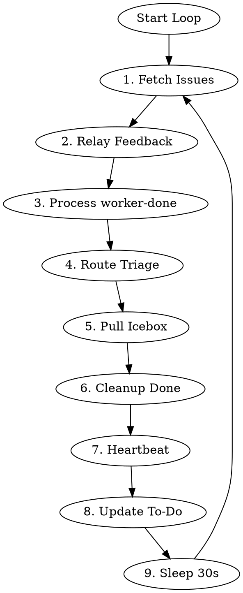

# Legion Controller

> **Customization:** This skill is the primary extension point for Legion's behavior.
> The state machine provides suggested actions and raw signals. This skill decides what
> to do with them. Modify this file to change how issues flow through the pipeline.

Persistent coordinator that loops forever, dispatching and resuming workers based on Linear issue state.

## Environment

Required:
- `LINEAR_TEAM_ID` - Linear team UUID
- `LEGION_DIR` - path to default jj workspace
- `LEGION_SHORT_ID` - short ID for daemon identification
- `LEGION_DAEMON_PORT` - daemon HTTP API port (default: 13370)

## Core Principle

**Keep work moving forward.** Priority order:
1. Unblock in-progress work (relay user feedback)
2. Advance completed work (process worker-done)
3. Start new work (triage, pull from Icebox)

## Algorithm



**Do not exit.** Loop continuously.

### 1. Fetch Issues

```bash
LINEAR_JSON=$(linear_linear(action="search", query={"team": "$LINEAR_TEAM_ID"}))
ACTIVE_WORKERS=$(curl -s http://127.0.0.1:$LEGION_DAEMON_PORT/workers | jq 'length')
```

### 2. Relay User Feedback (Highest Priority)

When both `user-input-needed` AND `user-feedback-given` labels present:
1. Remove both labels
2. **Resume** (not spawn) worker session with prompt to check Linear comments

### 3. Process worker-done

Run state script:
```bash
echo "$LINEAR_JSON" | bun run packages/daemon/src/state/cli.ts --team-id "$LINEAR_TEAM_ID" --daemon-url http://127.0.0.1:$LEGION_DAEMON_PORT
```

The state CLI returns JSON with both `suggestedAction` and raw signals:
- `hasLiveWorker`, `workerMode`, `workerStatus` — worker state
- `hasPr`, `prIsDraft` — PR state
- `hasUserFeedback` — user interaction state

Use `suggestedAction` as the primary guide, but consult raw signals when the suggestion
is `skip`. The state machine returns `skip` conservatively — the controller should reason
about what to do:

| suggestedAction | Signals | Controller should... |
|-----------------|---------|---------------------|
| `skip` | `hasPr: true`, status: In Progress | PR opened; wait for Linear auto-transition or manually advance to Needs Review |
| `skip` | `workerStatus: "dead"` | Dead worker blocking progress; clean up and re-evaluate |
| `retry_pr_check` | `prIsDraft: null` | GitHub API flaked; try again next iteration |

### Routing by Action Intent

The state machine returns a `suggestedAction`. Route by prefix:

| Prefix | Intent | Controller action |
|--------|--------|-------------------|
| `dispatch_` | Spawn a new worker | `POST /workers` with mode from `ACTION_TO_MODE` |
| `transition_to_` | Move issue to new status | Update Linear issue status |
| `resume_` | Send prompt to existing worker | Find worker by sessionId, send prompt |
| `relay_` | Forward information | Relay user feedback to worker |
| `add_` | Add label | Add the specified label to the issue |
| `remove_` | Remove label + retry | Remove label, then re-evaluate |
| `retry_` | Wait | Do nothing this iteration, re-check next loop |
| `skip` | No action needed | Check raw signals for edge cases (see signals table below) |
| `investigate_` | Anomaly detected | Log warning, inspect issue state manually |

This routing is stable across code changes. New action types automatically route
correctly if they follow the naming convention.

**Handling `investigate_no_pr`:** Worker marked done but no PR exists. Likely causes:
1. Worker crashed before creating PR
2. PR creation failed silently
3. Issue moved to wrong status manually
4. Linear attachment wasn't added

**Action:** Investigate, then consider moving back to In Progress and re-dispatching implementer. May also just wait and check again next iteration.

**`retry_pr_check`:** The GitHub API couldn't determine PR draft status. Do nothing this iteration —
don't dispatch a worker, don't transition status. The next loop iteration will re-run the state script
which will retry the GitHub API call. If this persists across multiple iterations, investigate the
GitHub API connectivity.

### Quality Gate (Controller Policy)

Before transitioning from In Progress → Needs Review, the controller independently verifies code quality. This is a controller-level policy, not signaled by the state machine.

**When to run:** Whenever executing a `transition_to_needs_review` action.

**Trust but verify:** The implement workflow self-enforces checks before PR (step 4). The controller independently verifies.

```bash
WORKSPACES_DIR=$(dirname "$LEGION_DIR")
ISSUE_LOWER=$(echo "$ISSUE_IDENTIFIER" | tr '[:upper:]' '[:lower:]')
WORKSPACE_PATH="$WORKSPACES_DIR/$ISSUE_LOWER"

cd "$WORKSPACE_PATH"
bun test 2>&1
TST_EXIT=$?
bunx tsc --noEmit 2>&1
TSC_EXIT=$?
bunx biome check 2>&1
BIOME_EXIT=$?
```

**If all pass** (exit codes 0): Proceed with transition to Needs Review.

**If any fail:** Do NOT advance to Needs Review. Instead:
1. Remove `worker-done` label
2. Resume the implementer session with the failure output
3. The implementer will fix and re-add `worker-done` when ready

### 4. Route Triage

Controller routes Triage issues directly (no worker needed):

| Assessment | Route To |
|------------|----------|
| Urgent AND clear requirements | Todo (dispatch planner) |
| Clear but not urgent | Backlog |
| Vague OR large OR needs breakdown | Icebox |

### 5. Pull from Icebox

**If active workers < 10:**
1. Get oldest Icebox item (FIFO)
2. Move to Backlog
3. Dispatch architect

### 6. Cleanup Done

For Done issues without live workers:
```bash
WORKSPACES_DIR=$(dirname "$LEGION_DIR")
ISSUE_LOWER=$(echo "$ISSUE_IDENTIFIER" | tr '[:upper:]' '[:lower:]')
jj workspace forget "$ISSUE_LOWER" -R "$LEGION_DIR"
rm -rf "$WORKSPACES_DIR/$ISSUE_LOWER"
```

### 7. Write Heartbeat

```bash
mkdir -p ~/.legion/$LEGION_SHORT_ID && touch ~/.legion/$LEGION_SHORT_ID/heartbeat
```

### 8. Update To-Do List

Maintain in context:
```markdown
## Controller State
**Active workers:** [count] / 10 max
### Priority Queue
- [ENG-XX] description
### In Progress
- [ENG-YY] mode - worker running
### Blocked
- [ENG-ZZ] user-input-needed
```

### 9. Sleep and Loop

```bash
sleep 30
```

Then return to step 1.

## Dispatch vs Resume

**Dispatch** = new worker via daemon API:
```bash
# $ISSUE_ID = Linear UUID, $ISSUE_IDENTIFIER = e.g. "LEG-18"
# Workspaces are siblings to default workspace, named by identifier for easy navigation
WORKSPACES_DIR=$(dirname "$LEGION_DIR")
ISSUE_LOWER=$(echo "$ISSUE_IDENTIFIER" | tr '[:upper:]' '[:lower:]')
WORKSPACE_PATH="$WORKSPACES_DIR/$ISSUE_LOWER"

# Create workspace if needed
[ ! -d "$WORKSPACE_PATH" ] && jj workspace add "$WORKSPACE_PATH" --name "$ISSUE_LOWER" -R "$LEGION_DIR"

# Dispatch worker via daemon HTTP API
RESPONSE=$(curl -s -X POST http://127.0.0.1:$LEGION_DAEMON_PORT/workers \
  -H 'content-type: application/json' \
  -d "{
    \"issueId\": \"$ISSUE_IDENTIFIER\",
    \"mode\": \"$MODE\",
    \"workspace\": \"$WORKSPACE_PATH\",
    \"env\": {
      \"LINEAR_ISSUE_ID\": \"$ISSUE_IDENTIFIER\",
      \"LINEAR_TEAM_ID\": \"$LINEAR_TEAM_ID\",
      \"LEGION_DIR\": \"$LEGION_DIR\",
      \"LEGION_SHORT_ID\": \"$LEGION_SHORT_ID\"
    }
  }")

WORKER_ID=$(echo "$RESPONSE" | jq -r '.id')
WORKER_PORT=$(echo "$RESPONSE" | jq -r '.port')
SESSION_ID=$(echo "$RESPONSE" | jq -r '.sessionId')

# Send initial prompt to worker's OpenCode serve
curl -s -X POST http://127.0.0.1:$WORKER_PORT/session/$SESSION_ID/prompt_async \
  -H 'content-type: application/json' \
  -d "{
    \"parts\": [{
      \"type\": \"text\",
      \"text\": \"/legion-worker $MODE mode for $ISSUE_IDENTIFIER\"
    }]
  }"

# Add worker-active label
linear_linear(action="update", id="$ISSUE_ID", labels=["worker-active", ...existing...])
```

**Resume** = send prompt to existing worker:
```bash
# Get worker info from daemon
ISSUE_LOWER=$(echo "$ISSUE_IDENTIFIER" | tr '[:upper:]' '[:lower:]')
WORKER_ID="$ISSUE_LOWER-$MODE"
WORKER_INFO=$(curl -s http://127.0.0.1:$LEGION_DAEMON_PORT/workers/$WORKER_ID)
WORKER_PORT=$(echo "$WORKER_INFO" | jq -r '.port')
SESSION_ID=$(echo "$WORKER_INFO" | jq -r '.sessionId')

# Send prompt to worker's OpenCode serve
curl -s -X POST http://127.0.0.1:$WORKER_PORT/session/$SESSION_ID/prompt_async \
  -H 'content-type: application/json' \
  -d "{
    \"parts\": [{
      \"type\": \"text\",
      \"text\": \"$PROMPT\"
    }]
  }"
```

Use resume for: user feedback relay, PR changes requested, retro after review approval.

## Worker Inspection

Available when needed (debugging, intervention):

```bash
# List all workers
curl -s http://127.0.0.1:$LEGION_DAEMON_PORT/workers | jq '.[] | {id, status, port, pid, sessionId, startedAt}'

# Get specific worker info
curl -s http://127.0.0.1:$LEGION_DAEMON_PORT/workers/$WORKER_ID | jq '.'

# Check worker status (busy/idle)
curl -s http://127.0.0.1:$LEGION_DAEMON_PORT/workers/$WORKER_ID/status | jq '.'

# Get worker messages
WORKER_PORT=$(curl -s http://127.0.0.1:$LEGION_DAEMON_PORT/workers/$WORKER_ID | jq -r '.port')
curl -s http://127.0.0.1:$WORKER_PORT/session/$SESSION_ID/message?limit=20 | jq '.[-5:]'

# Send input (use sparingly - prefer prompt_async)
curl -s -X POST http://127.0.0.1:$WORKER_PORT/session/$SESSION_ID/prompt_async \
  -H 'content-type: application/json' \
  -d '{"parts":[{"type":"text","text":"message"}]}'
```

## Labels

| Label | Meaning |
|-------|---------|
| `worker-done` | Worker finished phase, controller acts |
| `worker-active` | Worker dispatched and running |
| `user-input-needed` | Blocked on human, controller skips |
| `user-feedback-given` | Human responded, controller resumes |
| `needs-approval` | Architect done, waiting for human approval |
| `human-approved` | Human approved, controller advances to planner |

## Common Mistakes

| Mistake | Correction |
|---------|------------|
| Spawn new worker for user feedback | **Resume** existing session via HTTP API |
| Skip Icebox when capacity exists | Pull oldest Icebox item if workers < 10 |
| Plan Triage items directly | Route first (to Icebox/Backlog/Todo), then workers act |
| Exit after processing all issues | **Never exit** - loop forever with 30s sleep |
| Process issue with live worker | Skip it - worker is already handling |

## Status Flow

```
Triage ─┬─► Icebox ─► Backlog ─► Todo ─► In Progress ─► Needs Review ─► Retro ─► Done
        ├─► Backlog ──────────────┘                          │
        └─► Todo ─────────────────────────────────────────────┘
```
