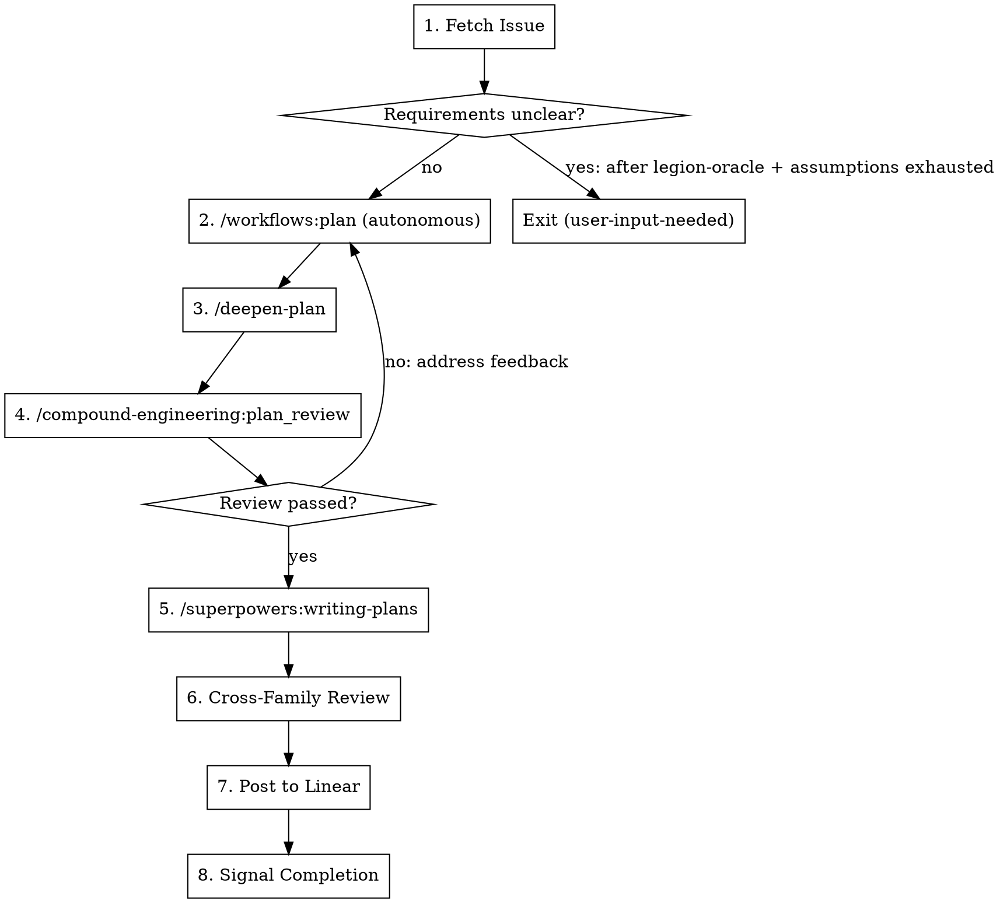

# Plan Workflow

Transform a Linear issue into a reviewed, executable implementation plan.

## Workflow



### 1. Fetch the Issue

```
linear_linear(action="get", id=$LINEAR_ISSUE_ID)
```

The `$LINEAR_ISSUE_ID` environment variable is set by the controller when spawning this worker.

Extract:
- Title and description
- Comments with additional context
- Acceptance criteria if present

### 2. Invoke /workflows:plan (Autonomous)

Invoke `/workflows:plan` with this context:

```
You are running autonomously without user interaction.
Do NOT ask the user questions interactively. If requirements are unclear:

1. Invoke /legion-oracle [specific question] for research-based guidance
2. Make reasonable assumptions and document them explicitly
3. Only escalate to user-input-needed if you truly cannot proceed

Feature description:
[Linear issue title + description + comments]
```

The skill handles:
- Local research (repo-research-analyst, learnings-researcher)
- Conditional external research (best-practices-researcher, framework-docs-researcher)
- SpecFlow analysis for edge cases
- Structured plan creation

**If the skill determines requirements are fundamentally unclear** (even after legion-oracle + assumptions):
1. Add `user-input-needed` label via `linear_linear(action="update", ...)`
2. Post a comment via `linear_linear(action="comment", ...)` explaining what needs clarification
3. Exit immediately - do NOT add `worker-done`

### 3. Invoke /deepen-plan

Invoke `/deepen-plan` on the plan file from step 2.

This enhances each section with:
- Parallel research agents
- Available skills matched to plan content
- Institutional learnings from `docs/solutions/`
- Review agents for comprehensive coverage

### 4. Review with /compound-engineering:plan_review

Invoke `/compound-engineering:plan_review` to validate the plan.

**Iterate until review passes:**
1. Read the review feedback
2. Address each issue identified (may re-invoke portions of step 2 or 3)
3. Re-invoke `/compound-engineering:plan_review`
4. Repeat until no blocking issues remain

**Max 3 iterations.** If still failing:
1. Add `user-input-needed` label with a comment summarizing unresolved issues
2. Exit without `worker-done`

### 5. Invoke /superpowers:writing-plans

Convert the approved plan into executable, bite-sized tasks.

This creates step-by-step implementation instructions with:
- Exact file paths
- Complete code examples
- Test commands with expected output
- Commit points

This is what the implement workflow will follow.

#### Parallelism Annotation

After creating executable tasks, annotate each task with dependency information:

- **Independent tasks:** Mark tasks that have no dependencies on other tasks. These can execute in parallel.
- **Sequential tasks:** Mark tasks that must follow a specific order, noting which task(s) they depend on.
- **Dependency notation:** Use a simple format in the plan:

```
Task 1: [description] — Independent
Task 2: [description] — Independent  
Task 3: [description] — Depends on: Task 1, Task 2
Task 4: [description] — Depends on: Task 3
```

The implementer will use these annotations to create a task graph with `blockedBy` edges for parallel execution via the task system.

**Guidelines for annotating dependencies:**
- Only mark a dependency if the task truly needs another task's output (shared files, API contracts, test fixtures)
- Minimize dependency chains — prefer wide, shallow graphs over deep sequential chains
- When in doubt, mark as independent (the implementer can add dependencies if needed)

### 6. Cross-Family Review

After creating the executable plan, spawn a cross-family review session for external validation.

1. Spawn a review session:
   - Category: `review-plan`
   - Model override: Use a different model family than the one that created the plan
   - Prompt: Include the original issue requirements AND the complete executable plan from step 5

2. The reviewer evaluates:
   - Does the plan address all requirements from the issue?
   - Are the tasks correctly ordered and dependencies explicit?
   - Is the plan feasible given the codebase structure?
   - Are there missing steps or edge cases?
   - Is each task small enough to be independently testable?

3. If the reviewer finds issues:
   - Address each finding (adjust tasks, fix ordering, add missing steps)
   - Re-run `/superpowers:writing-plans` if structural changes are needed
   - You do NOT need to re-review after fixes — one cross-family pass is sufficient

4. Proceed to posting with the final (possibly revised) plan.

### 7. Post to Linear

Use `linear_linear(action="comment", ...)` to post the **full executable plan** from step 5 (or step 6 if revised).

The complete `/superpowers:writing-plans` output goes directly into the Linear comment - all tasks, all code examples, all test commands.

### 8. Signal Completion

Add `worker-done` label to the Linear issue via `linear_linear(action="update", ...)`, then exit.

**CRITICAL:** Only add `worker-done` after successfully posting the plan. Never add this label if:
- Requirements were unclear and could not be resolved (use `user-input-needed` instead)
- Plan review failed and was not resolved
- Cross-family review found unresolved issues
- Any step failed to complete

## Quick Reference

| Step | Action | Skill/Tool |
|------|--------|------------|
| Fetch | Get issue details | `linear_linear(action="get", ...)` |
| Research + Structure | Create plan | `/workflows:plan` (autonomous) |
| Enhance | Deepen with agents | `/deepen-plan` |
| Validate | Review plan | `/compound-engineering:plan_review` (iterate) |
| Executable | Bite-sized tasks | `/superpowers:writing-plans` |
| Cross-Family Review | External validation | Spawn review session (different model family) |
| Post | Full plan to issue | `linear_linear(action="comment", ...)` |
| Complete | Add done label | `linear_linear(action="update", ...)` |

## Autonomous Context Template

When invoking skills that normally ask user questions:

```
You are running autonomously without user interaction.
Do NOT ask the user questions interactively. If uncertain:

1. Invoke /legion-oracle [specific question] - cheap research-based guidance
2. Make reasonable assumptions and document them
3. Only escalate to user-input-needed as absolute last resort

[rest of prompt]
```

## Common Mistakes

| Mistake | Correction |
|---------|------------|
| Adding `worker-done` when requirements unclear | Use `user-input-needed` label, exit without `worker-done` |
| Skipping /deepen-plan | Always run to enhance plan with research |
| Posting summary instead of full plan | Post complete executable plan from /superpowers:writing-plans |
| Asking user questions | Use legion-oracle first, then assumptions, escalate only as last resort |
| Skipping plan review iteration | Always iterate until review passes or max 3 attempts |
