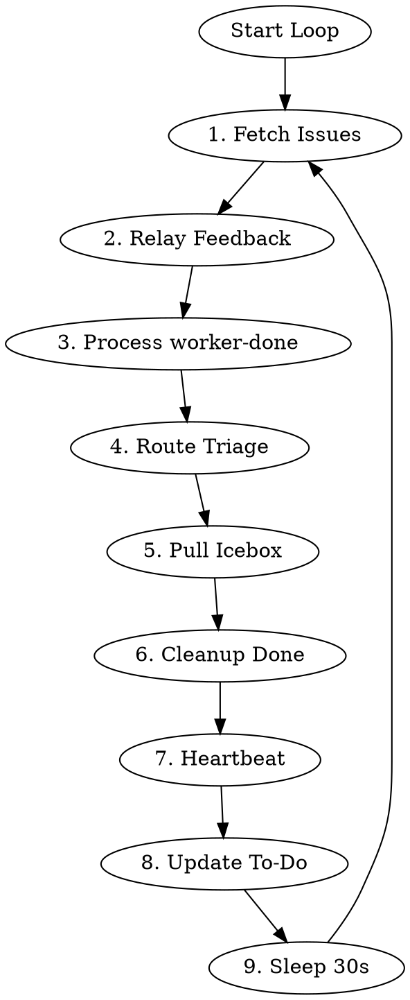

# Legion Controller

> **Customization:** This skill is the primary extension point for Legion's behavior.
> The state machine provides suggested actions and raw signals. This skill decides what
> to do with them. Modify this file to change how issues flow through the pipeline.

Persistent coordinator that loops forever, dispatching and resuming workers based on issue state.

## Environment

Required:
- `LEGION_ID` - team/project identifier (Linear UUID or GitHub `owner/project-number`)
- `LEGION_ISSUE_BACKEND` - issue backend: `"linear"` or `"github"`
- `LEGION_SHORT_ID` - short ID for daemon identification
- `LEGION_DAEMON_PORT` - daemon HTTP API port (default: 13370)

## Core Principle

**Keep work moving forward.** Priority order:
1. Unblock in-progress work (relay user feedback)
2. Advance completed work (process worker-done)
3. Start new work (triage, pull from Icebox)

## Algorithm



**Do not exit.** Loop continuously.

### 1. Fetch Issues

```bash
# Derive OWNER and PROJECT_NUM from LEGION_ID for GitHub backend
# LEGION_ID format for GitHub: "owner/project-number"
if [ "$LEGION_ISSUE_BACKEND" = "github" ]; then
  OWNER="${LEGION_ID%%/*}"
  PROJECT_NUM="${LEGION_ID##*/}"
fi

# Fetch issues based on backend
if [ "$LEGION_ISSUE_BACKEND" = "github" ]; then
  ISSUES_JSON=$(gh project item-list $PROJECT_NUM --owner $OWNER --format json)
else
  ISSUES_JSON=$(linear_linear(action="search", query={"team": "$LEGION_ID"}))
fi

ACTIVE_WORKERS=$(curl -s http://127.0.0.1:$LEGION_DAEMON_PORT/workers | jq 'length')
```

**CRITICAL:** Pass `ISSUES_JSON` directly to the state endpoint in step 3 without modification. Do NOT reconstruct, filter, or hand-craft the issue JSON. The state machine's parser handles both Linear and GitHub formats. Injecting your own assumptions about labels, status, or other fields produces stale data and wrong actions.

### 2. Relay User Feedback (Highest Priority)

When both `user-input-needed` AND `user-feedback-given` labels present:
1. Remove both labels
2. **Resume** (not spawn) worker session with prompt to check issue comments

### 3. Process worker-done

Analyze via daemon:
```bash
COLLECTED=$(echo "$ISSUES_JSON" | jq -Rs --arg backend "$LEGION_ISSUE_BACKEND" \
  '{"backend": $backend, "issues": (. | fromjson)}' | \
  curl -s -X POST http://127.0.0.1:$LEGION_DAEMON_PORT/state/collect \
  -H 'Content-Type: application/json' --data @-)
```

The state endpoint returns JSON with both `suggestedAction` and raw signals:
- `hasLiveWorker`, `workerMode`, `workerStatus` — worker state
- `hasPr`, `prIsDraft` — PR state
- `hasUserFeedback` — user interaction state

Use `suggestedAction` as the primary guide, but consult raw signals when the suggestion
is `skip`. The state machine returns `skip` conservatively — the controller should reason
about what to do:

| suggestedAction | Signals | Controller should... |
|-----------------|---------|---------------------|
| `skip` | `hasPr: true`, status: In Progress, `hasLiveWorker: true` | Live implementer still working on PR; wait for it to finish |
| `skip` | `workerStatus: "dead"` | Dead worker blocking progress; clean up and re-evaluate |
| `retry_pr_check` | `prIsDraft: null` | GitHub API flaked; try again next iteration |

### Routing by Action Intent

The state machine returns a `suggestedAction`. Route by prefix:

| Prefix | Intent | Controller action |
|--------|--------|-------------------|
| `dispatch_` | Spawn a new worker | `POST /workers` with mode from `ACTION_TO_MODE` |
| `transition_to_` | Move issue to new status | Update issue status (Linear: `linear_linear(action="update", ...)`, GitHub: `gh api graphql` for status field) |
| `resume_` | Send prompt to existing worker | Find worker by sessionId, send prompt |
| `relay_` | Forward information | Relay user feedback to worker |
| `add_` | Add label | Add the specified label (Linear: `linear_linear(action="update", ...)`, GitHub: `gh issue edit --add-label`) |
| `remove_` | Remove label + retry | Remove label (Linear: `linear_linear(action="update", ...)`, GitHub: `gh issue edit --remove-label`), then re-evaluate |
| `retry_` | Wait | Do nothing this iteration, re-check next loop |
| `skip` | No action needed | Check raw signals for edge cases (see signals table below) |
| `investigate_` | Anomaly detected | Log warning, inspect issue state manually |

This routing is stable across code changes. New action types automatically route
correctly if they follow the naming convention.

**Handling `investigate_no_pr`:** Worker marked done but no PR exists. Likely causes:
1. Worker crashed before creating PR
2. PR creation failed silently
3. Issue moved to wrong status manually
4. PR wasn't linked to issue (Linear attachment or GitHub linked PR)

**Action:** Investigate, then consider moving back to In Progress and re-dispatching implementer. May also just wait and check again next iteration.

**`retry_pr_check`:** The GitHub API couldn't determine PR draft status. Do nothing this iteration —
don't dispatch a worker, don't transition status. The next loop iteration will re-run the state script
which will retry the GitHub API call. If this persists across multiple iterations, investigate the
GitHub API connectivity.

### Implement → Testing → Review Handoff

The implementer adds `worker-done` when finished:
1. Implementer opens a **draft PR**, verifies CI passes, adds `worker-done`, and exits
2. State machine sees: In Progress + `worker-done` → `transition_to_testing`
3. Controller transitions issue to Testing status
4. Controller runs the quality gate (below)
5. If quality gate passes: dispatch tester
6. If quality gate fails: move back to In Progress, dispatch fresh implementer with failure output

After the tester runs:
- **Test passed** (`test-passed` label): Controller removes `worker-done` and `test-passed` labels, transitions to Needs Review, dispatches reviewer (no additional quality gate needed)
- **Test failed** (`test-failed` label): Controller removes `test-failed` and `worker-done` labels, transitions back to In Progress, resumes implementer session with test failure report from the PR comment

### Review → Re-implementation → Testing Loop

When the reviewer requests changes, the implementer's fixes **must go through testing again**:

1. Reviewer converts PR to draft, adds `worker-done`
2. State machine: `resume_implementer_for_changes`
3. Controller **transitions issue to In Progress**, removes `worker-done`
4. Controller resumes the implementer session with "Address PR review comments"
5. Implementer fixes, pushes, adds `worker-done`
6. State machine: In Progress + `worker-done` → `transition_to_testing`
7. Tester verifies the fixes
8. If tester passes → Needs Review → reviewer runs again

**Critical:** The controller MUST transition to In Progress before resuming the implementer. If the issue stays in Needs Review and the implementer adds `worker-done`, the state machine will see `prIsDraft + worker-done` and suggest `resume_implementer_for_changes` again (infinite loop).

### Quality Gate (Controller Policy)

Before dispatching a tester, the controller independently verifies code quality. This is a controller-level policy, not signaled by the state machine.

**When to run:** Whenever about to execute a `dispatch_tester` action.

**Before dispatching tester, verify CI is passing:**
```bash
gh pr checks "$LEGION_ISSUE_ID"
```

If any checks are failing, do NOT dispatch the tester. Instead:
1. Move issue back to In Progress
2. Re-dispatch an implementer with the CI failure output:
```bash
legion dispatch "$ISSUE_IDENTIFIER" implement \
  --repo "$OWNER/$REPO" \
  --prompt "Invoke the /legion-worker skill for implement mode. CI is failing: [paste failure summary]. Fix and push. ($BACKEND_SUFFIX)"
```

**CI is the implementer's responsibility.** The implement workflow requires passing CI before
signaling completion. If CI is failing when the controller sees a PR, the implementer didn't
finish — re-dispatch an implementer with the CI failure output. The tester should also check
CI status and include it in the review.

### Post-Merge Monitoring

If an issue remains in Retro after the merger exits, verify PR merge status:
```bash
gh pr view "$LEGION_ISSUE_ID" --json state,merged
```

If the PR is merged but the issue isn't closed, close it explicitly:
```bash
gh issue close $ISSUE_NUMBER -R $OWNER/$REPO
```

This handles edge cases where the merge workflow's explicit close failed or where GitHub auto-close didn't trigger. The `transition_to_done` action type exists in the state machine for this purpose.

### 4. Route Triage

**Be ambitious. Prioritize user value. Keep work moving.**

No issue is "too big" for Legion — that's what the architect phase is for. Large or complex
issues go to Backlog where the architect breaks them down. Only route to Icebox if the issue
is genuinely unclear (missing context, ambiguous requirements, needs user clarification).

Controller routes Triage issues directly (no worker needed):

| Assessment | Route To |
|------------|----------|
| Urgent AND clear requirements | Todo (dispatch planner) |
| Bug label + clear reproduction steps + no architectural uncertainty | Todo (skip architect — dispatch planner directly) |
| Clear requirements, any size | Backlog (architect breaks down if large) |
| Ambiguous or missing context | Icebox (needs clarification) |

The skip-architect rule only applies when ALL conditions are met: `bug` label present,
description contains clear reproduction steps, and the change is scoped to a single
component. When in doubt, route to Backlog.

### 5. Pull from Icebox

**If active workers < 10:**
1. Check for Icebox items that have been clarified: look for `user-feedback-given` label OR new comments added since the issue was moved to Icebox
2. If no clarified items exist, skip — leave Icebox items until users respond
3. Move the oldest clarified item to Backlog
4. Dispatch architect

### 6. Cleanup Done

For Done issues without live workers:
```bash
curl -s -X DELETE "http://127.0.0.1:$LEGION_DAEMON_PORT/workers/$WORKER_ID/workspace" \
  -H 'Content-Type: application/json' \
  -d '{"repo": "'"'$OWNER/$REPO'"'"}'
```

### 7. Write Heartbeat

```bash
The daemon handles heartbeat writing automatically. No manual heartbeat step needed.
```

### 8. Update To-Do List

Maintain in context:
```markdown
## Controller State
**Active workers:** [count] / 10 max
### Priority Queue
- [ENG-XX] description
### In Progress
- [ENG-YY] mode - worker running
### Blocked
- [ENG-ZZ] user-input-needed
```

### 9. Sleep and Loop

```bash
sleep 30
```

Then return to step 1.

## Dispatch vs Resume

### Backend in Prompts

Workers must know which backend they're on. The controller always includes the backend
in dispatch and resume prompts so workers don't need to check environment variables.

Build the backend suffix from `LEGION_ISSUE_BACKEND` and (for GitHub) the repo derived
from the issue identifier:

- **GitHub:** `(github backend, repo: $OWNER/$REPO)` — derive owner/repo from the issue
  identifier (format: `owner-repo-number`, e.g. `acme-widgets-42` → `acme/widgets`)
- **Linear:** `(linear backend)`

### Dispatch (New Worker)

**Always use skill invocation (`/skill-name`), not file paths.** Workers load skills via the
skill system. Pointing them at file paths bypasses skill loading and risks the worker not
getting the full skill content.

```bash
# GitHub example:
legion dispatch "$ISSUE_IDENTIFIER" "$MODE" \
  --repo "$OWNER/$REPO" \
  --prompt "Invoke the /legion-worker skill for $MODE mode for $ISSUE_IDENTIFIER (github backend, repo: $OWNER/$REPO)"

# Linear example:
legion dispatch "$ISSUE_IDENTIFIER" "$MODE" \
  --prompt "Invoke the /legion-worker skill for $MODE mode for $ISSUE_IDENTIFIER (linear backend)"
```

The `dispatch` command handles: workspace creation (jj workspace add), daemon API call (POST /workers), initial prompt, and prints worker info.

For custom prompts, still include the backend suffix:
```bash
legion dispatch "$ISSUE_IDENTIFIER" "$MODE" \
  --repo "$OWNER/$REPO" \
  --prompt "Custom instructions here (github backend, repo: $OWNER/$REPO)"
```

### Resume (Prompt Existing Worker)

```bash
# User feedback relay (GitHub):
legion prompt "$ISSUE_IDENTIFIER" \
  "Invoke the /legion-worker skill. Check issue comments for user feedback. (github backend, repo: $OWNER/$REPO)"

# PR changes requested — tell them to invoke the skill, not give step-by-step fix instructions:
legion prompt "$ISSUE_IDENTIFIER" --mode implement \
  "Invoke the /legion-worker skill for implement mode. CI is failing on your PR — check the failures and fix. (github backend, repo: $OWNER/$REPO)"
```

If multiple workers exist for the same issue (different modes), specify mode with `--mode`.

Use resume for: user feedback relay, PR changes requested, retro after review approval.

### Retro

Retro is triggered by resuming the **implement worker's existing session** — this preserves the implementer's full context. The retro skill handles spawning a fresh subagent for an outside perspective.

Before dispatching retro, consume routing hints conservatively:

- The handoff read should use the workspace path if available (from the daemon's
  `/workers` response), or the current working directory as fallback.
- **Default: full pipeline.** If handoff data is missing, unreadable, or routing hints are
  unknown, dispatch retro normally. The skip only fires when ALL conditions are explicitly
  met.

```bash
# Optional workspace-aware read (if worker metadata includes workspace path):
# HANDOFF=$(legion handoff read --workspace "$WORKSPACE_PATH" 2>/dev/null || echo '{}')

# Fallback read from current directory:
HANDOFF=$(legion handoff read 2>/dev/null || echo '{}')

SKIP_RETRO=$(echo "$HANDOFF" | jq -r '.plan.routingHints.skipRetro // false')
TRICKY_PARTS_COUNT=$(echo "$HANDOFF" | jq -r '(.implement.trickyParts // []) | length')
DEVIATIONS_COUNT=$(echo "$HANDOFF" | jq -r '(.implement.deviations // []) | length')

if [ "$SKIP_RETRO" = "true" ] && [ "$TRICKY_PARTS_COUNT" = "0" ] && [ "$DEVIATIONS_COUNT" = "0" ]; then
  echo "Skipping retro: skipRetro=true with no implementer trickyParts/deviations; dispatching merger directly"
  if [ "$LEGION_ISSUE_BACKEND" = "github" ]; then
    legion dispatch "$ISSUE_IDENTIFIER" merge \
      --repo "$OWNER/$REPO" \
      --prompt "Invoke the /legion-worker skill for merge mode for $ISSUE_IDENTIFIER (github backend, repo: $OWNER/$REPO)"
  else
    legion dispatch "$ISSUE_IDENTIFIER" merge \
      --prompt "Invoke the /legion-worker skill for merge mode for $ISSUE_IDENTIFIER (linear backend)"
  fi
else
  echo "Running full pipeline: retro required (missing/corrupt hints or skip conditions unmet)"
  # Proceed with normal retro resume below
fi
```

**Use skill invocation for retro too:**

```bash
# GitHub:
legion prompt "$ISSUE_IDENTIFIER" --mode implement \
  "Invoke the /legion-retro skill. (github backend, repo: $OWNER/$REPO)"

# Linear:
legion prompt "$ISSUE_IDENTIFIER" --mode implement \
  "Invoke the /legion-retro skill. (linear backend)"
```

**If the implement worker died** (action `dispatch_implementer_for_retro`), a fresh worker is dispatched in `implement` mode. This loses the implementer's perspective — both retro analyses will be from a fresh viewpoint.

**ADAPTIVE ROUTING GUARDRAILS — MUST NEVER BE SKIPPED:**
- Testing phase CANNOT be skipped — tester ALWAYS runs
- Routing hints are ADVISORY — labels, PR state, daemon state remain authoritative
- When hints are missing/corrupt: fall back to full pipeline
- When multiple hints conflict: fall back to full pipeline

## Worker Inspection

The daemon is the controller's interface to workers. Use the daemon API, not direct port access.

```bash
# List all workers
curl -s http://127.0.0.1:$LEGION_DAEMON_PORT/workers | jq '.[] | {id, status, port, sessionId}'

# Check worker status (busy/idle)
curl -s http://127.0.0.1:$LEGION_DAEMON_PORT/workers/$WORKER_ID/status | jq '.'
```

The state machine reports `hasLiveWorker`, `workerMode`, and `workerStatus` for each issue.
Use these signals — don't independently verify worker liveness.

### Session Versioning (Escape Hatch Only)

Session IDs are **deterministic** — `computeSessionId(teamId, issueId, mode)` uses UUID v5.
Same inputs always produce the same session ID. If the serve still has that session in
memory, re-dispatching with the same issue ID and mode re-attaches to the existing session
(the serve returns 409 DuplicateIDError, which the daemon treats as "reuse").

**This is by design — session reuse preserves the worker's full context.** A worker that has
been reading code, making changes, and iterating on review feedback carries all that context
in its session. Re-dispatching without a version increment reconnects to that session, so
the worker continues where it left off.

The `--version` flag on `legion dispatch` exists **only as an escape hatch** for unrecoverable
sessions — e.g., the session is corrupted, the serve crashed and lost the session, or the
workspace was deleted and recreated. **Do NOT increment versions during normal pipeline
operation.** Each version increment creates a completely fresh session that has zero context
about the issue, the codebase changes, or prior work.

**NEVER do this:**
```bash
# WRONG: Incrementing version on every dispatch throws away all worker context
legion dispatch issue-123 implement --version 1 --prompt "Fix review feedback"
# Later...
legion dispatch issue-123 implement --version 2 --prompt "Fix CI"
# Later...
legion dispatch issue-123 implement --version 3 --prompt "Fix more things"
```

**Do this instead:**
```bash
# CORRECT: Same version (or no version) = worker resumes with full context
legion dispatch issue-123 implement --prompt "Fix review feedback"
# Later...
legion dispatch issue-123 implement --prompt "Fix CI"  # Same session, worker remembers everything
```

A context-less worker is dangerous — it doesn't understand the branch topology, prior
changes, or conventions established during earlier work. This can lead to destructive
actions like force-pushing to the wrong branch.
### Don't Delete a Workspace While Workers May Resume

**A worker whose workspace has been deleted cannot respond to prompts.** Every tool call
fails because the working directory no longer exists. The session appears "busy" but
produces no output — it looks like the worker is stalled, but the root cause is the
missing workspace.

This applies to both active workers AND idle workers you might want to resume later
(e.g., for retro). Only delete workspaces during Cleanup Done (step 6) — after the
issue is fully complete and no further prompts will be sent.

## Observability Rules

### 1. Trust the state machine

The state machine checks worker liveness, PR status, labels, and draft state. POST issue
data to `/state/collect` and route by `suggestedAction`. Don't independently check PRs,
ports, or process status — that's the state machine's job.

For the full observability architecture and failure case studies, see `docs/solutions/daemon/controller-observability.md`.

### 2. Never reconstruct state machine input

Pass issue tracker output directly to `/state/collect`. Do not hand-craft JSON, filter
issues, or inject your own assumptions about labels or status. The state machine's
parser handles the raw format.

### 3. Fresh data every loop iteration

Fetch issues from the tracker at the start of every loop. Don't carry labels, statuses, or
worker state between iterations — they go stale.

### 4. One PR per issue

Each issue gets its own workspace, its own branch (named after the issue ID), and its
own PR. Do not accumulate changes from multiple issues into a single PR — this makes
it impossible to track what's merged.

## Labels

| Label | Meaning |
|-------|---------|
| `worker-done` | Worker finished phase, controller acts |
| `worker-active` | Worker dispatched and running |
| `user-input-needed` | Blocked on human, controller skips |
| `user-feedback-given` | Human responded, controller resumes |
| `needs-approval` | Architect done, waiting for human approval |
| `human-approved` | Human approved, controller advances to planner |
| `test-passed` | Tester verified behavior, controller advances to Needs Review |
| `test-failed` | Tester found issues, controller returns to implementer |

### Label Batching Pattern

Combine multiple label changes on the same issue into a single `gh issue edit` call to reduce GitHub API calls:

**Instead of multiple calls:**
```bash
gh issue edit $ISSUE_NUMBER --remove-label "worker-done" -R $OWNER/$REPO
gh issue edit $ISSUE_NUMBER --remove-label "test-passed" -R $OWNER/$REPO
```

**Use a single batched call:**
```bash
gh issue edit $ISSUE_NUMBER \
  --remove-label "worker-done" \
  --remove-label "test-passed" \
  -R $OWNER/$REPO
```

**Combined add + remove:**
```bash
# Remove worker-done and test-passed, add nothing (clean up after test pass → needs review)
gh issue edit $ISSUE_NUMBER \
  --remove-label "worker-done" \
  --remove-label "test-passed" \
  -R $OWNER/$REPO

# Remove worker-done and worker-active, add nothing (after processing)
gh issue edit $ISSUE_NUMBER \
  --remove-label "worker-done" \
  --remove-label "worker-active" \
  -R $OWNER/$REPO
```

**When dispatching a worker, combine worker-active:**
```bash
# Add worker-active in same call as status update where possible
gh issue edit $ISSUE_NUMBER --add-label "worker-active" -R $OWNER/$REPO
```

This reduces GitHub API calls from N individual calls to 1 batched call per label group.

## Red Flags — STOP and Verify

If you catch yourself thinking any of these, STOP. You're about to make a mistake.

| Thought | What to do instead |
|---------|--------------------|
| "Let me construct the JSON for the state machine" | POST tracker output to `/state/collect` directly — no hand-crafting |
| "I know the label/status from last iteration" | Fetch fresh from the tracker. State goes stale between iterations. |
| "The changes are lost" | Check local commits (`jj log`), open PRs (`gh pr list`), and worker workspaces before concluding anything is lost |
| "I'll give the worker specific instructions" | State the mode, issue ID, and backend. Invoke the skill. Let the workflow guide the worker. |
| "Let me check the worker's port directly" | Use the daemon API (`/workers`, `/workers/:id/status`). The state machine reports liveness. |
| "I'll accumulate these changes into the existing PR" | One issue = one workspace = one branch = one PR. |
| "This issue is too big/complex" | No issue is too big. That's what the architect phase is for. Route to Backlog. |
| "The worker is busy, I'll wait" | Check the transcript. If the worker received prompts but produced no response, the workspace may have been deleted. A worker cannot function without its workspace. |
| "CI can be fixed later" | CI is the implementer's responsibility. If CI is failing, the implementer isn't done — re-dispatch. |
| "This worker keeps failing, let me increment the version" | **NEVER increment `--version` during normal operation.** Version increments destroy all worker context. Re-dispatch without version — the worker resumes with full context of prior work. Version is an escape hatch for unrecoverable sessions only. |

## Common Mistakes

| Mistake | Correction |
|---------|------------|
| Spawn new worker for user feedback | **Resume** existing session via HTTP API |
| Skip Icebox when capacity exists | Pull oldest Icebox item if workers < 10 |
| Plan Triage items directly | Route first (to Icebox/Backlog/Todo), then workers act |
| Exit after processing all issues | **Never exit** - loop forever with 30s sleep |
| Process issue with live worker | Skip it - worker is already handling |
| Give workers step-by-step fix instructions | Invoke the skill. State the mode, issue ID, and backend only. |
| Forget to remove `worker-done` after processing | Always remove `worker-done` label after acting on it. |
| Classify issues as "too big" | Route to Backlog for architect breakdown. No issue is too big for Legion. |
| Advance pipeline with CI failing | Re-dispatch implementer with CI failure output. Don't dispatch reviewer until CI passes. |
| Delete a workspace to "reset" a worker | **Never delete a workspace while the worker might be resumed.** A deleted workspace silently kills the worker — prompts arrive but every tool call fails. Only delete during Cleanup Done. |
| Increment `--version` on every dispatch | **Never increment version during normal pipeline operation.** Each increment creates a fresh session with zero context. A context-less worker is dangerous — it can push to wrong branches, overwrite work, or break the repo. Only use `--version` when a session is truly unrecoverable (serve crash, corrupted session). |

## Status Flow

```
Triage ─┬─► Icebox ─► Backlog ─► Todo ─► In Progress ─► Testing ─► Needs Review ─► Retro ─► Done
        ├─► Backlog ──────────────┘           │                        │
        └─► Todo ─────────────────────────────┴────────────────────────┘
```
