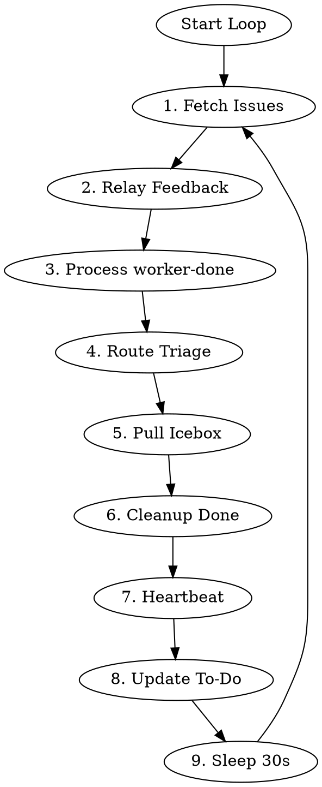

# Legion Controller

> **Customization:** This skill is the primary extension point for Legion's behavior.
> The state machine provides suggested actions and raw signals. This skill decides what
> to do with them. Modify this file to change how issues flow through the pipeline.

Persistent coordinator that loops forever, dispatching and resuming workers based on issue state.

## Environment

Required:
- `LEGION_TEAM_ID` - team/project identifier (Linear UUID or GitHub `owner/project-number`)
- `LEGION_ISSUE_BACKEND` - issue backend: `"linear"` or `"github"`
- `LEGION_DIR` - path to default jj workspace
- `LEGION_SHORT_ID` - short ID for daemon identification
- `LEGION_DAEMON_PORT` - daemon HTTP API port (default: 13370)

## Core Principle

**Keep work moving forward — but only on opted-in issues.** Priority order:
1. Unblock in-progress work (relay user feedback)
2. Advance completed work (process worker-done)
3. Start new work (triage, pull from Icebox)

## Opt-In Filter

**CRITICAL:** This board is shared with human developers. Only process issues that have the `legion` label. Ignore ALL issues without this label — they belong to humans.

After fetching issues and collecting state, filter the results: skip any issue that does not have the `legion` label. Do not triage, dispatch, transition, or otherwise touch unlabeled issues.

## Algorithm



**Do not exit.** Loop continuously.

### 1. Fetch Issues

```bash
# Derive OWNER and PROJECT_NUM from LEGION_TEAM_ID for GitHub backend
# LEGION_TEAM_ID format for GitHub: "owner/project-number"
if [ "$LEGION_ISSUE_BACKEND" = "github" ]; then
  OWNER="${LEGION_TEAM_ID%%/*}"
  PROJECT_NUM="${LEGION_TEAM_ID##*/}"
fi

# Fetch issues based on backend
if [ "$LEGION_ISSUE_BACKEND" = "github" ]; then
  ISSUES_JSON=$(gh project item-list $PROJECT_NUM --owner $OWNER --format json)
else
  ISSUES_JSON=$(linear_linear(action="search", query={"team": "$LEGION_TEAM_ID"}))
fi

ACTIVE_WORKERS=$(curl -s http://127.0.0.1:$LEGION_DAEMON_PORT/workers | jq 'length')
```

**CRITICAL:** Pass `ISSUES_JSON` directly to the state endpoint in step 3 without modification. Do NOT reconstruct, filter, or hand-craft the issue JSON. The state machine's parser handles both Linear and GitHub formats. Injecting your own assumptions about labels, status, or other fields produces stale data and wrong actions.

### 2. Relay User Feedback (Highest Priority)

When both `user-input-needed` AND `user-feedback-given` labels present:
1. Remove both labels
2. **Resume** (not spawn) worker session with prompt to check issue comments

### 3. Process worker-done

Analyze via daemon:
```bash
COLLECTED=$(echo "$ISSUES_JSON" | jq -Rs --arg backend "$LEGION_ISSUE_BACKEND" \
  '{"backend": $backend, "issues": (. | fromjson)}' | \
  curl -s -X POST http://127.0.0.1:$LEGION_DAEMON_PORT/state/collect \
  -H 'Content-Type: application/json' --data @-)
```

The state endpoint returns JSON with both `suggestedAction` and raw signals:
- `hasLiveWorker`, `workerMode`, `workerStatus` — worker state
- `hasPr`, `prIsDraft` — PR state
- `hasUserFeedback` — user interaction state

Use `suggestedAction` as the primary guide, but consult raw signals when the suggestion
is `skip`. The state machine returns `skip` conservatively — the controller should reason
about what to do:

| suggestedAction | Signals | Controller should... |
|-----------------|---------|---------------------|
| `skip` | `hasPr: true`, status: In Progress | PR opened; wait for auto-transition to Needs Review (or transition explicitly if using GitHub backend) |
| `skip` | `workerStatus: "dead"` | Dead worker blocking progress; clean up and re-evaluate |
| `retry_pr_check` | `prIsDraft: null` | GitHub API flaked; try again next iteration |

### Routing by Action Intent

The state machine returns a `suggestedAction`. Route by prefix:

| Prefix | Intent | Controller action |
|--------|--------|-------------------|
| `dispatch_` | Spawn a new worker | `POST /workers` with mode from `ACTION_TO_MODE` |
| `transition_to_` | Move issue to new status | Update issue status (Linear: `linear_linear(action="update", ...)`, GitHub: `gh api graphql` for status field) |
| `resume_` | Send prompt to existing worker | Find worker by sessionId, send prompt |
| `relay_` | Forward information | Relay user feedback to worker |
| `add_` | Add label | Add the specified label (Linear: `linear_linear(action="update", ...)`, GitHub: `gh issue edit --add-label`) |
| `remove_` | Remove label + retry | Remove label (Linear: `linear_linear(action="update", ...)`, GitHub: `gh issue edit --remove-label`), then re-evaluate |
| `retry_` | Wait | Do nothing this iteration, re-check next loop |
| `skip` | No action needed | Check raw signals for edge cases (see signals table below) |
| `investigate_` | Anomaly detected | Log warning, inspect issue state manually |

This routing is stable across code changes. New action types automatically route
correctly if they follow the naming convention.

**Handling `investigate_no_pr`:** Worker marked done but no PR exists. Likely causes:
1. Worker crashed before creating PR
2. PR creation failed silently
3. Issue moved to wrong status manually
4. PR wasn't linked to issue (Linear attachment or GitHub linked PR)

**Action:** Investigate, then consider moving back to In Progress and re-dispatching implementer. May also just wait and check again next iteration.

**`retry_pr_check`:** The GitHub API couldn't determine PR draft status. Do nothing this iteration —
don't dispatch a worker, don't transition status. The next loop iteration will re-run the state script
which will retry the GitHub API call. If this persists across multiple iterations, investigate the
GitHub API connectivity.

### Implement → Review Handoff

The implementer does **not** use `worker-done`. Instead:
1. Implementer opens a **draft PR** and exits
2. The issue transitions to Needs Review (Linear auto-transition, or controller transitions explicitly for GitHub)
3. State machine sees: Needs Review, no `worker-done`, no live worker → `dispatch_reviewer`
4. Controller runs the quality gate (below), then dispatches the reviewer

### Quality Gate (Controller Policy)

Before dispatching a reviewer, the controller independently verifies code quality. This is a controller-level policy, not signaled by the state machine.

**When to run:** Whenever about to execute a `dispatch_reviewer` action.

**Trust but verify:** The implement workflow self-enforces checks before PR (step 4). The controller independently verifies.

```bash
WORKSPACES_DIR=$(dirname "$LEGION_DIR")
ISSUE_LOWER=$(echo "$ISSUE_IDENTIFIER" | tr '[:upper:]' '[:lower:]')
WORKSPACE_PATH="$WORKSPACES_DIR/$ISSUE_LOWER"

cd "$WORKSPACE_PATH"
bun test 2>&1
TST_EXIT=$?
bunx tsc --noEmit 2>&1
TSC_EXIT=$?
bunx biome check 2>&1
BIOME_EXIT=$?
```

**If all pass** (exit codes 0): Proceed with dispatching the reviewer.

**If any fail:** Do NOT dispatch reviewer. Instead:
1. Move issue back to In Progress
2. Dispatch a fresh implementer with the failure output
3. The implementer will fix, re-open/update the PR, and exit — issue transitions back to Needs Review

### 4. Route Triage

Controller routes Triage issues directly (no worker needed):

| Assessment | Route To |
|------------|----------|
| Urgent AND clear requirements | Todo (dispatch planner) |
| Clear but not urgent | Backlog |
| Vague OR large OR needs breakdown | Icebox |

### 5. Pull from Icebox

**If active workers < 1:**
1. Get oldest Icebox item with `legion` label (FIFO)
2. Move to Backlog
3. Dispatch architect

### 6. Cleanup Done

For Done issues without live workers:
```bash
WORKSPACES_DIR=$(dirname "$LEGION_DIR")
ISSUE_LOWER=$(echo "$ISSUE_IDENTIFIER" | tr '[:upper:]' '[:lower:]')
git -C "$LEGION_DIR" worktree remove "$WORKSPACES_DIR/$ISSUE_LOWER"
git -C "$LEGION_DIR" branch -d "legion/$ISSUE_LOWER"
```

### 7. Write Heartbeat

```bash
mkdir -p ~/.legion/$LEGION_SHORT_ID && touch ~/.legion/$LEGION_SHORT_ID/heartbeat
```

### 8. Update To-Do List

Maintain in context:
```markdown
## Controller State
**Active workers:** [count] / 1 max
### Priority Queue
- [ENG-XX] description
### In Progress
- [ENG-YY] mode - worker running
### Blocked
- [ENG-ZZ] user-input-needed
```

### 9. Sleep and Loop

```bash
sleep 30
```

Then return to step 1.

## Dispatch vs Resume

### Backend in Prompts

Workers must know which backend they're on. The controller always includes the backend
in dispatch and resume prompts so workers don't need to check environment variables.

Build the backend suffix from `LEGION_ISSUE_BACKEND` and (for GitHub) the repo derived
from the issue identifier:

- **GitHub:** `(github backend, repo: $OWNER/$REPO)` — derive owner/repo from the issue
  identifier (format: `owner-repo-number`, e.g. `acme-widgets-42` → `acme/widgets`)
- **Linear:** `(linear backend)`

### Dispatch (New Worker)

```bash
# GitHub example:
legion dispatch "$ISSUE_IDENTIFIER" "$MODE" \
  --prompt "/legion-worker $MODE mode for $ISSUE_IDENTIFIER (github backend, repo: $OWNER/$REPO)"

# Linear example:
legion dispatch "$ISSUE_IDENTIFIER" "$MODE" \
  --prompt "/legion-worker $MODE mode for $ISSUE_IDENTIFIER (linear backend)"
```

The `dispatch` command handles: workspace creation (jj workspace add), daemon API call (POST /workers), initial prompt (/legion-worker), and prints worker info.

For custom prompts, still include the backend suffix:
```bash
legion dispatch "$ISSUE_IDENTIFIER" "$MODE" \
  --prompt "Custom instructions here (github backend, repo: $OWNER/$REPO)"
```

### Resume (Prompt Existing Worker)

```bash
# User feedback relay (GitHub):
legion prompt "$ISSUE_IDENTIFIER" \
  "Check issue comments for user feedback (github backend, repo: $OWNER/$REPO)"

# User feedback relay (Linear):
legion prompt "$ISSUE_IDENTIFIER" \
  "Check issue comments for user feedback (linear backend)"

# PR changes requested (GitHub):
legion prompt "$ISSUE_IDENTIFIER" --mode implement \
  "Address PR review comments (github backend, repo: $OWNER/$REPO)"
```

If multiple workers exist for the same issue (different modes), specify mode with `--mode`.

Use resume for: user feedback relay, PR changes requested, retro after review approval.

### Retro

Retro is triggered by resuming the **implement worker's existing session** — this preserves the implementer's full context. The retro skill handles spawning a fresh subagent for an outside perspective.

```bash
# GitHub:
legion prompt "$ISSUE_IDENTIFIER" --mode implement \
  "/legion-retro (github backend, repo: $OWNER/$REPO)"

# Linear:
legion prompt "$ISSUE_IDENTIFIER" --mode implement \
  "/legion-retro (linear backend)"
```

**If the implement worker died** (action `dispatch_implementer_for_retro`), a fresh worker is dispatched in `implement` mode. This loses the implementer's perspective — both retro analyses will be from a fresh viewpoint.

## Worker Inspection

The daemon is the controller's interface to workers. Use the daemon API, not direct port access.

```bash
# List all workers
curl -s http://127.0.0.1:$LEGION_DAEMON_PORT/workers | jq '.[] | {id, status, port, sessionId}'

# Check worker status (busy/idle)
curl -s http://127.0.0.1:$LEGION_DAEMON_PORT/workers/$WORKER_ID/status | jq '.'
```

The state machine reports `hasLiveWorker`, `workerMode`, and `workerStatus` for each issue.
Use these signals — don't independently verify worker liveness.

## Observability Rules

### 1. Trust the state machine

The state machine checks worker liveness, PR status, labels, and draft state. POST issue
data to `/state/collect` and route by `suggestedAction`. Don't independently check PRs,
ports, or process status — that's the state machine's job.

For the full observability architecture and failure case studies, see `docs/solutions/daemon/controller-observability.md`.

### 2. Never reconstruct state machine input

Pass issue tracker output directly to `/state/collect`. Do not hand-craft JSON, filter
issues, or inject your own assumptions about labels or status. The state machine's
parser handles the raw format.

### 3. Fresh data every loop iteration

Fetch issues from the tracker at the start of every loop. Don't carry labels, statuses, or
worker state between iterations — they go stale.

### 4. One PR per issue

Each issue gets its own workspace, its own branch (named after the issue ID), and its
own PR. Do not accumulate changes from multiple issues into a single PR — this makes
it impossible to track what's merged.

## Labels

| Label | Meaning |
|-------|---------|
| `worker-done` | Worker finished phase, controller acts |
| `worker-active` | Worker dispatched and running |
| `user-input-needed` | Blocked on human, controller skips |
| `user-feedback-given` | Human responded, controller resumes |
| `needs-approval` | Architect done, waiting for human approval |
| `human-approved` | Human approved, controller advances to planner |

## Red Flags — STOP and Verify

If you catch yourself thinking any of these, STOP. You're about to make a mistake.

| Thought | What to do instead |
|---------|--------------------|
| "Let me construct the JSON for the state machine" | POST tracker output to `/state/collect` directly — no hand-crafting |
| "I know the label/status from last iteration" | Fetch fresh from the tracker. State goes stale between iterations. |
| "The changes are lost" | Check local commits (`jj log`), open PRs (`gh pr list`), and worker workspaces before concluding anything is lost |
| "I'll give the worker specific instructions" | State the mode, issue ID, and backend. Let the workflow guide the worker. |
| "Let me check the worker's port directly" | Use the daemon API (`/workers`, `/workers/:id/status`). The state machine reports liveness. |
| "I'll accumulate these changes into the existing PR" | One issue = one workspace = one branch = one PR. |

## Common Mistakes

| Mistake | Correction |
|---------|------------|
| Spawn new worker for user feedback | **Resume** existing session via HTTP API |
| Skip Icebox when capacity exists | Pull oldest Icebox item if workers < 10 |
| Plan Triage items directly | Route first (to Icebox/Backlog/Todo), then workers act |
| Exit after processing all issues | **Never exit** - loop forever with 30s sleep |
| Process issue with live worker | Skip it - worker is already handling |
| Give workers step-by-step fix instructions | State the mode, issue ID, and backend only. Let the workflow guide the worker. |
| Forget to remove `worker-done` after processing | Always remove `worker-done` label after acting on it. Otherwise the state machine re-triggers on the next loop. |

## Status Flow

```
Triage ─┬─► Icebox ─► Backlog ─► Todo ─► In Progress ─► Needs Review ─► Retro ─► Done
        ├─► Backlog ──────────────┘                          │
        └─► Todo ─────────────────────────────────────────────┘
```
