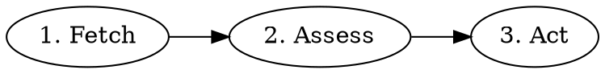

# Architect Workflow

Turn Backlog issues into spec-ready work.

## Workflow



### 1. Fetch Issue

**GitHub:**

```
gh issue view $ISSUE_NUMBER --json title,body,labels,comments,state -R $OWNER/$REPO
```

**Linear:**

```
linear_linear(action="get", id=$LEGION_ISSUE_ID)
```

Extract title, description, comments (included in get response), current labels.

Also check for project-specific skills that may be relevant to this issue's domain. Note any relevant skills in your output so downstream workers (planner, implementer, tester) know to use them.

### 1.5. Inject Relevant Learnings

Follow the injection algorithm in @references/knowledge-injection.md using these keyword sources:

| Keyword Source | Fallback |
|---------------|----------|
| Issue title | — (always available) |
| Issue description | Title only (description rarely missing) |

Extract keywords from the issue title and description. Match against `docs/solutions/index.json` to surface patterns, architectural decisions, and pitfalls relevant to this issue's domain.

Output the injected learnings visibly in the session before proceeding to assessment. If no relevant learnings are found, output "No relevant learnings found." and continue.

**Graceful degradation:** If `docs/solutions/index.json` is missing or invalid, skip silently and proceed to step 2.

### 2. Assess

**Is it clear?** Does it have testable acceptance criteria and no unresolved questions?

If unclear and researchable, try `/legion-oracle [your question]`.
If still unclear, escalate.

**Is it small enough?** Could it be split into independent, shippable pieces?

### 3. Act

**If unclear:**
- Add `user-input-needed` label:
  - **GitHub:** `gh issue edit $ISSUE_NUMBER --add-label "user-input-needed" --remove-label "worker-active" -R $OWNER/$REPO`
  - **Linear:** `linear_linear(action="update", id=$LEGION_ISSUE_ID, labels=[...current without "worker-active" plus "user-input-needed"])`
- Post comment with specific questions:
  - **GitHub:** `gh issue comment $ISSUE_NUMBER --body "..." -R $OWNER/$REPO`
  - **Linear:** `linear_linear(action="comment", id=$LEGION_ISSUE_ID, body="...")`
- Notify controller (best-effort):
  ```
  envoy_publish(topic="notifications.role.legion-controller", message="Worker blocked: $ISSUE_NUMBER architect needs user input")
  ```
  If `envoy_publish` fails, continue — the label is the source of truth.
- Exit

**If too big:** Break down into sub-issues. Each sub-issue must be spec-ready:
- Clear problem statement (what needs to change and why)
- Testable acceptance criteria (how we verify it's done)
- Small enough for one PR
- No blocking questions

Create each spec-ready sub-issue with `worker-done` label.

**Partial breakdown allowed:** If some pieces are clear but others need clarification:
1. Create sub-issues for the clear pieces (with `worker-done`)
2. Add `user-input-needed` to parent with questions about unclear pieces
3. Post comment listing created children AND what still needs clarification

This unblocks work on clear pieces while getting answers on unclear ones.

**If spec-ready:** Refine the acceptance criteria, add testing infrastructure assessment, and
**update the issue body** with the complete designed spec. The issue body is the canonical
record of what this issue is — it must reflect the architect's output, not just the original
rough description.

- **GitHub:** `gh issue edit $ISSUE_NUMBER --body "[refined spec with acceptance criteria and testing infrastructure]" -R $OWNER/$REPO`
- **Linear:** `linear_linear(action="update", id=$LEGION_ISSUE_ID, description="[refined spec]")`

Then add `worker-done` label. Exit.

### 4. Cross-Family Review

Before signaling completion, spawn a cross-family review session to validate the architect output.

**When to review:** Only when you've produced output (created sub-issues or verified spec-readiness). Skip review if escalating with `user-input-needed`.

**How to review:**

1. Spawn a review session using the delegation tool:
   - Category: `review-architect`
   - Model override: Use a different model family than the one doing the architecture work
   - Prompt: Include the original issue description AND your architect output (sub-issues created, acceptance criteria written, or spec-readiness assessment)

2. The reviewer evaluates:
   - Are acceptance criteria testable? (Can a human or CI verify pass/fail?)
   - Are sub-issues properly scoped? (Each small enough for one PR?)
   - Is anything missing from the original requirements?
   - Are there unresolved ambiguities that should be questions, not assumptions?

3. If the reviewer finds issues:
   - Address each finding (fix acceptance criteria, adjust sub-issues, add missing items)
   - You do NOT need to re-review after fixes — one review pass is sufficient

4. Only after incorporating review feedback, proceed to signal completion.

## 5. Signal Handoff

Before signaling completion, write handoff data for downstream workers. This data is advisory — downstream workers can read it but are not required to act on it.

First, assess which injected learnings were helpful:

> Review the learnings injected at the start of this phase. For each, assess: did this learning materially influence your work, prevent a mistake, or provide useful context for this phase? List only those canonical paths in `learningsHelpful`. If none were helpful, use an empty array. If no learnings were injected, omit both fields from handoff.

```bash
# Write handoff data — fail loudly if this fails
legion handoff write --phase architect --workspace . <<'HANDOFF'
{
  "scope": "<small|medium|large>",
  "components": ["list", "of", "affected", "components"],
  "subIssues": ["issue-id-1", "issue-id-2"],
  "routingHints": {
    "complexity": "<trivial|small|medium|large>",
    "estimatedImplementers": 1,
    "skipRetro": false
  },
  "concerns": ["list", "of", "concerns"],
  "learningsInjected": ["<canonical docs/solutions/ paths injected into this phase>"],
  "learningsHelpful": ["<subset that materially helped>"]
}
HANDOFF
```

Verify the handoff was written:

```bash
if [ ! -f .legion/architect.json ]; then
  echo "FATAL: Handoff write failed — .legion/architect.json not created"
  echo "STOP: Do NOT signal worker-done. Diagnose: Is 'legion' CLI in PATH? Is --workspace correct?"
  echo "If write cannot be fixed, note the failure in your exit comment."
fi
```

**Fields:**
- `scope`: Overall scope assessment (small/medium/large)
- `components`: List of affected components or modules
- `subIssues`: IDs of any sub-issues created during breakdown
- `routingHints`: Guidance for downstream workers (complexity, estimated implementers, skip flags)
- `concerns`: Any architectural concerns or gotchas identified
- `learningsInjected`: Canonical `docs/solutions/` file paths of learnings presented to the worker at the start of the phase (omit if none were injected)
- `learningsHelpful`: Subset of `learningsInjected` that materially helped this phase's output (empty array if none were helpful; omit if no learnings were injected)

The handoff write will fail loudly if the CLI encounters an error. If the write fails, diagnose and fix the issue before continuing — handoff data is required for downstream phases to function.

## What Makes Good Acceptance Criteria

Acceptance criteria must be **testable** - a human or CI can verify pass/fail.

**Bad (vague):**
- "Should be fast"
- "Handle errors gracefully"
- "Nice UX"

**Good (testable):**
- "Page loads in under 500ms"
- "Shows error message with retry button on API timeout"
- "Form validates email format before submit"

Each criterion should answer: "How will we know this is done?"

Each criterion should also be **behaviorally verifiable** — a tester should be able to verify it by interacting with the running application, not just by reading code or running unit tests.

## Testing Infrastructure Assessment

After defining acceptance criteria, assess whether they can be verified against running infrastructure. Add a "Testing Infrastructure" section to your output:

**For each acceptance criterion, evaluate:**
- Can this be verified against a running application?
- What infrastructure is needed? (local server, browser, database, seed data)
- What's missing? (no docker-compose, no seed script, README doesn't explain how to run locally)

**Example output:**

```
### Testing Infrastructure

**Available:**
- Local dev server via `bun run dev`
- Seed data script at `scripts/seed.sh`

**Gaps:**
- No browser test harness (Playwright not configured)
- README missing instructions for local database setup
- No health check endpoint to verify server is ready
```

Flag gaps clearly so the user can address them before planning begins. If the project has no way to run locally at all, note this prominently.

## Sub-Issue Creation

**GitHub:**

```
gh issue create --title "[Scoped title]" --body "## Acceptance Criteria
- [ ] [Testable condition]

Part of $LEGION_ISSUE_ID." -R $OWNER/$REPO
```

**Linear:**

```
parent = linear_linear(action="get", id=$LEGION_ISSUE_ID)

linear_linear(action="create",
  title: [Scoped title],
  team: [Same team as parent],
  parentId: parent.id,  # UUID required
  description: |
    ## Acceptance Criteria
    - [ ] [Testable condition]

    Part of $LEGION_ISSUE_ID.,
  state: "Backlog",
  labels: ["worker-done"]
)
```

Post comment to parent explaining the breakdown.

## Updating Labels

Labels array replaces all labels. Fetch current labels first:

**GitHub:**

```
gh issue edit $ISSUE_NUMBER --add-label "worker-done" -R $OWNER/$REPO
```

**Linear:**

```
issue = linear_linear(action="get", id=$LEGION_ISSUE_ID)
current_label_names = [label.name for label in issue.labels]

linear_linear(action="update",
  id: $LEGION_ISSUE_ID,
  labels: current_label_names + ["worker-done"]
)
```

## 6. Completion Signals

| Outcome | Action |
|---------|--------|
| Spec-ready | Cross-family review → incorporate feedback → Add `worker-done` to issue |
| Fully broken down | Cross-family review → incorporate feedback → Add `worker-done` to each child, leave parent unchanged |
| Partial breakdown | Cross-family review → incorporate feedback → Add `worker-done` to clear children, add `user-input-needed` to parent |
| Unclear | Add `user-input-needed` to issue, remove `worker-active` (no review needed) |

**After breakdown:** Parent keeps its existing labels. Do NOT add `worker-done` to parent - only children get it. Post comment to parent explaining what was created and what still needs clarification.

**Cross-family review requirement:** Before adding `worker-done` to any issue or sub-issue, the architect output must pass cross-family review (Section 4). This ensures acceptance criteria are testable, sub-issues are properly scoped, and nothing is missing from the original requirements.

**Label cleanup:** After signaling completion, remove `worker-active`:
- **GitHub:** `gh issue edit $ISSUE_NUMBER --remove-label "worker-active" -R $OWNER/$REPO`
- **Linear:** `linear_linear(action="update", id=$LEGION_ISSUE_ID, labels=[...current labels without "worker-active"])`

Then notify the controller via Envoy (best-effort, exactly one notification):
```
envoy_publish(topic="notifications.role.legion-controller", message="Worker done: $ISSUE_NUMBER architect completed. Sub-issues ready for planning.")
```
If `envoy_publish` fails, continue — the label is the source of truth.

## Common Mistakes

| Mistake | Correction |
|---------|------------|
| Adding `worker-done` to parent after breakdown | Only children get it; parent stays unchanged |
| Thinking "none" means remove labels from parent | "None" means don't add anything; keep existing labels |
| Using identifier as `parentId` | Must use UUID from `get_issue` (Linear only) |
| Updating labels without fetching current | Fetch first, then append |
| Forgetting to comment on parent after breakdown | Always post comment explaining which children were created |
