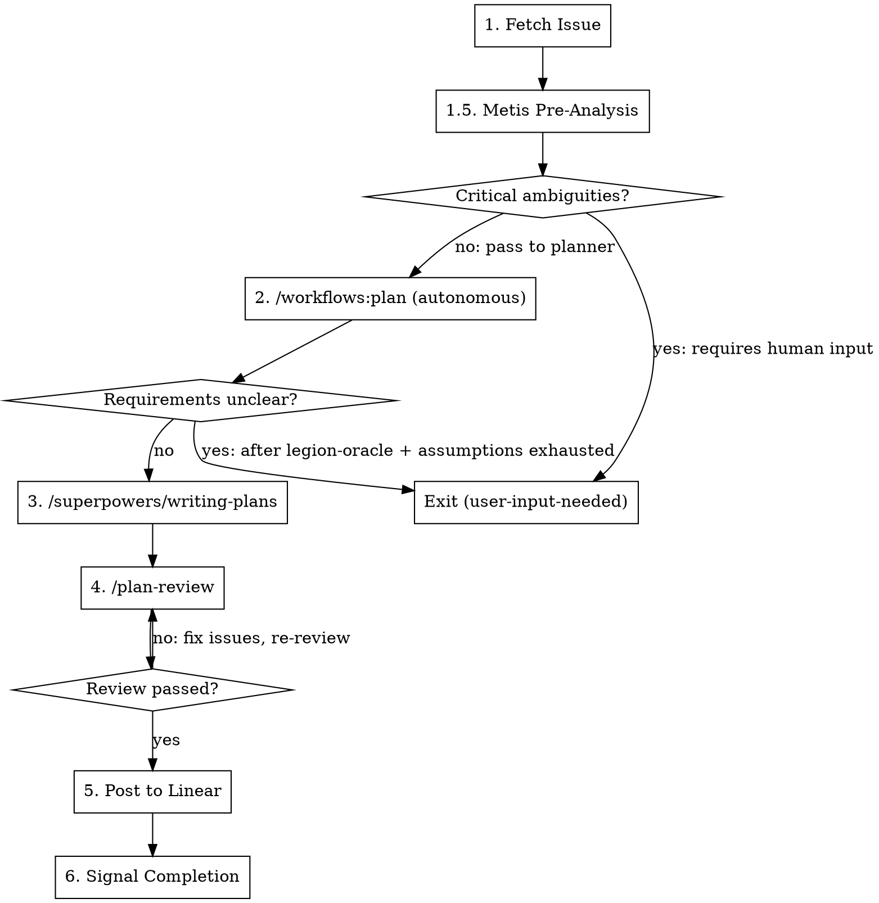

# Plan Workflow

Transform a Linear issue into a reviewed, executable implementation plan.

## Workflow



### 1. Fetch the Issue

```
linear_linear(action="get", id=$LINEAR_ISSUE_ID)
```

The `$LINEAR_ISSUE_ID` environment variable is set by the controller when spawning this worker.

Extract:
- Title and description
- Comments with additional context
- Acceptance criteria if present

### 1.5. Pre-Planning Analysis (Metis)

Before researching and structuring the plan, run a pre-planning analysis to identify risks that could derail the planner.

Spawn via background_task:
- subagent_type: metis
- run_in_background: true
- description: "Pre-planning analysis for $LINEAR_ISSUE_ID"
- prompt: Start with "MODE: PRE_PLANNING" then include the issue title, description, acceptance criteria, and relevant comments. Ask Metis to identify: hidden assumptions, ambiguities with effort implications, scope traps, and AI-slop risks.

Wait for the result via background_output.

**Verify mode activation:** The response must begin with `## Mode: Pre-Planning Analysis`. If it echoes a different mode, retry once with the correct MODE header.

**If Metis fails or times out (>3 min):** Proceed to step 2 without pre-analysis. Note the missing analysis in the planner context.

**If Metis flags critical ambiguities requiring human input** — specifically, ambiguities where the effort delta exceeds ~1 hour or where a user choice is required (not planner judgment) — treat as unclear and exit via the existing escalation protocol (add `user-input-needed`, post comment, exit).

**Otherwise**, pass the Metis analysis as additional context to step 2:

```
Metis pre-analysis:
[analysis output]

Create the implementation plan accounting for these findings.
```

### 2. Invoke /workflows:plan (Autonomous)

Invoke `/workflows:plan` with this context:

```
You are running autonomously without user interaction.
Do NOT ask the user questions interactively. If requirements are unclear:

1. Invoke /legion-oracle [specific question] for research-based guidance
2. Make reasonable assumptions and document them explicitly
3. Only escalate to user-input-needed if you truly cannot proceed

Metis pre-analysis:
[analysis output from step 1.5]

Feature description:
[Linear issue title + description + comments]
```

The skill handles:
- Local research (repo-research-analyst, learnings-researcher)
- Conditional external research (best-practices-researcher, framework-docs-researcher)
- SpecFlow analysis for edge cases
- Structured plan creation

**If the skill determines requirements are fundamentally unclear** (even after legion-oracle + assumptions):
1. Add `user-input-needed` label via `linear_linear(action="update", ...)`
2. Post a comment via `linear_linear(action="comment", ...)` explaining what needs clarification
3. Exit immediately - do NOT add `worker-done`

### 3. Invoke /superpowers/writing-plans

Convert the approved plan into executable, bite-sized tasks.

This creates step-by-step implementation instructions with:
- Exact file paths
- Complete code examples
- Test commands with expected output
- Commit points

This is what the implement workflow will follow.

#### Parallelism Annotation

After creating executable tasks, annotate each task with dependency information:

- **Independent tasks:** Mark tasks that have no dependencies on other tasks. These can execute in parallel.
- **Sequential tasks:** Mark tasks that must follow a specific order, noting which task(s) they depend on.
- **Dependency notation:** Use a simple format in the plan:

```
Task 1: [description] — Independent
Task 2: [description] — Independent  
Task 3: [description] — Depends on: Task 1, Task 2
Task 4: [description] — Depends on: Task 3
```

The implementer will use these annotations to create a task graph with `blockedBy` edges for parallel execution via the task system.

**Guidelines for annotating dependencies:**
- Only mark a dependency if the task truly needs another task's output (shared files, API contracts, test fixtures)
- Minimize dependency chains — prefer wide, shallow graphs over deep sequential chains
- When in doubt, mark as independent (the implementer can add dependencies if needed)

### 4. Review with /plan-review

After creating the executable plan, invoke `/plan-review` with the plan file path.

This spawns parallel cross-family reviewers:
- **Momus** (on a different model family) checks plan executability — can a stateless agent follow every task without asking questions?
- **Simplicity reviewer** challenges unnecessary complexity — are there tasks that could be removed or combined?

**Iterate until review passes:**
1. Read the aggregated review feedback
2. Address each blocking issue by editing the plan directly — do NOT re-run `/superpowers/writing-plans`
3. Re-invoke `/plan-review`
4. Repeat until no blocking issues remain

**Max 3 iterations.** If still failing:
1. Add `user-input-needed` label via `linear_linear(action="update", ...)`
2. Post a comment explaining unresolved review issues
3. Exit without `worker-done`

**If a reviewer fails/times out:** Proceed with partial results. Note the missing review in the Linear comment.

### 5. Post to Linear

Use `linear_linear(action="comment", ...)` to post the **full executable plan** from step 3 (or revised after step 4).

The complete `/superpowers:writing-plans` output goes directly into the Linear comment - all tasks, all code examples, all test commands.

### 6. Signal Completion

Add `worker-done` label to the Linear issue via `linear_linear(action="update", ...)`, then exit.

**CRITICAL:** Only add `worker-done` after successfully posting the plan. Never add this label if:
- Requirements were unclear and could not be resolved (use `user-input-needed` instead)
- Plan review failed and was not resolved
- Any step failed to complete

## Quick Reference

| Step | Action | Skill/Tool |
|------|--------|------------|
| Fetch | Get issue details | `linear_linear(action="get", ...)` |
| Pre-Analysis | Identify risks | Metis agent (background) |
| Research + Structure | Create plan | `/workflows:plan` (autonomous) |
| Executable | Bite-sized tasks | `/superpowers/writing-plans` |
| Validate | Review plan | `/plan-review` (iterate) |
| Post | Full plan to issue | `linear_linear(action="comment", ...)` |
| Complete | Add done label | `linear_linear(action="update", ...)` |

## Autonomous Context Template

When invoking skills that normally ask user questions:

```
You are running autonomously without user interaction.
Do NOT ask the user questions interactively. If uncertain:

1. Invoke /legion-oracle [specific question] - cheap research-based guidance
2. Make reasonable assumptions and document them
3. Only escalate to user-input-needed as absolute last resort

[rest of prompt]
```

## Common Mistakes

| Mistake | Correction |
|---------|------------|
| Adding `worker-done` when requirements unclear | Use `user-input-needed` label, exit without `worker-done` |
| Posting summary instead of full plan | Post complete executable plan from /superpowers/writing-plans |
| Asking user questions | Use legion-oracle first, then assumptions, escalate only as last resort |
| Skipping plan review iteration | Always iterate until /plan-review passes or max 3 attempts |
| Ignoring Metis pre-analysis | Always pass Metis findings to /workflows:plan as context |
