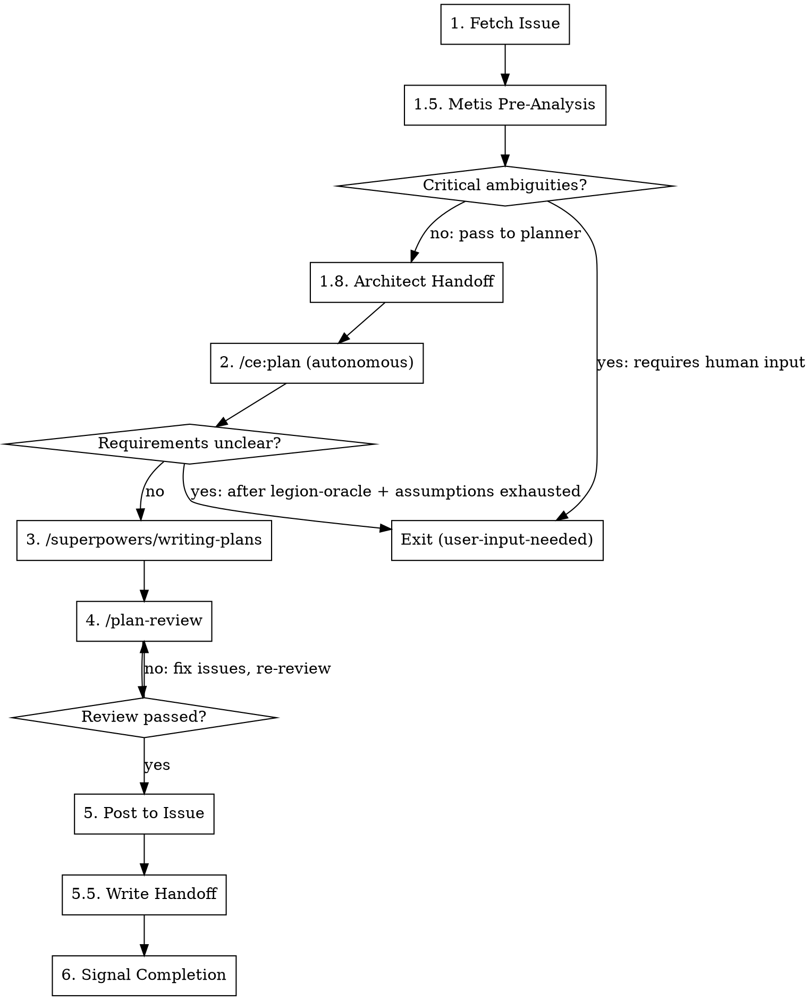

# Plan Workflow

Transform an issue into a reviewed, executable implementation plan.

## Workflow



### 1. Fetch the Issue

**GitHub:**

```
gh issue view $ISSUE_NUMBER --json title,body,labels,comments,state -R $OWNER/$REPO
```

**Linear:**

```
linear_linear(action="get", id=$LEGION_ISSUE_ID)
```

Extract:
- Title and description
- Comments with additional context
- Acceptance criteria if present

### 1.5. Pre-Planning Analysis (Metis)

Before researching and structuring the plan, run a pre-planning analysis to identify risks that could derail the planner.

Spawn via background_task:
- subagent_type: metis
- run_in_background: true
- description: "Pre-planning analysis for $LEGION_ISSUE_ID"
- prompt: Start with "MODE: PRE_PLANNING" then include the issue title, description, acceptance criteria, and relevant comments. Ask Metis to identify: hidden assumptions, ambiguities with effort implications, scope traps, and AI-slop risks.

Wait for the result via background_output.

**Verify mode activation:** The response must begin with `## Mode: Pre-Planning Analysis`. If it echoes a different mode, retry once with the correct MODE header.

**If Metis fails or times out (>3 min):** Proceed to step 2 without pre-analysis. Note the missing analysis in the planner context.

**If Metis flags critical ambiguities requiring human input** — specifically, ambiguities where the effort delta exceeds ~1 hour or where a user choice is required (not planner judgment) — treat as unclear and exit via the existing escalation protocol (add `user-input-needed`, post comment, exit).

**Otherwise**, pass the Metis analysis as additional context to step 2:

```
Metis pre-analysis:
[analysis output]

Create the implementation plan accounting for these findings.
```

### 1.7. Inject Relevant Learnings

Before invoking `/ce:plan`, check the learnings index for applicable prior knowledge:

1. **Read the index:**
   ```bash
   cat docs/solutions/index.json
   ```
   If the file doesn't exist or is invalid JSON, skip this step entirely — proceed to step 2.

2. **Extract module/area keywords** from the issue title, description, and Metis analysis output. Look for references to:
   - Source path segments (e.g., `packages/daemon/src/state/`, `serve-manager`)
   - Module names (e.g., "daemon", "controller", "worker", "state")
   - Component names (e.g., "serve-manager", "decision", "fetch")
   - Feature areas (e.g., "skills", "linear", "github", "review", "retro")
   - Integration concerns (e.g., "PR", "labels", "MCP")
   - Domain concepts and error keywords from the issue

3. **Match keywords against index keys** using two modes:
   - **Path matching**: For each key in `.index` that does NOT start with `tag:`, check if any extracted keyword appears as a substring of the key (case-insensitive). Collect all matched learning file paths.
   - **Tag matching**: For each key that starts with `tag:`, extract the tag name (e.g., `tag:race-condition` → `race-condition`). Check if any extracted keyword matches the tag name (case-insensitive). Collect matched learning file paths.

4. **Deduplicate and rank** matched learnings:
   - Remove duplicates (same file matched via multiple keys)
   - **Status filter**: For each candidate, read its YAML front matter `status` field. Exclude any file with `status: superseded`. If file doesn't exist or has no front matter, include it (graceful degradation).
   - **Primary rank: tag overlap** — For each remaining candidate, read its `tags` front matter field. Count how many of its tags appear in the issue's extracted keywords (case-insensitive). Higher overlap = higher rank.
   - **Secondary rank: key specificity** — Learnings matched via longer/more-specific keys rank higher (e.g., a match on `packages/daemon/src/state` outranks a match on `packages/daemon`)
   - **Tertiary rank: match count** — Number of distinct key matches (more matches = more relevant)
   - **Cap at 3 learnings maximum**

5. **Read each matched learning file** (from `docs/solutions/<path>`). For each file:
   - Read YAML front matter: extract `title` and `tags` fields
   - Skip past front matter (`---` blocks) and headings, take the first paragraph of prose (typically the Problem or Overview section)
   - Prepend structured header: `[{title} | tags: {comma-separated tags}]`
   - Truncate entire output (header + prose) to **350 characters**

6. **Add to `/ce:plan` context** in step 2. Append this section to the autonomous context template, between the Metis pre-analysis and the feature description:

   ```
   Relevant learnings from prior work (preloaded from docs/solutions/index.json):

   1. [docs/solutions/<path>]: [{title} | tags: {tag1}, {tag2}] <prose excerpt> (350 chars max total)
   2. [docs/solutions/<path>]: [{title} | tags: {tag1}, {tag2}] <prose excerpt>
   3. [docs/solutions/<path>]: [{title} | tags: {tag1}, {tag2}] <prose excerpt>

   Review these learnings for patterns and pitfalls relevant to this implementation.
   ```

**If no matches found:** Skip — do not add an empty "Relevant learnings" section.

**If a matched file doesn't exist on disk:** Skip that entry silently (stale index entry from a file rename). Do not error.

### 1.8. Read Architect Handoff (if available)

```bash
legion handoff read --phase architect 2>/dev/null || echo '{}'
```

If architect handoff is present, use `routingHints` and `concerns` to inform planning. This is advisory only — proceed even if the file is missing or empty.

Pass any architect routing hints to `/ce:plan` context in step 2 alongside Metis analysis and learnings.

### 2. Invoke /ce:plan (Autonomous)

Invoke `/ce:plan` with this context:

```
You are running autonomously without user interaction.
Do NOT ask the user questions interactively. If requirements are unclear:

1. Invoke /legion-oracle [specific question] for research-based guidance
2. Make reasonable assumptions and document them explicitly
3. Only escalate to user-input-needed if you truly cannot proceed

Metis pre-analysis:
[analysis output from step 1.5]

Feature description:
[Issue title + description + comments]
```

The skill handles:
- Local research (repo-research-analyst, learnings-researcher)
- Conditional external research (best-practices-researcher, framework-docs-researcher)
- SpecFlow analysis for edge cases
- Structured plan creation

**If the skill determines requirements are fundamentally unclear** (even after legion-oracle + assumptions):
1. Add `user-input-needed` label:
   - **GitHub:** `gh issue edit $ISSUE_NUMBER --add-label "user-input-needed" --remove-label "worker-active" -R $OWNER/$REPO`
   - **Linear:** `linear_linear(action="update", id=$LEGION_ISSUE_ID, labels=[...current without "worker-active" plus "user-input-needed"])`
2. Post a comment explaining what needs clarification:
   - **GitHub:** `gh issue comment $ISSUE_NUMBER --body "..." -R $OWNER/$REPO`
   - **Linear:** `linear_linear(action="comment", id=$LEGION_ISSUE_ID, body="...")`
3. Exit immediately - do NOT add `worker-done`

### 3. Invoke /superpowers/writing-plans

Convert the approved plan into executable, bite-sized tasks.

This creates step-by-step implementation instructions with:
- Exact file paths
- Complete code examples
- Test commands with expected output
- Commit points

This is what the implement workflow will follow.

#### Parallelism Annotation

After creating executable tasks, annotate each task with dependency information:

- **Independent tasks:** Mark tasks that have no dependencies on other tasks. These can execute in parallel.
- **Sequential tasks:** Mark tasks that must follow a specific order, noting which task(s) they depend on.
- **Dependency notation:** Use a simple format in the plan:

```
Task 1: [description] — Independent
Task 2: [description] — Independent  
Task 3: [description] — Depends on: Task 1, Task 2
Task 4: [description] — Depends on: Task 3
```

The implementer will use these annotations to create a task graph with `blockedBy` edges for parallel execution via the task system.

**Guidelines for annotating dependencies:**
- Only mark a dependency if the task truly needs another task's output (shared files, API contracts, test fixtures)
- Minimize dependency chains — prefer wide, shallow graphs over deep sequential chains
- When in doubt, mark as independent (the implementer can add dependencies if needed)

#### Testing Plan

After creating executable tasks, add a **Testing Plan** section to the plan output. The tester agent will use this to verify the implementation works end-to-end.

**Required sections:**

```
## Testing Plan

### Setup
- [Concrete commands to boot the environment]
- [e.g., `bun install && bun run dev`, `docker-compose up -d`]

### Health Check
- [How to verify the environment is ready]
- [e.g., `curl -s http://localhost:3000/health` returns 200]
- [Include timeout: retry for 30s before declaring failure]

### Verification Steps
For each acceptance criterion:
1. **[Criterion name]**
   - Action: [What to do — navigate to URL, run command, etc.]
   - Expected: [What should happen — page shows X, API returns Y]
   - Tool: [Playwright / curl / CLI]

### Tools Needed
- [List of tools the tester should use]
- [e.g., Playwright for browser, curl for API, CLI for commands]
```

**Guidelines:**
- Setup commands must be copy-pasteable — no placeholders the tester would need to figure out
- Health checks should have a timeout (e.g., "retry for 30s")
- Verification steps should be specific enough that a fresh agent with no implementation context can follow them
- If infrastructure doesn't exist yet (architect flagged gaps), note what the implementer needs to create

### 4. Review with /plan-review

After creating the executable plan, invoke `/plan-review` with the plan file path.

This spawns parallel cross-family reviewers:
- **Momus** (on a different model family) checks plan executability — can a stateless agent follow every task without asking questions?
- **Simplicity reviewer** challenges unnecessary complexity — are there tasks that could be removed or combined?

**Iterate until review passes:**
1. Read the aggregated review feedback
2. Address each blocking issue by editing the plan directly — do NOT re-run `/superpowers/writing-plans`
3. Re-invoke `/plan-review`
4. Repeat until no blocking issues remain

**Max 3 iterations.** If still failing:
1. Add `user-input-needed` label:
   - **GitHub:** `gh issue edit $ISSUE_NUMBER --add-label "user-input-needed" --remove-label "worker-active" -R $OWNER/$REPO`
   - **Linear:** `linear_linear(action="update", id=$LEGION_ISSUE_ID, labels=[...current without "worker-active" plus "user-input-needed"])`
2. Post a comment explaining unresolved review issues:
   - **GitHub:** `gh issue comment $ISSUE_NUMBER --body "..." -R $OWNER/$REPO`
   - **Linear:** `linear_linear(action="comment", id=$LEGION_ISSUE_ID, body="...")`
3. Exit without `worker-done`

**If a reviewer fails/times out:** Proceed with partial results. Note the missing review in the issue comment.

### 5. Post to Issue

Post the **full executable plan** from step 3 (or revised after step 4):

- **GitHub:** `gh issue comment $ISSUE_NUMBER --body "..." -R $OWNER/$REPO`
- **Linear:** `linear_linear(action="comment", id=$LEGION_ISSUE_ID, body="...")`

The complete `/superpowers:writing-plans` output goes directly into the issue comment - all tasks, all code examples, all test commands.

### 5.5. Write Handoff Data

After posting the plan, write handoff data for downstream phases:

```bash
legion handoff write --phase plan \
  --data '{
    "taskCount": 5,
    "independentTasks": 3,
    "routingHints": {
      "complexity": "small",
      "estimatedImplementers": 1,
      "skipTest": false,
      "skipRetro": false,
      "skipArchitect": false
    },
    "concerns": ["Race condition in state transitions noted by Metis"],
    "learningsUsed": ["docs/solutions/state/race-conditions.md"],
    "workflowRecommendation": "Standard pipeline — all phases needed"
  }' 2>/dev/null || true
```

**Fields:**
- `taskCount`: Number of tasks in the executable plan
- `independentTasks`: Number of tasks marked as independent (can parallelize)
- `routingHints`: Planner's assessment of complexity and pipeline needs
- `concerns`: Combined concerns from Metis analysis and planner judgment
- `learningsUsed`: List of `docs/solutions/` files injected in step 1.7
- `workflowRecommendation`: Freeform text for future adaptive routing

**This step is non-blocking.** If the handoff write fails, it must not prevent completion. The `|| true` ensures the workflow continues.

**workflowRecommendation examples:**
- "Standard pipeline — all phases needed"
- "Simple bug fix — skip retro, single implementer"
- "Complex feature — 2 parallel implementers recommended, full pipeline"
- "Dependency bump — skip retro"


### 6. Signal Completion

Add `worker-done` label to the issue, then exit:

- **GitHub:** `gh issue edit $ISSUE_NUMBER --add-label "worker-done" -R $OWNER/$REPO`
- **Linear:** `linear_linear(action="update", id=$LEGION_ISSUE_ID, labels=[...current + "worker-done"])`

Then remove `worker-active`:
- **GitHub:** `gh issue edit $ISSUE_NUMBER --remove-label "worker-active" -R $OWNER/$REPO`
- **Linear:** `linear_linear(action="update", id=$LEGION_ISSUE_ID, labels=[...current labels without "worker-active"])`

**CRITICAL:** Only add `worker-done` after successfully posting the plan. Never add this label if:
- Requirements were unclear and could not be resolved (use `user-input-needed` instead)
- Plan review failed and was not resolved
- Any step failed to complete

## Quick Reference

| Step | Action | Skill/Tool |
|------|--------|------------|
| Fetch | Get issue details | `gh issue view $ISSUE_NUMBER ...` or `linear_linear(action="get", ...)` |
| Pre-Analysis | Identify risks | Metis agent (background) |
| Architect Handoff | Read prior phase hints | `legion handoff read --phase architect` |
| Research + Structure | Create plan | `/ce:plan` (autonomous) |
| Executable | Bite-sized tasks | `/superpowers/writing-plans` |
| Validate | Review plan | `/plan-review` (iterate) |
| Post | Full plan to issue | `gh issue comment ...` or `linear_linear(action="comment", ...)` |
| Write Handoff | Capture plan metadata | `legion handoff write --phase plan` |
| Complete | Add done label | `gh issue edit --add-label ...` or `linear_linear(action="update", ...)` |

## Autonomous Context Template

When invoking skills that normally ask user questions:

```
You are running autonomously without user interaction.
Do NOT ask the user questions interactively. If uncertain:

1. Invoke /legion-oracle [specific question] - cheap research-based guidance
2. Make reasonable assumptions and document them
3. Only escalate to user-input-needed as absolute last resort

[rest of prompt]
```

## Common Mistakes

| Mistake | Correction |
|---------|------------|
| Adding `worker-done` when requirements unclear | Use `user-input-needed` label, exit without `worker-done` |
| Posting summary instead of full plan | Post complete executable plan from /superpowers/writing-plans |
| Asking user questions | Use legion-oracle first, then assumptions, escalate only as last resort |
| Skipping plan review iteration | Always iterate until /plan-review passes or max 3 attempts |
| Ignoring Metis pre-analysis | Always pass Metis findings to /ce:plan as context |
