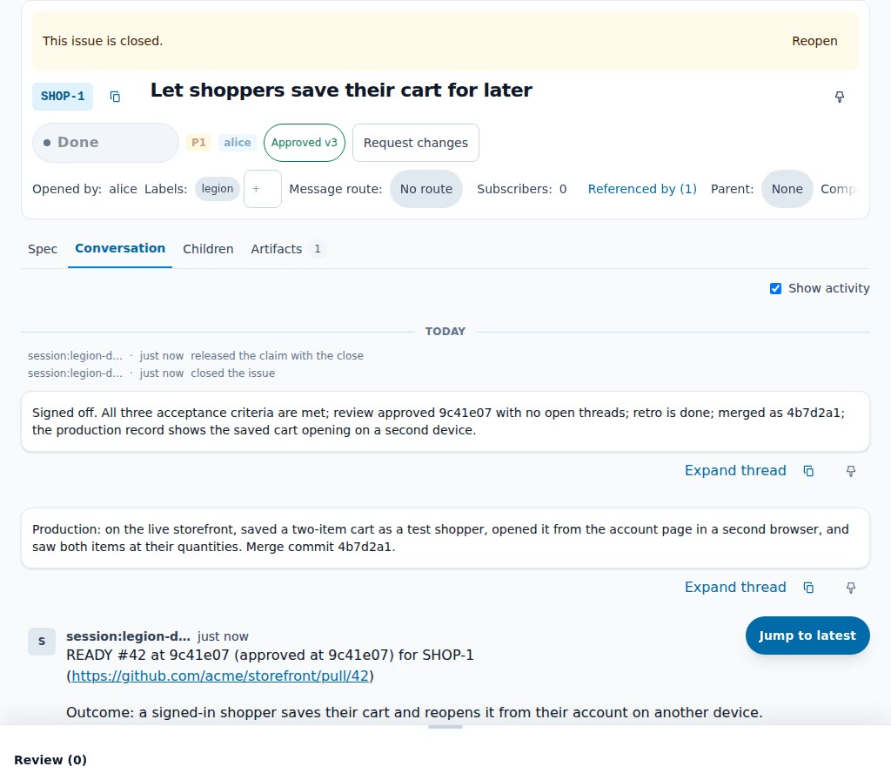
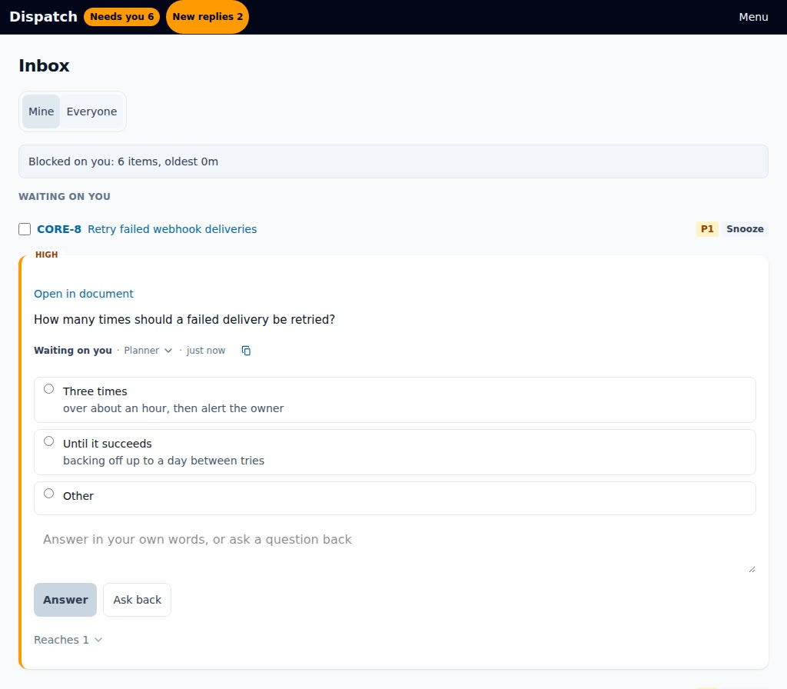
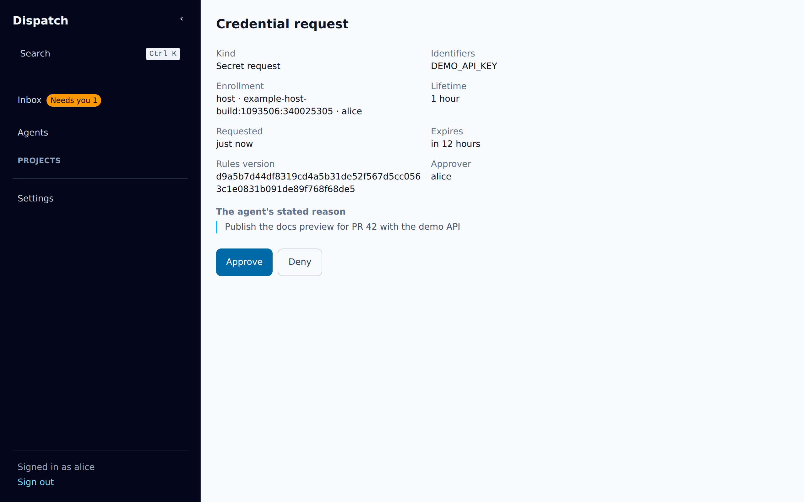

# Legion

Legion runs teams of coding agents on the issues you hand it, and brings each one back as a pull
request that is ready to merge. Root processes own issue trees: each root issue gets an architect
that writes its spec and splits the work, and the daemon runs a planner, an implementer, a tester, a
reviewer and a merger over each change. The Legion daemon keeps the durable state, gives each agent
its credentials and routes the events between them. Issues, specs and every decision a person makes
live in Dispatch. Legion is for people who want agents to work tracked issues end to end while they
keep the decisions: what to build, whether the spec is right, the answers to the agents' questions,
which credentials the agents may use, and the merge.

Documentation: <https://sjawhar.github.io/legion/>

## The four parts

### Legion

The coordinator: a Go daemon and the `legion` CLI. The daemon works the Dispatch issues labelled
`legion`. A controller session the operator starts labels and admits the highest-priority `todo`
issue whenever a slot frees; you can also label an issue yourself. Each admitted issue gets an
architect, which writes the spec, splits the work and asks you what only you can answer. Once you
approve the spec, the daemon runs the phase workers in turn: planner, implementer, tester, reviewer
and merger. Each agent is an [Oh My Pi](https://github.com/sjawhar/oh-my-pi) session, in a tmux
pane on one host or in an [Agent Sandbox](https://github.com/kubernetes-sigs/agent-sandbox)
pod on Kubernetes, and each phase commits a handoff under `.legion/` on the issue branch for a
restarted agent to recover from. The daemon writes the issue's status back to Dispatch as it moves
from Todo through In Progress, Testing, Needs Review and Retro to Done. Legion never merges: the
merger posts `READY` on the issue, a person merges the pull request, and the implementer then checks
the change in production.

[Legion's documentation](https://sjawhar.github.io/legion/legion/) ·
[a walkthrough video of one issue](https://sjawhar.github.io/legion/legion/walkthrough/)

[](https://sjawhar.github.io/legion/legion/walkthrough/)

### Dispatch

The record of work and decisions: a web app and an HTTP API over projects and issues. An issue holds
its status, its spec, its conversation and its files. The spec is a live document that people and
agents edit together, comment on and suggest changes to. An ask is a question put to a named
person, and it waits in that person's Inbox until they answer it. An approval request is an ask
whose answer approves a document at one version or requests changes. Agents work through
`dispatch_*` tools; people use the dashboard: the Inbox, each project's list and board, and the
Agents page, where they can message the agents that are running.

[Dispatch's documentation](https://sjawhar.github.io/legion/dispatch/) ·
[a video of answering an ask](https://sjawhar.github.io/legion/dispatch/inbox-and-asks/)

[](https://sjawhar.github.io/legion/dispatch/inbox-and-asks/)

### Envoy

The events between everything else, carried on NATS JetStream. Envoy's listener turns GitHub
webhooks into events, Dispatch publishes its own, and each event reaches the agent sessions
subscribed to its topic: one issue's events, one session's inbox, or a role, which the listener
hands to whichever session holds it. Delivery is at least once. Events stay in the stream for 72
hours, and the Legion daemon reads them through durable consumers, so an event that arrives while it
is down is read when it comes back. Agent harnesses connect through the clients in this repository:
`packages/pi-envoy` for Oh My Pi, `packages/claude-envoy` for Claude Code and `packages/envoy-plugin`
for OpenCode, all built on `packages/envoy-client`.

[Envoy's documentation](https://sjawhar.github.io/legion/dispatch/envoy/)

### Secrets Broker

Credentials an agent asks for and a person approves. An agent runs
`agent-secrets NAME -- <command>`, and the broker's rules grant the request at once, refuse it, or
send it to a named person, who approves or denies it in their Dispatch Inbox. The granted value
reaches only the session that asked, in the environment of the command it runs, so an agent never
holds a long-lived key. Each session signs its requests with a key of its own, and every request,
decision and use is recorded. Legion enrolls every worker pod it starts on Kubernetes when its
deployment names a broker.

[The Secrets Broker's documentation](https://sjawhar.github.io/legion/broker/) ·
[a walkthrough video of one request](https://sjawhar.github.io/legion/broker/walkthrough/)

[](https://sjawhar.github.io/legion/broker/walkthrough/)

## Quick start

The documentation's getting-started pages cover each part:

- **Dispatch on your machine.** [Running Dispatch](https://sjawhar.github.io/legion/dispatch/running-dispatch/#running-it-on-your-machine)
  starts the server against a Postgres in Docker, with a sign-in that needs no GitHub App.
- **The Secrets Broker on your machine.**
  [Run the broker locally](https://sjawhar.github.io/legion/broker/guides/run-locally/): one script,
  `packages/envoy/scripts/dev-broker.sh`, starts a broker with example rules and fake secrets. The
  [quickstart](https://sjawhar.github.io/legion/broker/quickstart/) then uses a secret from an agent
  session.
- **Envoy.** [Running the listener](https://sjawhar.github.io/legion/dispatch/envoy/#running-the-listener)
  lists its settings and health checks.
- **Legion.** [Running Legion](https://sjawhar.github.io/legion/legion/running-legion/) is the
  operator's guide: the cluster, the two GitHub Apps, `legion.yaml` and the model route.
  [Using Legion](https://sjawhar.github.io/legion/legion/using-legion/) covers handing it an issue.
  The `legion` CLI ships on each `legion-v*` [release](https://github.com/sjawhar/legion/releases) as
  `legion-<os>-<arch>.tar.gz` for Linux and macOS, and the worker image carries the same binary at
  `/opt/legion/bin/legion`.

To serve the documentation site from a checkout, with Bun, Go and Node.js 22.12 or newer installed:

```sh
bun install
bun run docs:dev
```

## Repository layout

| Path | What it holds |
| --- | --- |
| `packages/daemon/` | The Legion daemon and the `legion` CLI, in Go, with the role prompts the binary embeds, and the worker image's Dockerfile. |
| `packages/envoy/` | Go: the Envoy listener, Dispatch's server (`cmd/dispatch`), the Secrets Broker (`cmd/broker`) and its `agent-secrets` clients. |
| `packages/dispatch/` | Dispatch's web app, in React, which Dispatch's server serves. |
| `packages/proof-editor/` | Dispatch's document editor, copied from [proof-sdk](https://github.com/EveryInc/proof-sdk). |
| `packages/contracts/` | The event contracts and Dispatch tool specifications the packages share, and the Go code generated from them. |
| `packages/envoy-client/` | The HTTP client, tool contract and message renderer the three Envoy clients share. |
| `packages/pi-envoy/` | The Oh My Pi extension: the Envoy, Dispatch and Legion tools, and the agents Legion's workers run with. |
| `packages/claude-envoy/` | The Claude Code plugin: Envoy events in a Claude Code session, and the Dispatch tools. |
| `packages/envoy-plugin/` | The OpenCode plugin: the Envoy and Dispatch tools. |
| `skills/` | The skills Legion's agents load: the architect, the controller, the phase workers, Dispatch, Envoy and the review rubrics. |
| `deploy/kubernetes/` | Example files for running Legion on Kubernetes: `legion.yaml`, the controller's file, and a model route. |
| `docs/site/` | The documentation site, in Astro Starlight. |
| `docs/` | Beside the site: the Kubernetes runtime's reference (`kubernetes.md`), design principles, plans and learnings. |
| `scripts/` | The live end-to-end proofs (`scripts/e2e/`) and repository tooling. |
| `patches/` | Patches Bun applies to three editor dependencies at install. |
| `.github/` | CI and release workflows, and the checks they run. |
| `.dispatch/architecture/` | Legion's architecture model, which Dispatch imports for the project. |

## Development

You need Bun at the version `.bun-version` pins and Go at the version `go.work` names. `go.work`
binds the two Go modules, `packages/daemon` and `packages/envoy`; the TypeScript packages and the
documentation site are Bun workspaces of the root `package.json`.

```sh
bun install                                          # every workspace
cd packages/<package> && bun run lint && bun run typecheck && bun run test
go -C packages/daemon test ./...                     # the Legion daemon
go -C packages/envoy test ./...                      # Envoy, Dispatch's server and the Secrets Broker
```

Envoy's Go tests start NATS in Docker, and the tests that need a Postgres read its address from the
environment. The repository's conventions and each part's commands are in `AGENTS.md` at the root
and in the `AGENTS.md` beside most packages; `skills/AGENTS.md` covers the skills. The documentation
site's [contributing page](https://sjawhar.github.io/legion/contributing/) covers writing its pages.

## License

Apache License 2.0; see [LICENSE](LICENSE). Code copied from other projects keeps its own license in
a `LICENSE` file beside it.

Every artifact a release ships carries the licenses of the third-party code in it, written at build
time from what the build included, and the build fails when a dependency's license cannot be
determined:

| Artifact | Notices |
| --- | --- |
| `@sjawhar/pi-legion-envoy`, `@sjawhar/opencode-legion-envoy` (npm) | `dist/THIRD_PARTY_NOTICES` in the package |
| `packages/claude-envoy` (committed bundle) | `packages/claude-envoy/dist/THIRD_PARTY_NOTICES` |
| Dispatch web app | `THIRD_PARTY_NOTICES.txt` beside the bundle, served at `/THIRD_PARTY_NOTICES.txt` |
| `ghcr.io/sjawhar/legion/envoy`, `ghcr.io/sjawhar/legion-worker` images | `/usr/share/doc/legion/THIRD_PARTY_NOTICES` |
| `legion-<os>-<arch>.tar.gz` (`legion-v*` releases) | `legion-<os>-<arch>/THIRD_PARTY_NOTICES` |
| `legion-envoy-<arch>.tar.gz`, `agent-secrets-<arch>.tar.gz` (`legion-envoy-v*` releases) | `THIRD_PARTY_NOTICES`, `agent-secrets/THIRD_PARTY_NOTICES` |

`scripts/third-party-notices.ts` writes the JavaScript bundles' notices from the bundler's module
list, `scripts/go-third-party-notices.sh` the Go programs' with go-licenses, and each image assembles
its file with `scripts/assemble-third-party-notices.sh`.
