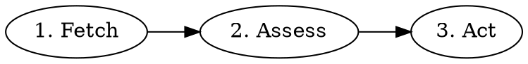

# Create Architect Workflow for Legion Worker

## Overview

Add a new `architect` worker mode that turns vague/large Backlog items into spec-ready work. The architect assesses issues for clarity and size, breaks down large issues into sub-issues, and adds acceptance criteria.

## Problem Statement

Legion workers can only handle well-specified issues. Vague or large issues sit without a path to implementation. The architect fills this gap.

## Proposed Solution

Create `skills/legion-worker/workflows/architect.md` with:
- Simple decision: clear + small enough? → finalize. Too big? → break down. Unclear? → escalate.
- Sub-issue creation via Linear MCP
- Oracle available for research if needed

## Technical Considerations

**Environment simplification**: Workers are launched in their workspace directory. The only required environment variable is `LINEAR_ISSUE_ID`. Remove `WORKSPACE_DIR` and `LEGION_DIR` requirements from SKILL.md.

**Linear API gotchas**:
- `parentId` must be UUID (call `get_issue` first to resolve)
- `labels` array on `update_issue` replaces all labels (fetch current first)
- Label objects have `.name` property - extract names before updating

---

## Acceptance Criteria

- [x] `skills/legion-worker/workflows/architect.md` created
- [x] `skills/legion-worker/SKILL.md` routing table includes `architect` mode
- [x] `skills/legion-worker/SKILL.md` environment simplified to just `LINEAR_ISSUE_ID`
- [x] Workflow follows existing patterns (numbered steps, MCP tool calls)

---

## Implementation Tasks

### Task 1: Create architect workflow file

**File:** `skills/legion-worker/workflows/architect.md`

```markdown
# Architect Workflow

Turn Backlog issues into spec-ready work.

## Workflow



### 1. Fetch Issue

```
mcp__linear__get_issue with id: $LINEAR_ISSUE_ID
mcp__linear__list_comments with issueId: $LINEAR_ISSUE_ID
```

Extract title, description, comments, current labels.

### 2. Assess

**Is it clear?** Does it have testable acceptance criteria and no unresolved questions?

If unclear and researchable, try `/oracle [your question]`.
If still unclear, escalate.

**Is it small enough?** Could it be split into independent, shippable pieces?

### 3. Act

**If unclear:** Add `user-input-needed` label, post comment with specific questions, exit.

**If too big:** Break down into sub-issues. Each sub-issue must be spec-ready:
- Clear problem statement (what needs to change and why)
- Testable acceptance criteria (how we verify it's done)
- Small enough for one PR
- No blocking questions

Create each sub-issue with `worker-done` label. Leave parent unlabeled. Exit.

**If spec-ready:** Ensure acceptance criteria are present and testable, add `worker-done` label. Exit.

## What Makes Good Acceptance Criteria

Acceptance criteria must be **testable** - a human or CI can verify pass/fail.

**Bad (vague):**
- "Should be fast"
- "Handle errors gracefully"
- "Nice UX"

**Good (testable):**
- "Page loads in under 500ms"
- "Shows error message with retry button on API timeout"
- "Form validates email format before submit"

Each criterion should answer: "How will we know this is done?"

## Sub-Issue Creation

```
parent = mcp__linear__get_issue with id: $LINEAR_ISSUE_ID

mcp__linear__create_issue with:
  title: [Scoped title]
  team: [Same team as parent]
  parentId: parent.id  # UUID required
  description: |
    ## Acceptance Criteria
    - [ ] [Testable condition]

    Part of $LINEAR_ISSUE_ID.
  state: "Backlog"
  labels: ["worker-done"]
```

Post comment to parent explaining the breakdown.

## Updating Labels

Labels array replaces all labels. Fetch current labels first:

```
issue = mcp__linear__get_issue with id: $LINEAR_ISSUE_ID
current_label_names = [label.name for label in issue.labels]

mcp__linear__update_issue with:
  id: $LINEAR_ISSUE_ID
  labels: current_label_names + ["worker-done"]
```

## Completion Signals

| Outcome | Label | On |
|---------|-------|-----|
| Spec-ready | `worker-done` | Issue |
| Broken down | `worker-done` | Each child |
| Broken down | (none) | Parent |
| Unclear | `user-input-needed` | Issue |

## Common Mistakes

| Mistake | Correction |
|---------|------------|
| Adding `worker-done` to parent after breakdown | Only children get it |
| Using identifier as `parentId` | Must use UUID from `get_issue` |
| Updating labels without fetching current | Fetch first, then append |
```

### Task 2: Update worker skill

**File:** `skills/legion-worker/SKILL.md`

**Changes:**

1. Add `architect` to Mode Routing table:
```markdown
| Mode | Workflow | Adds `worker-done` |
|------|----------|-------------------|
| `architect` | @workflows/architect.md | Yes (or on children) |
```

2. Simplify Environment section to:
```markdown
## Environment

Required:
- `LINEAR_ISSUE_ID` - issue identifier (e.g., `ENG-21`)
```

3. Update lifecycle: architect → plan → implement → review → retro → finish

---

## References

- Design document: `docs/plans/2026-02-02-backlog-management-design.md`
- Existing workflow pattern: `skills/legion-worker/workflows/plan.md`
