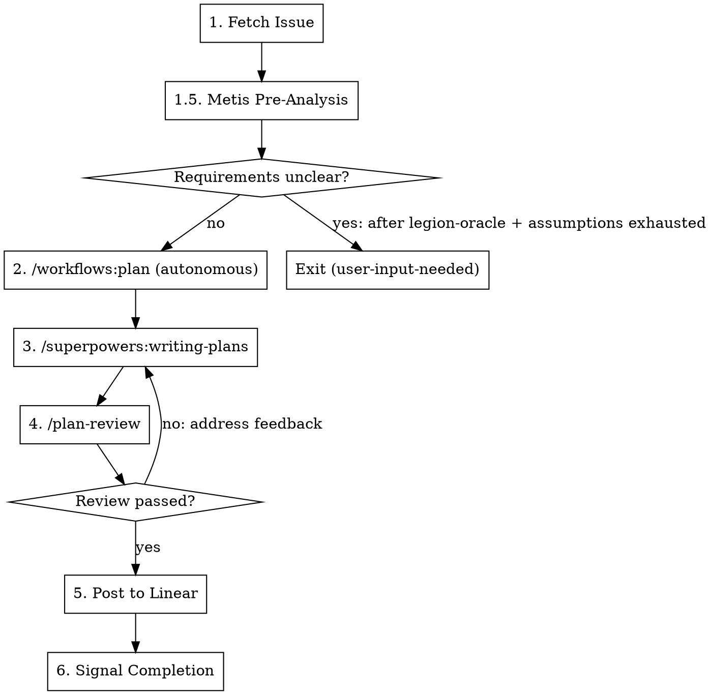

# Planning Pipeline & Roadmap Consolidation

> **For Claude:** REQUIRED SUB-SKILL: Use superpowers:executing-plans to implement this plan task-by-task.

**Goal:** Add a Metis+Momus planning pipeline to Legion's worker plan workflow, replace the inflexible compound-engineering plan_review with a custom reviewer system, and consolidate the open issue backlog into a single forward-looking roadmap.

**Architecture:** Skills-first approach. Metis becomes a pre-planning analyst (agent in the plugin, invoked by plan workflow). Momus becomes a plan-executability reviewer (agent in the plugin, invoked by a new /plan-review command). Compound-engineering's simplicity reviewer is ported and generalized. All changes are to skill markdown + agent prompts + one delegation guard update.

**Tech Stack:** TypeScript/Bun plugin (`packages/opencode-plugin/`), OpenCode skill markdown (`.claude/skills/`), existing `background_task` delegation tool

**Review reconciliation (Metis + Oracle findings addressed):**
- Fix #1 (workflow order): `/plan-review` now runs AFTER `/superpowers:writing-plans`, not before — Momus reviews the executable plan, not the structural plan
- Fix #2 (cross-family dropped): `/plan-review` command explicitly specifies model overrides to ensure cross-family review
- Fix #3 (dual-mode brittle): Added explicit `MODE:` sentinel header requirement for mode selection, not natural language hints
- Fix #4 (leaf agent guard): Task 3 now includes updating `LEAF_AGENTS` in `delegation-tool.ts`
- Fix #5 (workflow graph mismatch): Metis insertion reconciled with the `unclear?` decision node
- Fix #6 (pseudo-YAML): Task 5 uses consistent `background_task(...)` tool call format matching plan.md conventions
- Fix #7 (issue closure): Removed from this plan — close issues as separate operational step after validation
- Fix #8 (biome not verified): Replaced with repo's actual scripts (`bun run lint`, `bun run typecheck`, `bun run test`)
- Fix #9 (configurable claim): Removed — customization is by editing the command file, stated honestly
- Fix #10 (reviewer failure): Added fallback behavior for partial reviewer completion

---

## Context: What Exists Today

### Implemented (skills-first roadmap + MVP phases 2-4 — all complete)

- **Plugin:** 9 agents (orchestrator, executor, conductor, oracle, explorer, librarian, metis, momus, multimodal), 12 hooks, task system with dependency graph, session-based delegation, category routing with model override
- **Worker pipeline:** architect → plan → implement → review → retro → merge
- **Plan workflow (plan.md):** fetch → /workflows:plan → /deepen-plan → /compound-engineering:plan_review (iterate 3x max) → /superpowers:writing-plans → cross-family review → post to Linear
- **Note:** `/deepen-plan` spawns 20-40 parallel agents to enrich a plan, but its unique value (institutional learnings from `docs/solutions/`) is already covered by `/workflows:plan`'s `learnings-researcher` step. This plan removes it.
- **Cross-family review:** All phases (architect, plan, implement) spawn cross-model review sessions
- **Pipeline discipline:** Human approval gate, structured escalation, quality gates, parallelism annotations

### Current Metis Agent (gap analysis, not pre-planning)

```
Prompt: ~1.5K chars, gap analysis specialist
Role: Compares implementation against spec, finds missing features
When used: After implementation, for "did we miss anything?"
```

### Current Momus Agent (general critique, not plan validation)

```
Prompt: ~1.5K chars, critical reviewer
Role: Challenges assumptions, identifies weaknesses
When used: General-purpose review, "what's wrong with this?"
```

### Problem: Plan Review is Inflexible

`/compound-engineering:plan_review` hardcodes 3 Rails-persona reviewers (DHH, Kieran, simplicity). Can't customize the reviewer list. Good simplicity focus, but:
- Rails-specific personas are irrelevant for non-Rails projects
- No plan-executability check (can a stateless agent execute this?)
- No pre-planning analysis (hidden requirements, ambiguities, AI-slop risk)

---

## What This Plan Adds

### 1. Metis Pre-Analysis (new role for existing agent)

**Where it runs:** Between plan.md step 1 (fetch issue) and the `Requirements unclear?` decision. Metis analysis feeds into the clarity assessment — if Metis flags critical ambiguities, escalate via existing unclear protocol.

**What it does:** Reads the spec-ready issue (from architect) and produces:
- Hidden assumptions the planner should explicitly address
- Ambiguities where interpretation A vs B means 2x effort difference
- Scope traps ("this sounds simple but actually touches X, Y, Z")
- AI-slop warnings ("don't over-engineer this — simple approach is fine")
- Recommended constraints for the planner

**Why here, not in architect:** The architect works with vague issues and already has its own clarity check + cross-family review. Metis catches the gap between "spec looks clear" and "planner will still guess wrong" — things that only surface when you try to turn acceptance criteria into implementation steps.

### 2. Momus Plan-Executability Review (new role for existing agent)

**Where it runs:** AFTER `/superpowers:writing-plans` produces the executable plan. Momus reviews the final executable output, not the structural plan.

**What it does:**
- Can a stateless agent execute this plan without asking questions?
- Are all file paths real and specific (not "relevant files")?
- Are acceptance criteria machine-verifiable?
- Is the task dependency graph correct (no missing deps, no unnecessary serialization)?
- Are code examples complete (not "add validation logic here")?

### 3. Custom /plan-review Command (replaces compound-engineering:plan_review)

**What it does:** Spawns reviewers in parallel via `background_task` with explicit model overrides to ensure cross-family review. Waits for results, returns aggregated feedback.

**Reviewers (edit `.claude/commands/plan-review.md` to customize):**
- Momus with explicit cross-family model override (plan-executability)
- Simplicity-reviewer on default model (complexity challenge)

**Failure handling:** If one reviewer fails/times out after 5 minutes, proceed with the other's results and note the partial review. If both fail, fall back to manual review and escalate.

---

## Open Issues Reconciliation

Issues should be closed as a **separate operational step** after this plan's implementation is validated on the merged branch. Do not close issues in the same change set as code.

### To Close After Validation (7 completed + 1 superseded)

| Issue | Title | Evidence |
|-------|-------|----------|
| #22 | human approval gate | `needs-approval`/`human-approved` labels in state machine (`packages/daemon/src/state/`) |
| #24 | cross-family model review | Cross-family review in `architect.md`, `plan.md`, `implement.md` workflows |
| #26 | structured escalation reports | Escalation template in `.claude/skills/legion-worker/SKILL.md` "Blocking on User Input" section |
| #27 | upfront parallelism annotation | "Parallelism Annotation" sub-step in `plan.md` after writing-plans |
| #29 | Orchestration Roadmap (umbrella) | Superseded by `docs/plans/2026-02-11-skills-first-roadmap.md` |
| #30 | pre-transition quality gates | Quality gate as controller policy in controller SKILL.md + `packages/daemon/src/state/` |
| #37 | MVP roadmap (Phases 2-4) | All tasks in `docs/plans/2026-02-12-opencode-legion-mvp-phases-2-4.md` implemented |
| #23 | impact analysis step in plan workflow | Addressed by Metis pre-analysis (this plan, Task 1-2) |

### To Consolidate

**#34 + #35 → single "adaptive workflow pipeline" issue.** #34 (dynamic workflow orchestration) and #35 (model-determined workflow topology at triage) are both about making the pipeline flexible. #35 is a subset of #34. Merge into one issue.

### Keep Open (deferred, still valid)

| Issue | Title | Rationale |
|-------|-------|-----------|
| #25 | E2E testing capability set | Useful but not blocking |
| #31 | lightweight codebase index | Deferred until pipeline is excellent |
| #32 | proactive memory injection | Depends on #31 |
| #33 | stuck detection (oscillation heuristics) | Deferred — revisit after seeing real stuck patterns |
| #34+#35 | adaptive workflow pipeline (consolidated) | Make pipeline excellent before making it flexible |
| #39 | CliError refactor | Standalone, unrelated |

---

## Tasks

### Task 1: Update Metis Agent Prompt for Pre-Planning Analysis

**Files:**
- Modify: `packages/opencode-plugin/src/agents/metis.ts`

**Step 1: Read the current prompt**

Read `packages/opencode-plugin/src/agents/metis.ts` to understand the current structure.

**Step 2: Rewrite the prompt**

Replace `METIS_PROMPT` with a dual-mode prompt. Each mode is activated by a `MODE:` sentinel header in the delegation prompt (not by natural language hints).

**Mode 1 — Pre-Planning Analysis** (activated by `MODE: PRE_PLANNING` in delegation prompt):
- The agent MUST echo `## Mode: Pre-Planning Analysis` as the first line to confirm mode selection
- Input: spec-ready issue (title, description, acceptance criteria, comments)
- Process: identify hidden assumptions, ambiguities with effort implications, scope traps, AI-slop risks, implicit requirements
- Output: structured analysis with `## Assumptions to Address`, `## Ambiguities` (each with options + recommended default + effort delta), `## Scope Warnings`, `## Constraints for Planner`
- Constraint: READ-ONLY, no file modifications
- Keep it concise — the planner is smart, it just needs the pre-analysis, not verbose guidance

**Mode 2 — Gap Analysis** (activated by `MODE: GAP_ANALYSIS` in delegation prompt, or when no mode specified — preserves backward compatibility):
- The agent MUST echo `## Mode: Gap Analysis` as the first line
- Same as current: compare implementation against spec, find missing features, uncovered edge cases
- Triggered when reviewing implementation (not during planning)

Both modes share the same constraints (read-only, specific, reference file:line) and communication format.

**Design guidance:**
- Target ~2K chars total (current is 1.5K — modest increase for dual-mode)
- Use XML tags for mode sections in the prompt (`<pre-planning>`, `<gap-analysis>`) with clear activation instructions
- Study oh-my-opencode's Metis for inspiration (`/home/sami/oh-my-opencode/original/src/agents/metis.ts`) but don't copy — theirs is 12.9K chars and over-engineered for this use case

**Step 3: Update the description**

Update the `description` field in `createMetisAgent` to mention both pre-planning analysis and gap analysis.

**Step 4: Run tests + typecheck + lint**

Run (from `packages/opencode-plugin/`):
```bash
bun run test && bun run typecheck && bun run lint
```

Expected: All pass (prompt change doesn't affect types or tests)

**Step 5: Commit**

```
feat(agents): add pre-planning analysis mode to Metis

Metis now supports two modes activated by MODE: sentinel header:
- PRE_PLANNING: identifies hidden assumptions, ambiguities, scope
  traps before planning
- GAP_ANALYSIS: existing behavior comparing implementation against spec
```

---

### Task 2: Update Momus Agent Prompt for Plan-Executability Review

**Files:**
- Modify: `packages/opencode-plugin/src/agents/momus.ts`

**Step 1: Read the current prompt**

Read `packages/opencode-plugin/src/agents/momus.ts`.

**Step 2: Rewrite the prompt**

Replace `MOMUS_PROMPT` with a dual-mode prompt. Each mode is activated by a `MODE:` sentinel header.

**Mode 1 — Plan Executability Review** (activated by `MODE: PLAN_EXECUTABILITY`):
- The agent MUST echo `## Mode: Plan Executability Review` as the first line
- Input: executable implementation plan (from `/superpowers:writing-plans` output — the final bite-sized task list, NOT the structural plan)
- Evaluate:
  - Can a stateless agent execute every task without asking questions?
  - Are file paths specific and real (not "relevant files" or "appropriate location")?
  - Are code examples complete (not "add validation logic" or "implement error handling")?
  - Are test commands runnable with expected outputs specified?
  - Is the dependency graph correct (no missing deps, no unnecessary serialization)?
  - Are acceptance criteria machine-verifiable (not "should be fast" but "loads in <500ms")?
- Output: `Verdict: [executable/needs-work/reject]` + issues list with severity (blocking/non-blocking) + specific fixes
- A "blocking" issue means the plan CANNOT be executed as-is. A "non-blocking" issue is an improvement suggestion.
- Constraint: READ-ONLY

**Mode 2 — General Critical Review** (activated by `MODE: CRITICAL_REVIEW`, or when no mode specified — preserves backward compatibility):
- The agent MUST echo `## Mode: Critical Review` as the first line
- Same as current: challenge assumptions, identify weaknesses, quality assessment
- Used for code review, approach critique, etc.

**Design guidance:**
- Target ~2.5K chars total (current is 1.5K — increase for plan-specific checklist)
- The plan-executability checklist is the key differentiator from general review
- Study oh-my-opencode's Momus (`/home/sami/oh-my-opencode/original/src/agents/momus.ts`) but keep it focused — theirs has a lot of `.sisyphus/plans/` path enforcement that's irrelevant here
- The simplicity-reviewer covers "is this too complex?" — Momus covers "can this actually be executed?"

**Step 3: Update the description**

Update `createMomusAgent` description to mention plan-executability review.

**Step 4: Run tests + typecheck + lint**

Run (from `packages/opencode-plugin/`):
```bash
bun run test && bun run typecheck && bun run lint
```

Expected: All pass

**Step 5: Commit**

```
feat(agents): add plan-executability review mode to Momus

Momus now supports two modes activated by MODE: sentinel header:
- PLAN_EXECUTABILITY: validates implementation plans are executable
  by a stateless agent (file paths, code completeness, deps)
- CRITICAL_REVIEW: existing behavior for general quality assessment
```

---

### Task 3: Port Code-Simplicity-Reviewer into Legion Agents

**Files:**
- Create: `packages/opencode-plugin/src/agents/simplicity-reviewer.ts`
- Modify: `packages/opencode-plugin/src/agents/index.ts`
- Modify: `packages/opencode-plugin/src/delegation/delegation-tool.ts`

**Step 1: Read the compound-engineering reviewer**

Read `~/.config/opencode/compound-engineering/plugins/compound-engineering/agents/review/code-simplicity-reviewer.md` for the source prompt. Note: this path is the plan author's local machine. If the file doesn't exist, use this description of the core philosophy: YAGNI-focused reviewer that challenges unnecessary abstractions, over-engineering, premature complexity, and asks "what could be removed?"

**Step 2: Create the agent**

Create `packages/opencode-plugin/src/agents/simplicity-reviewer.ts`:
- Port the simplicity reviewer's core philosophy (YAGNI, minimal complexity, challenge abstractions)
- Strip Rails-specific references — make it language/framework-agnostic
- Keep: "is this more complex than necessary?", "what could be removed?", "is there a simpler approach?"
- Add: evaluation of plan simplicity (not just code) — "are there unnecessary tasks?", "could tasks be combined?"
- Target ~1.5K chars
- Temperature: 0.1
- Read-only constraints (same as Momus/Metis)
- Default model: same as other agents (`anthropic/claude-sonnet-4-20250514`)

**Step 3: Register in agents/index.ts**

Add `createSimplicityReviewerAgent` to imports and `createAgents()` array. Add `"simplicity-reviewer"` to `DEFAULT_MODELS` map with default `"anthropic/claude-sonnet-4-20250514"`.

**Step 4: Add to LEAF_AGENTS in delegation-tool.ts**

In `packages/opencode-plugin/src/delegation/delegation-tool.ts` line 10, add `"simplicity-reviewer"` to the `LEAF_AGENTS` set:

```typescript
const LEAF_AGENTS = new Set(["explorer", "librarian", "oracle", "metis", "momus", "multimodal", "simplicity-reviewer"]);
```

This prevents the simplicity-reviewer from delegating to other agents.

**Step 5: Run tests + typecheck + lint**

Run (from `packages/opencode-plugin/`):
```bash
bun run test && bun run typecheck && bun run lint
```

Expected: All pass. If there's an integration test asserting agent count, update it (currently 9 agents → 10).

**Step 6: Commit**

```
feat(agents): add simplicity-reviewer agent

Framework-agnostic code and plan simplicity reviewer. Challenges
unnecessary complexity, abstractions, and over-engineering. Ported
and generalized from compound-engineering's code-simplicity-reviewer.
Added to LEAF_AGENTS to prevent delegation.
```

---

### Task 4: Create /plan-review Command

**Files:**
- Create: `.claude/commands/plan-review.md` (create `.claude/commands/` directory first — it doesn't exist yet)

**Step 1: Create the directory**

```bash
mkdir -p .claude/commands
```

**Step 2: Write the command**

Create `.claude/commands/plan-review.md`:

```markdown
---
name: plan-review
description: Have specialized agents review a plan in parallel
argument-hint: "[plan file path]"
---

Review the provided plan using parallel specialist agents. Spawn both as background tasks and wait for results.

## Reviewers

### 1. Momus — Plan Executability (cross-family)

Spawn via background_task:
- subagent_type: momus
- model: openai/gpt-5.2 (cross-family — default agents are Anthropic)
- description: "Plan executability review"
- prompt: Start with "MODE: PLAN_EXECUTABILITY" then include the plan content. Ask Momus to check: file paths real and specific, code examples complete, test commands runnable, dependency graph correct, acceptance criteria machine-verifiable.

### 2. Simplicity Reviewer — Complexity Challenge

Spawn via background_task:
- subagent_type: simplicity-reviewer
- description: "Plan simplicity review"
- prompt: Include the plan content. Ask the reviewer to challenge unnecessary tasks, over-engineered approaches, premature abstractions, and tasks that could be combined or removed.

## Aggregation

After both complete (use background_output for each), aggregate into:

- **Verdict:** [executable/needs-work/reject] — reject if either reviewer finds blocking issues
- **Issues:** Combined list, deduplicated, severity-ranked (blocking first, then non-blocking)
- **Fixes:** Specific fix for each issue

## Failure Handling

- If one reviewer fails or times out (>5 min), proceed with the other's results and note "partial review — [agent] unavailable"
- If both fail, report "review unavailable" and escalate to manual review
```

Note: The Momus reviewer uses `model: openai/gpt-5.2` to ensure cross-family review (default agents are Anthropic Claude). Adjust the model if your provider setup differs.

**Step 3: Verify the command loads**

Run OpenCode in the legion project directory and check that `/plan-review` appears when typing `/`. If OpenCode doesn't load `.claude/commands/`, implement as a skill instead (`.claude/skills/plan-review/SKILL.md` with the same content).

**Step 4: Commit**

```
feat(commands): add /plan-review with parallel Momus + simplicity review

Spawns cross-family Momus (plan executability on GPT) and
simplicity-reviewer in parallel. Aggregates findings with
failure handling for partial reviews.
```

---

### Task 5: Update plan.md Workflow — Add Metis Pre-Analysis Step

**Files:**
- Modify: `.claude/skills/legion-worker/workflows/plan.md`

**Step 1: Read the current workflow**

Read `.claude/skills/legion-worker/workflows/plan.md`.

**Step 2: Add Metis pre-analysis between fetch and the unclear decision**

After "### 1. Fetch the Issue", add:

```markdown
### 1.5. Pre-Planning Analysis (Metis)

Before researching and structuring the plan, run a pre-planning analysis to identify risks that could derail the planner.

Spawn via background_task:
- subagent_type: metis
- description: "Pre-planning analysis for $LINEAR_ISSUE_ID"
- prompt: Start with "MODE: PRE_PLANNING" then include the issue title, description, acceptance criteria, and relevant comments. Ask Metis to identify: hidden assumptions, ambiguities with effort implications, scope traps, and AI-slop risks.

Wait for the result via background_output.

**If Metis flags critical ambiguities requiring human input** (not planner judgment), treat as unclear and exit via the existing escalation protocol (add `user-input-needed`, post comment, exit).

**Otherwise**, pass the Metis analysis as additional context to step 2:

```
Metis pre-analysis:
[analysis output]

Create the implementation plan accounting for these findings.
```
```

**Step 3: Update the workflow diagram**

Update the dot graph to insert Metis between fetch and unclear:

```dot
fetch -> metis;
metis -> unclear;
unclear -> exit_unclear [label="yes: after legion-oracle + assumptions exhausted"];
unclear -> research_plan [label="no"];
```

**Step 4: Update the quick reference table**

Add row: `| Pre-analysis | Identify risks | background_task(subagent_type="metis") |`

**Step 5: Commit**

```
feat(workflow): add Metis pre-analysis step to plan workflow

Metis runs between issue fetch and the unclear-requirements decision.
Identifies hidden assumptions, ambiguities, scope traps, and AI-slop
risks. Critical ambiguities trigger escalation via existing protocol.
Analysis is passed as context to the planner.
```

---

### Task 6: Update plan.md Workflow — Replace plan_review and Reorder Steps

**Files:**
- Modify: `.claude/skills/legion-worker/workflows/plan.md`

This task makes two changes: (a) replace `/compound-engineering:plan_review` with `/plan-review`, and (b) move the review step to AFTER `/superpowers:writing-plans` so Momus reviews the executable plan, not the structural plan.

**Step 1: Read the current steps 2-6**

Identify the current ordering:
1. Fetch
2. /workflows:plan (research + structure)
3. /deepen-plan
4. /compound-engineering:plan_review (iterate)
5. /superpowers:writing-plans (executable tasks)
6. Cross-family review
7. Post to Linear

**Step 2: Remove /deepen-plan and reorder**

`/deepen-plan` is removed. Its unique value (institutional learnings from `docs/solutions/`) is already covered by `/workflows:plan`'s `learnings-researcher` agent in step 1. The "spawn 40 agents to enrich every section" approach is brute-force enrichment of a document that's about to be rewritten into executable tasks anyway.

New ordering:
1. Fetch
1.5. Metis pre-analysis (added in Task 5)
2. /workflows:plan (research + structure + learnings)
3. /superpowers:writing-plans (executable tasks)
4. /plan-review (iterate) ← replaces compound-engineering + cross-family
5. Post to Linear

**Step 3: Replace compound-engineering:plan_review section**

Remove step 3 (`/deepen-plan`), step 4 (`/compound-engineering:plan_review`), and step 6 (cross-family review). Replace with a single new step 4:

```markdown
### 4. Review with /plan-review

After creating the executable plan, invoke `/plan-review` with the plan file path.

This spawns parallel cross-family reviewers:
- **Momus** (on a different model family) checks plan executability — can a stateless agent follow every task without asking questions?
- **Simplicity reviewer** challenges unnecessary complexity — are there tasks that could be removed or combined?

**Iterate until review passes:**
1. Read the aggregated review feedback
2. Address each blocking issue identified
3. Re-invoke `/plan-review`
4. Repeat until no blocking issues remain

**Max 3 iterations.** If still failing:
1. Add `user-input-needed` label via `linear_linear(action="update", ...)`
2. Post a comment explaining unresolved review issues
3. Exit without `worker-done`

**If a reviewer fails/times out:** Proceed with partial results. Note the missing review in the Linear comment.
```

**Step 4: Update the workflow diagram**

New dot graph reflecting the reordered steps:



**Step 5: Update the quick reference table**

| Step | Action | Skill/Tool |
|------|--------|------------|
| Fetch | Get issue details | `linear_linear(action="get", ...)` |
| Pre-analysis | Identify risks | `background_task(subagent_type="metis")` |
| Research + Structure | Create plan | `/workflows:plan` (autonomous) |
| Executable | Bite-sized tasks | `/superpowers:writing-plans` |
| Validate | Review executable plan | `/plan-review` (iterate) |
| Post | Full plan to issue | `linear_linear(action="comment", ...)` |
| Complete | Add done label | `linear_linear(action="update", ...)` |

**Step 6: Renumber all sections in plan.md**

Ensure section numbers are sequential (1, 1.5, 2, 3, 4, 5, 6) and all internal references are updated. Remove any references to `/deepen-plan`.

**Step 7: Commit**

```
feat(workflow): simplify plan pipeline, replace plan_review, reorder review

Removes /deepen-plan (learnings already covered by /workflows:plan).
Review now runs AFTER /superpowers:writing-plans so Momus validates
the executable plan. Replaces hardcoded Rails persona reviewers with
cross-family Momus + simplicity-reviewer. Pipeline goes from 6 steps
to 4 steps (excluding fetch/post/complete).
```

---

## Summary

After this plan, the legion worker pipeline becomes:

```
architect:  issue → assess → act → cross-family review → done
plan:       fetch → Metis → unclear? → /workflows:plan → /superpowers:writing-plans → /plan-review (Momus + simplicity) → post → done
implement:  claim tasks → TDD → green CI → cross-family review → ship PR
review:     read PR → evaluate → approve/request changes
merge:      merge PR → cleanup
```

**New agents:** simplicity-reviewer (1)
**Modified agents:** metis (dual-mode with sentinel), momus (dual-mode with sentinel)
**Modified plugin code:** `LEAF_AGENTS` updated in delegation-tool.ts
**New commands:** /plan-review
**Modified workflows:** plan.md (Metis step + reordered review after writing-plans)
**Issues to close (after validation):** #22, #23, #24, #26, #27, #29, #30, #37
**Issues to consolidate:** #34 + #35 → single adaptive workflow issue
**Issues remaining:** #25, #31, #32, #33, #34+#35, #39
