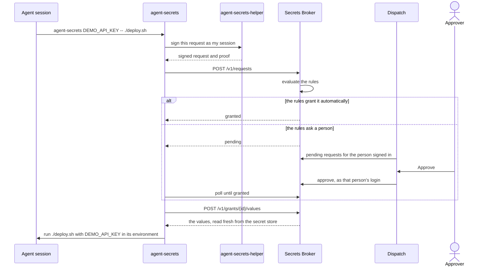

The Secrets Broker hands agent sessions the secret values they need, one request at a time, so an
agent never holds a long-lived API key. An agent asks for a secret by name; the broker decides from
its rules whether to grant it at once, refuse it, or ask a person; and the person approves or denies
it in Dispatch. A granted value reaches only the command that asked for it, and every request,
decision and use is recorded. The command keeps the value in its environment for as long as it
runs; the grant's expiry or revocation stops the session from reading the value again, not a
command that already has it.

```sh
agent-secrets DEMO_API_KEY --reason "Deploy the example service" -- ./deploy.sh
```

That one command is all an agent runs. Everything else on this page explains what happens behind
it.

## Why it exists

- **No long-lived keys in agents.** An agent's environment, transcript and tools are the easiest
  place for a key to leak. With the broker, an agent session holds only a signing key of its own
  that dies with the session, and fetches a value for exactly the command that needs it.
- **A person approves what needs approval.** The rules say which secrets an agent gets
  automatically and which need a person's yes. Approving is one click in Dispatch, where that
  person already works.
- **Every grant is recorded.** Each approval rests on a signed, content-addressed record of who
  asked, for what, why, and who decided, which the broker re-verifies every time it releases a
  value.

## How a request flows



On a machine, `agent-secrets-helper` holds each agent session's key and signs for it. In a
container (a **box**) the container holds its own key, and in Kubernetes each Legion worker pod
does; the request flow is the same. [Run an agent in a
container](/legion/broker/guides/run-an-agent-in-a-container/) shows a box's setup.

## The pieces

| Piece | What it does | Where it runs |
| --- | --- | --- |
| Secrets Broker (`envoy-broker`) | Enrolls sessions, evaluates the rules, records requests and decisions, and releases granted values. | A server, beside Postgres and the secret store. |
| `agent-secrets` | The command an agent runs to use a secret, and the tool people and launchers use to log machines in and inspect sessions. | Wherever agents run. |
| `agent-secrets-helper` | A per-user daemon that holds each host agent session's key, enrolls it, and signs for it. | Each machine that runs agents directly. |
| Dispatch | Shows people the requests they must decide and the grants they can revoke, and passes their decisions to the broker. | Dispatch's server and web app. |
| Legion | Enrolls every worker pod it runs on Kubernetes, so a phase worker can use `agent-secrets` like any other session. | Legion's daemon. |

## How it fits with Legion and Dispatch

[Dispatch](/legion/dispatch/) is where people decide: its Inbox lists **Credential requests**
beside the asks waiting on them, its credential pages show what an agent asked for and why, and its
Settings page lists the live grants a person can revoke. The broker holds no Dispatch credential;
Dispatch's server calls the broker on the signed-in person's behalf.

[Legion](/legion/legion/) runs agents. When its Kubernetes runtime is configured with the broker,
the Legion daemon logs itself in once (a person approves its machine login in Dispatch) and enrolls
every worker pod it starts, so each pod's agent gets only the grants of that pod. See
[how Legion, Dispatch and the broker fit together](/legion/how-it-fits/).

## Where to go next

- [Quickstart](/legion/broker/quickstart/): use a secret from an agent session, and see what the
  approver sees.
- [Concepts](/legion/broker/concepts/): sessions, machine logins, rules, grants, approvals and the
  audit record.
- Guides: [approve a request](/legion/broker/guides/approve-a-request/),
  [log a machine in](/legion/broker/guides/log-a-machine-in/),
  [run an agent in a container](/legion/broker/guides/run-an-agent-in-a-container/),
  [revoke a session or a grant](/legion/broker/guides/revoke-a-session/),
  [run the broker locally](/legion/broker/guides/run-locally/), and
  [troubleshooting](/legion/broker/guides/troubleshooting/).
- [Operating the broker](/legion/broker/operate/): configuration, dependencies, health and logs.
- Reference, generated from the code: [`agent-secrets` CLI](/legion/broker/reference/cli/),
  [HTTP API](/legion/broker/reference/api/), [configuration](/legion/broker/reference/config/),
  and [error codes](/legion/broker/reference/errors/).
