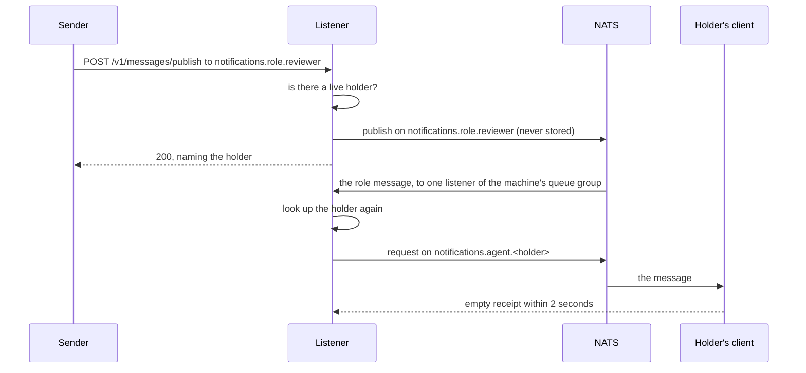

## Topics

Every event and message travels on a NATS subject under `notifications.`, which Envoy calls a
topic. Its tokens, separated by dots, say what the event is about, from the most general to the
most specific:

| Topic | What arrives there |
| --- | --- |
| `notifications.agent.<session_id>` | One session's inbox: messages sent to it, a role's messages while it holds the role, and Dispatch events for the asks it follows. |
| `notifications.role.<role>` | A role. You publish to it, and the listener hands each message to the session holding the role. |
| `notifications.dispatch.issue.<KEY>.<type>` | Every event of one Dispatch issue, such as `issue.updated` or `ask.answered`. |
| `notifications.dispatch.document.<PROJECT>.<slug>.<type>` | Every event of one project document. |
| `notifications.dispatch.project.<PROJECT>.<type>` | Changes to one project's settings. |
| `notifications.github.<owner>.<repo>.pr.<n>` | A pull request opened, updated or closed. A closed event says whether it merged. |
| `notifications.github.<owner>.<repo>.pr.<n>.comment`, `.review`, `.mention` | A pull request's comments, reviews, and comments that mention the listener's trigger (`@legion` unless configured). |
| `notifications.github.<owner>.<repo>.pr.<n>.checks` | One commit's checks have all finished: passed, failed, cancelled or skipped, with the failing checks named. |
| `notifications.github.<owner>.<repo>.issue.<n>`, `.issue.<n>.comment`, `.issue.<n>.mention` | A GitHub issue and its comments. |
| `notifications.github.<owner>.<repo>.push.branch.<ref>`, `.push.tag.<ref>` | A push to a branch or a tag. |
| `notifications.github.<owner>.<repo>.workflow.<file>.<action>` | A workflow run that belongs to no pull request. |
| `notifications.slack.<team>.<channel>.message`, `.mention` | Slack messages, and the same under `.thread.<ts>` for a thread. |
| `notifications.legion.<project>.controller` | A Legion project's controller. |
| `notifications.envoy.exceptions.<topic>` | A delivery to `<topic>` that failed, with the reason. |

A GitHub owner, repository, ref or workflow file is always one token. A dot in a name is written
`_`, so `acme/site.io` is `notifications.github.acme.site_io`, and a topic that spells the name with
its dot receives nothing. The listener warns about that spelling when a session subscribes to it.

A subscription can use NATS wildcards: `*` matches one token, and `>` matches one or more trailing
tokens. `>` does not match the subject it follows, so `notifications.github.acme.site.pr.7.>`
alone would miss the pull request's own lifecycle events. When an agent subscribes to `<subject>.>`
through an Envoy tool, its client registers `<subject>` as well, which makes
`notifications.github.<owner>.<repo>.pr.<n>.>` the one subscription for everything about a pull
request.

## Interests and subscriptions

An **interest** is the list of topics a session has registered with the listener, stored in the
`envoy_interests` key-value bucket under the session's id, together with the machine and directory
it runs in. A session's own inbox, `notifications.agent.<session_id>`, is always in it. Subscribing
adds topics to it, unsubscribing removes them, and claiming a role adds the role's topic.

A session receives what its interest names in one of two ways:

- **It subscribes itself.** The Oh My Pi extension and the Claude Code plugin open their own NATS
  subscriptions, for the inbox and for every topic the agent subscribes to, and register with
  `self_subscribed: true`. Events reach such a session while it is connected. The listener does
  not push to it.
- **The listener pushes to it.** The OpenCode plugin registers the port of the OpenCode server
  instead. The listener reads the stream through its durable consumer and, for each event that
  matches the interest of a session registered on its own machine, posts the event as text to
  `http://<host>:<port>/session/<session_id>/prompt_async`.

Every five minutes the listener removes the interest of any session that is no longer live and has
not changed its interest in ten minutes. That never ends a role claim, which has rules of its own.

## Sessions and the registry

A **live** session is one with an entry in the `envoy_sessions` bucket. The entry holds the
session's machine, directory, title, port, whether it subscribes itself, and the delivery modes it
accepts, and it lapses five minutes after it was last written. Each client re-registers every two
minutes, so a session that stops running drops out of the registry within five. The Oh My Pi and
Claude Code clients also remove their entry when they shut down.

`GET /v1/sessions` lists the live sessions, and that list is what Dispatch's Agents page and the
`envoy_sessions` tool show. A message sent to a session that is not live is refused.

A session also advertises the targeted-delivery modes it accepts, which Dispatch uses when a person
messages it: `aside` and `steer`, plus `btw` where the host can run a side turn. Oh My Pi advertises
`btw` when it can, and Claude Code advertises only `aside`. A Dispatch message in a mode the session
does not advertise is refused rather than delivered in a different way.

## Roles and claims

A **role** is a name, such as `reviewer` or `merge-queue`, that one session holds at a time. A
sender publishes to `notifications.role.<role>` without knowing which session holds it, and the
listener hands the message to whichever session does when the message arrives. Legion's agents talk
to each other this way: an implementer publishes to the architect's role, and it reaches the
architect's current session even after that session was resumed under a new id.

A session claims a role with `envoy_role_set` (`POST /v1/roles/set`). The claim is stored in the
`envoy_roles` bucket with its holder, when it was made, and the session it continues, if any. The
session must be registered first. There are two kinds of claim:

- **A claim** takes the role from whoever holds it. The last claim wins.
- **A soft claim** takes the role only when nobody holds it, the holder is no longer live, or the
  holder is the session this one continues, such as the session a fork or a resume was made from.
  Any other holder answers `409` with the holder's id, and nothing changes. The clients use soft
  claims to take a role back after a resume, so a resumed session never takes a role a different
  live session holds.

When a message for a role arrives, the listener looks up the holder at that moment and forwards the
message to the holder's inbox subject, as a request the holder must acknowledge:

A role message is not stored. When nobody holds the role, publishing through the API is refused with
`404` and a `reason`. When the holder has not refreshed its registration in five minutes, does not
accept the message's delivery mode, or does not acknowledge it within two seconds, the listener
publishes an exception instead (see [Delivery](#delivery)).

Claims survive a listener restart. A restored claim whose holder is not registered yet gets one
registry lifetime, five minutes, to register again; after that the next delivery, the next lookup,
or the listener's claim reaper, which runs every five minutes, releases it.

### During a deploy's overlap

A rolling deploy runs the new listener and the old one side by side for a while, under the same
machine id. The new listener serves `/v1` and joins the role lane as soon as NATS is connected and
its caches are loaded. The role lane is a core NATS queue subscription named
`envoy-listener-<machine id>`, and NATS hands each message to one member of a queue group, so a
role message is forwarded once even while both listeners are in the group.

The durable consumer, `listener-<machine id>`, takes one binding at a time. The new listener asks
for it every two seconds and binds within two seconds of the old one exiting. Until then its
`/healthz` answers `starting`, so a deploy that waits for health waits for the binding. If the old
listener still holds the consumer after 135 seconds, the new one exits non-zero.

## Delivery

Every Envoy tool states the contract: delivery is at-least-once, possibly out of order across
topics; use the event's id to drop duplicates and its time to judge freshness. What that means in
practice:

- **What is kept.** Events on `agent`, `dispatch`, `github`, `slack`, `legion`, `ghostwispr` and
  `whatsapp` topics, and exceptions for inbox deliveries, are stored in `ENVOY_NOTIFICATIONS` for
  72 hours. Role messages and the other exceptions travel over core NATS and are not stored.
- **Sessions that subscribe themselves** receive what is published while they are connected. They
  do not replay what they missed. A consumer that must not miss an event, such as Legion's daemon,
  reads the stream with a durable consumer of its own.
- **Sessions the listener pushes to** are retried. The listener's durable consumer acknowledges each
  event explicitly; a push that fails to a live session is retried 30 seconds later, up to 20
  deliveries in all. A push to a session that is not live is dropped.
- **Duplicates.** One event can arrive twice: on two overlapping subscriptions (`pr.7.>` and
  `pr.7.comment`), from a retry, or from a sender that sends again. Every envelope carries an
  `event_id`, which every copy of one publish shares, and a `dedupe_key`, which a re-send shares
  with the message it repeats. The Oh My Pi and Claude Code clients drop a second copy of an
  `event_id`, and a re-send under a `dedupe_key` that names its event for 72 hours, but they keep
  these in memory, so a client that restarts can hand its agent a repeat. The stream itself stores
  one copy of a message whose key names its event, such as a GitHub delivery redelivered under its
  delivery id.
- **Order.** Do not rely on order across topics. A retry arrives after events that were published
  later.

A failed delivery to a role or to an inbox, and a refusal of a message's delivery mode on any topic,
is published as an exception on `notifications.envoy.exceptions.<topic>`. Its payload names the
`original_topic`, the `event_id`, the `recipient_session` where there is one, and the `reason`:

| Reason | What happened |
| --- | --- |
| `no_holder` | Nobody holds the role, or the inbox's session is not live. |
| `delivery_failed` | The role's holder has not refreshed its registration in five minutes, a recipient does not accept the message's delivery mode, or forwarding the message to the holder or pushing it to the inbox's session failed. |
| `receipt_timeout` | The role's holder was live and was sent the message, but did not acknowledge it within two seconds. |

Legion's daemon subscribes to the exceptions of role messages, so it learns when a notice did not
reach the agent it was for.
