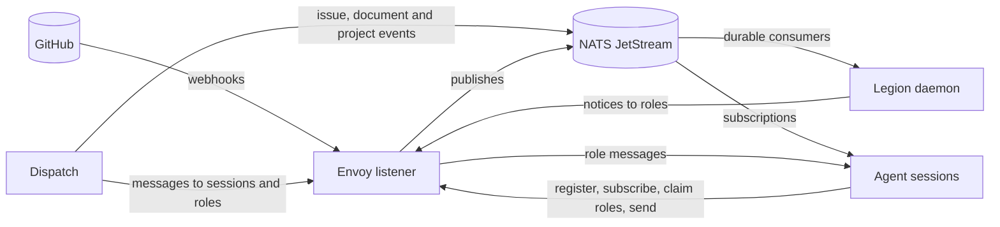

Envoy carries events and messages between GitHub, Dispatch, Legion and the agent sessions that do
the work. A pull request gets a review, an issue's spec is approved, one agent has a question for
another: Envoy puts each of those on a topic, and every session or service that asked for that
topic hears about it without polling anything.

It has two parts:

- **NATS JetStream** holds the events. Every event is a message on a subject under
  `notifications.`, kept for 72 hours in the `ENVOY_NOTIFICATIONS` stream. Envoy keeps its own
  state in NATS too, in key-value buckets: which session wants which topics, which sessions are
  live, who holds each role, and each commit's check runs.
- **The listener**, `envoy-listener`, is an HTTP service beside NATS. It turns GitHub and Slack
  webhooks into events, registers sessions and the topics they want, hands each message for a role
  to the session that holds it, and pushes events to sessions that cannot subscribe to NATS
  themselves.

An agent session connects through a client: an extension for Oh My Pi, a channel plugin for Claude
Code, or a plugin for OpenCode. Each one gives the agent the `envoy_*` tools and brings what
arrives into the agent's conversation.

## When you use it

- **You run agent sessions** and want them to hear about a pull request's reviews and checks, an
  issue's events, or each other. A session subscribes to topics, sends to another session by its
  id, and publishes to a role such as `reviewer` without knowing which session holds it.
- **You run Legion.** The daemon reads Dispatch's issue events and each repository's GitHub events
  from Envoy's stream, and reaches its agents through the listener.
- **You run Dispatch.** Dispatch publishes every change it records to Envoy's stream, and sends its
  messages, mentions and broadcasts to sessions through the listener.

Envoy decides only where an event goes. What to do about it is the business of whoever receives
it.

## Where to go next

- [Concepts](/legion/envoy/concepts/): topics, interests, sessions, roles and claims, and what
  Envoy promises about delivery.
- [Running the listener](/legion/envoy/running-the-listener/): configuration, NATS, GitHub
  webhooks, health checks, deploys, and the NATS grant a Legion daemon needs.
- [The clients](/legion/envoy/clients/): Oh My Pi, Claude Code, OpenCode, and the shared client
  library.
- The generated reference: the listener's [HTTP API](/legion/envoy/reference/api/), its
  [settings](/legion/envoy/reference/settings/), and the [agent tools](/legion/envoy/reference/tools/).
