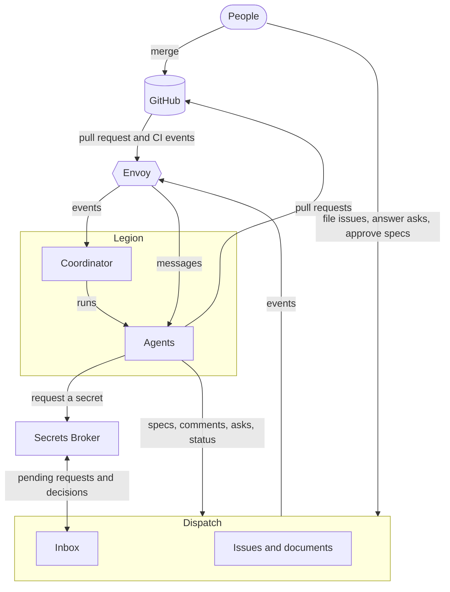

Four components share the work. **Dispatch** holds the record: the issues, their documents, and
every decision a person makes about them. **Legion** works the issues handed to it by running coding
agents. The **Secrets Broker** gives those agents credentials, with a person's approval shown in
Dispatch when the secret's owner and tier require one. **Envoy** carries events between them.

## Dispatch: the record of work and decisions

Dispatch is a web dashboard and an HTTP API over one store of projects and issues. Each issue has a
lifecycle status, from Triage, Icebox, Backlog and Todo through In Progress, Testing, Needs Review
and Retro to Done.

An issue carries documents, the first of which is its spec. People and agents comment on a
document, suggest exact replacements for its text, and ask questions. An **ask** is a decision put
to a named person: it waits in that person's **Inbox** until they answer it, and an approval request
is an ask whose answer approves a document at one version or requests changes with a reason.

People use the dashboard: they file issues, answer asks, approve specs and watch the agents working
on the **Agents** page. Agents use Dispatch's tools and API to write specs, post comments and
messages, open asks and move issues. Dispatch publishes its issue, document and project events on
Envoy, so nothing that reacts to Dispatch has to poll it.

## Legion: the coordinator and its agents

Legion's coordinator works only the issues handed to it, which are the ones carrying the Dispatch
label `legion`. That lets Legion share a project with people and other agents. A person sets the
label from the issue header, or an agent sets it with a Dispatch tool. Legion's own **controller**
agent also hands over work: whenever an admission slot is free, it labels and admits the
highest-priority `todo` leaf issue that nobody else is working.

Each admitted issue gets an **architect**, which owns the issue's tree. It writes the spec, splits
large work into child issues, and runs each change through phase workers in turn: a **planner**, an
**implementer**, a **tester** and a **reviewer**, then a **merger**. Every agent works in a
workspace of its own, and every phase commits a structured handoff under `.legion/` on the issue
branch, which is what a restarted agent recovers from. The coordinator writes the issue's status
back to Dispatch as the work moves (In Progress, Testing, Needs Review, Retro).

Two decisions stay with people:

- **The design gate.** Before implementation starts, a person approves the root issue's spec at a
  specific version in Dispatch. A later version of the spec closes the gate again until someone
  approves it. The gate is on by default; a deployment can turn it off.
- **The merge.** The merger checks that every check and workflow the base branch requires has
  passed, then posts `READY` on the Dispatch issue. A person merges the pull request under the
  repository's own rules. Legion never merges.

The coordinator runs its agents as Oh My Pi sessions, either in tmux panes on one host or as Agent
Sandbox pods in a Kubernetes cluster.

## Secrets Broker: credentials a person approved

An agent that needs a secret, such as a token for a service its task touches, asks the broker for
it by name. The agent's session or pod first enrolls with the broker under a signing key of its own,
so every request is signed by the session making it. Two tags on each secret, its owner and its
tier, then decide whether to grant the request automatically (the owner's own sessions asking for
an agent-tier secret), send it to a person for approval (its owner, or anyone for a shared
human-tier secret), or refuse it.

An approval request appears in that person's Dispatch Inbox, labelled as a secret request or a
machine login, together with the reason the agent gave. The person approves or denies it there, and
Dispatch relays the decision to the broker under the signed-in person's own identity. The broker
holds no Dispatch credential: Dispatch reads the pending requests from the broker and sends back
each decision. A grant is short-lived, and `agent-secrets NAME -- <command>` runs a command with
the granted value in that command's environment rather than printing it.

## Envoy: the events between them

Envoy is the event transport, built on NATS JetStream. Dispatch publishes each issue's events to a
topic of the form `notifications.dispatch.issue.<KEY>.<event>`, and Envoy turns GitHub's webhooks
into events on topics for each repository and pull request. Legion's coordinator reads both streams
with durable consumers, so an event that arrives while it is down is read when it comes back.

Envoy also delivers messages to agent sessions directly: a message to one session, to whichever
session holds a role, or a broadcast a person sends from the Dispatch Agents page. Envoy decides
only where an event goes; what to do about it is the coordinator's and the agents' business.

## An issue, start to finish

1. Someone files an issue in a Dispatch project. It starts in Triage.
2. When it is ready, it moves to Todo with the `legion` label, set by a person or by the controller
   filling a free slot.
3. The coordinator admits it and starts its architect, which writes the spec.
4. The architect requests approval. The request reaches the approver's Inbox, they approve that
   version, and Dispatch publishes the approval on Envoy. The coordinator opens the design gate.
5. The planner, implementer, tester and reviewer take the change in turn. A review that requests
   changes sends it back to the implementer, and through the tester again.
6. Once the reviewer approves, the retrospective runs. The merger then confirms the required checks
   and posts `READY` on the issue.
7. A person merges the pull request.
8. The implementer drives the change in production and records what it observed on the pull
   request and the issue. The architect signs off, and the issue is Done.

Read on in [Legion](/legion/legion/), [Dispatch](/legion/dispatch/) and the
[Secrets Broker](/legion/broker/).
