Legion is a team of coding agents that works the issues you hand it. You write an issue in
[Dispatch](/legion/dispatch/), label it `legion` and set it to `todo`. When a slot is free, the Legion
daemon admits it and starts an **architect**, an agent that owns the issue from start to finish. The
architect turns your issue into a spec and asks you the questions only you can answer. Once you
approve the spec, the daemon runs **phase workers** one after another: a planner, an implementer
that writes the change and opens a pull request, a tester, a reviewer and a merger. Each agent is an
[Oh My Pi](https://github.com/sjawhar/oh-my-pi) session in a Kubernetes pod of its own.

Legion never merges. When the change is tested, reviewed and approved, the merger posts `READY` on
the Dispatch issue and a person merges the pull request under the repository's own branch
protection. The implementer then drives the merged change in production and records what it saw,
and only then does the architect close the issue. Every step leaves a record you can read: the spec
and the questions in Dispatch, the code and the reviews on GitHub, and each phase's handoff on the
issue's branch.

```mermaid
flowchart LR
  issue["Dispatch issue<br/>labelled legion, in todo"] --> admission["Admission<br/>a free slot"]
  admission --> architect["Architect<br/>writes the spec"]
  architect --> gate{"You approve<br/>the spec"}
  gate --> planner
  subgraph pods["Phase workers, one Kubernetes pod each"]
    planner --> implementer
    implementer --> tester
    tester --> reviewer
    reviewer --> retro["retro<br/>(the implementer)"]
    retro --> merger
    tester -. fails .-> implementer
    reviewer -. changes requested .-> implementer
  end
  merger --> ready["READY on<br/>the issue"]
  ready --> merge["A person merges<br/>the pull request"]
  merge --> production["Production check<br/>(the implementer)"]
  production --> done["The architect<br/>closes the issue"]
```

## Where to go next

- [Concepts](/legion/legion/concepts/): the controller, the architect, the phase workers,
  admission, the design gate, handoffs, review and the production check, and how they fit together.
- [Using Legion](/legion/legion/using-legion/): hand an issue to Legion, approve its spec, review
  and merge its pull request, and read what each Dispatch status means.
- [Running Legion](/legion/legion/running-legion/): what an operator needs to run the Legion daemon
  on Kubernetes, how to configure, start, upgrade and watch it.
- [Troubleshooting](/legion/legion/troubleshooting/): the failures Legion reports, and the command
  that shows each one.
- [Walkthrough](/legion/legion/walkthrough/): an issue going through Legion, end to end.
- Reference: the [CLI](/legion/legion/reference/cli/), the
  [configuration examples](/legion/legion/reference/config/) and the
  [skills](/legion/legion/reference/skills/) Legion's agents load, all generated from the code when
  the site is built.

Legion's agents ask for credentials through the [Secrets Broker](/legion/broker/) when a deployment
enrolls them, and everything a person sees of Legion happens in [Dispatch](/legion/dispatch/).
[How it fits together](/legion/how-it-fits/) shows Legion, Dispatch and the Secrets Broker side by
side.
