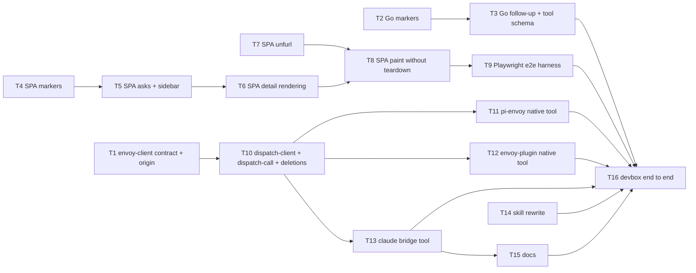

# Dispatch Conversations Implementation Plan

> **For agentic workers:** REQUIRED SUB-SKILL: Use superpowers:subagent-driven-development (recommended) or superpowers:executing-plans to implement this plan task-by-task. Steps use checkbox (`- [ ]`) syntax for tracking.

**Goal:** Make a dispatch thread one decision held as a conversation on one GitHub issue: any turn may ask, every ask has an id, every answer names its ask, every turn carries the asking session's identity, all plumbing is invisible to humans, and the tool that does it is native to each host plugin instead of a separate MCP process.

**Architecture:** The Go dispatch service (`packages/envoy/internal/dispatch`) gains a second mode of the same `dispatch` tool — `thread: N` posts a follow-up comment instead of creating an issue — and writes every marker as an HTML comment while still reading legacy YAML front matter. The dashboard SPA (`packages/dispatch/web`) collects asks from the body and every follow-up comment, renders one form per open ask and each answer under its question, unfurls GitHub references, shows session title/id on the origin line, and stops rebuilding the page on events. The standalone MCP shim is deleted; `envoy-client` becomes a library (`dispatch-contract`, `dispatch-call`, `dispatch-client`) that each host plugin — pi-envoy (OMP), envoy-plugin (OpenCode), claude-envoy-bridge — wraps in a native `dispatch` tool that reads the session's identity from the host on every call and makes one stateless HTTP request to the service.

**Tech Stack:** Go 1.26 (`go-github/v66`, `modelcontextprotocol/go-sdk`, `yaml.v3`), TypeScript on Bun (bun test, Biome), Vite SPA (`marked`, `dompurify`, `yaml`), Playwright (new, dashboard e2e), Docker Compose (envoy image), jj.

**Spec:** `docs/superpowers/specs/2026-09-05-dispatch-conversations-design.md` — binding. This plan is its argument; where the plan and the spec disagree, the spec wins and the plan is wrong.

**Branch:** jj bookmark `feat/dispatch-conversations` in `/home/ubuntu/legion` (the spec commit is its head). Version control is jj only — never `git`.

---

## Global Constraints

Every task's requirements implicitly include this section. Parallel implementers take these values as given; nobody negotiates them in a task.

### Repo hygiene

- Public repo. Never write the company org name, private repo names, the devbox hostname, Slack team ids, or internal webhook hostnames into code, tests, docs, or commit messages. Use `acme-org/example-repo` and `example-host`.
- jj only: `jj status`, `jj diff --git`, `jj log`, `jj describe -m`, `jj new`, `jj bookmark set`, `jj git push`. `jj new` comes **before** the work of the next commit, never after. Never `jj undo` twice; never `git`.
- Shell rules: (1) never `rm -rf`/`rm -r` on a path containing a variable, `~`, or `$HOME` — `ls` the literal path first and delete that literal path; (2) environment variables do not persist between shell calls — set them per command (`env ENVOY_IMAGE_TAG=x cmd`), never `export` and rely on it later.
- Biome: double quotes, semicolons, ES5 trailing commas, 100-char lines; `node:` prefix for builtins; `type` imports; interfaces for object shapes; no barrel files; tests in co-located `__tests__/` (SPA, envoy-client, envoy-plugin), `*.test.ts` beside the module (pi-envoy), `tests/` (claude-envoy-bridge), `*_test.go` (Go).
- No "MVP", "phase 1", "follow-up", "TODO", or deprecation shims anywhere in the diff. The only backward-compatibility item is **reading** legacy front-matter markers. Writers emit only HTML comments.
- Docs are evergreen: describe what is true after this change; no "previously"/"now" trails.

### Caps and exact service error strings (Go, `packages/envoy/internal/dispatch/core`)

| Condition | Exact error text |
|---|---|
| `context` over cap | `context is <n> characters; the limit is 1200` (`<n>` = `utf8.RuneCountInString`) |
| `question` over cap | `question is <n> characters; the limit is 800` |
| blank required prose | `context is required and must not be blank` / `question is required and must not be blank` |
| blank subject (open mode) | `subject is required and must not be blank` |
| bad urgency (open mode) | `invalid urgency "<v>": use low, med, high, or blocking` |
| `thread` with `subject`, `urgency`, or `parent` | `thread cannot be combined with subject, urgency, or parent` |
| malformed `thread` | `Invalid thread: <s>` (also for a thread ref carrying a comment id) |
| bare `thread` and no repo | `no repo for thread #<n>: pass thread=owner/name#<n> (the plugin fills repo from the working directory when one is a GitHub repo)` |
| open mode, no repo | `no repo: pass repo=owner/name (the plugin fills it from the working directory when one is a GitHub repo)` |
| target is a PR or has no parsable thread marker | `#<n> is not a dispatch thread` |
| target is closed | `#<n> is closed; open a new thread` |

Constants: `ContextMaxChars = 1200`, `QuestionMaxChars = 800` in `core/thread.go`. Caps apply in both modes and are checked before any GitHub call. No truncation, ever.

### Marker encodings (exact)

All writers emit `<!-- dispatch:<kind>\n<yaml>-->` where `<yaml>` is the marshaller's output and ends with `\n`, so the closing `-->` sits alone on its line. Kinds: `thread`, `ask`, `answer`, `urgency`. The marker is always the first thing in the body; the human-readable body follows after one blank line.

```text
<!-- dispatch:thread
requestId: c9e7cf0d6c2786f9
urgency: blocking
origin:
    host: omp
    machine: example-host
    cwd: /home/ubuntu/legion
    tmux: dev4:4.2
    pane: '%15'
    sessionId: 01a05ac6-3b19-7000-9d2b-1e5f0a6c2b7d
    sessionTitle: 'pm: e2e submitter identity'
ask:
    - askId: c9e7cf0d6c2786f9
      question: What value?
      header: E2E_SUBMITTER_EMAIL
      options:
        - label: env var
-->

**<subject>**

## Context

<context>

## Question

<question>
```

```text
<!-- dispatch:ask
requestId: 7b1e2c3d4e5f6a7b
origin:
    host: omp
    ...
ask:
    - askId: 7b1e2c3d4e5f6a7b
      question: ...
-->

## Context

<context>

## Question

<question>
```

```text
<!-- dispatch:answer
forThread: 17158
forAsk: "7b1e2c3d4e5f6a7b"
answers:
  - - "Option A"
-->

**<header>** — <question>
Option A
```

```text
<!-- dispatch:urgency
urgency: "high"
-->

Urgency set to **high**.
```

Rules:

- Key order as shown (thread: `requestId, urgency, origin, ask`; ask: `requestId, origin, ask`; answer: `forThread, forAsk, answers`; urgency: `urgency`). Indentation and quoting are whatever `yaml.v3` (Go) or `yaml` (npm) emit — the dashboard double-quotes every string it writes — and readers parse YAML, never depending on either.
- Empty `origin` fields are omitted (`omitempty` / undefined). `origin` and `ask` are omitted entirely when absent.
- **Comment-safety:** an HTML comment ends at the first `-->`. Writers guarantee the YAML text never contains `-->`, `<!--`, or `--!>`: every string scalar containing one of those is emitted double-quoted, and the sequences are then rewritten to `--\u003e`, `\u003c!--`, `--!\u003e` — legal YAML escapes inside double quotes that decode to the original characters. Go: `commentSafeYAML` in `core/markers.go`. TS: `commentSafeYaml` in `web/src/markers.ts` (uses `yaml.stringify(value, { defaultStringType: "QUOTE_DOUBLE", defaultKeyType: "PLAIN" })` then the same three replacements).
- **Readers accept both encodings.** Legacy front matter is `---\n<yaml>\n---`; a legacy block with no `kind` key is a thread marker; `kind: answer` / `kind: urgency` are the legacy answer/urgency comments. A legacy answer has no `forAsk`.
- **Reader position rule:** a marker is recognised only at the very start of a body (`startsWith("<!-- dispatch:")` or `startsWith("---\n")`). The close is the first `\n-->` (HTML) or `\n---` (legacy) after the opening line.
- GitHub issue search indexes HTML-comment text in bodies (verified 2026-09-05 with `gh search issues --repo microsoft/vscode 'in:body "bug_report_template"'`, a token that exists only inside an HTML comment in that template), so `githubapi.BuildRequestIDQuery`'s `in:body "<requestId>"` dedupe keeps working unchanged.

### `askId` / `forAsk` rules

- A turn (the opening body or one follow-up comment) has a `requestId` `R` (16 hex chars). Its asks are indexed `i = 0..n-1`; `askId(i) = R` when `i == 0`, else `R + "." + i` (e.g. `7b1e2c3d4e5f6a7b.1`). The service writes `askId` into every ask entry (`core.AskIDFor`, `core.WithAskIDs`; the plugin never sends `askId`).
- Readers use the explicit `askId` when present. A legacy thread marker has none: readers synthesise ids from the thread's `requestId` with the same rule (`askIdFor` in `web/src/asks.ts`), so a new answer posted on a legacy thread names a stable id.
- An answer with `forAsk` answers exactly that ask; its `answers` list has exactly one `QuestionAnswer` (the chosen values). An answer without `forAsk` (legacy) answers every ask in the **body**, by index (`answers[i]` ↔ body ask `i`).
- An ask is **open** when no answer resolves to it. The dashboard rejects an answer for an `askId` not on the thread before posting (`Error("askId <id> is not on this thread")`).

### `origin` fields (wire JSON and YAML keys are identical)

| Key | Type | Producer |
|---|---|---|
| `host` | `"omp" \| "opencode" \| "claude"` | asserted by the plugin, never detected from the environment |
| `machine` | string | `machineID()` (`envoy-client/src/machine.ts`) |
| `cwd` | string | the session's working directory (`ctx.cwd` / `ctx.directory` / `process.cwd()`) |
| `tmux` | string `session:window.pane` | `resolveOrigin` via `tmux display-message` when `TMUX_PANE` is set |
| `pane` | string `%N` | same call |
| `sessionId` | string | pi-envoy: `context.sessionManager.getSessionId()` read inside the tool handler; OpenCode: `ctx.sessionID`; Claude: `CLAUDE_CODE_SESSION_ID` |
| `sessionTitle` | string | pi-envoy: `context.sessionManager.getSessionName?.()`; OpenCode: `GET <serverUrl>session/<id>` `.title`; Claude: omitted |

Anything a host cannot supply is omitted, never invented. `OMP_SESSION_ID`, `OMPCODE`, and `CLAUDECODE` are read nowhere in Envoy after this plan.

### The `dispatch` tool — LLM-facing schema (one flat object, identical on all three hosts)

Source of the strings: `packages/envoy-client/src/dispatch-contract.ts` (`DISPATCH_TOOL_NAME`, `DISPATCH_TOOL_DESCRIPTION`, `DISPATCH_ARGUMENTS`, `DISPATCH_URGENCIES`). Each host builds the schema object with its own builder (`pi.zod`, `tool.schema`, `zod`) from these strings; the shapes below are the contract.

```jsonc
{
  "type": "object",
  "required": ["context", "question"],
  "properties": {
    "subject":  { "type": "string" },                       // open a thread; omit with `thread`
    "thread":   { "type": "string" },                       // "<n>" | "owner/name#<n>"; omit subject/urgency/repo/parent
    "context":  { "type": "string" },                       // ≤ 1200 chars (service-enforced)
    "question": { "type": "string" },                       // ≤ 800 chars (service-enforced)
    "ask":      { "type": "array", "items": {
                   "type": "object", "required": ["question"],
                   "properties": {
                     "question": { "type": "string" }, "header": { "type": "string" },
                     "options": { "type": "array", "items": { "type": "object", "required": ["label"],
                                  "properties": { "label": { "type": "string" }, "description": { "type": "string" } } } },
                     "multiple": { "type": "boolean" }, "custom": { "type": "boolean" } } } },
    "urgency":  { "enum": ["low", "med", "high", "blocking"] },  // open mode only
    "repo":     { "type": "string" },                            // open mode only
    "parent":   { "type": "string" }                             // open mode only
  }
}
```

Tool description (verbatim, `DISPATCH_TOOL_DESCRIPTION`):

> Raise a durable question to the human as a Dispatch thread (a GitHub issue shown on the dashboard), or continue an existing thread with a follow-up question. The reader has NOT seen your transcript. Open a thread with `subject`; continue one with `thread`. The reply arrives in this session as a steer.

Argument descriptions (verbatim, `DISPATCH_ARGUMENTS`):

- `subject`: Open a new thread: one line naming the decision needed (the issue title). Omit when continuing a thread with `thread`.
- `thread`: Continue an existing thread: "<n>" (an issue in the working directory's repo) or "owner/name#<n>". When set, omit subject, urgency, repo, and parent.
- `context`: What you are doing, what you found, why you are stuck — at most 1200 characters, at most three short paragraphs or a bullet list. The reader has NOT seen your transcript: no nouns you coined this session, no internal identifiers unless the question is about them. GitHub references (#N, owner/repo#N, URLs) may be bare; the dashboard unfurls them.
- `question`: The ask, at most 800 characters, as a list: current state → desired state → your recommendation and why; options go in `ask`.
- `ask`: Structured questions rendered as buttons on the dashboard. Each: { question, header?, options: [{ label, description? }], multiple?, custom? }. Use this whenever the answer is one of N choices.
- `urgency`: low | med | high | blocking (default med). Opening a thread only.
- `repo`: owner/name. Opening a thread only; defaults to the working directory's GitHub repo.
- `parent`: <n> | owner/name#<n>[#<commentId>]. Opening a thread only: link the thread as a sub-issue of an existing issue and append a breadcrumb to the comment.

Plugin-side validation (`parseDispatchCall` in `dispatch-contract.ts`; a key whose value is `undefined` counts as absent). Exact error messages:

| Condition | Message |
|---|---|
| both `subject` and `thread` | `dispatch: pass either subject (open a thread) or thread (continue one), not both` |
| neither | `dispatch: subject or thread is required` |
| `thread` with `urgency`/`repo`/`parent` | `dispatch: thread cannot be combined with urgency, repo, or parent` |
| shape failure | `dispatch: invalid arguments — <path>: <message>[; …]` |
| open mode, cwd has no GitHub remote, no `repo`, no qualified `parent` | `dispatch: <cwd> has no GitHub remote; pass repo=owner/name` |
| continue mode, bare `thread`, cwd has no GitHub remote | `dispatch: <cwd> has no GitHub remote; pass thread=owner/name#<n>` |
| token minting failed | `dispatch: gh auth token returned empty in <cwd> — check your gh-app setup` |

### Service-facing call (plugin → Go, JSON-RPC over stateless Streamable HTTP)

Exactly one `POST <serviceUrl>` per tool call, where `serviceUrl` is `resolveDispatchConfig(process.env, { cwd }).url` (`…/mcp`). Headers: `Authorization: Bearer <token freshly minted by gh auth token in the session cwd>`, `Content-Type: application/json`, `Accept: application/json, text/event-stream`. Body:

```json
{ "jsonrpc": "2.0", "id": 1, "method": "tools/call",
  "params": { "name": "dispatch", "arguments": { …DispatchCall, "repo"?: "owner/name", "origin": { … } } } }
```

- `repo` is included whenever the plugin resolved it from the cwd (open mode without `repo`/qualified `parent`; continue mode with a bare `thread`). The service accepts `repo` in both modes (it is how a bare `thread` resolves); a qualified `thread`/`parent` wins over `repo`.
- No `initialize`, no `Mcp-Session-Id` request header, ever; an `mcp-session-id` response header is ignored. No token cache, no retry: a fresh token per call means a 401 is a real auth failure.
- Response: `content-type: text/event-stream` → the first `data:` line is the JSON-RPC response; otherwise the body is the JSON-RPC response. `error` → `DispatchServiceError(kind: "tool", error.message)`. `result.isError === true` → `DispatchServiceError("tool", <text content joined by "\n">)`. Success → `JSON.parse(result.content[0].text)`.
- Service result: open → `{"thread":N,"url":"https://github.com/o/r/issues/N"}`; continue → `{"thread":N,"url":"https://github.com/o/r/issues/N","comment":"https://github.com/o/r/issues/N#issuecomment-<id>"}`. `url` is always the issue URL (the auto-subscribe regex keys on `/issues/N`).

### `envoy-client` library API (exact signatures; Tasks 1 and 10 produce them, Tasks 11–13 consume them)

```ts
// src/dispatch-contract.ts
export const DISPATCH_TOOL_NAME: "dispatch";
export const DISPATCH_TOOL_DESCRIPTION: string;
export const DISPATCH_ARGUMENTS: Readonly<Record<"subject"|"thread"|"context"|"question"|"ask"|"urgency"|"repo"|"parent", string>>;
export const DISPATCH_URGENCIES: readonly ["low", "med", "high", "blocking"];
export type DispatchUrgency = (typeof DISPATCH_URGENCIES)[number];
export interface DispatchQuestionOption { readonly label: string; readonly description?: string }
export interface DispatchQuestion { readonly question: string; readonly header?: string; readonly options?: readonly DispatchQuestionOption[]; readonly multiple?: boolean; readonly custom?: boolean }
export interface OpenThreadCall { readonly subject: string; readonly context: string; readonly question: string; readonly ask?: readonly DispatchQuestion[]; readonly urgency?: DispatchUrgency; readonly repo?: string; readonly parent?: string }
export interface ContinueThreadCall { readonly thread: string; readonly context: string; readonly question: string; readonly ask?: readonly DispatchQuestion[] }
export type DispatchCall = OpenThreadCall | ContinueThreadCall;
export class DispatchArgumentError extends Error {}
export function parseDispatchCall(raw: unknown): DispatchCall;        // throws DispatchArgumentError
export function isContinueCall(call: DispatchCall): call is ContinueThreadCall;
export const dispatchToolShape: z.ZodRawShape;                       // zod v4, flat, with .describe() — for hosts that speak zod v4 (Claude)

// src/dispatch-cwd.ts (changed)
export type DispatchHost = "omp" | "opencode" | "claude";
export interface DispatchOrigin { readonly host?: DispatchHost; readonly machine?: string; readonly cwd: string; readonly tmux?: string; readonly pane?: string; readonly sessionId?: string; readonly sessionTitle?: string }
export function resolveOrigin(env: Record<string, string | undefined>, exec: ExecFn, cwd: string): Promise<DispatchOrigin>;  // machine, cwd, tmux, pane only — no host detection

// src/dispatch-call.ts (new)
export interface PrepareDispatchCallInput { readonly call: DispatchCall; readonly cwd: string; readonly host: DispatchHost; readonly sessionId?: string; readonly sessionTitle?: string; readonly env: Record<string, string | undefined>; readonly exec: ExecFn }
export interface DispatchServiceArguments { readonly subject?: string; readonly thread?: string; readonly context: string; readonly question: string; readonly ask?: readonly DispatchQuestion[]; readonly urgency?: DispatchUrgency; readonly repo?: string; readonly parent?: string; readonly origin: DispatchOrigin }
export function prepareDispatchCall(input: PrepareDispatchCallInput): Promise<DispatchServiceArguments>;  // throws DispatchArgumentError

// src/dispatch-client.ts (renamed from dispatch-mcp-bridge.ts, rewritten)
export type TokenGetter = () => Promise<string | null>;
export function ghTokenGetter(cwd: string): TokenGetter;            // execFile("gh", ["auth","token"], { cwd, timeout: 5_000 })
export interface DispatchClientOptions { readonly serviceUrl: string; readonly getToken: TokenGetter; readonly fetchImpl?: typeof fetch }
export interface DispatchServiceResult { readonly thread: number; readonly url: string; readonly comment?: string }
export class DispatchServiceError extends Error { readonly kind: "auth" | "transport" | "tool" }
export function callDispatch(options: DispatchClientOptions, args: DispatchServiceArguments): Promise<DispatchServiceResult>;

// src/dispatch-config.ts (kept; wrappers removed)
export function resolveDispatchConfig(env, options?): { readonly url: string | null; readonly error: string | null };

// src/dispatch-subscribe.ts (kept; exact-name match)
export function isDispatchTool(tool: string): boolean;             // tool === "dispatch"
export function dispatchSubscriptionTopic(tool: string, output: string): string | null;
```

`package.json` `exports` after this plan: `./defaults`, `./dispatch-call`, `./dispatch-client`, `./dispatch-config`, `./dispatch-contract`, `./dispatch-cwd`, `./dispatch-subscribe`, `./errors`, `./machine`, `./tool-contract`, `./transport`. Deleted: `./dispatch-mcp-bridge`, `./dispatch-mcp-shim`.

### Tool gating (all three hosts)

The `dispatch` tool is registered iff `resolveDispatchConfig(process.env, { cwd: process.cwd() }).url !== null` at plugin load. `resolveDispatchConfig` derives the user-config directory as `options.home ?? env["HOME"] ?? homedir()` (Task 10 makes this change; Tasks 11–13 rely on it): the `env` argument is the one source of truth for the call, so a test that passes an `env` with a temp `HOME` — or sets `process.env.HOME` before a plugin reads `process.env` — is read from that directory. `os.homedir()` alone is not a test seam under Bun, which resolves it once at startup and ignores later changes to `process.env.HOME`; on this devbox, whose real `~/.config/opencode/envoy.json` enables dispatch, a test that relied on it would find the tool registered. When `.error !== null` (an invalid `envoy.json`): pi-envoy notifies `envoy: dispatch tool disabled — <error>` (warning) on `session_start`; envoy-plugin throws at plugin init (`[envoy-plugin] <error>`), matching its existing refuse-to-load behaviour; claude-envoy-bridge writes `envoy-mcp: dispatch tool disabled — <error>` to stderr and omits the tool. Sessions on machines without dispatch configured see no `dispatch` tool, as today.

### Auto-subscribe contract (pi-envoy `tool_result`, envoy-plugin `tool.execute.after`)

The native tool is named exactly `dispatch`. pi-envoy's handler returns `toolSuccess(JSON.stringify(result), result)` so `event.details` is `{ thread, url, comment? }` and `JSON.stringify(event.details)` contains the issue URL; OpenCode's tool returns `JSON.stringify(result)` as `output.output`. `dispatchSubscriptionTopic("dispatch", …)` therefore still yields `notifications.github.<owner>.<repo>.issue.<n>.>`. A follow-up from a handed-off session subscribes the new session id the same way.

### Dashboard contracts (SPA)

- Search query adds `comments(last: 30) { nodes { databaseId body createdAt updatedAt author { login } } }`; the sidebar's `openAskCount` is computed from that window (31 GraphQL points per sidebar refetch), and from the full REST comment list once a thread's comments have been loaded (authoritative). `Thread.hasAsk` is replaced by `Thread.openAskCount: number`.
- Stable DOM ids the DOM layer patches and the e2e tests select: `#sidebar-root`, `#thread-list`, `#search-input`, `#detail-root`, `#detail-header`, `#detail-opening`, `#detail-opening-asks`, `#detail-subthreads`, `#detail-conversation`, `#detail-ask-forms`, `#detail-reply`, `#reply-body`, `#help-root`. Per-ask forms: `form.ask-form[data-action="ask-answer"][data-ask-id="<askId>"]` with inputs named `answer`, `custom-enabled`, `custom`. Unfurled references: `a.gh-ref[data-gh-ref="owner/repo#N"]` (`data-unfurled="1"` once the title is applied). Origin line: `.origin-line .origin-session-title`, `.origin-line code.origin-session-id`, `button[data-action="copy-session-id"][data-copy-text="<sessionId>"]`, existing `button[data-action="copy-origin"][data-copy-text="tmux switch-client -t %N"]`. Sidebar badge: `.thread-row .badge.state-needs-you` (text `needs you`).
- Open-ask forms live in `#detail-ask-forms` (after the conversation, before the reply form), one per open ask, heading `Answer: <header or "Question n"> — <question>` with an anchor `↑ question` (`↑ question · asked <time ago>` when the ask came from a follow-up; `href="#turn-<commentId>"` or `#detail-opening`). They are created when the thread is selected or when an ask opens, and are never re-created by an event. The reply textarea is created on selection and never re-created; it is cleared only after a successful post.
- Unfurl: after markdown rendering, text nodes outside `a`, `code`, `pre` matching bare `#N`, `owner/repo#N`, and anchors whose text equals a GitHub issue/PR URL become `a.gh-ref` links; titles come from `GET /api/github/rest/repos/{owner}/{repo}/issues/{n}` (PRs included), cached per page load in a `Map<string, Promise<string | null>>`; a failed fetch leaves the plain link. Bare `#N` resolves against the thread's repo. Link text becomes the title; `title` attribute is `owner/repo#N`.

### Deletions (clean cutover — every one is in scope)

`packages/envoy-client/src/dispatch-mcp-shim.ts`, `packages/envoy-client/bin/dispatch-mcp-shim.ts`, `packages/envoy-client/src/__tests__/dispatch-mcp-shim.test.ts`, `…/dispatch-mcp-shim-gate.test.ts`, `…/dispatch-mcp-shim-inject.test.ts`, `…/dispatch-mcp-bridge.test.ts`; `packages/pi-envoy/.mcp.json`, `packages/pi-envoy/bin/dispatch-mcp-shim.ts`; `packages/envoy-plugin/src/dispatch-mcp.ts`, `packages/envoy-plugin/src/__tests__/dispatch-mcp.test.ts`, `packages/envoy-plugin/bin/dispatch-mcp-shim.ts`, `packages/envoy-plugin/src/config/` (loader made dead by the MCP entry's removal; `resolveDispatchConfig` is the one loader); `packages/claude-envoy-bridge/bin/dispatch-mcp-shim.ts` and the `dispatch` entry in its `.mcp.json`; the `.mcp.json` rewrite/restore steps in `.github/workflows/release-pi-envoy.yaml`; the shim build and `.mcp.json` check in `packages/pi-envoy/scripts/prepack.sh`; `resolveDispatchMcpUrl`/`dispatchConfigError` wrappers in `dispatch-config.ts`; `OMP_SESSION_ID`/`OMPCODE`/`CLAUDECODE` host detection in `dispatch-cwd.ts`; `"mcp__dispatch_dispatch"` in every `packages/pi-envoy/agents/legion-*.md` `tools:` list (becomes `"dispatch"`).

---

## File structure

| Path | Change | Responsibility |
|---|---|---|
| `packages/envoy/internal/dispatch/core/markers.go` | modify | Marker types (`MetaMarker`, `AskMarker`, `Origin` +session fields, `QuestionInfo.AskID`), HTML-comment builders, comment-safe YAML, dual-encoding parser, body layouts |
| `packages/envoy/internal/dispatch/core/markers_test.go` | modify | Marker round-trips, legacy parse, comment-terminator escaping |
| `packages/envoy/internal/dispatch/core/parent.go` | modify | `ParseThread` (thread refs) beside `ParseParent` |
| `packages/envoy/internal/dispatch/core/parent_test.go` | modify | `ParseThread` cases |
| `packages/envoy/internal/dispatch/core/thread.go` | modify | `Dispatch` router, `CreateThread` (askIds, caps), `ContinueThread` (validation, dedupe over comments, comment post), request ids |
| `packages/envoy/internal/dispatch/core/thread_test.go` | modify | Fake GitHub with issues/comments state; follow-up tests |
| `packages/envoy/internal/dispatch/githubapi/operations.go` | modify | `GetIssue`, `ListComments`, `CreateComment` |
| `packages/envoy/internal/dispatch/mcp/server.go` | modify | Two-mode input schema, `core.Dispatch`, package doc |
| `packages/envoy/internal/dispatch/mcp/server_test.go` | modify | Mode-mix rejection, schema `required`, comments |
| `packages/envoy/cmd/dispatch/AGENTS.md` | modify | Auth model, marker format, tool contract sections |
| `packages/dispatch/web/src/markers.ts` | modify | Dual-encoding reader, HTML-comment writers, askId/session fields, `stripMarker` |
| `packages/dispatch/web/src/asks.ts` | create | Ask/answer model: collect, map, open |
| `packages/dispatch/web/src/unfurl.ts` | create | Reference detection, DOM linkify, title unfurler |
| `packages/dispatch/web/src/dom.ts` | create | Region painting, ask-form reconciliation, form state sync |
| `packages/dispatch/web/src/types.ts` | modify | `OriginHost` +opencode, `Origin` +session, `Thread.openAskCount` |
| `packages/dispatch/web/src/api.ts` | modify | Search window comments, `getReferenceTitle`, `openAskCount` |
| `packages/dispatch/web/src/components/thread-detail.ts` | modify | Region renderers, turn cards, answers under questions, origin line with session |
| `packages/dispatch/web/src/components/ask-form.ts` | modify | One form per ask, `summarizeAnswer` |
| `packages/dispatch/web/src/components/sidebar.ts` | modify | Controls/list split, needs-you badge |
| `packages/dispatch/web/src/main.ts` | modify | Controller (asks, per-ask submit, urgency summary), `attachDom` without teardown |
| `packages/dispatch/web/src/styles.css` | modify | New classes |
| `packages/dispatch/web/src/__tests__/{markers,asks,unfurl,dashboard}.test.ts` | modify/create | Unit tests |
| `packages/dispatch/e2e/` | create | Playwright config, fixture server, fixtures, `*.e2e.ts` specs |
| `packages/dispatch/package.json`, `tsconfig.json` | modify | `@playwright/test`, `e2e` scripts, includes |
| `.github/workflows/envoy-and-contracts.yaml` | modify | Playwright step in the `dispatch` job |
| `.github/workflows/release-pi-envoy.yaml` | modify | Drop `.mcp.json` rewrite/restore |
| `.gitignore` | modify | Playwright output dirs |
| `packages/envoy-client/src/dispatch-contract.ts` | create | Tool strings, call types, `parseDispatchCall`, `dispatchToolShape` |
| `packages/envoy-client/src/dispatch-call.ts` | create | `prepareDispatchCall` |
| `packages/envoy-client/src/dispatch-client.ts` | rename+rewrite | `callDispatch`, `ghTokenGetter`, `DispatchServiceError` |
| `packages/envoy-client/src/dispatch-cwd.ts` | modify | Origin type, no host detection |
| `packages/envoy-client/src/dispatch-config.ts` | modify | Drop wrappers, wording |
| `packages/envoy-client/src/dispatch-subscribe.ts` | modify | Exact-name match, wording |
| `packages/envoy-client/src/__tests__/*` | modify/create/delete | See Tasks 1, 10 |
| `packages/envoy-client/package.json` | modify | Exports and build list |
| `packages/pi-envoy/extensions/envoy.ts`, `envoy.test.ts` | modify | Native `dispatch` tool; gating; tests |
| `packages/pi-envoy/src/pi-types.ts` | modify | `zod.boolean`, `ZodProperty.describe` |
| `packages/pi-envoy/scripts/prepack.sh`, `package.json`, `README.md`, `AGENTS.md`, `agents/legion-*.md` | modify | Shim removal, docs, tool names |
| `packages/envoy-plugin/src/server.ts`, `package.json`, `README.md`, `AGENTS.md` | modify | Native tool; loader consolidation; docs |
| `packages/claude-envoy-bridge/src/envoy-mcp-server.ts`, `tests/envoy-mcp-server.test.ts`, `.mcp.json`, `README.md` | modify | `dispatch` tool of the `envoy` MCP server |
| `skills/dispatch/SKILL.md` | rewrite | Writing for the reader, Continuing a thread, manual fallback, before/after |
| `docs/plans/2026-09-04-dispatch-everywhere-design.md` | modify | Retitle §2, point at the spec |
| `docs/solutions/envoy/{dispatch-thread-provenance,omp-extension-mcp-mounting,mcp-streamable-http-per-call-auth}.md`, `docs/solutions/build-errors/npm-publish-discards-bun-workspace-rewrite.md`, `packages/dispatch/AGENTS.md` | modify | Evergreen wording |

## Task graph and parallelism



- **Wave 1 (start together, no shared files):** T1, T2, T4, T7, T14.
- **Wave 2:** T3 (after T2), T5 (after T4), T10 (after T1).
- **Wave 3:** T6 (after T5), T11, T12, T13 (after T10; they touch disjoint packages).
- **Wave 4:** T8 (after T6 and T7); T15 (after T13 — it documents files T10–T13 create and delete, and its grep verification needs them landed). **Wave 5:** T9 (after T8). **Wave 6:** T16 (after everything).
- Cross-package interfaces are fixed above; Go and SPA implement the marker format independently against the "Marker encodings" section, and the three plugins implement against the "envoy-client library API" section. If an implementer believes a Global Constraint is wrong, they stop and raise it — they do not change it locally.

Each task ends with a jj commit. Before starting a task, confirm `@` is a fresh empty change: `jj log -r @ --no-graph -T 'description.first_line()'` prints nothing; if it prints a message, run `jj new` first. Commit with `jj describe -m "<message>"` followed by `jj new`.

---

### Task 1: envoy-client — shared `dispatch` contract and session-aware origin

**Parallel with:** T2, T4, T7, T14. **Depends on:** nothing. **Produces the interface for:** T10, T11, T12, T13.

**Files:**
- Create: `packages/envoy-client/src/dispatch-contract.ts`
- Create: `packages/envoy-client/src/__tests__/dispatch-contract.test.ts`
- Modify: `packages/envoy-client/src/dispatch-cwd.ts` (lines 1–4 header comment, 22–40 types, 120–157 `resolveOrigin`)
- Modify: `packages/envoy-client/src/__tests__/dispatch-cwd.test.ts` (lines 113–151, the six host-detection tests)
- Modify: `packages/envoy-client/package.json` (`exports`, `build`)

**Interfaces:**
- Produces: everything under "envoy-client library API" for `dispatch-contract.ts` and `dispatch-cwd.ts` in Global Constraints.

- [ ] **Step 1: Write the failing contract tests**

Create `packages/envoy-client/src/__tests__/dispatch-contract.test.ts`:

```ts
import { describe, expect, it } from "bun:test";
import {
  DISPATCH_ARGUMENTS,
  DISPATCH_TOOL_NAME,
  DISPATCH_URGENCIES,
  DispatchArgumentError,
  isContinueCall,
  parseDispatchCall,
} from "../dispatch-contract";

describe("parseDispatchCall", () => {
  it("accepts an opening call and keeps every field", () => {
    const call = parseDispatchCall({
      subject: "s",
      context: "c",
      question: "q",
      urgency: "high",
      repo: "acme-org/example-repo",
      parent: "42",
      ask: [{ question: "Color?", header: "Color", options: [{ label: "red" }] }],
    });
    expect(isContinueCall(call)).toBe(false);
    expect(call).toEqual({
      subject: "s",
      context: "c",
      question: "q",
      urgency: "high",
      repo: "acme-org/example-repo",
      parent: "42",
      ask: [{ question: "Color?", header: "Color", options: [{ label: "red" }] }],
    });
  });

  it("accepts a continuing call", () => {
    const call = parseDispatchCall({ thread: "17158", context: "c", question: "q" });
    expect(isContinueCall(call)).toBe(true);
    expect(call).toEqual({ thread: "17158", context: "c", question: "q" });
  });

  it("treats a key with an undefined value as absent", () => {
    const call = parseDispatchCall({ thread: "7", subject: undefined, context: "c", question: "q" });
    expect(isContinueCall(call)).toBe(true);
  });

  it("rejects a call that names both subject and thread", () => {
    expect(() => parseDispatchCall({ subject: "s", thread: "7", context: "c", question: "q" })).toThrow(
      "dispatch: pass either subject (open a thread) or thread (continue one), not both"
    );
  });

  it("rejects a call that names neither", () => {
    expect(() => parseDispatchCall({ context: "c", question: "q" })).toThrow(
      "dispatch: subject or thread is required"
    );
  });

  it("rejects opening-only arguments on a continuing call", () => {
    for (const extra of [{ urgency: "high" }, { repo: "o/r" }, { parent: "1" }]) {
      expect(() => parseDispatchCall({ thread: "7", context: "c", question: "q", ...extra })).toThrow(
        "dispatch: thread cannot be combined with urgency, repo, or parent"
      );
    }
  });

  it("rejects shape errors naming the path", () => {
    const thrown = (() => {
      try {
        parseDispatchCall({ subject: "s", context: "c", question: 5 });
        return null;
      } catch (error) {
        return error;
      }
    })();
    expect(thrown).toBeInstanceOf(DispatchArgumentError);
    expect((thrown as Error).message).toStartWith("dispatch: invalid arguments — question:");
  });

  it("rejects unknown keys", () => {
    expect(() => parseDispatchCall({ subject: "s", context: "c", question: "q", origin: {} })).toThrow(
      DispatchArgumentError
    );
  });

  it("exports the tool name, urgencies, and a description for every argument", () => {
    expect(DISPATCH_TOOL_NAME).toBe("dispatch");
    expect(DISPATCH_URGENCIES).toEqual(["low", "med", "high", "blocking"]);
    expect(Object.keys(DISPATCH_ARGUMENTS).sort()).toEqual(
      ["ask", "context", "parent", "question", "repo", "subject", "thread", "urgency"]
    );
  });
});
```

- [ ] **Step 2: Run it to verify it fails**

Run: `cd /home/ubuntu/legion/packages/envoy-client && bun test src/__tests__/dispatch-contract.test.ts`
Expected: FAIL — `Cannot find module '../dispatch-contract'`.

- [ ] **Step 3: Create `dispatch-contract.ts`**

```ts
// The `dispatch` tool as every host plugin exposes it: the strings the model
// reads, the two call shapes, and the validator each plugin runs before it
// touches the network. Hosts build their own schema object from
// DISPATCH_ARGUMENTS with their own builder (OMP's pi.zod, OpenCode's
// tool.schema, Claude's zod) because tool schemas must be a single flat
// object at the top level; the open/continue rule is enforced here.

import { z } from "zod";

export const DISPATCH_TOOL_NAME = "dispatch";
export const DISPATCH_CONTEXT_MAX = 1200;
export const DISPATCH_QUESTION_MAX = 800;
export const DISPATCH_URGENCIES = ["low", "med", "high", "blocking"] as const;
export type DispatchUrgency = (typeof DISPATCH_URGENCIES)[number];

export const DISPATCH_TOOL_DESCRIPTION =
  "Raise a durable question to the human as a Dispatch thread (a GitHub issue shown on the dashboard), or continue an existing thread with a follow-up question. The reader has NOT seen your transcript. Open a thread with `subject`; continue one with `thread`. The reply arrives in this session as a steer.";

export const DISPATCH_ARGUMENTS = {
  subject:
    "Open a new thread: one line naming the decision needed (the issue title). Omit when continuing a thread with `thread`.",
  thread:
    'Continue an existing thread: "<n>" (an issue in the working directory\'s repo) or "owner/name#<n>". When set, omit subject, urgency, repo, and parent.',
  context: `What you are doing, what you found, why you are stuck — at most ${DISPATCH_CONTEXT_MAX} characters, at most three short paragraphs or a bullet list. The reader has NOT seen your transcript: no nouns you coined this session, no internal identifiers unless the question is about them. GitHub references (#N, owner/repo#N, URLs) may be bare; the dashboard unfurls them.`,
  question: `The ask, at most ${DISPATCH_QUESTION_MAX} characters, as a list: current state → desired state → your recommendation and why; options go in \`ask\`.`,
  ask: "Structured questions rendered as buttons on the dashboard. Each: { question, header?, options: [{ label, description? }], multiple?, custom? }. Use this whenever the answer is one of N choices.",
  urgency: "low | med | high | blocking (default med). Opening a thread only.",
  repo: "owner/name. Opening a thread only; defaults to the working directory's GitHub repo.",
  parent:
    "<n> | owner/name#<n>[#<commentId>]. Opening a thread only: link the thread as a sub-issue of an existing issue and append a breadcrumb to the comment.",
} as const;

export interface DispatchQuestionOption {
  readonly label: string;
  readonly description?: string;
}

export interface DispatchQuestion {
  readonly question: string;
  readonly header?: string;
  readonly options?: readonly DispatchQuestionOption[];
  readonly multiple?: boolean;
  readonly custom?: boolean;
}

export interface OpenThreadCall {
  readonly subject: string;
  readonly context: string;
  readonly question: string;
  readonly ask?: readonly DispatchQuestion[];
  readonly urgency?: DispatchUrgency;
  readonly repo?: string;
  readonly parent?: string;
}

export interface ContinueThreadCall {
  readonly thread: string;
  readonly context: string;
  readonly question: string;
  readonly ask?: readonly DispatchQuestion[];
}

export type DispatchCall = OpenThreadCall | ContinueThreadCall;

export class DispatchArgumentError extends Error {
  override readonly name = "DispatchArgumentError";
}

const QuestionOptionSchema = z.strictObject({
  label: z.string().min(1),
  description: z.string().optional(),
});

export const DispatchQuestionSchema = z.strictObject({
  question: z.string().min(1),
  header: z.string().optional(),
  options: z.array(QuestionOptionSchema).optional(),
  multiple: z.boolean().optional(),
  custom: z.boolean().optional(),
});

const prose = {
  context: z.string(),
  question: z.string(),
  ask: z.array(DispatchQuestionSchema).optional(),
};

const OpenThreadCallSchema = z.strictObject({
  subject: z.string(),
  ...prose,
  urgency: z.enum(DISPATCH_URGENCIES).optional(),
  repo: z.string().optional(),
  parent: z.string().optional(),
});

const ContinueThreadCallSchema = z.strictObject({ thread: z.string(), ...prose });

/**
 * The flat, LLM-facing shape for hosts whose builder is zod v4 (the Claude
 * bridge). Descriptions come from DISPATCH_ARGUMENTS so every host shows the
 * model the same words.
 */
export const dispatchToolShape = {
  subject: z.string().describe(DISPATCH_ARGUMENTS.subject).optional(),
  thread: z.string().describe(DISPATCH_ARGUMENTS.thread).optional(),
  context: z.string().describe(DISPATCH_ARGUMENTS.context),
  question: z.string().describe(DISPATCH_ARGUMENTS.question),
  ask: z.array(DispatchQuestionSchema).describe(DISPATCH_ARGUMENTS.ask).optional(),
  urgency: z.enum(DISPATCH_URGENCIES).describe(DISPATCH_ARGUMENTS.urgency).optional(),
  repo: z.string().describe(DISPATCH_ARGUMENTS.repo).optional(),
  parent: z.string().describe(DISPATCH_ARGUMENTS.parent).optional(),
} satisfies z.ZodRawShape;

export function isContinueCall(call: DispatchCall): call is ContinueThreadCall {
  return "thread" in call;
}

/** Drop keys whose value is undefined: hosts pass optional args as undefined, the schema treats them as absent. */
function present(raw: Record<string, unknown>): Record<string, unknown> {
  return Object.fromEntries(Object.entries(raw).filter(([, value]) => value !== undefined));
}

function describeIssues(error: z.ZodError): string {
  return error.issues.map((issue) => `${issue.path.join(".") || "(root)"}: ${issue.message}`).join("; ");
}

/**
 * Validate the model's arguments into one of the two call shapes. Throws
 * DispatchArgumentError with a message the model can act on; nothing here
 * touches the network.
 */
export function parseDispatchCall(raw: unknown): DispatchCall {
  if (typeof raw !== "object" || raw === null || Array.isArray(raw)) {
    throw new DispatchArgumentError("dispatch: invalid arguments — expected an object");
  }
  const args = present(raw as Record<string, unknown>);
  const hasSubject = "subject" in args;
  const hasThread = "thread" in args;
  if (hasSubject && hasThread) {
    throw new DispatchArgumentError(
      "dispatch: pass either subject (open a thread) or thread (continue one), not both"
    );
  }
  if (!hasSubject && !hasThread) {
    throw new DispatchArgumentError("dispatch: subject or thread is required");
  }
  if (hasThread && ("urgency" in args || "repo" in args || "parent" in args)) {
    throw new DispatchArgumentError("dispatch: thread cannot be combined with urgency, repo, or parent");
  }
  const parsed = hasThread ? ContinueThreadCallSchema.safeParse(args) : OpenThreadCallSchema.safeParse(args);
  if (!parsed.success) {
    throw new DispatchArgumentError(`dispatch: invalid arguments — ${describeIssues(parsed.error)}`);
  }
  return parsed.data;
}
```

- [ ] **Step 4: Run the contract tests**

Run: `cd /home/ubuntu/legion/packages/envoy-client && bun test src/__tests__/dispatch-contract.test.ts`
Expected: `9 pass`, `0 fail`.

- [ ] **Step 5: Rewrite the origin tests for the new shape**

In `packages/envoy-client/src/__tests__/dispatch-cwd.test.ts`, delete the six `it(...)` blocks between `describe("resolveOrigin", () => {` and `it("includes the tmux pane target when TMUX_PANE is set"` (the `OMP_SESSION_ID`, `OMPCODE`, both-set, `CLAUDECODE`, `OPENCODE_*`, and "omits host" cases) and put these in their place:

```ts
  it("never sets host: the plugin asserts it", async () => {
    const { exec } = fakeExec({});
    const origin = await resolveOrigin(
      { OMP_SESSION_ID: "abc", OMPCODE: "1", CLAUDECODE: "1" },
      exec,
      "/repo"
    );
    expect(origin.host).toBeUndefined();
    expect(origin.cwd).toBe("/repo");
    expect(typeof origin.machine).toBe("string");
  });

  it("never sets session identity: the plugin supplies it from the host", async () => {
    const { exec } = fakeExec({});
    const origin = await resolveOrigin({ OMP_SESSION_ID: "abc" }, exec, "/repo");
    expect(origin.sessionId).toBeUndefined();
    expect(origin.sessionTitle).toBeUndefined();
  });
```

- [ ] **Step 6: Run to verify the new tests fail**

Run: `cd /home/ubuntu/legion/packages/envoy-client && bun test src/__tests__/dispatch-cwd.test.ts`
Expected: FAIL on "never sets host" (`Expected: undefined, Received: "omp"`).

- [ ] **Step 7: Update `dispatch-cwd.ts`**

Replace the file header comment (lines 1–4) with:

```ts
// Cwd-derived defaults for the dispatch tool: which GitHub repo a thread
// belongs to, and where a human jumps back to reply. Every host plugin (OMP,
// OpenCode, Claude) calls this from inside the session's own process, so this
// is the one place that needs to know about the working directory.
```

Replace `DispatchHost` and `DispatchOrigin` (lines 22–40) with:

```ts
/** The coding-agent hosts that ship a `dispatch` tool. Each plugin asserts its own value. */
export type DispatchHost = "omp" | "opencode" | "claude";

/** Provenance attached to every dispatch turn so a human can find the asking session. */
export interface DispatchOrigin {
  readonly host?: DispatchHost;
  readonly machine?: string;
  readonly cwd: string;
  /** Human-readable `session:window.pane`; ambiguous inside a tmux session group. */
  readonly tmux?: string;
  /** Stable pane id (`%N`); `tmux switch-client -t %N` jumps there from anywhere. */
  readonly pane?: string;
  /** The host's session id, read by the plugin at call time. */
  readonly sessionId?: string;
  /** The host's session title, read by the plugin at call time. */
  readonly sessionTitle?: string;
}
```

In `resolveOrigin`, replace the doc comment and delete the host-detection block (the comment starting `// Only markers a host process sets for itself` through the `else if (env["CLAUDECODE"])` branch's closing brace) so the function reads:

```ts
/**
 * Best-effort provenance for a dispatch turn: machine, session cwd, and —
 * inside tmux — the pane to jump back to. Host and session identity are the
 * calling plugin's to add; nothing here is guessed from the environment.
 */
export async function resolveOrigin(
  env: Record<string, string | undefined>,
  exec: ExecFn,
  cwd: string
): Promise<DispatchOrigin> {
  const origin: { -readonly [K in keyof DispatchOrigin]: DispatchOrigin[K] } = {
    cwd,
    machine: machineID(),
  };

  const pane = env["TMUX_PANE"];
  if (pane) {
    // `#S:#I.#P` reads well but names one session of a session group at
    // random; the pane id is what `switch-client -t` needs to land in the
    // right session, window, and pane from wherever the human is attached.
    const output = await tryExec(
      exec,
      "tmux",
      ["display-message", "-p", "-t", pane, "#S:#I.#P #{pane_id}"],
      cwd
    );
    const [target, paneId] = output?.trim().split(" ") ?? [];
    if (target) origin.tmux = target;
    if (paneId) origin.pane = paneId;
  }

  return origin;
}
```

Also change the `defaultExec` comment (line 19) to `/** Real exec used outside tests: a 5s timeout keeps a broken jj/git/tmux from hanging the tool call. */`.

- [ ] **Step 8: Run both test files**

Run: `cd /home/ubuntu/legion/packages/envoy-client && bun test src/__tests__/dispatch-cwd.test.ts src/__tests__/dispatch-contract.test.ts`
Expected: `0 fail`.

- [ ] **Step 9: Export the new modules**

In `packages/envoy-client/package.json`, add to `exports` (alphabetical, same three-key shape as the others):

```json
    "./dispatch-call": {
      "types": "./src/dispatch-call.ts",
      "bun": "./src/dispatch-call.ts",
      "default": "./dist/dispatch-call.js"
    },
    "./dispatch-client": {
      "types": "./src/dispatch-client.ts",
      "bun": "./src/dispatch-client.ts",
      "default": "./dist/dispatch-client.js"
    },
    "./dispatch-config": {
      "types": "./src/dispatch-config.ts",
      "bun": "./src/dispatch-config.ts",
      "default": "./dist/dispatch-config.js"
    },
    "./dispatch-contract": {
      "types": "./src/dispatch-contract.ts",
      "bun": "./src/dispatch-contract.ts",
      "default": "./dist/dispatch-contract.js"
    },
    "./dispatch-cwd": {
      "types": "./src/dispatch-cwd.ts",
      "bun": "./src/dispatch-cwd.ts",
      "default": "./dist/dispatch-cwd.js"
    },
```

(`./dispatch-call` and `./dispatch-client` point at files Task 10 creates; the export map is the interface and lands now so T11–T13 can be written against it.) Leave `./dispatch-mcp-bridge` and `./dispatch-mcp-shim` for Task 10 to delete together with their files. Do not touch `build` yet (Task 10 rewrites it once the file set is final).

- [ ] **Step 10: Typecheck and commit**

Run: `cd /home/ubuntu/legion/packages/envoy-client && bunx tsc --noEmit`
Expected: no output (exit 0).

```bash
cd /home/ubuntu/legion && jj describe -m "feat(envoy-client): shared dispatch contract; origin carries session identity, not detected host" && jj new
```

**Verification (user-observable):** none yet at a human surface — this task is an interface. Its proof is `bun test` for the two files above passing and `bunx tsc --noEmit` clean; the human-facing proof lands with Tasks 11–13.

---

### Task 2: Go — markers as HTML comments, legacy parse, askId, session identity

**Parallel with:** T1, T4, T7, T14. **Depends on:** nothing. **Produces for:** T3.

**Files:**
- Modify: `packages/envoy/internal/dispatch/core/markers.go` (whole file)
- Modify: `packages/envoy/internal/dispatch/core/markers_test.go` (whole file)
- Modify: `packages/envoy/internal/dispatch/core/thread.go:131` (`BuildMetaMarker` call site — signature change)
- Modify: `packages/envoy/internal/dispatch/core/thread_test.go:24` (`TestRequestIDQueryMatchesMarker` — same signature change)

**Interfaces:**
- Produces (Go): `type MetaMarker { RequestID; Urgency; Origin *Origin; Ask []QuestionInfo }`, `type AskMarker { RequestID; Origin *Origin; Ask []QuestionInfo }`, `Origin` +`SessionID`/`SessionTitle`, `QuestionInfo` +`AskID`, `BuildMetaMarker(MetaMarker) (string, error)`, `BuildAskMarker(AskMarker) (string, error)`, `ParseMetaMarker(body) *MetaMarker`, `ParseAskMarker(body) *AskMarker`, `AskIDFor(requestID string, index int) string`, `WithAskIDs([]QuestionInfo, requestID) []QuestionInfo`, `BuildThreadBody(marker, subject, context, question) string`, `BuildFollowUpBody(marker, context, question) string`, constants `KindThread/KindAsk/KindAnswer/KindUrgency`.

- [ ] **Step 1: Replace `markers_test.go` with tests for the new format**

```go
package core

import (
	"strings"
	"testing"
)

func mustBuildMeta(t *testing.T, m MetaMarker) string {
	t.Helper()
	got, err := BuildMetaMarker(m)
	if err != nil {
		t.Fatalf("BuildMetaMarker: %v", err)
	}
	return got
}

func TestBuildMetaMarkerIsAnHTMLComment(t *testing.T) {
	got := mustBuildMeta(t, MetaMarker{RequestID: "R", Urgency: UrgencyMed})
	if !strings.HasPrefix(got, "<!-- dispatch:thread\n") {
		t.Errorf("missing opening: %q", got)
	}
	if !strings.HasSuffix(got, "\n-->") {
		t.Errorf("closing --> must sit alone on the last line: %q", got)
	}
	if strings.Count(got, "-->") != 1 {
		t.Errorf("exactly one comment terminator expected: %q", got)
	}
	if strings.Contains(got, "---") {
		t.Errorf("front matter delimiters must not appear: %q", got)
	}
}

func TestBuildMetaMarkerKeyOrder(t *testing.T) {
	got := mustBuildMeta(t, MetaMarker{
		RequestID: "R",
		Urgency:   UrgencyHigh,
		Origin:    &Origin{Host: "omp"},
		Ask:       []QuestionInfo{{AskID: "R", Question: "Q?"}},
	})
	for _, pair := range [][2]string{{"requestId: R", "urgency: high"}, {"urgency: high", "origin:"}, {"origin:", "ask:"}} {
		if strings.Index(got, pair[0]) > strings.Index(got, pair[1]) {
			t.Errorf("%q must precede %q in %q", pair[0], pair[1], got)
		}
	}
}

func TestBuildMetaMarkerOmitsOriginAndAskWhenEmpty(t *testing.T) {
	got := mustBuildMeta(t, MetaMarker{RequestID: "R", Urgency: UrgencyMed})
	if strings.Contains(got, "origin:") || strings.Contains(got, "ask:") {
		t.Errorf("empty origin/ask leaked: %q", got)
	}
}

func TestBuildMetaMarkerSerializesSessionIdentityAndOmitsEmptyOriginFields(t *testing.T) {
	got := mustBuildMeta(t, MetaMarker{
		RequestID: "R",
		Urgency:   UrgencyMed,
		Origin: &Origin{
			Host:         "omp",
			Cwd:          "/home/ubuntu/legion",
			SessionID:    "01a05ac6-3b19-7000-9d2b-1e5f0a6c2b7d",
			SessionTitle: "pm: e2e submitter identity",
		},
	})
	for _, want := range []string{"host: omp", "cwd: /home/ubuntu/legion", "sessionId: 01a05ac6-3b19-7000-9d2b-1e5f0a6c2b7d", "sessionTitle: 'pm: e2e submitter identity'"} {
		if !strings.Contains(got, want) {
			t.Errorf("missing %q in %q", want, got)
		}
	}
	for _, absent := range []string{"machine:", "tmux:", "pane:"} {
		if strings.Contains(got, absent) {
			t.Errorf("empty field %q leaked: %q", absent, got)
		}
	}
}

func TestParseMetaMarkerReadsHTMLComment(t *testing.T) {
	body := "<!-- dispatch:thread\nrequestId: req-7\nurgency: high\norigin:\n    host: opencode\n    sessionId: ses_1\n    sessionTitle: fix login\nask:\n    - askId: req-7\n      question: Color?\n      options:\n        - label: blue\n-->\n\n**Subject**\n\n## Context\n\nc\n\n## Question\n\nq"
	parsed := ParseMetaMarker(body)
	if parsed == nil {
		t.Fatal("nil parse")
	}
	if parsed.RequestID != "req-7" || parsed.Urgency != UrgencyHigh {
		t.Errorf("scalars: %+v", parsed)
	}
	if parsed.Origin == nil || parsed.Origin.Host != "opencode" || parsed.Origin.SessionID != "ses_1" || parsed.Origin.SessionTitle != "fix login" {
		t.Errorf("origin: %+v", parsed.Origin)
	}
	if len(parsed.Ask) != 1 || parsed.Ask[0].AskID != "req-7" || parsed.Ask[0].Question != "Color?" {
		t.Errorf("ask: %+v", parsed.Ask)
	}
}

func TestParseMetaMarkerReadsLegacyFrontmatter(t *testing.T) {
	body := "---\nurgency: med\nrequestId: R\norigin:\n  host: omp\n  tmux: main:3.0\n  pane: '%840'\nask:\n  - question: Color?\n    options:\n      - label: blue\n---\n\n**Subject**"
	parsed := ParseMetaMarker(body)
	if parsed == nil {
		t.Fatal("legacy front matter must still parse")
	}
	if parsed.RequestID != "R" || parsed.Urgency != UrgencyMed {
		t.Errorf("scalars: %+v", parsed)
	}
	if parsed.Origin == nil || parsed.Origin.Pane != "%840" {
		t.Errorf("origin: %+v", parsed.Origin)
	}
	if len(parsed.Ask) != 1 || parsed.Ask[0].AskID != "" {
		t.Errorf("legacy ask carries no askId: %+v", parsed.Ask)
	}
}

func TestParseMetaMarkerRejectsOtherKinds(t *testing.T) {
	cases := map[string]string{
		"plain body":               "plain body",
		"legacy answer comment":    "---\nkind: answer\nforThread: 1\nanswers: [[a]]\n---\n",
		"legacy urgency comment":   "---\nkind: urgency\nurgency: high\n---\n",
		"html ask marker":          "<!-- dispatch:ask\nrequestId: R\n-->\n",
		"unknown urgency":          "<!-- dispatch:thread\nrequestId: R\nurgency: nuclear\n-->",
		"missing requestId":        "<!-- dispatch:thread\nurgency: med\n-->",
		"unterminated comment":     "<!-- dispatch:thread\nrequestId: R\nurgency: med\n",
		"marker not at body start": "\n<!-- dispatch:thread\nrequestId: R\nurgency: med\n-->",
	}
	for name, body := range cases {
		if got := ParseMetaMarker(body); got != nil {
			t.Errorf("%s: expected nil, got %+v", name, got)
		}
	}
}

func TestParseAskMarker(t *testing.T) {
	body := "<!-- dispatch:ask\nrequestId: 7b1e\norigin:\n    host: claude\n    sessionId: abc\nask:\n    - askId: 7b1e\n      question: Which?\n    - askId: 7b1e.1\n      question: How many?\n-->\n\n## Context\n\nc\n\n## Question\n\nq"
	parsed := ParseAskMarker(body)
	if parsed == nil {
		t.Fatal("nil parse")
	}
	if parsed.RequestID != "7b1e" || parsed.Origin == nil || parsed.Origin.SessionID != "abc" {
		t.Errorf("parsed: %+v", parsed)
	}
	if len(parsed.Ask) != 2 || parsed.Ask[1].AskID != "7b1e.1" {
		t.Errorf("ask: %+v", parsed.Ask)
	}
	if ParseAskMarker("<!-- dispatch:thread\nrequestId: R\nurgency: med\n-->") != nil {
		t.Error("a thread marker is not an ask marker")
	}
	if ParseAskMarker("<!-- dispatch:ask\norigin:\n    host: omp\n-->") != nil {
		t.Error("an ask marker without requestId is invalid")
	}
}

func TestAskIDFor(t *testing.T) {
	if got := AskIDFor("abcd", 0); got != "abcd" {
		t.Errorf("index 0 reuses the request id, got %q", got)
	}
	if got := AskIDFor("abcd", 2); got != "abcd.2" {
		t.Errorf("index 2: got %q", got)
	}
	withIDs := WithAskIDs([]QuestionInfo{{Question: "a"}, {Question: "b"}}, "abcd")
	if withIDs[0].AskID != "abcd" || withIDs[1].AskID != "abcd.1" {
		t.Errorf("WithAskIDs: %+v", withIDs)
	}
	if WithAskIDs(nil, "abcd") != nil || WithAskIDs([]QuestionInfo{}, "abcd") != nil {
		t.Error("empty ask stays nil so the marker omits it")
	}
}

func TestMetaMarkerRoundTripWithEveryField(t *testing.T) {
	multiple := true
	original := MetaMarker{
		RequestID: "req-99",
		Urgency:   UrgencyBlocking,
		Origin: &Origin{
			Host: "omp", Machine: "example-host", Cwd: "/home/ubuntu/legion", Tmux: "main:3.0", Pane: "%840",
			SessionID: "01a05ac6-3b19-7000-9d2b-1e5f0a6c2b7d", SessionTitle: "pm: e2e submitter identity",
		},
		Ask: []QuestionInfo{{
			AskID: "req-99", Question: "Color?", Header: "Color",
			Options: []QuestionOption{{Label: "blue", Description: "ocean"}, {Label: "red"}}, Multiple: &multiple,
		}},
	}
	parsed := ParseMetaMarker(mustBuildMeta(t, original))
	if parsed == nil {
		t.Fatal("nil parse")
	}
	if parsed.RequestID != original.RequestID || parsed.Urgency != original.Urgency {
		t.Errorf("scalars: %+v", parsed)
	}
	if parsed.Origin == nil || *parsed.Origin != *original.Origin {
		t.Errorf("origin: %+v vs %+v", parsed.Origin, original.Origin)
	}
	if len(parsed.Ask) != 1 || parsed.Ask[0].AskID != "req-99" || parsed.Ask[0].Options[0].Description != "ocean" || parsed.Ask[0].Multiple == nil || !*parsed.Ask[0].Multiple {
		t.Errorf("ask: %+v", parsed.Ask)
	}
}

// Values a session or a human produces can contain the HTML comment
// terminator. The marker must still be one comment and still parse back to
// the original text.
func TestMarkerEscapesCommentDelimitersInValues(t *testing.T) {
	cases := []struct {
		name   string
		origin Origin
	}{
		{"arrow in session title", Origin{SessionTitle: "migrate A --> B"}},
		{"comment opener in title", Origin{SessionTitle: "<!-- not a comment"}},
		{"bang close in cwd", Origin{Cwd: "/tmp/x--!>y"}},
		{"colon-space and hash in cwd", Origin{Cwd: "/home/ubuntu/notes: issue #42", Tmux: "legion-2.0:12.1"}},
		{"windows-style cwd", Origin{Cwd: "C:/Users/sami/legion"}},
	}
	for _, tc := range cases {
		t.Run(tc.name, func(t *testing.T) {
			origin := tc.origin
			marker := mustBuildMeta(t, MetaMarker{RequestID: "R", Urgency: UrgencyMed, Origin: &origin})
			if strings.Count(marker, "-->") != 1 || !strings.HasSuffix(marker, "\n-->") {
				t.Fatalf("marker is not a single HTML comment: %q", marker)
			}
			if strings.Count(marker, "<!--") != 1 {
				t.Fatalf("comment opener leaked into the body: %q", marker)
			}
			if strings.Contains(marker, "--!>") {
				t.Fatalf("--!> leaked: %q", marker)
			}
			parsed := ParseMetaMarker(marker)
			if parsed == nil || parsed.Origin == nil || *parsed.Origin != tc.origin {
				t.Errorf("round trip lost data: got %+v want %+v\nmarker: %q", parsed, tc.origin, marker)
			}
		})
	}
	ask := []QuestionInfo{{AskID: "R", Question: "A --> B?", Options: []QuestionOption{{Label: "-->", Description: "<!-- x"}}}}
	marker := mustBuildMeta(t, MetaMarker{RequestID: "R", Urgency: UrgencyMed, Ask: ask})
	parsed := ParseMetaMarker(marker)
	if parsed == nil || parsed.Ask[0].Question != "A --> B?" || parsed.Ask[0].Options[0].Label != "-->" || parsed.Ask[0].Options[0].Description != "<!-- x" {
		t.Errorf("ask round trip: %+v from %q", parsed, marker)
	}
}

func TestBuildThreadBodyLayout(t *testing.T) {
	marker := mustBuildMeta(t, MetaMarker{RequestID: "R", Urgency: UrgencyMed})
	got := BuildThreadBody(marker, "Subject", "Context text.", "Question text.")
	want := marker + "\n\n**Subject**\n\n## Context\n\nContext text.\n\n## Question\n\nQuestion text."
	if got != want {
		t.Errorf("got %q\nwant %q", got, want)
	}
	if ParseMetaMarker(got) == nil {
		t.Error("the thread body must start with a parsable marker")
	}
}

func TestBuildFollowUpBodyLayout(t *testing.T) {
	marker, err := BuildAskMarker(AskMarker{RequestID: "F"})
	if err != nil {
		t.Fatal(err)
	}
	got := BuildFollowUpBody(marker, "More context.", "Revised question.")
	want := marker + "\n\n## Context\n\nMore context.\n\n## Question\n\nRevised question."
	if got != want {
		t.Errorf("got %q\nwant %q", got, want)
	}
	if ParseAskMarker(got) == nil {
		t.Error("the follow-up body must start with a parsable ask marker")
	}
}
```

- [ ] **Step 2: Run to verify compile failure**

Run: `cd /home/ubuntu/legion/packages/envoy && go test ./internal/dispatch/core/ -run 'Marker|AskID|Layout' 2>&1 | head -20`
Expected: build failure (`undefined: AskMarker`, `BuildMetaMarker … used as value`, etc.).

- [ ] **Step 3: Rewrite `markers.go`**

```go
package core

import (
	"fmt"
	"log/slog"
	"strings"

	"gopkg.in/yaml.v3"
)

// Urgency is the dispatch thread urgency level.
type Urgency string

const (
	UrgencyLow      Urgency = "low"
	UrgencyMed      Urgency = "med"
	UrgencyHigh     Urgency = "high"
	UrgencyBlocking Urgency = "blocking"
)

// Marker kinds. Every marker is `<!-- dispatch:<kind>\n<yaml>-->` at the very
// start of an issue body or comment. The dashboard writes answer and urgency
// markers; this package writes thread and ask markers.
const (
	KindThread  = "thread"
	KindAsk     = "ask"
	KindAnswer  = "answer"
	KindUrgency = "urgency"
)

// QuestionOption is one selectable option in a QuestionInfo.
type QuestionOption struct {
	Label       string `json:"label" yaml:"label"`
	Description string `json:"description,omitempty" yaml:"description,omitempty"`
}

// QuestionInfo describes a structured question attached to a turn. AskID is
// assigned by this package (AskIDFor) and never supplied by a caller.
type QuestionInfo struct {
	AskID    string           `json:"askId,omitempty" yaml:"askId,omitempty"`
	Question string           `json:"question" yaml:"question"`
	Header   string           `json:"header,omitempty" yaml:"header,omitempty"`
	Options  []QuestionOption `json:"options" yaml:"options"`
	Multiple *bool            `json:"multiple,omitempty" yaml:"multiple,omitempty"`
	Custom   *bool            `json:"custom,omitempty" yaml:"custom,omitempty"`
}

// Origin captures which session a dispatch turn came from and where a human
// can find it. Every field is optional; the calling plugin fills what its
// host can supply, and each empty field is dropped from the rendered marker.
type Origin struct {
	Host         string `json:"host,omitempty" yaml:"host,omitempty"`
	Machine      string `json:"machine,omitempty" yaml:"machine,omitempty"`
	Cwd          string `json:"cwd,omitempty" yaml:"cwd,omitempty"`
	Tmux         string `json:"tmux,omitempty" yaml:"tmux,omitempty"`
	Pane         string `json:"pane,omitempty" yaml:"pane,omitempty"`
	SessionID    string `json:"sessionId,omitempty" yaml:"sessionId,omitempty"`
	SessionTitle string `json:"sessionTitle,omitempty" yaml:"sessionTitle,omitempty"`
}

// MetaMarker is the dispatch:thread marker at the top of an issue body.
type MetaMarker struct {
	RequestID string         `yaml:"requestId"`
	Urgency   Urgency        `yaml:"urgency"`
	Origin    *Origin        `yaml:"origin,omitempty"`
	Ask       []QuestionInfo `yaml:"ask,omitempty"`
}

// AskMarker is the dispatch:ask marker at the top of a follow-up comment.
type AskMarker struct {
	RequestID string         `yaml:"requestId"`
	Origin    *Origin        `yaml:"origin,omitempty"`
	Ask       []QuestionInfo `yaml:"ask,omitempty"`
}

const (
	markerOpen  = "<!-- dispatch:"
	markerClose = "-->"
)

// AskIDFor names the i-th ask of a turn whose request id is requestID: the
// first ask reuses the request id, later ones append ".<index>".
func AskIDFor(requestID string, index int) string {
	if index == 0 {
		return requestID
	}
	return fmt.Sprintf("%s.%d", requestID, index)
}

// WithAskIDs returns a copy of ask with AskID assigned per AskIDFor. An empty
// ask stays nil so the marker omits the key.
func WithAskIDs(ask []QuestionInfo, requestID string) []QuestionInfo {
	if len(ask) == 0 {
		return nil
	}
	out := make([]QuestionInfo, len(ask))
	for i, q := range ask {
		q.AskID = AskIDFor(requestID, i)
		out[i] = q
	}
	return out
}

// BuildMetaMarker renders the dispatch:thread marker for an issue body.
func BuildMetaMarker(m MetaMarker) (string, error) { return buildMarker(KindThread, m) }

// BuildAskMarker renders the dispatch:ask marker for a follow-up comment.
func BuildAskMarker(m AskMarker) (string, error) { return buildMarker(KindAsk, m) }

func buildMarker(kind string, payload any) (string, error) {
	data, err := commentSafeYAML(payload)
	if err != nil {
		return "", fmt.Errorf("dispatch: marshal %s marker: %w", kind, err)
	}
	return markerOpen + kind + "\n" + string(data) + markerClose, nil
}

// commentSafeYAML marshals v as YAML that can sit inside an HTML comment. An
// HTML comment ends at the first "-->", so every string scalar containing
// "-->", "<!--", or "--!>" is emitted double-quoted and those sequences are
// rewritten with YAML \u escapes, which are legal only inside double quotes
// and decode back to the original characters. The emitter folds double-quoted
// scalars only at spaces, so the sequences survive folding intact.
func commentSafeYAML(v any) ([]byte, error) {
	var node yaml.Node
	if err := node.Encode(v); err != nil {
		return nil, err
	}
	forceDoubleQuotes(&node)
	out, err := yaml.Marshal(&node)
	if err != nil {
		return nil, err
	}
	text := string(out)
	text = strings.ReplaceAll(text, "-->", `--\u003e`)
	text = strings.ReplaceAll(text, "<!--", `\u003c!--`)
	text = strings.ReplaceAll(text, "--!>", `--!\u003e`)
	return []byte(text), nil
}

func containsCommentDelimiter(s string) bool {
	return strings.Contains(s, "-->") || strings.Contains(s, "<!--") || strings.Contains(s, "--!>")
}

func forceDoubleQuotes(n *yaml.Node) {
	if n.Kind == yaml.ScalarNode && n.Tag == "!!str" && containsCommentDelimiter(n.Value) {
		n.Style = yaml.DoubleQuotedStyle
	}
	for _, child := range n.Content {
		forceDoubleQuotes(child)
	}
}

// splitMarker returns the kind and YAML text of the marker at the start of
// body. It accepts the HTML-comment form and legacy front matter
// ("---\n<yaml>\n---"); a legacy block names its kind with a `kind:` key and
// is a thread marker when that key is absent.
func splitMarker(body string) (kind, yamlText string, ok bool) {
	if strings.HasPrefix(body, markerOpen) {
		rest := body[len(markerOpen):]
		newline := strings.IndexByte(rest, '\n')
		if newline < 0 {
			return "", "", false
		}
		kind = strings.TrimSpace(rest[:newline])
		rest = rest[newline+1:]
		end := strings.Index(rest, "\n"+markerClose)
		if end < 0 {
			return "", "", false
		}
		return kind, rest[:end] + "\n", true
	}
	if strings.HasPrefix(body, "---\n") {
		after := body[4:]
		end := strings.Index(after, "\n---")
		if end < 0 {
			return "", "", false
		}
		yamlText = after[:end]
		var head struct {
			Kind string `yaml:"kind"`
		}
		if err := yaml.Unmarshal([]byte(yamlText), &head); err != nil {
			return "", "", false
		}
		if head.Kind == "" {
			head.Kind = KindThread
		}
		return head.Kind, yamlText, true
	}
	return "", "", false
}

// ParseMetaMarker reads the dispatch:thread marker at the start of an issue
// body, in either encoding. Returns nil when there is none, when it is another
// kind, or when it is invalid.
func ParseMetaMarker(body string) *MetaMarker {
	kind, text, ok := splitMarker(body)
	if !ok || kind != KindThread {
		return nil
	}
	var m MetaMarker
	if err := yaml.Unmarshal([]byte(text), &m); err != nil {
		return nil
	}
	switch m.Urgency {
	case UrgencyLow, UrgencyMed, UrgencyHigh, UrgencyBlocking:
	default:
		slog.Warn("dispatch: thread marker has invalid urgency", "urgency", m.Urgency)
		return nil
	}
	if m.RequestID == "" {
		slog.Warn("dispatch: thread marker missing requestId")
		return nil
	}
	return &m
}

// ParseAskMarker reads the dispatch:ask marker at the start of a comment.
// Returns nil when the comment carries none or it is invalid.
func ParseAskMarker(body string) *AskMarker {
	kind, text, ok := splitMarker(body)
	if !ok || kind != KindAsk {
		return nil
	}
	var m AskMarker
	if err := yaml.Unmarshal([]byte(text), &m); err != nil || m.RequestID == "" {
		return nil
	}
	return &m
}

// BuildThreadBody renders the canonical thread body: marker, subject, then
// the Context and Question sections. The reader has not seen the caller's
// transcript, so both sections carry their own heading.
func BuildThreadBody(marker, subject, context, question string) string {
	return fmt.Sprintf("%s\n\n**%s**\n\n## Context\n\n%s\n\n## Question\n\n%s", marker, subject, context, question)
}

// BuildFollowUpBody renders a follow-up comment: marker, then the Context and
// Question sections of the new turn.
func BuildFollowUpBody(marker, context, question string) string {
	return fmt.Sprintf("%s\n\n## Context\n\n%s\n\n## Question\n\n%s", marker, context, question)
}
```

- [ ] **Step 4: Fix both existing callers of `BuildMetaMarker`**

Replace line 131 of `packages/envoy/internal/dispatch/core/thread.go` (`marker := BuildMetaMarker(…)`) with:

```go
		marker, err := BuildMetaMarker(MetaMarker{RequestID: requestID, Urgency: urgency, Origin: input.Origin, Ask: WithAskIDs(input.Ask, requestID)})
		if err != nil {
			return DispatchResult{}, err
		}
		body := BuildThreadBody(marker, input.Subject, input.Context, input.Question)
```

In `packages/envoy/internal/dispatch/core/thread_test.go`, `TestRequestIDQueryMatchesMarker` (line 24) builds a marker single-valued; replace that line with:

```go
	marker, err := BuildMetaMarker(MetaMarker{Urgency: UrgencyMed, RequestID: id})
	if err != nil {
		t.Fatal(err)
	}
```

(Task 3 restructures `CreateThread` further; this keeps the package compiling now.)

- [ ] **Step 5: Run the core package tests**

Run: `cd /home/ubuntu/legion/packages/envoy && go test ./internal/dispatch/core/`
Expected: `ok  	github.com/sjawhar/envoy/internal/dispatch/core`. If `TestMarkerEscapesCommentDelimitersInValues` fails on the `--!>` case, check `forceDoubleQuotes` reached nested `Content` (mapping values are children of the mapping node).

- [ ] **Step 6: Commit**

```bash
cd /home/ubuntu/legion && jj describe -m "feat(dispatch): markers are HTML comments with askId and session identity; legacy front matter still parses" && jj new
```

**Verification (user-observable):** a thread body built by this package, pasted into any GitHub issue, renders only the subject/context/question — no YAML — and `gh issue view <n> --json body --jq .body | head -1` prints `<!-- dispatch:thread`. The end-to-end run in Task 16 performs this against a real issue; the Go tests above are the scoped proof for this task.

---

### Task 3: Go — the two-mode tool: follow-up comments, dedupe over comments, caps

**Parallel with:** T5, T10 (different packages). **Depends on:** T2.

**Files:**
- Modify: `packages/envoy/internal/dispatch/githubapi/operations.go` (append)
- Modify: `packages/envoy/internal/dispatch/core/parent.go` (append `ParseThread`)
- Modify: `packages/envoy/internal/dispatch/core/parent_test.go` (append)
- Modify: `packages/envoy/internal/dispatch/core/thread.go` (whole file)
- Modify: `packages/envoy/internal/dispatch/core/thread_test.go` (fake GitHub + new tests)
- Modify: `packages/envoy/internal/dispatch/mcp/server.go` (package doc, `dispatchInput`, handler)
- Modify: `packages/envoy/internal/dispatch/mcp/server_test.go` (comments + two tests)

**Interfaces:**
- Consumes: Task 2's marker API.
- Produces (Go): `core.Dispatch(ctx, client, DispatchInput) (DispatchResult, error)`; `DispatchInput` +`Thread`; `DispatchResult` +`Comment`; `ContextMaxChars`, `QuestionMaxChars`; `ComputeFollowUpRequestID`; `ParseThread`; `githubapi.GetIssue/ListComments/CreateComment`. Wire: the service-facing call and result in Global Constraints.

- [ ] **Step 1: Add `ParseThread` tests**

Append to `packages/envoy/internal/dispatch/core/parent_test.go`:

```go
func TestParseThread(t *testing.T) {
	cases := []struct {
		in      string
		repo    string
		number  int
		wantErr string
	}{
		{"42", "", 42, ""},
		{" acme-org/example-repo#17158 ", "acme-org/example-repo", 17158, ""},
		{"", "", 0, "Invalid thread: "},
		{"abc", "", 0, "Invalid thread: abc"},
		{"42#900", "", 0, "Invalid thread: 42#900"},
		{"acme-org/example-repo#42#900", "", 0, "Invalid thread: acme-org/example-repo#42#900"},
		{"0", "", 0, "Invalid thread issue number: 0"},
	}
	for _, tc := range cases {
		got, err := ParseThread(tc.in)
		if tc.wantErr != "" {
			if err == nil || err.Error() != tc.wantErr {
				t.Errorf("ParseThread(%q): err %v, want %q", tc.in, err, tc.wantErr)
			}
			continue
		}
		if err != nil {
			t.Errorf("ParseThread(%q): %v", tc.in, err)
			continue
		}
		if got.Repo != tc.repo || got.IssueNumber != tc.number {
			t.Errorf("ParseThread(%q) = %+v", tc.in, got)
		}
	}
}
```

- [ ] **Step 2: Implement `ParseThread`**

Append to `packages/envoy/internal/dispatch/core/parent.go`:

```go
// ParsedThread names an existing dispatch thread. Repo is empty for the
// bare-number form (the caller resolves it against the dispatch repo).
type ParsedThread struct {
	Repo        string
	IssueNumber int
}

var threadRepoForm = regexp.MustCompile(`^([^/\s#]+/[^/\s#]+)#(\d+)$`)
var threadBareForm = regexp.MustCompile(`^(\d+)$`)

// ParseThread parses a `thread` argument: "<n>" or "owner/name#<n>". A
// comment id is not a thread and is rejected.
func ParseThread(s string) (ParsedThread, error) {
	s = strings.TrimSpace(s)
	var repo, issue string
	if m := threadRepoForm.FindStringSubmatch(s); m != nil {
		repo, issue = m[1], m[2]
	} else if m := threadBareForm.FindStringSubmatch(s); m != nil {
		issue = m[1]
	} else {
		return ParsedThread{}, fmt.Errorf("Invalid thread: %s", s)
	}
	n, err := parsePositiveInteger(issue, "issue number")
	if err != nil {
		return ParsedThread{}, fmt.Errorf("Invalid thread issue number: %s", issue)
	}
	return ParsedThread{Repo: repo, IssueNumber: n}, nil
}
```

Run: `cd /home/ubuntu/legion/packages/envoy && go test ./internal/dispatch/core/ -run TestParseThread`
Expected: `ok`.

- [ ] **Step 3: Add the GitHub operations**

Append to `packages/envoy/internal/dispatch/githubapi/operations.go`:

```go
// IssueInfo is what ContinueThread needs to know about a target issue.
type IssueInfo struct {
	Number      int
	URL         string
	State       string // "open" | "closed"
	Body        string
	PullRequest bool
}

// GetIssue fetches an issue's state, body, and URL. Pull requests come back
// from the same endpoint; PullRequest tells them apart.
func GetIssue(ctx context.Context, client *github.Client, owner, repo string, number int) (IssueInfo, error) {
	issue, _, err := client.Issues.Get(ctx, owner, repo, number)
	if err != nil {
		return IssueInfo{}, fmt.Errorf("get issue: %w", err)
	}
	return IssueInfo{
		Number:      issue.GetNumber(),
		URL:         issue.GetHTMLURL(),
		State:       issue.GetState(),
		Body:        issue.GetBody(),
		PullRequest: issue.IsPullRequest(),
	}, nil
}

// CommentRef is a minimal pointer to an issue comment.
type CommentRef struct {
	ID   int64  `json:"id"`
	URL  string `json:"url"`
	Body string `json:"body"`
}

// ListComments returns every comment on an issue, oldest first, following
// pagination to the end: follow-up dedupe must see the whole thread.
func ListComments(ctx context.Context, client *github.Client, owner, repo string, number int) ([]CommentRef, error) {
	var refs []CommentRef
	opts := &github.IssueListCommentsOptions{ListOptions: github.ListOptions{PerPage: 100}}
	for {
		comments, resp, err := client.Issues.ListComments(ctx, owner, repo, number, opts)
		if err != nil {
			return nil, fmt.Errorf("list comments: %w", err)
		}
		for _, c := range comments {
			refs = append(refs, CommentRef{ID: c.GetID(), URL: c.GetHTMLURL(), Body: c.GetBody()})
		}
		if resp.NextPage == 0 {
			return refs, nil
		}
		opts.Page = resp.NextPage
	}
}

// CreateComment posts a comment on an issue.
func CreateComment(ctx context.Context, client *github.Client, owner, repo string, number int, body string) (CommentRef, error) {
	comment, _, err := client.Issues.CreateComment(ctx, owner, repo, number, &github.IssueComment{Body: github.String(body)})
	if err != nil {
		return CommentRef{}, fmt.Errorf("create comment: %w", err)
	}
	return CommentRef{ID: comment.GetID(), URL: comment.GetHTMLURL(), Body: comment.GetBody()}, nil
}
```

Run: `cd /home/ubuntu/legion/packages/envoy && go build ./...`
Expected: no output.

- [ ] **Step 4: Rebuild the fake GitHub in `thread_test.go` and add the follow-up tests**

Replace `newDispatchTestServer` and `callsContain` (lines 90–160 of `thread_test.go`) with a stateful fake, and change every existing `client, calls := newDispatchTestServer(t)` to `client, gh := newDispatchTestServer(t)` with `*calls` → `gh.calls`:

```go
type fakeIssue struct {
	state string
	body  string
	pull  bool
}

type fakeComment struct {
	id   int64
	body string
}

// fakeGitHub covers every REST + GraphQL endpoint Dispatch can call and
// records "<method> <path>[?query]" for assertions. Issues and comments are
// stateful so follow-up tests can seed a thread and read back what was posted.
type fakeGitHub struct {
	calls     []string
	issues    map[int]fakeIssue
	comments  map[int][]fakeComment
	nextIssue int
	nextID    int64
}

func newDispatchTestServer(t *testing.T) (*github.Client, *fakeGitHub) {
	t.Helper()
	gh := &fakeGitHub{issues: map[int]fakeIssue{}, comments: map[int][]fakeComment{}, nextIssue: 100, nextID: 1000}
	record := func(r *http.Request) {
		p := r.URL.Path
		if r.URL.RawQuery != "" {
			p += "?" + r.URL.RawQuery
		}
		gh.calls = append(gh.calls, r.Method+" "+p)
	}
	number := func(r *http.Request) int {
		n, _ := strconv.Atoi(r.PathValue("number"))
		return n
	}
	issueURL := func(r *http.Request, n int) string {
		return fmt.Sprintf("https://github.com/%s/%s/issues/%d", r.PathValue("owner"), r.PathValue("repo"), n)
	}

	mux := http.NewServeMux()
	mux.HandleFunc("GET /search/issues", func(w http.ResponseWriter, r *http.Request) {
		record(r)
		fmt.Fprint(w, `{"total_count":0,"items":[]}`)
	})
	mux.HandleFunc("POST /repos/{owner}/{repo}/issues", func(w http.ResponseWriter, r *http.Request) {
		record(r)
		var req struct{ Body string `json:"body"` }
		_ = json.NewDecoder(r.Body).Decode(&req)
		gh.nextIssue++
		gh.issues[gh.nextIssue] = fakeIssue{state: "open", body: req.Body}
		fmt.Fprintf(w, `{"number":%d,"html_url":%q}`, gh.nextIssue, issueURL(r, gh.nextIssue))
	})
	mux.HandleFunc("GET /repos/{owner}/{repo}/issues/{number}", func(w http.ResponseWriter, r *http.Request) {
		record(r)
		n := number(r)
		issue, ok := gh.issues[n]
		if !ok {
			issue = fakeIssue{state: "open"}
		}
		pull := ""
		if issue.pull {
			pull = `,"pull_request":{"url":"https://api.github.com/x"}`
		}
		fmt.Fprintf(w, `{"number":%d,"node_id":"node-%d","state":%q,"body":%q,"html_url":%q%s}`, n, n, issue.state, issue.body, issueURL(r, n), pull)
	})
	mux.HandleFunc("GET /repos/{owner}/{repo}/issues/{number}/comments", func(w http.ResponseWriter, r *http.Request) {
		record(r)
		n := number(r)
		items := make([]string, 0, len(gh.comments[n]))
		for _, c := range gh.comments[n] {
			items = append(items, fmt.Sprintf(`{"id":%d,"body":%q,"html_url":"%s#issuecomment-%d"}`, c.id, c.body, issueURL(r, n), c.id))
		}
		fmt.Fprintf(w, "[%s]", strings.Join(items, ","))
	})
	mux.HandleFunc("POST /repos/{owner}/{repo}/issues/{number}/comments", func(w http.ResponseWriter, r *http.Request) {
		record(r)
		n := number(r)
		var req struct{ Body string `json:"body"` }
		_ = json.NewDecoder(r.Body).Decode(&req)
		gh.nextID++
		gh.comments[n] = append(gh.comments[n], fakeComment{id: gh.nextID, body: req.Body})
		fmt.Fprintf(w, `{"id":%d,"body":%q,"html_url":"%s#issuecomment-%d"}`, gh.nextID, req.Body, issueURL(r, n), gh.nextID)
	})
	mux.HandleFunc("POST /graphql", func(w http.ResponseWriter, r *http.Request) {
		record(r)
		fmt.Fprint(w, `{"data":{"addSubIssue":{"issue":{"id":"x"},"subIssue":{"id":"y"}}}}`)
	})
	mux.HandleFunc("GET /repos/{owner}/{repo}/issues/comments/{id}", func(w http.ResponseWriter, r *http.Request) {
		record(r)
		fmt.Fprint(w, `{"id":1,"body":"parent comment"}`)
	})
	mux.HandleFunc("PATCH /repos/{owner}/{repo}/issues/comments/{id}", func(w http.ResponseWriter, r *http.Request) {
		record(r)
		fmt.Fprint(w, `{"id":1,"body":"parent comment\n\n-> #101"}`)
	})

	srv := httptest.NewServer(mux)
	t.Cleanup(srv.Close)
	client := github.NewClient(srv.Client())
	base, err := url.Parse(srv.URL + "/")
	if err != nil {
		t.Fatalf("parse test server url: %v", err)
	}
	client.BaseURL = base
	return client, gh
}

func callsContain(calls []string, substr string) bool {
	for _, c := range calls {
		if strings.Contains(c, substr) {
			return true
		}
	}
	return false
}

func countCalls(calls []string, substr string) int {
	n := 0
	for _, c := range calls {
		if strings.Contains(c, substr) {
			n++
		}
	}
	return n
}

// threadBody is a valid dispatch thread body for seeding the fake.
func threadBody(t *testing.T) string {
	t.Helper()
	marker, err := BuildMetaMarker(MetaMarker{RequestID: "seed", Urgency: UrgencyMed})
	if err != nil {
		t.Fatal(err)
	}
	return BuildThreadBody(marker, "S", "C", "Q")
}
```

Add `"encoding/json"` and `"strconv"` to the test file's imports. Then append the new tests:

```go
func TestCreateThreadWritesAskIDs(t *testing.T) {
	client, gh := newDispatchTestServer(t)
	_, err := CreateThread(context.Background(), client, DispatchInput{
		Repo: "acme/widgets", Subject: "S", Context: "C", Question: "Q",
		Ask: []QuestionInfo{{Question: "a?"}, {Question: "b?"}},
	})
	if err != nil {
		t.Fatal(err)
	}
	created := gh.issues[101]
	parsed := ParseMetaMarker(created.body)
	if parsed == nil {
		t.Fatalf("created body has no thread marker: %q", created.body)
	}
	if parsed.Ask[0].AskID != parsed.RequestID || parsed.Ask[1].AskID != parsed.RequestID+".1" {
		t.Errorf("askIds: %+v (requestId %s)", parsed.Ask, parsed.RequestID)
	}
}

func TestDispatchRejectsProseOverCapBeforeAnyGitHubCall(t *testing.T) {
	long := func(n int) string { return strings.Repeat("é", n) }
	cases := []struct {
		name  string
		input DispatchInput
		want  string
	}{
		{"open context", DispatchInput{Repo: "acme/widgets", Subject: "S", Context: long(1201), Question: "Q"}, "context is 1201 characters; the limit is 1200"},
		{"open question", DispatchInput{Repo: "acme/widgets", Subject: "S", Context: "C", Question: long(801)}, "question is 801 characters; the limit is 800"},
		{"continue context", DispatchInput{Repo: "acme/widgets", Thread: "42", Context: long(1201), Question: "Q"}, "context is 1201 characters; the limit is 1200"},
		{"continue question", DispatchInput{Repo: "acme/widgets", Thread: "42", Context: "C", Question: long(801)}, "question is 801 characters; the limit is 800"},
	}
	for _, tc := range cases {
		t.Run(tc.name, func(t *testing.T) {
			client, gh := newDispatchTestServer(t)
			_, err := Dispatch(context.Background(), client, tc.input)
			if err == nil || err.Error() != tc.want {
				t.Fatalf("err %v, want %q", err, tc.want)
			}
			if len(gh.calls) != 0 {
				t.Errorf("expected no GitHub calls, got %v", gh.calls)
			}
		})
	}
	client, _ := newDispatchTestServer(t)
	if _, err := Dispatch(context.Background(), client, DispatchInput{Repo: "acme/widgets", Subject: "S", Context: long(1200), Question: long(800)}); err != nil {
		t.Errorf("exactly at the caps must pass: %v", err)
	}
}

func TestContinueThreadPostsAskCommentAndCreatesNoIssue(t *testing.T) {
	client, gh := newDispatchTestServer(t)
	gh.issues[42] = fakeIssue{state: "open", body: threadBody(t)}
	result, err := Dispatch(context.Background(), client, DispatchInput{
		Repo: "acme/widgets", Thread: "42", Context: "More context.", Question: "Revised?",
		Origin: &Origin{Host: "omp", SessionID: "ses_2", SessionTitle: "renamed"},
		Ask:    []QuestionInfo{{Question: "Which?", Options: []QuestionOption{{Label: "a"}}}},
	})
	if err != nil {
		t.Fatalf("Dispatch: %v", err)
	}
	if result.Thread != 42 || result.URL != "https://github.com/acme/widgets/issues/42" {
		t.Errorf("result must point at the existing issue: %+v", result)
	}
	if result.Comment != "https://github.com/acme/widgets/issues/42#issuecomment-1001" {
		t.Errorf("result.Comment: %q", result.Comment)
	}
	if countCalls(gh.calls, "POST /repos/acme/widgets/issues") != countCalls(gh.calls, "POST /repos/acme/widgets/issues/42/comments") {
		t.Errorf("a follow-up must not create an issue: %v", gh.calls)
	}
	if callsContain(gh.calls, "/search/issues") {
		t.Errorf("a follow-up dedupes over comments, not the issue search: %v", gh.calls)
	}
	posted := gh.comments[42]
	if len(posted) != 1 {
		t.Fatalf("expected one comment, got %d", len(posted))
	}
	marker := ParseAskMarker(posted[0].body)
	if marker == nil {
		t.Fatalf("comment has no ask marker: %q", posted[0].body)
	}
	if marker.Origin == nil || marker.Origin.SessionID != "ses_2" || marker.Origin.SessionTitle != "renamed" {
		t.Errorf("origin re-stamped from the call: %+v", marker.Origin)
	}
	if len(marker.Ask) != 1 || marker.Ask[0].AskID != marker.RequestID {
		t.Errorf("first ask reuses the follow-up request id: %+v", marker.Ask)
	}
	if !strings.Contains(posted[0].body, "## Context\n\nMore context.\n\n## Question\n\nRevised?") {
		t.Errorf("body layout: %q", posted[0].body)
	}
}

func TestContinueThreadDedupesOverComments(t *testing.T) {
	client, gh := newDispatchTestServer(t)
	gh.issues[42] = fakeIssue{state: "open", body: threadBody(t)}
	input := DispatchInput{Repo: "acme/widgets", Thread: "42", Context: "C2", Question: "Q2"}
	first, err := Dispatch(context.Background(), client, input)
	if err != nil {
		t.Fatal(err)
	}
	second, err := Dispatch(context.Background(), client, input)
	if err != nil {
		t.Fatal(err)
	}
	if len(gh.comments[42]) != 1 {
		t.Fatalf("retry posted a duplicate: %d comments", len(gh.comments[42]))
	}
	if first.Comment != second.Comment {
		t.Errorf("retry must return the existing comment: %q vs %q", first.Comment, second.Comment)
	}
	changed, err := Dispatch(context.Background(), client, DispatchInput{Repo: "acme/widgets", Thread: "42", Context: "C2", Question: "Q3"})
	if err != nil {
		t.Fatal(err)
	}
	if len(gh.comments[42]) != 2 || changed.Comment == first.Comment {
		t.Errorf("a different question is a new follow-up: %d comments, %q", len(gh.comments[42]), changed.Comment)
	}
}

func TestContinueThreadRefusesNonThreadsAndClosedThreads(t *testing.T) {
	cases := []struct {
		name  string
		issue fakeIssue
		want  string
	}{
		{"plain issue", fakeIssue{state: "open", body: "just an issue"}, "#42 is not a dispatch thread"},
		{"pull request", fakeIssue{state: "open", body: "", pull: true}, "#42 is not a dispatch thread"},
		{"closed thread", fakeIssue{state: "closed", body: ""}, "#42 is closed; open a new thread"},
	}
	for _, tc := range cases {
		t.Run(tc.name, func(t *testing.T) {
			client, gh := newDispatchTestServer(t)
			issue := tc.issue
			if issue.body == "" && !issue.pull {
				issue.body = threadBody(t)
			}
			gh.issues[42] = issue
			_, err := Dispatch(context.Background(), client, DispatchInput{Repo: "acme/widgets", Thread: "42", Context: "C", Question: "Q"})
			if err == nil || err.Error() != tc.want {
				t.Fatalf("err %v, want %q", err, tc.want)
			}
			if len(gh.comments[42]) != 0 {
				t.Errorf("nothing may be posted: %v", gh.comments[42])
			}
		})
	}
}

func TestContinueThreadRejectsMixedMode(t *testing.T) {
	for _, extra := range []func(*DispatchInput){
		func(in *DispatchInput) { in.Subject = "S" },
		func(in *DispatchInput) { in.Urgency = UrgencyHigh },
		func(in *DispatchInput) { in.Parent = "7" },
	} {
		client, gh := newDispatchTestServer(t)
		input := DispatchInput{Repo: "acme/widgets", Thread: "42", Context: "C", Question: "Q"}
		extra(&input)
		_, err := Dispatch(context.Background(), client, input)
		if err == nil || err.Error() != "thread cannot be combined with subject, urgency, or parent" {
			t.Errorf("err %v", err)
		}
		if len(gh.calls) != 0 {
			t.Errorf("validation must precede GitHub calls: %v", gh.calls)
		}
	}
}

func TestContinueThreadResolvesRepo(t *testing.T) {
	client, gh := newDispatchTestServer(t)
	gh.issues[9] = fakeIssue{state: "open", body: threadBody(t)}
	if _, err := Dispatch(context.Background(), client, DispatchInput{Repo: "ignored/repo", Thread: "qualified/repo#9", Context: "C", Question: "Q"}); err != nil {
		t.Fatal(err)
	}
	if callsContain(gh.calls, "ignored/repo") || !callsContain(gh.calls, "/repos/qualified/repo/issues/9") {
		t.Errorf("qualified thread must name its repo: %v", gh.calls)
	}
	_, err := Dispatch(context.Background(), client, DispatchInput{Thread: "9", Context: "C", Question: "Q"})
	want := "no repo for thread #9: pass thread=owner/name#9 (the plugin fills repo from the working directory when one is a GitHub repo)"
	if err == nil || err.Error() != want {
		t.Errorf("bare thread without repo: got %v want %q", err, want)
	}
	_, err = Dispatch(context.Background(), client, DispatchInput{Thread: "nine", Context: "C", Question: "Q"})
	if err == nil || err.Error() != "Invalid thread: nine" {
		t.Errorf("malformed thread: %v", err)
	}
}

func TestComputeFollowUpRequestIDCoversThreadContextQuestionAsk(t *testing.T) {
	ask := []QuestionInfo{{Question: "Color?"}}
	base := ComputeFollowUpRequestID("o/r", 42, "C", "Q", nil)
	if base != ComputeFollowUpRequestID("o/r", 42, "C", "Q", []QuestionInfo{}) {
		t.Error("nil and empty ask must hash identically")
	}
	for name, other := range map[string]string{
		"thread":  ComputeFollowUpRequestID("o/r", 43, "C", "Q", nil),
		"repo":    ComputeFollowUpRequestID("o/x", 42, "C", "Q", nil),
		"context": ComputeFollowUpRequestID("o/r", 42, "C2", "Q", nil),
		"ask":     ComputeFollowUpRequestID("o/r", 42, "C", "Q", ask),
	} {
		if other == base {
			t.Errorf("request id ignored %s", name)
		}
	}
	if len(base) != 16 {
		t.Errorf("request id must be 16 hex chars, got %q", base)
	}
}
```

Update `TestCreateThreadErrorWhenNoRepo`'s `want` to `"no repo: pass repo=owner/name (the plugin fills it from the working directory when one is a GitHub repo)"`.

- [ ] **Step 5: Run to verify the new tests fail to compile**

Run: `cd /home/ubuntu/legion/packages/envoy && go vet ./internal/dispatch/core/ 2>&1 | head`
Expected: `undefined: Dispatch`, `undefined: ComputeFollowUpRequestID`, unknown field `Thread`.

- [ ] **Step 6: Rewrite `thread.go`**

```go
package core

import (
	"context"
	"crypto/sha256"
	"encoding/hex"
	"encoding/json"
	"fmt"
	"regexp"
	"strings"
	"unicode/utf8"

	"github.com/google/go-github/v66/github"

	"github.com/sjawhar/envoy/internal/dispatch/githubapi"
)

// Prose caps. The reader is a human on a dashboard; longer than this is a
// transcript, not a question. Enforced before any GitHub call, never truncated.
const (
	ContextMaxChars  = 1200
	QuestionMaxChars = 800
)

// DispatchInput captures every parameter the dispatch tool accepts. Thread
// selects the mode: empty opens a thread, otherwise the call continues one.
type DispatchInput struct {
	Repo     string         `json:"repo,omitempty"`
	Parent   string         `json:"parent,omitempty"`
	Thread   string         `json:"thread,omitempty"`
	Subject  string         `json:"subject,omitempty"`
	Context  string         `json:"context"`
	Question string         `json:"question"`
	Origin   *Origin        `json:"origin,omitempty"`
	Ask      []QuestionInfo `json:"ask,omitempty"`
	Urgency  Urgency        `json:"urgency,omitempty"`
}

// DispatchResult is the tool's output payload. URL is always the issue URL;
// Comment is set when the call posted (or found) a follow-up comment.
type DispatchResult struct {
	Thread  int    `json:"thread"`
	URL     string `json:"url"`
	Comment string `json:"comment,omitempty"`
}

// Dispatch routes a call to CreateThread or ContinueThread by the presence of
// Thread. Both share the prose validation.
func Dispatch(ctx context.Context, client *github.Client, input DispatchInput) (DispatchResult, error) {
	if input.Thread != "" {
		return ContinueThread(ctx, client, input)
	}
	return CreateThread(ctx, client, input)
}

// ComputeRequestID hashes the (repo|parent|subject|context|question|urgency|ask)
// tuple to identify duplicate opening attempts. ask is included so two
// otherwise identical dispatches that attach different structured questions
// do not collapse onto the same thread; an empty ask hashes the same whether
// the caller omitted it or sent `[]`.
func ComputeRequestID(repo, parent, subject, context, question string, urgency Urgency, ask []QuestionInfo) string {
	if len(ask) == 0 {
		ask = nil
	}
	askJSON, _ := json.Marshal(ask)
	h := sha256.Sum256([]byte(fmt.Sprintf("%s|%s|%s|%s|%s|%s|%s", repo, parent, subject, context, question, urgency, askJSON)))
	return hex.EncodeToString(h[:])[:16]
}

// ComputeFollowUpRequestID hashes (repo|thread|context|question|ask) to
// identify duplicate follow-up attempts on one thread.
func ComputeFollowUpRequestID(repo string, thread int, context, question string, ask []QuestionInfo) string {
	if len(ask) == 0 {
		ask = nil
	}
	askJSON, _ := json.Marshal(ask)
	h := sha256.Sum256([]byte(fmt.Sprintf("follow-up|%s|%d|%s|%s|%s", repo, thread, context, question, askJSON)))
	return hex.EncodeToString(h[:])[:16]
}

// validateProse rejects blank or over-cap context/question, naming the field.
func validateProse(context, question string) error {
	for _, field := range []struct {
		name  string
		value string
		max   int
	}{{"context", context, ContextMaxChars}, {"question", question, QuestionMaxChars}} {
		if strings.TrimSpace(field.value) == "" {
			return fmt.Errorf("%s is required and must not be blank", field.name)
		}
		if n := utf8.RuneCountInString(field.value); n > field.max {
			return fmt.Errorf("%s is %d characters; the limit is %d", field.name, n, field.max)
		}
	}
	return nil
}

// validateInput rejects an opening call whose rendered thread the dashboard
// could not use: blank subject (the reader has no transcript to fall back
// on), bad prose, or an urgency the marker parsers on both sides refuse.
func validateInput(input DispatchInput, urgency Urgency) error {
	if strings.TrimSpace(input.Subject) == "" {
		return fmt.Errorf("subject is required and must not be blank")
	}
	if err := validateProse(input.Context, input.Question); err != nil {
		return err
	}
	switch urgency {
	case UrgencyLow, UrgencyMed, UrgencyHigh, UrgencyBlocking:
		return nil
	default:
		return fmt.Errorf("invalid urgency %q: use low, med, high, or blocking", urgency)
	}
}

var (
	ignorableSubIssue  = regexp.MustCompile(`(?i)already.*sub.?issue|already exists`)
	ignorableEditError = regexp.MustCompile(`(?i)already|duplicate|exists`)
	dispatchLabel      = "dispatch-thread"
	// GitHub's own owner/name alphabet. Anything else (spaces, quotes,
	// search qualifiers) would be spliced verbatim into the dedupe search
	// query, so it is refused up front.
	repoSlugPattern = regexp.MustCompile(`^[A-Za-z0-9-]+/[A-Za-z0-9_.-]+$`)
)

func splitValidRepo(repo string) (owner, name string, err error) {
	owner, name, ok := githubapi.SplitRepo(repo)
	if !ok || !repoSlugPattern.MatchString(repo) {
		return "", "", fmt.Errorf("invalid repo slug %q: expected owner/name", repo)
	}
	return owner, name, nil
}

// CreateThread opens a thread: resolve the target repo, dedupe by request id,
// create the issue if needed, and — when a parent was given — link it as a
// sub-issue and append a breadcrumb to the parent comment.
//
// Repo resolution, first hit wins: a qualified parent ("owner/name#n") names
// its own repo; otherwise input.Repo is used. Neither present is an error —
// the calling plugin is expected to fill Repo from the working directory.
func CreateThread(ctx context.Context, client *github.Client, input DispatchInput) (DispatchResult, error) {
	urgency := input.Urgency
	if urgency == "" {
		urgency = UrgencyMed
	}
	if err := validateInput(input, urgency); err != nil {
		return DispatchResult{}, err
	}

	var parent ParsedParent
	if input.Parent != "" {
		var err error
		parent, err = ParseParent(input.Parent)
		if err != nil {
			return DispatchResult{}, err
		}
	}

	repo := parent.Repo
	if repo == "" {
		repo = input.Repo
	}
	if repo == "" {
		return DispatchResult{}, fmt.Errorf("no repo: pass repo=owner/name (the plugin fills it from the working directory when one is a GitHub repo)")
	}
	owner, name, err := splitValidRepo(repo)
	if err != nil {
		return DispatchResult{}, err
	}

	requestID := ComputeRequestID(repo, input.Parent, input.Subject, input.Context, input.Question, urgency, input.Ask)
	existing, err := githubapi.SearchByRequestID(ctx, client, owner, name, requestID, dispatchLabel)
	if err != nil {
		return DispatchResult{}, err
	}
	var thread githubapi.IssueRef
	foundExisting := len(existing) > 0
	if foundExisting {
		thread = existing[0]
	} else {
		marker, err := BuildMetaMarker(MetaMarker{RequestID: requestID, Urgency: urgency, Origin: input.Origin, Ask: WithAskIDs(input.Ask, requestID)})
		if err != nil {
			return DispatchResult{}, err
		}
		body := BuildThreadBody(marker, input.Subject, input.Context, input.Question)
		thread, err = githubapi.IssueCreate(ctx, client, owner, name, input.Subject, body, []string{dispatchLabel})
		if err != nil {
			return DispatchResult{}, err
		}
	}

	if input.Parent != "" {
		if err := githubapi.AddSubIssue(ctx, client, owner, name, parent.IssueNumber, thread.Number); err != nil {
			if !(foundExisting && ignorableSubIssue.MatchString(err.Error())) {
				return DispatchResult{}, err
			}
		}

		if parent.CommentID != 0 {
			if err := updateBreadcrumb(ctx, client, owner, name, parent.CommentID, thread.Number); err != nil {
				if !(foundExisting && ignorableEditError.MatchString(err.Error())) {
					return DispatchResult{}, err
				}
			}
		}
	}

	return DispatchResult{Thread: thread.Number, URL: thread.URL}, nil
}

// ContinueThread posts a follow-up turn on an existing open dispatch thread as
// a comment carrying a dispatch:ask marker. The same request id mechanism as
// CreateThread applies, searched across the thread's comments, so a retried
// follow-up posts once.
//
// Repo resolution, first hit wins: a qualified thread ("owner/name#n") names
// its own repo; otherwise input.Repo is used (the calling plugin fills it from
// the working directory for a bare-number thread).
func ContinueThread(ctx context.Context, client *github.Client, input DispatchInput) (DispatchResult, error) {
	if input.Subject != "" || input.Urgency != "" || input.Parent != "" {
		return DispatchResult{}, fmt.Errorf("thread cannot be combined with subject, urgency, or parent")
	}
	if err := validateProse(input.Context, input.Question); err != nil {
		return DispatchResult{}, err
	}
	ref, err := ParseThread(input.Thread)
	if err != nil {
		return DispatchResult{}, err
	}
	repo := ref.Repo
	if repo == "" {
		repo = input.Repo
	}
	if repo == "" {
		return DispatchResult{}, fmt.Errorf("no repo for thread #%d: pass thread=owner/name#%d (the plugin fills repo from the working directory when one is a GitHub repo)", ref.IssueNumber, ref.IssueNumber)
	}
	owner, name, err := splitValidRepo(repo)
	if err != nil {
		return DispatchResult{}, err
	}

	issue, err := githubapi.GetIssue(ctx, client, owner, name, ref.IssueNumber)
	if err != nil {
		return DispatchResult{}, err
	}
	if issue.PullRequest || ParseMetaMarker(issue.Body) == nil {
		return DispatchResult{}, fmt.Errorf("#%d is not a dispatch thread", ref.IssueNumber)
	}
	if issue.State != "open" {
		return DispatchResult{}, fmt.Errorf("#%d is closed; open a new thread", ref.IssueNumber)
	}

	requestID := ComputeFollowUpRequestID(repo, ref.IssueNumber, input.Context, input.Question, input.Ask)
	comments, err := githubapi.ListComments(ctx, client, owner, name, ref.IssueNumber)
	if err != nil {
		return DispatchResult{}, err
	}
	for _, c := range comments {
		if m := ParseAskMarker(c.Body); m != nil && m.RequestID == requestID {
			return DispatchResult{Thread: issue.Number, URL: issue.URL, Comment: c.URL}, nil
		}
	}

	marker, err := BuildAskMarker(AskMarker{RequestID: requestID, Origin: input.Origin, Ask: WithAskIDs(input.Ask, requestID)})
	if err != nil {
		return DispatchResult{}, err
	}
	comment, err := githubapi.CreateComment(ctx, client, owner, name, ref.IssueNumber, BuildFollowUpBody(marker, input.Context, input.Question))
	if err != nil {
		return DispatchResult{}, err
	}
	return DispatchResult{Thread: issue.Number, URL: issue.URL, Comment: comment.URL}, nil
}

func updateBreadcrumb(ctx context.Context, client *github.Client, owner, repo string, commentID int, thread int) error {
	body, err := githubapi.GetComment(ctx, client, owner, repo, int64(commentID))
	if err != nil {
		return err
	}
	next := breadcrumbBody(body, thread)
	if next == body {
		return nil
	}
	return githubapi.EditComment(ctx, client, owner, repo, int64(commentID), next)
}

func breadcrumbBody(body string, thread int) string {
	breadcrumb := fmt.Sprintf("→ #%d", thread)
	if strings.Contains(body, breadcrumb) {
		return body
	}
	return fmt.Sprintf("%s\n\n%s", body, breadcrumb)
}
```

- [ ] **Step 7: Run the core tests**

Run: `cd /home/ubuntu/legion/packages/envoy && go test ./internal/dispatch/core/`
Expected: `ok`. The pre-existing `TestCreateThreadRejectsUnusableInput` still passes (blank context/question messages unchanged).

- [ ] **Step 8: Update the MCP server**

In `packages/envoy/internal/dispatch/mcp/server.go`, replace the package doc comment (lines 1–12) with:

```go
// Package mcp serves the Streamable HTTP MCP endpoint for the dispatch tool.
//
// Authentication is per-call: the Authorization header of the HTTP request
// carrying each tools/call is forwarded verbatim to GitHub. There is no
// fallback to a server-stored token.
//
// The endpoint is stateless. Clients — the `dispatch` tool inside each host
// plugin, via envoy-client's dispatch-client — send exactly one tools/call
// POST per invocation and never initialize or hold a session, so a server
// that validated session ids would refuse them. Dispatch is a single
// request/response tool with no server-initiated messages, which is all
// stateless mode gives up.
```

Replace `dispatchInput` (lines 87–98) with:

```go
// dispatchInput mirrors core.DispatchInput. The jsonschema tag is a plain
// description string; required-ness is conveyed by absence of omitempty:
// only context and question are required, because `subject` opens a thread
// and `thread` continues one. core.Dispatch enforces that exactly one is
// present with its arguments.
type dispatchInput struct {
	Subject  string              `json:"subject,omitempty" jsonschema:"Open a thread: one line, the decision needed. Omit when continuing a thread."`
	Thread   string              `json:"thread,omitempty" jsonschema:"Continue a thread: <n> | owner/name#<n>. Omit subject, urgency, and parent."`
	Context  string              `json:"context" jsonschema:"What you are doing, what you found, why you are stuck (at most 1200 characters). The reader has NOT seen your transcript."`
	Question string              `json:"question" jsonschema:"The ask (at most 800 characters): current state → desired state → your recommendation and why; options go in ask."`
	Ask      []core.QuestionInfo `json:"ask,omitempty" jsonschema:"Optional structured questions attached to this turn"`
	Urgency  string              `json:"urgency,omitempty" jsonschema:"Urgency: low | med | high | blocking (default med). Opening a thread only."`
	Repo     string              `json:"repo,omitempty" jsonschema:"owner/name. Filled by the calling plugin from the session's working directory when the call does not name a qualified parent or thread."`
	Parent   string              `json:"parent,omitempty" jsonschema:"<n> | owner/name#<n>[#<commentId>]. Opening a thread only: link it as a sub-issue and append a breadcrumb to the comment."`
	Origin   *core.Origin        `json:"origin,omitempty" jsonschema:"Filled by the calling plugin from the session; leave unset."`
}
```

Replace the handler body after the bearer check (from `urgency := core.Urgency(input.Urgency)` through the `core.CreateThread(...)` call) with:

```go
	client := s.newClient(ctx, token)
	result, err := core.Dispatch(ctx, client, core.DispatchInput{
		Repo:     input.Repo,
		Parent:   input.Parent,
		Thread:   input.Thread,
		Subject:  input.Subject,
		Context:  input.Context,
		Question: input.Question,
		Origin:   input.Origin,
		Ask:      input.Ask,
		Urgency:  core.Urgency(input.Urgency),
	})
```

(The urgency default moves entirely into `core.CreateThread`; defaulting it here would make every follow-up a mixed-mode call.) Update the tool `Description` to: `"Raise a durable question to the human as a Dispatch thread (a GitHub issue), or continue an existing thread with a follow-up question. Open with subject; continue with thread."`.

- [ ] **Step 9: Add server tests**

Append to `server_test.go`:

```go
// The service-facing schema requires only the prose: `subject` opens a
// thread and `thread` continues one, so neither can be required.
func TestDispatchToolSchemaRequiresOnlyContextAndQuestion(t *testing.T) {
	server, _ := recordingServer(t)
	session := connect(t, server, &rotatingBearer{token: "token"})
	tools, err := session.ListTools(context.Background(), nil)
	if err != nil {
		t.Fatal(err)
	}
	if len(tools.Tools) != 1 || tools.Tools[0].Name != "dispatch" {
		t.Fatalf("tools: %+v", tools.Tools)
	}
	schema := tools.Tools[0].InputSchema
	if want := []string{"context", "question"}; !slices.Equal(schema.Required, want) {
		t.Errorf("required %v, want %v", schema.Required, want)
	}
	for _, name := range []string{"subject", "thread", "ask", "urgency", "repo", "parent", "origin"} {
		if _, ok := schema.Properties[name]; !ok {
			t.Errorf("schema lacks %q", name)
		}
	}
}

// A call that mixes the two modes fails validation before any GitHub call.
func TestDispatchHandlerRejectsMixedModeBeforeGitHub(t *testing.T) {
	server, tokensUsed := recordingServer(t)
	header := http.Header{}
	header.Set("Authorization", "Bearer t")
	request := &mcpsdk.CallToolRequest{Extra: &mcpsdk.RequestExtra{Header: header}}

	_, _, err := server.dispatchHandler(context.Background(), request, dispatchInput{Repo: "acme/example-repo", Thread: "42", Subject: "s", Context: "c", Question: "q"})

	if err == nil || err.Error() != "thread cannot be combined with subject, urgency, or parent" {
		t.Fatalf("err %v", err)
	}
	if len(*tokensUsed) != 1 {
		t.Errorf("the GitHub client is built from this call's bearer exactly once: %v", *tokensUsed)
	}
}
```

Rewrite the comments that describe "the shim" in `server_test.go`: on `rotatingBearer` → `// rotatingBearer sends whatever token is current at the time of each request: every plugin call mints a fresh GitHub token.`; on `TestDispatchUsesTheBearerOfEachCall` → `// Installation tokens expire within an hour. The server must authenticate each tools/call with that call's bearer, never one seen earlier on the same connection.`; on `TestDispatchServesSessionsFromBeforeARestart` → `// Plugins send no Mcp-Session-Id, but a stray one (a client that did initialize, or a header replayed by a proxy) must not make the server answer 404: the endpoint is stateless and serves every tools/call on its own.`.

- [ ] **Step 10: Run all dispatch Go tests**

Run: `cd /home/ubuntu/legion/packages/envoy && go test ./internal/dispatch/...`
Expected: every package line `ok` (auth, config, core, githubapi, mcp, sse).

- [ ] **Step 11: Commit**

```bash
cd /home/ubuntu/legion && jj describe -m "feat(dispatch): thread argument posts a follow-up comment; dedupe over comments; prose caps" && jj new
```

**Verification (user-observable):** with the service running from this branch (`Task 16` builds and starts it), a plugin-shaped request against `http://127.0.0.1:8766/mcp` with `thread` posts a comment on the named issue and `gh issue view <n> --comments` shows the new turn without YAML; a second identical request returns the same `comment` URL and `gh api repos/<o>/<r>/issues/<n>/comments --jq length` is unchanged. Scoped proof now: the Go suite above. Exact operator command, once the container runs the new image (Task 16 step 3):

```bash
cd /home/ubuntu/legion && env TOKEN="$(gh auth token)" bash -c 'curl -sS -X POST http://127.0.0.1:8766/mcp -H "Authorization: Bearer $TOKEN" -H "Content-Type: application/json" -H "Accept: application/json, text/event-stream" -d "{\"jsonrpc\":\"2.0\",\"id\":1,\"method\":\"tools/call\",\"params\":{\"name\":\"dispatch\",\"arguments\":{\"thread\":\"acme-org/example-repo#<n>\",\"context\":\"Checking the follow-up path.\",\"question\":\"Does this land as a comment with no visible YAML?\",\"origin\":{\"host\":\"omp\",\"cwd\":\"/home/ubuntu/legion\"}}}}"'
```

Expected: a JSON-RPC response whose `result.content[0].text` is `{"thread":<n>,"url":"https://github.com/acme-org/example-repo/issues/<n>","comment":"https://github.com/acme-org/example-repo/issues/<n>#issuecomment-<id>"}`.

---
### Task 4: SPA — markers in both encodings, HTML-comment writers, session fields

**Parallel with:** T1, T2, T7, T14. **Depends on:** nothing. **Produces for:** T5, T6, T8.

**Files:**
- Modify: `packages/dispatch/web/src/types.ts` (`OriginHost`, `Origin`)
- Modify: `packages/dispatch/web/src/markers.ts` (whole file)
- Modify: `packages/dispatch/web/src/__tests__/markers.test.ts` (whole file)
- Modify (compile only): `packages/dispatch/web/src/api.ts`, `components/thread-detail.ts`, `main.ts` — rename imports `parseMetaMarker` → `parseThreadMarker`, `stripMetaMarker` → `stripMarker`; `buildAnswerMarkerComment` call site gets the new signature in Task 6 (leave a compiling call now by passing the opening ask id — see step 6).

**Interfaces:**
- Produces:
  ```ts
  export type MarkerKind = "thread" | "ask" | "answer" | "urgency";
  export type MarkerQuestion = Omit<QuestionInfo, "header" | "options"> & { askId?: string; header?: string; options?: MarkerQuestionOption[] };
  export interface ParsedThreadMarker { requestId: string; urgency: Urgency; ask?: MarkerQuestion[]; origin?: Origin }
  export interface ParsedAskMarker { requestId: string; ask: MarkerQuestion[]; origin?: Origin }
  export interface ParsedAnswerMarker { forThread: number; forAsk: string | null; answers: QuestionAnswer[] }
  export function parseThreadMarker(body: string): ParsedThreadMarker | null;
  export function parseAskMarker(body: string): ParsedAskMarker | null;
  export function parseAnswerMarker(body: string): ParsedAnswerMarker | null;
  export function parseUrgencyMarker(body: string): Urgency | null;
  export function effectiveUrgency(bodyUrgency: Urgency, comments: { body: string }[]): Urgency;
  export function stripMarker(body: string): string;
  export function buildAnswerMarkerComment(threadNumber: number, askId: string, answers: QuestionAnswer[], summary: string): string;
  export function buildUrgencyMarkerComment(urgency: Urgency): string;
  export function isUrgency(value: unknown): value is Urgency;
  ```

- [ ] **Step 1: Update `types.ts`**

Replace `OriginHost` and `Origin` (lines 8–20) with:

```ts
/**
 * Coding-agent hosts that ship a `dispatch` tool. Mirrors `DispatchHost` in
 * envoy-client, the only producer of the field; a marker naming anything else
 * is treated as having no host.
 */
export type OriginHost = "omp" | "opencode" | "claude";

export interface Origin {
  host?: OriginHost;
  machine?: string;
  cwd?: string;
  tmux?: string;
  pane?: string;
  sessionId?: string;
  sessionTitle?: string;
}
```

- [ ] **Step 2: Replace `markers.test.ts`**

```ts
import { describe, expect, it } from "bun:test";

import {
  buildAnswerMarkerComment,
  buildUrgencyMarkerComment,
  effectiveUrgency,
  parseAnswerMarker,
  parseAskMarker,
  parseThreadMarker,
  parseUrgencyMarker,
  stripMarker,
} from "../markers";

const htmlThread = [
  "<!-- dispatch:thread",
  "requestId: R",
  "urgency: high",
  "origin:",
  "    host: opencode",
  "    cwd: '/home/ubuntu/notes: issue #42'",
  "    tmux: legion-2.0:12.1",
  "    pane: '%15'",
  "    sessionId: ses_abc",
  "    sessionTitle: 'pm: e2e submitter identity'",
  "ask:",
  "    - askId: R",
  "      question: Color?",
  "      header: Color",
  "      options:",
  "        - label: blue",
  "        - label: red",
  "-->",
  "",
  "**Subject**",
  "",
  "## Context",
  "",
  "Body",
].join("\n");

const legacyThread =
  "---\nurgency: med\nrequestId: L\norigin:\n  host: omp\n  tmux: main:3.0\n  pane: '%840'\nask:\n  - question: Color?\n---\n\n**Subject**\n\nBody";

describe("markers — parseThreadMarker", () => {
  it("reads the HTML-comment encoding with session identity and askIds", () => {
    expect(parseThreadMarker(htmlThread)).toEqual({
      requestId: "R",
      urgency: "high",
      origin: {
        host: "opencode",
        cwd: "/home/ubuntu/notes: issue #42",
        tmux: "legion-2.0:12.1",
        pane: "%15",
        sessionId: "ses_abc",
        sessionTitle: "pm: e2e submitter identity",
      },
      ask: [{ askId: "R", question: "Color?", header: "Color", options: [{ label: "blue" }, { label: "red" }] }],
    });
  });

  it("still reads legacy front matter", () => {
    expect(parseThreadMarker(legacyThread)).toEqual({
      requestId: "L",
      urgency: "med",
      origin: { host: "omp", tmux: "main:3.0", pane: "%840" },
      ask: [{ question: "Color?" }],
    });
  });

  it("returns null for other kinds, invalid urgency, missing requestId, and markers not at the start", () => {
    expect(parseThreadMarker("plain body")).toBeNull();
    expect(parseThreadMarker("---\nkind: answer\nforThread: 1\nanswers: [[a]]\n---\n")).toBeNull();
    expect(parseThreadMarker("<!-- dispatch:ask\nrequestId: R\nask: []\n-->")).toBeNull();
    expect(parseThreadMarker("<!-- dispatch:thread\nrequestId: R\nurgency: nuclear\n-->")).toBeNull();
    expect(parseThreadMarker("<!-- dispatch:thread\nurgency: med\n-->")).toBeNull();
    expect(parseThreadMarker("\n<!-- dispatch:thread\nrequestId: R\nurgency: med\n-->")).toBeNull();
    expect(parseThreadMarker("<!-- dispatch:thread\nrequestId: R\nurgency: med\n")).toBeNull();
  });

  it("drops a host outside the union, unknown origin keys, and malformed ask blocks", () => {
    const body =
      "<!-- dispatch:thread\nrequestId: R\nurgency: med\norigin:\n    host: pirate\n    cwd: /tmp\n    rogue: 1\nask:\n    - just a string\n-->";
    expect(parseThreadMarker(body)).toEqual({ requestId: "R", urgency: "med", origin: { cwd: "/tmp" } });
  });
});

describe("markers — parseAskMarker", () => {
  it("reads a follow-up ask comment", () => {
    const body =
      "<!-- dispatch:ask\nrequestId: F\norigin:\n    host: omp\n    sessionId: ses_2\nask:\n    - askId: F\n      question: Which?\n    - askId: F.1\n      question: How many?\n-->\n\n## Context\n\nc";
    expect(parseAskMarker(body)).toEqual({
      requestId: "F",
      origin: { host: "omp", sessionId: "ses_2" },
      ask: [
        { askId: "F", question: "Which?" },
        { askId: "F.1", question: "How many?" },
      ],
    });
  });

  it("yields an empty ask list when the turn carries no structured question", () => {
    expect(parseAskMarker("<!-- dispatch:ask\nrequestId: F\n-->\n\n## Context")).toEqual({ requestId: "F", ask: [] });
  });

  it("returns null for thread markers, missing requestId, and prose", () => {
    expect(parseAskMarker(htmlThread)).toBeNull();
    expect(parseAskMarker("<!-- dispatch:ask\nask: []\n-->")).toBeNull();
    expect(parseAskMarker("a reply that mentions dispatch:ask")).toBeNull();
  });
});

describe("markers — parseAnswerMarker", () => {
  it("reads an HTML-comment answer naming its ask", () => {
    const body = '<!-- dispatch:answer\nforThread: 641\nforAsk: "R.1"\nanswers:\n  - - "ship"\n-->\n\n**Q** — ship';
    expect(parseAnswerMarker(body)).toEqual({ forThread: 641, forAsk: "R.1", answers: [["ship"]] });
  });

  it("reads a legacy answer as naming no ask", () => {
    const body = "---\nkind: answer\nforThread: 641\nanswers:\n  - [ship]\n  - [north, east]\n---\n";
    expect(parseAnswerMarker(body)).toEqual({ forThread: 641, forAsk: null, answers: [["ship"], ["north", "east"]] });
  });

  it("returns null for other kinds and non-string answers", () => {
    expect(parseAnswerMarker("<!-- dispatch:urgency\nurgency: high\n-->")).toBeNull();
    expect(parseAnswerMarker("---\nkind: answer\nforThread: 641\nanswers:\n  - ship\n---\n")).toBeNull();
    expect(parseAnswerMarker("plain comment")).toBeNull();
  });
});

describe("markers — parseUrgencyMarker / effectiveUrgency", () => {
  it("reads both encodings", () => {
    expect(parseUrgencyMarker("<!-- dispatch:urgency\nurgency: high\n-->\n\nUrgency set to **high**.")).toBe("high");
    expect(parseUrgencyMarker("---\nkind: urgency\nurgency: low\n---\n")).toBe("low");
    expect(parseUrgencyMarker("---\nkind: other\nurgency: high\n---\n")).toBeNull();
    expect(parseUrgencyMarker("plain comment")).toBeNull();
  });

  it("latest urgency marker wins across encodings", () => {
    const legacyHigh = "---\nkind: urgency\nurgency: high\n---\n";
    expect(effectiveUrgency("med", [{ body: legacyHigh }, { body: "noise" }, { body: buildUrgencyMarkerComment("low") }])).toBe("low");
    expect(effectiveUrgency("med", [])).toBe("med");
  });
});

describe("markers — writers", () => {
  it("writes the answer as an HTML comment naming the ask, with the summary below", () => {
    const out = buildAnswerMarkerComment(641, "R.1", [["blue", "free text"]], "**Color** — Color?\nblue, free text");
    expect(out.startsWith("<!-- dispatch:answer\n")).toBe(true);
    expect(out).not.toContain("---");
    expect(out).toContain("\n-->\n\n**Color** — Color?\nblue, free text");
    expect(parseAnswerMarker(out)).toEqual({ forThread: 641, forAsk: "R.1", answers: [["blue", "free text"]] });
  });

  it("writes urgency as an HTML comment with a one-line summary", () => {
    const out = buildUrgencyMarkerComment("blocking");
    expect(out.startsWith("<!-- dispatch:urgency\n")).toBe(true);
    expect(out.endsWith("-->\n\nUrgency set to **blocking**.")).toBe(true);
    expect(parseUrgencyMarker(out)).toBe("blocking");
  });

  it("keeps the marker a single comment when an answer contains comment delimiters", () => {
    const out = buildAnswerMarkerComment(1, "R", [["A --> B", "<!-- x", "y --!> z"]], "summary");
    const markerEnd = out.indexOf("\n-->");
    expect(markerEnd).toBeGreaterThan(0);
    const inside = out.slice("<!-- dispatch:answer\n".length, markerEnd);
    expect(inside).not.toContain("-->");
    expect(inside).not.toContain("<!--");
    expect(inside).not.toContain("--!>");
    expect(parseAnswerMarker(out)?.answers).toEqual([["A --> B", "<!-- x", "y --!> z"]]);
  });
});

describe("markers — stripMarker", () => {
  it("returns the body after an HTML-comment marker", () => {
    expect(stripMarker(htmlThread)).toBe("**Subject**\n\n## Context\n\nBody");
  });

  it("returns the body after legacy front matter", () => {
    expect(stripMarker(legacyThread)).toBe("**Subject**\n\nBody");
  });

  it("returns the original body when there is no marker", () => {
    expect(stripMarker("plain text")).toBe("plain text");
  });
});
```

- [ ] **Step 3: Run to verify failure**

Run: `cd /home/ubuntu/legion/packages/dispatch && bun test web/src/__tests__/markers.test.ts`
Expected: FAIL — `parseThreadMarker`, `parseAskMarker`, `stripMarker` are not exported.

- [ ] **Step 4: Rewrite `markers.ts`**

```ts
import type { QuestionAnswer, QuestionInfo } from "@opencode-ai/sdk/v2";
import { parse as yamlParse, stringify as yamlStringify } from "yaml";
import type { Origin, OriginHost, Urgency } from "./types";

export type { QuestionAnswer, QuestionInfo };

/**
 * One selectable option as a marker carries it. The Go marshaller drops an
 * empty `description`, so it is optional here where the SDK requires it.
 */
export type MarkerQuestionOption = Omit<QuestionInfo["options"][number], "description"> & {
  description?: string;
};

/**
 * One question as a marker carries it. `askId` is written by the service for
 * every turn it posts; a legacy thread marker has none and the reader
 * synthesises one (see asks.ts). `header` and `options` are `omitempty` on
 * the Go side, so neither is guaranteed.
 */
export type MarkerQuestion = Omit<QuestionInfo, "header" | "options"> & {
  askId?: string;
  header?: string;
  options?: MarkerQuestionOption[];
};

export interface ParsedThreadMarker {
  requestId: string;
  urgency: Urgency;
  ask?: MarkerQuestion[];
  origin?: Origin;
}

export interface ParsedAskMarker {
  requestId: string;
  ask: MarkerQuestion[];
  origin?: Origin;
}

export interface ParsedAnswerMarker {
  forThread: number;
  /** The `askId` this answer settles; null for a legacy answer, which settles every ask in the body. */
  forAsk: string | null;
  answers: QuestionAnswer[];
}

export type MarkerKind = "thread" | "ask" | "answer" | "urgency";

const MARKER_KINDS = ["thread", "ask", "answer", "urgency"] as const satisfies readonly MarkerKind[];
const MARKER_OPEN = "<!-- dispatch:";
const MARKER_CLOSE = "-->";

function isMarkerKind(value: unknown): value is MarkerKind {
  return MARKER_KINDS.some((kind) => kind === value);
}

const ORIGIN_HOSTS = ["omp", "opencode", "claude"] as const satisfies readonly OriginHost[];

function isOriginHost(value: unknown): value is OriginHost {
  return ORIGIN_HOSTS.some((host) => host === value);
}

// Reads only the known origin fields, dropping unrecognized keys, non-string
// values, and a host outside the union envoy-client can emit. A malformed or
// absent origin block yields undefined rather than making the whole marker
// unparseable.
function parseOrigin(raw: unknown): Origin | undefined {
  if (typeof raw !== "object" || raw === null) return undefined;
  const origin: Origin = {};
  if ("host" in raw && isOriginHost(raw.host)) origin.host = raw.host;
  for (const key of ["machine", "cwd", "tmux", "pane", "sessionId", "sessionTitle"] as const) {
    if (key in raw) {
      const value = (raw as Record<string, unknown>)[key];
      if (typeof value === "string" && value) origin[key] = value;
    }
  }
  return Object.keys(origin).length > 0 ? origin : undefined;
}

const URGENCIES = ["low", "med", "high", "blocking"] as const satisfies readonly Urgency[];

export function isUrgency(value: unknown): value is Urgency {
  return URGENCIES.some((urgency) => urgency === value);
}

function isMarkerQuestionOption(value: unknown): value is MarkerQuestionOption {
  if (typeof value !== "object" || value === null) return false;
  if (!("label" in value) || typeof value.label !== "string") return false;
  if (!("description" in value)) return true;
  return value.description === undefined || typeof value.description === "string";
}

function isMarkerQuestion(value: unknown): value is MarkerQuestion {
  if (typeof value !== "object" || value === null) return false;
  if (!("question" in value) || typeof value.question !== "string") return false;
  if ("askId" in value && value.askId !== undefined && typeof value.askId !== "string") return false;
  if ("header" in value && value.header !== undefined && typeof value.header !== "string") {
    return false;
  }
  if (!("options" in value) || value.options === undefined) return true;
  return Array.isArray(value.options) && value.options.every(isMarkerQuestionOption);
}

/**
 * A marker lives in the issue body, so any repo collaborator can write one. An
 * `ask` block that isn't a well-formed question list is dropped rather than
 * handed to the renderer, which would otherwise iterate over a string.
 */
function parseAsk(raw: unknown): MarkerQuestion[] | undefined {
  if (!Array.isArray(raw) || raw.length === 0) return undefined;
  const questions: unknown[] = raw;
  return questions.every(isMarkerQuestion) ? questions : undefined;
}

function parseYamlObject(text: string): Record<string, unknown> | null {
  let data: unknown;
  try {
    data = yamlParse(text);
  } catch {
    return null;
  }
  if (typeof data !== "object" || data === null || Array.isArray(data)) return null;
  return data as Record<string, unknown>;
}

interface RawMarker {
  kind: MarkerKind;
  data: Record<string, unknown>;
  /** Index into the body just past the marker's closing delimiter. */
  end: number;
}

/**
 * Read the marker at the very start of a body, in either encoding: the HTML
 * comment `<!-- dispatch:<kind>\n<yaml>\n-->` or legacy front matter
 * `---\n<yaml>\n---` (a `kind` key names the kind; absent means thread). Every
 * field stays `unknown`: the body is user-editable, so each one is narrowed by
 * its caller before use.
 */
function readMarker(body: string): RawMarker | null {
  if (body.startsWith(MARKER_OPEN)) {
    const newline = body.indexOf("\n", MARKER_OPEN.length);
    if (newline < 0) return null;
    const kind = body.slice(MARKER_OPEN.length, newline).trim();
    if (!isMarkerKind(kind)) return null;
    const close = body.indexOf(`\n${MARKER_CLOSE}`, newline);
    if (close < 0) return null;
    const data = parseYamlObject(body.slice(newline + 1, close));
    if (!data) return null;
    return { kind, data, end: close + 1 + MARKER_CLOSE.length };
  }
  if (body.startsWith("---\n")) {
    const close = body.indexOf("\n---", 4);
    if (close < 0) return null;
    const data = parseYamlObject(body.slice(4, close));
    if (!data) return null;
    const kind = data.kind === undefined ? "thread" : data.kind;
    if (!isMarkerKind(kind)) return null;
    return { kind, data, end: close + 4 };
  }
  return null;
}

export function parseThreadMarker(body: string): ParsedThreadMarker | null {
  const marker = readMarker(body);
  if (marker?.kind !== "thread") return null;
  const { urgency, requestId } = marker.data;
  if (!isUrgency(urgency) || typeof requestId !== "string" || !requestId) return null;
  const parsed: ParsedThreadMarker = { urgency, requestId };
  const ask = parseAsk(marker.data.ask);
  if (ask) parsed.ask = ask;
  const origin = parseOrigin(marker.data.origin);
  if (origin) parsed.origin = origin;
  return parsed;
}

export function parseAskMarker(body: string): ParsedAskMarker | null {
  const marker = readMarker(body);
  if (marker?.kind !== "ask") return null;
  const { requestId } = marker.data;
  if (typeof requestId !== "string" || !requestId) return null;
  const parsed: ParsedAskMarker = { requestId, ask: parseAsk(marker.data.ask) ?? [] };
  const origin = parseOrigin(marker.data.origin);
  if (origin) parsed.origin = origin;
  return parsed;
}

export function parseUrgencyMarker(commentBody: string): Urgency | null {
  const marker = readMarker(commentBody);
  if (marker?.kind !== "urgency") return null;
  return isUrgency(marker.data.urgency) ? marker.data.urgency : null;
}

/**
 * Compute the effective urgency for a thread by folding the body's thread
 * marker with any urgency marker comments in chronological order. Latest
 * marker wins. Returns the body's urgency if no comment markers exist.
 */
export function effectiveUrgency(bodyUrgency: Urgency, comments: { body: string }[]): Urgency {
  let urgency = bodyUrgency;
  for (const comment of comments) {
    const marker = parseUrgencyMarker(comment.body);
    if (marker) urgency = marker;
  }
  return urgency;
}

function isQuestionAnswer(value: unknown): value is QuestionAnswer {
  return Array.isArray(value) && value.every((entry) => typeof entry === "string");
}

export function parseAnswerMarker(commentBody: string): ParsedAnswerMarker | null {
  const marker = readMarker(commentBody);
  if (marker?.kind !== "answer") return null;
  const { forThread, forAsk, answers } = marker.data;
  if (typeof forThread !== "number" || !Array.isArray(answers)) return null;
  // Each answer is the list of values chosen for one question; a marker whose
  // answers aren't string arrays would crash the renderer that maps over them.
  const values: unknown[] = answers;
  if (!values.every(isQuestionAnswer)) return null;
  return { forThread, forAsk: typeof forAsk === "string" && forAsk ? forAsk : null, answers: values };
}

/**
 * YAML that can sit inside an HTML comment. The comment ends at the first
 * `-->`, so every string is emitted double-quoted (where `\u` escapes are
 * legal) and the three delimiter sequences are escaped; they decode back to
 * the original characters. `lineWidth: 0` keeps each scalar on one line.
 */
function commentSafeYaml(value: unknown): string {
  return yamlStringify(value, { defaultStringType: "QUOTE_DOUBLE", defaultKeyType: "PLAIN", lineWidth: 0 })
    .replaceAll("-->", "--\\u003e")
    .replaceAll("<!--", "\\u003c!--")
    .replaceAll("--!>", "--!\\u003e");
}

function buildMarker(kind: MarkerKind, payload: Record<string, unknown>): string {
  return `${MARKER_OPEN}${kind}\n${commentSafeYaml(payload)}${MARKER_CLOSE}`;
}

/** The answer comment: marker naming the ask, then the human-readable summary — the only part a GitHub reader sees. */
export function buildAnswerMarkerComment(
  threadNumber: number,
  askId: string,
  answers: QuestionAnswer[],
  summary: string
): string {
  return `${buildMarker("answer", { forThread: threadNumber, forAsk: askId, answers })}\n\n${summary}`;
}

export function buildUrgencyMarkerComment(urgency: Urgency): string {
  return `${buildMarker("urgency", { urgency })}\n\nUrgency set to **${urgency}**.`;
}

/** The body without its leading marker, in either encoding. */
export function stripMarker(body: string): string {
  const marker = readMarker(body);
  if (!marker) return body;
  return body.slice(marker.end).replace(/^\n+/, "");
}
```

- [ ] **Step 5: Run the marker tests**

Run: `cd /home/ubuntu/legion/packages/dispatch && bun test web/src/__tests__/markers.test.ts`
Expected: `0 fail`. If the delimiter test fails because `yaml` emitted a plain scalar, confirm the `defaultStringType` option spelling (`"QUOTE_DOUBLE"`).

- [ ] **Step 6: Make the rest of the SPA compile against the renames**

- `api.ts`: `parseMetaMarker` → `parseThreadMarker` (import and both uses).
- `components/thread-detail.ts`: imports `parseMetaMarker` → `parseThreadMarker`, `stripMetaMarker` → `stripMarker`; delete the local `stripAnswerMarker` function and use `stripMarker(comment.body)` in `renderAnswerComment`.
- `main.ts`: imports likewise; in `submitAskAnswer`, the call becomes `buildAnswerMarkerComment(issue.number, meta?.requestId ?? "", answers, summary)` — a placeholder Task 6 replaces with the real per-ask id (this task only restores compilation).
- `__tests__/dashboard.test.ts`: the urgency assertion `expect(calls).toEqual(["---\nkind: urgency\nurgency: high\n---\n"])` becomes `expect(calls[0]?.startsWith("<!-- dispatch:urgency\n")).toBe(true); expect(calls[0]).toContain("Urgency set to **high**.")`; the ask test's `expect(calls[0]).toContain("kind: answer")` becomes `expect(calls[0]?.startsWith("<!-- dispatch:answer\n")).toBe(true)` and `expect(calls[0]).toContain("forThread: 12")`.

Run: `cd /home/ubuntu/legion/packages/dispatch && bunx tsc --noEmit && bun test`
Expected: tsc clean; `0 fail`.

- [ ] **Step 7: Commit**

```bash
cd /home/ubuntu/legion && jj describe -m "feat(dispatch-web): read both marker encodings, write HTML-comment markers, carry session identity" && jj new
```

**Verification (user-observable):** on the dashboard, answering a question or changing urgency produces a GitHub comment that shows only its summary line on github.com (`gh issue view <n> --comments` shows `Urgency set to **high**.` and no `---` lines). Proven end to end in Task 16; the unit tests above are this task's scoped proof.

---

### Task 5: SPA — ask model, open-ask logic, sidebar "needs you"

**Parallel with:** T3, T7, T10. **Depends on:** T4.

**Files:**
- Create: `packages/dispatch/web/src/asks.ts`
- Create: `packages/dispatch/web/src/__tests__/asks.test.ts`
- Modify: `packages/dispatch/web/src/types.ts` (`Thread.hasAsk` → `openAskCount`, `SidebarFilters.openAskCounts`)
- Modify: `packages/dispatch/web/src/api.ts` (search query, `threadFromNode`, `getReferenceTitle`)
- Modify: `packages/dispatch/web/src/components/sidebar.ts` (badge)
- Modify: `packages/dispatch/web/src/__tests__/dashboard.test.ts` (fixtures `hasAsk` → `openAskCount`, search-shape test)

**Interfaces:**
- Produces:
  ```ts
  export interface ThreadAsk { readonly askId: string; readonly question: MarkerQuestion; readonly index: number; readonly source: { readonly kind: "body" } | { readonly kind: "comment"; readonly commentId: number } }
  export interface ThreadAnswer { readonly forAsk: string | null; readonly answers: QuestionAnswer[]; readonly commentId: number; readonly authorLogin: string; readonly createdAt: string }
  export interface ResolvedAnswer { readonly values: QuestionAnswer; readonly answer: ThreadAnswer }
  export function askIdFor(requestId: string, index: number): string;
  export function collectAsks(body: string, comments: readonly Comment[]): ThreadAsk[];
  export function collectAnswers(comments: readonly Comment[]): ThreadAnswer[];
  export function answerFor(ask: ThreadAsk, answers: readonly ThreadAnswer[]): ResolvedAnswer | null;
  export function openAsks(asks: readonly ThreadAsk[], answers: readonly ThreadAnswer[]): ThreadAsk[];
  export function answerTargets(answer: ThreadAnswer, asks: readonly ThreadAsk[]): ThreadAsk[];
  // api.ts
  export function getReferenceTitle(repo: string, number: number): Promise<string | null>;
  // types.ts
  Thread.openAskCount: number;  SidebarFilters.openAskCounts?: Record<string, number>;
  ```

- [ ] **Step 1: Write `asks.test.ts`**

This file is where the spec's "legacy answer maps to opening ask" case lives: nothing in Go reads answer markers, so the SPA's `answerFor` is the only implementation of that mapping.

```ts
import { describe, expect, it } from "bun:test";
import {
  answerFor,
  answerTargets,
  askIdFor,
  collectAnswers,
  collectAsks,
  openAsks,
  type ThreadAnswer,
  type ThreadAsk,
} from "../asks";
import { buildAnswerMarkerComment } from "../markers";
import type { Comment } from "../types";

const now = "2026-09-05T12:00:00Z";

function comment(id: number, body: string, authorLogin = "sami"): Comment {
  return { id, body, createdAt: now, updatedAt: now, authorLogin };
}

const newBody =
  "<!-- dispatch:thread\nrequestId: R\nurgency: med\nask:\n    - askId: R\n      question: Color?\n    - askId: R.1\n      question: Size?\n-->\n\nBody";
const legacyBody = "---\nurgency: med\nrequestId: L\nask:\n  - question: Color?\n  - question: Size?\n---\n\nBody";
const followUp = comment(
  30,
  "<!-- dispatch:ask\nrequestId: F\nask:\n    - askId: F\n      question: Which lane?\n-->\n\n## Context\n\nc",
  "agent"
);

describe("askIdFor", () => {
  it("reuses the request id for the first ask and suffixes later ones", () => {
    expect(askIdFor("R", 0)).toBe("R");
    expect(askIdFor("R", 2)).toBe("R.2");
  });
});

describe("collectAsks", () => {
  it("collects body asks and follow-up asks with their explicit ids", () => {
    const asks = collectAsks(newBody, [comment(1, "plain reply"), followUp]);
    expect(asks.map((ask) => [ask.askId, ask.source.kind, ask.index])).toEqual([
      ["R", "body", 0],
      ["R.1", "body", 1],
      ["F", "comment", 0],
    ]);
    expect(asks[2]?.source).toEqual({ kind: "comment", commentId: 30 });
  });

  it("synthesises ids for a legacy thread from its requestId", () => {
    expect(collectAsks(legacyBody, []).map((ask) => ask.askId)).toEqual(["L", "L.1"]);
  });

  it("is empty for a thread without asks", () => {
    expect(collectAsks("<!-- dispatch:thread\nrequestId: R\nurgency: med\n-->", [])).toEqual([]);
  });
});

describe("answers", () => {
  it("maps a named answer to its ask and leaves the others open", () => {
    const answers = collectAnswers([comment(40, buildAnswerMarkerComment(12, "R.1", [["large"]], "s"))]);
    const asks = collectAsks(newBody, [followUp]);
    expect(answerFor(asks[1] as ThreadAsk, answers)?.values).toEqual(["large"]);
    expect(answerFor(asks[0] as ThreadAsk, answers)).toBeNull();
    expect(openAsks(asks, answers).map((ask) => ask.askId)).toEqual(["R", "F"]);
    expect(answerTargets(answers[0] as ThreadAnswer, asks).map((ask) => ask.askId)).toEqual(["R.1"]);
  });

  it("maps a legacy answer to every body ask by index and never to a follow-up", () => {
    const legacy = comment(41, "---\nkind: answer\nforThread: 12\nanswers:\n  - [blue]\n  - [small]\n---\n\nsummary");
    const answers = collectAnswers([legacy]);
    const asks = collectAsks(legacyBody, [followUp]);
    expect(answerFor(asks[0] as ThreadAsk, answers)?.values).toEqual(["blue"]);
    expect(answerFor(asks[1] as ThreadAsk, answers)?.values).toEqual(["small"]);
    expect(answerFor(asks[2] as ThreadAsk, answers)).toBeNull();
    expect(openAsks(asks, answers).map((ask) => ask.askId)).toEqual(["F"]);
    expect(answerTargets(answers[0] as ThreadAnswer, asks).map((ask) => ask.askId)).toEqual(["L", "L.1"]);
  });

  it("an answer naming an unknown ask targets nothing", () => {
    const answers = collectAnswers([comment(42, buildAnswerMarkerComment(12, "nope", [["x"]], "s"))]);
    expect(answerTargets(answers[0] as ThreadAnswer, collectAsks(newBody, []))).toEqual([]);
  });
});
```

- [ ] **Step 2: Run to verify failure**

Run: `cd /home/ubuntu/legion/packages/dispatch && bun test web/src/__tests__/asks.test.ts`
Expected: FAIL — `Cannot find module '../asks'`.

- [ ] **Step 3: Create `asks.ts`**

```ts
// The ask/answer model of a thread: which questions were asked on which turn,
// which answers settle them, and which are still open. Pure functions over the
// issue body and its comments; the renderer and the sidebar both consume this.

import {
  type MarkerQuestion,
  parseAnswerMarker,
  parseAskMarker,
  parseThreadMarker,
  type QuestionAnswer,
} from "./markers";
import type { Comment } from "./types";

export interface ThreadAsk {
  readonly askId: string;
  readonly question: MarkerQuestion;
  /** Position within its turn (a legacy answer maps by this index). */
  readonly index: number;
  readonly source: { readonly kind: "body" } | { readonly kind: "comment"; readonly commentId: number };
}

export interface ThreadAnswer {
  /** The ask this answer settles; null for a legacy answer, which settles every body ask by index. */
  readonly forAsk: string | null;
  readonly answers: QuestionAnswer[];
  readonly commentId: number;
  readonly authorLogin: string;
  readonly createdAt: string;
}

export interface ResolvedAnswer {
  readonly values: QuestionAnswer;
  readonly answer: ThreadAnswer;
}

/** The service's rule: the first ask of a turn reuses the turn's request id; later ones append ".<index>". */
export function askIdFor(requestId: string, index: number): string {
  return index === 0 ? requestId : `${requestId}.${index}`;
}

export function collectAsks(body: string, comments: readonly Comment[]): ThreadAsk[] {
  const asks: ThreadAsk[] = [];
  const thread = parseThreadMarker(body);
  if (thread) {
    for (const [index, question] of (thread.ask ?? []).entries()) {
      asks.push({
        askId: question.askId ?? askIdFor(thread.requestId, index),
        question,
        index,
        source: { kind: "body" },
      });
    }
  }
  for (const comment of comments) {
    const marker = parseAskMarker(comment.body);
    if (!marker) continue;
    for (const [index, question] of marker.ask.entries()) {
      asks.push({
        askId: question.askId ?? askIdFor(marker.requestId, index),
        question,
        index,
        source: { kind: "comment", commentId: comment.id },
      });
    }
  }
  return asks;
}

export function collectAnswers(comments: readonly Comment[]): ThreadAnswer[] {
  const answers: ThreadAnswer[] = [];
  for (const comment of comments) {
    const marker = parseAnswerMarker(comment.body);
    if (!marker) continue;
    answers.push({
      forAsk: marker.forAsk,
      answers: marker.answers,
      commentId: comment.id,
      authorLogin: comment.authorLogin,
      createdAt: comment.createdAt,
    });
  }
  return answers;
}

export function answerFor(ask: ThreadAsk, answers: readonly ThreadAnswer[]): ResolvedAnswer | null {
  const named = answers.find((answer) => answer.forAsk === ask.askId);
  if (named) return { values: named.answers[0] ?? [], answer: named };
  if (ask.source.kind !== "body") return null;
  const legacy = answers.find((answer) => answer.forAsk === null);
  if (!legacy) return null;
  return { values: legacy.answers[ask.index] ?? [], answer: legacy };
}

export function openAsks(asks: readonly ThreadAsk[], answers: readonly ThreadAnswer[]): ThreadAsk[] {
  return asks.filter((ask) => answerFor(ask, answers) === null);
}

/** The asks an answer settles; empty when it names an ask that is not on the thread. */
export function answerTargets(answer: ThreadAnswer, asks: readonly ThreadAsk[]): ThreadAsk[] {
  if (answer.forAsk !== null) return asks.filter((ask) => ask.askId === answer.forAsk);
  return asks.filter((ask) => ask.source.kind === "body");
}
```

Run: `cd /home/ubuntu/legion/packages/dispatch && bun test web/src/__tests__/asks.test.ts`
Expected: `0 fail`.

- [ ] **Step 4: `types.ts` — replace `hasAsk`, add the sidebar override**

In `Thread`, replace `hasAsk: boolean;` with:

```ts
  /** Asks with no answer, from the search window (the detail view recomputes from every comment). */
  openAskCount: number;
```

In `SidebarFilters`, add after `addressed?`:

```ts
  // Map of "<repo>#<n>" → open-ask count recomputed from the full comment
  // list once a thread's comments were loaded; overrides the search window.
  openAskCounts?: Record<string, number>;
```

- [ ] **Step 5: `api.ts` — fetch the comment window and compute `openAskCount`; add `getReferenceTitle`**

Extend `GraphqlThreadNode`:

```ts
interface GraphqlCommentNode {
  databaseId: number;
  body: string;
  createdAt: string;
  updatedAt: string;
  author?: { login: string } | null;
}
// in GraphqlThreadNode:
  comments?: { totalCount: number; nodes?: Array<GraphqlCommentNode | null> | null } | null;
```

Change the query's `comments { totalCount }` to:

```graphql
            comments(last: 30) {
              totalCount
              nodes { databaseId body createdAt updatedAt author { login } }
            }
```

In `threadFromNode`, compute the window and count:

```ts
  const windowComments: Comment[] = (node.comments?.nodes ?? []).flatMap((comment) =>
    comment
      ? [{
          id: comment.databaseId,
          body: comment.body,
          createdAt: comment.createdAt,
          updatedAt: comment.updatedAt,
          authorLogin: comment.author?.login ?? "unknown",
        }]
      : []
  );
  const asks = collectAsks(node.body, windowComments);
  // …in the Thread literal, replace `hasAsk: Boolean(meta?.ask?.length),` with:
    openAskCount: openAsks(asks, collectAnswers(windowComments)).length,
```

Import `collectAnswers, collectAsks, openAsks` from `./asks`. Add:

```ts
/** Title of an issue or pull request for unfurling; null when it cannot be read (private, deleted, network). */
export async function getReferenceTitle(repo: string, number: number): Promise<string | null> {
  try {
    const issue = await githubRest<{ title?: string }>(`repos/${repo}/issues/${number}`);
    return issue.title ?? null;
  } catch {
    return null;
  }
}
```

- [ ] **Step 6: Sidebar badge**

In `components/sidebar.ts` `renderSidebar`, add after the `addressed` badge:

```ts
          ${openAskCount > 0 ? '<span class="badge state-badge state-needs-you">needs you</span>' : ""}
```

where, at the top of the row-mapping callback, `const openAskCount = filters.openAskCounts?.[key] ?? thread.openAskCount;`.

- [ ] **Step 7: Update `dashboard.test.ts` fixtures and the search-shape test**

Replace every `hasAsk: false` with `openAskCount: 0` and `hasAsk: true` with `openAskCount: 1`. In "searches dispatch threads via GraphQL…", make the mocked node's `comments` `{ totalCount: 2, nodes: [] }` and the expected thread carry `openAskCount: 0`. Add a test:

```ts
  it("counts open asks from the search window so the sidebar can mark threads that need you", async () => {
    const originalFetch = globalThis.fetch;
    globalThis.fetch = (async () =>
      new Response(
        JSON.stringify({
          data: {
            search: {
              nodes: [
                {
                  number: 12,
                  title: "Two asks, one answered",
                  body: "<!-- dispatch:thread\nrequestId: R\nurgency: med\nask:\n    - askId: R\n      question: a?\n    - askId: R.1\n      question: b?\n-->\n\nBody",
                  state: "OPEN",
                  updatedAt: now,
                  createdAt: now,
                  author: { login: "agent" },
                  comments: {
                    totalCount: 1,
                    nodes: [{ databaseId: 5, body: '<!-- dispatch:answer\nforThread: 12\nforAsk: "R"\nanswers:\n  - - "yes"\n-->\n\ns', createdAt: now, updatedAt: now, author: { login: "sami" } }],
                  },
                  parent: null,
                  repository: { owner: { login: "sjawhar" }, name: "legion" },
                },
              ],
            },
          },
        }),
        { headers: { "content-type": "application/json" } }
      )) as typeof fetch;
    try {
      const [thread] = await searchDispatchThreads(["sjawhar"]);
      expect(thread?.openAskCount).toBe(1);
      const html = renderSidebar([thread as Thread], { status: "open", urgency: "all", search: "", showAddressed: false });
      expect(html).toContain("needs you");
      expect(renderSidebar([{ ...(thread as Thread), openAskCount: 0 }], { status: "open", urgency: "all", search: "", showAddressed: false })).not.toContain("needs you");
    } finally {
      globalThis.fetch = originalFetch;
    }
  });
```

Run: `cd /home/ubuntu/legion/packages/dispatch && bunx tsc --noEmit && bun test`
Expected: tsc clean; `0 fail`.

- [ ] **Step 8: Commit**

```bash
cd /home/ubuntu/legion && jj describe -m "feat(dispatch-web): ask model with askId/forAsk mapping; sidebar marks threads with open asks" && jj new
```

**Verification (user-observable):** in the dashboard sidebar, a thread whose agent posted a follow-up question shows a `needs you` badge until every question on it is answered; a legacy thread with its opening ask answered shows none. Driven in Task 9 (Playwright, fixture with issue 12 open / issue 7 answered) and Task 16 (real thread).

---

### Task 6: SPA — detail rendering: turn cards, answers under questions, per-ask forms, session origin

**Parallel with:** T11, T12, T13. **Depends on:** T5.

**Files:**
- Modify: `packages/dispatch/web/src/components/ask-form.ts` (whole file)
- Modify: `packages/dispatch/web/src/components/reply-form.ts` (`id="detail-reply"` on the form)
- Modify: `packages/dispatch/web/src/components/thread-detail.ts` (whole file)
- Modify: `packages/dispatch/web/src/main.ts` (controller: state, `selectedDetail`, `submitAskAnswer`, `sidebarFilters`, exports)
- Modify: `packages/dispatch/web/src/styles.css` (append)
- Modify: `packages/dispatch/web/src/__tests__/dashboard.test.ts`, `markers.test.ts` (`summarizeAnswers` import)

**Interfaces:**
- Consumes: Task 5's `asks.ts`; Task 4's markers.
- Produces (for Task 8):
  ```ts
  // thread-detail.ts — region renderers return INNER html; renderThreadDetail wraps them in the ids from Global Constraints
  export interface ThreadDetailInput { issue: Issue; urgency: Urgency; comments: Comment[]; asks: ThreadAsk[]; answers: ThreadAnswer[]; openAsks: ThreadAsk[]; subThreads: Thread[]; repo: string; addressed: boolean; writeState?: ThreadWriteState }
  export interface ThreadWriteState { replyPending: boolean; replyError?: string; askPending?: string; askError?: { askId: string; message: string }; urgencyPending: boolean; urgencyError?: string; closePending: boolean; closeError?: string; addressedPending: boolean; addressedError?: string }
  export const EMPTY_WRITE_STATE: ThreadWriteState;
  export function renderDetailHeader(input: ThreadDetailInput): string;
  export function renderOpeningBody(input: ThreadDetailInput): string;
  export function renderOpeningAsks(input: ThreadDetailInput): string;
  export function renderSubThreads(subThreads: Thread[]): string;
  export function renderConversation(input: ThreadDetailInput): string;
  export function renderAskForms(input: ThreadDetailInput): string;
  export function renderThreadDetail(input: ThreadDetailInput | null): string;
  // ask-form.ts
  export interface AskFormInput { ask: ThreadAsk; pending: boolean; error?: string }
  export function renderAskForm(input: AskFormInput): string;   // <form class="ask-form" id="ask-form-<askId>" data-action="ask-answer" data-ask-id="<askId>">
  export function summarizeAnswer(question: MarkerQuestion, values: QuestionAnswer): string;
  // main.ts controller additions
  controller.selectedDetail(): ThreadDetailInput | null;  controller.sidebarFilters(): SidebarFilters;
  controller.submitAskAnswer(askId: string, values: QuestionAnswer): Promise<void>;
  ```

- [ ] **Step 1: Write the failing rendering tests**

Add to `dashboard.test.ts` (and change the existing `renders unanswered asks and submits answer marker comments` test to call `controller.submitAskAnswer("R", ["blue"])` and assert `calls[0]` contains `forAsk: "R"`; change the existing "keeps the ask question context visible after an answer" test's expectations to `expect(html).not.toMatch(/<form class="ask-form"/)`, `expect(html).toContain('<div class="ask-history" data-ask-id="R">')`, `expect(html).toContain("Sanity check")` — its body must carry `requestId: R`):

```ts
  it("renders one form per open ask, history under answered asks, and a follow-up turn card", () => {
    const issue: Issue = {
      repo: "sjawhar/legion",
      number: 12,
      title: "Two asks",
      body: "<!-- dispatch:thread\nrequestId: R\nurgency: med\norigin:\n    host: omp\n    sessionId: ses_1\n    sessionTitle: 'pm: e2e submitter identity'\n    tmux: main:3.0\n    pane: '%15'\nask:\n    - askId: R\n      question: Color?\n      header: Color\n      options:\n        - label: blue\n    - askId: R.1\n      question: Size?\n      header: Size\n      options:\n        - label: small\n-->\n\nOpening body",
      state: "OPEN",
      stateReason: null,
      updatedAt: now,
      createdAt: now,
      authorLogin: "agent",
    };
    const comments: Comment[] = [
      { id: 1, body: '<!-- dispatch:answer\nforThread: 12\nforAsk: "R"\nanswers:\n  - - "blue"\n-->\n\n**Color** — Color?\nblue', createdAt: now, updatedAt: now, authorLogin: "sami" },
      { id: 2, body: "<!-- dispatch:ask\nrequestId: F\norigin:\n    host: omp\n    sessionId: ses_2\n    sessionTitle: renamed\nask:\n    - askId: F\n      question: Which lane?\n      header: Lane\n      options:\n        - label: A\n        - label: B\n-->\n\n## Context\n\nThe reply changed the question.\n\n## Question\n\nWhich lane?", createdAt: now, updatedAt: now, authorLogin: "agent" },
    ];
    const asks = collectAsks(issue.body, comments);
    const answers = collectAnswers(comments);
    const html = renderThreadDetail({
      issue, urgency: "med", comments, asks, answers, openAsks: openAsks(asks, answers),
      subThreads: [], repo: "sjawhar/legion", addressed: false,
    });

    // Forms only for the open asks, each naming its id; the answered ask R keeps
    // its data-ask-id on the ask-history div (Playwright selects it there) but has no form.
    expect(html).toMatch(/<form class="ask-form"[^>]*data-ask-id="R\.1"/);
    expect(html).toMatch(/<form class="ask-form"[^>]*data-ask-id="F"/);
    expect(html).not.toMatch(/<form class="ask-form"[^>]*data-ask-id="R"/);
    expect(html).toContain('<div class="ask-history" data-ask-id="R">');
    expect(html.match(/class="ask-form"/g)?.length).toBe(2);
    // The answered ask shows its answer beneath the question, and the answer comment is not repeated in the conversation (one pill on the page).
    expect(html).toContain("answer-pill");
    expect(html).toContain(">blue<");
    expect(html.match(/class="answer-pill"/g)?.length).toBe(1);
    // The follow-up renders as a turn card with its prose and a waiting marker for its open ask.
    expect(html).toContain('id="turn-2"');
    expect(html).toContain("The reply changed the question.");
    expect(html).toContain("ask-waiting");
    // Session identity on the header origin line, with copy, and the tmux jump kept.
    expect(html).toContain('<span class="origin-session-title">pm: e2e submitter identity</span>');
    expect(html).toContain('<code class="origin-session-id">ses_1</code>');
    expect(html).toContain('data-action="copy-session-id" data-copy-text="ses_1"');
    expect(html).toContain('data-copy-text="tmux switch-client -t %15"');
    // The follow-up turn shows the session that asked it.
    expect(html).toContain("renamed");
    // No plumbing visible.
    expect(html).not.toContain("requestId");
    expect(html).not.toContain("dispatch:");
  });

  it("renders an answer for an ask that is not on the thread in place, marked as such", () => {
    const issue: Issue = { repo: "sjawhar/legion", number: 12, title: "T", body: "<!-- dispatch:thread\nrequestId: R\nurgency: med\n-->\n\nBody", state: "OPEN", stateReason: null, updatedAt: now, createdAt: now, authorLogin: "agent" };
    const comments: Comment[] = [{ id: 9, body: '<!-- dispatch:answer\nforThread: 12\nforAsk: "ghost"\nanswers:\n  - - "x"\n-->\n\nsummary', createdAt: now, updatedAt: now, authorLogin: "sami" }];
    const html = renderThreadDetail({ issue, urgency: "med", comments, asks: [], answers: collectAnswers(comments), openAsks: [], subThreads: [], repo: "sjawhar/legion", addressed: false });
    expect(html).toContain("answer to a question no longer on this thread");
    expect(html).toContain(">x<");
  });
```

Import `collectAnswers, collectAsks, openAsks` from `../asks` in the test file. Every existing `renderThreadDetail({ … })` call in the file gains the three new fields — add a helper at the top of the file and use it everywhere: `function detail(issue: Issue, comments: Comment[], extra: Partial<ThreadDetailInput> = {}): ThreadDetailInput { const asks = collectAsks(issue.body, comments); const answers = collectAnswers(comments); return { issue, urgency: "med", comments, asks, answers, openAsks: openAsks(asks, answers), subThreads: [], repo: issue.repo, addressed: false, ...extra }; }` (import `type ThreadDetailInput` from `../components/thread-detail`).

- [ ] **Step 2: Run to verify failure**

Run: `cd /home/ubuntu/legion/packages/dispatch && bun test web/src/__tests__/dashboard.test.ts`
Expected: FAIL (type errors on `ThreadDetailInput`, missing `data-ask-id`).

- [ ] **Step 3: Rewrite `ask-form.ts`**

```ts
import type { QuestionAnswer } from "@opencode-ai/sdk/v2";

import type { ThreadAsk } from "../asks";
import { escapeHtml, timeAgo } from "../html";
import type { MarkerQuestion, MarkerQuestionOption } from "../markers";

export interface AskFormInput {
  ask: ThreadAsk;
  pending: boolean;
  error?: string;
  /** When the ask came from a follow-up, the time it was asked (for the "↑ asked" anchor). */
  askedAt?: string;
}

function renderOption(question: MarkerQuestion, option: MarkerQuestionOption): string {
  const type = question.multiple ? "checkbox" : "radio";
  const label = escapeHtml(option.label);
  const description = option.description
    ? `<span class="ask-option-description">${escapeHtml(option.description)}</span>`
    : "";
  return `<label class="ask-option">
    <input type="${type}" name="answer" value="${label}">
    <span>${label}</span>${description}
  </label>`;
}

export function askHeader(question: MarkerQuestion, index: number): string {
  return question.header || `Question ${index + 1}`;
}

/**
 * The human-readable summary written below an answer marker: header, prompt,
 * and the chosen values, so the GitHub comment carries the full context even
 * where no dashboard renders the structured view.
 */
export function summarizeAnswer(question: MarkerQuestion, values: QuestionAnswer, index = 0): string {
  const header = askHeader(question, index);
  const prompt = question.question?.trim();
  const head = prompt ? `**${header}** — ${prompt}` : `**${header}**`;
  return `${head}\n${values.join(", ") || "No answer"}`;
}

/** The anchor of the turn that asked: the opening section or the follow-up's card. */
export function askAnchor(ask: ThreadAsk): string {
  return ask.source.kind === "body" ? "#detail-opening" : `#turn-${ask.source.commentId}`;
}

/**
 * One form per open ask. Created when the thread is selected or when the ask
 * opens; never re-created by an event (see dom.ts reconcileAskForms), so a
 * half-filled answer survives a GitHub event arriving.
 */
export function renderAskForm(input: AskFormInput): string {
  const { ask } = input;
  const options = (ask.question.options ?? []).map((option) => renderOption(ask.question, option)).join("");
  const asked = input.askedAt ? ` · asked ${escapeHtml(timeAgo(input.askedAt))}` : "";
  // Free-response is always offered. Agents can't opt out; humans may
  // have an answer that doesn't fit any of the canned options.
  return `<form class="ask-form" id="ask-form-${escapeHtml(ask.askId)}" data-action="ask-answer" data-ask-id="${escapeHtml(ask.askId)}">
    <h2>Answer: ${escapeHtml(askHeader(ask.question, ask.index))} <span class="ask-form-prompt">— ${escapeHtml(ask.question.question)}</span></h2>
    <a class="ask-form-anchor" href="${askAnchor(ask)}">↑ question${asked}</a>
    <div class="ask-options">${options}</div>
    <label class="ask-custom-toggle"><input type="checkbox" name="custom-enabled"> Other (specify)</label>
    <textarea class="ask-custom-text" name="custom" rows="3" placeholder="Type your answer"></textarea>
    <div class="form-actions">
      <button type="submit" ${input.pending ? "disabled" : ""}>Submit answer</button>
      ${input.error ? `<span class="form-error">${escapeHtml(input.error)}</span>` : ""}
    </div>
  </form>`;
}
```

(`renderAskContext` and `summarizeAnswers` are deleted; `markers.test.ts` drops its `summarizeAnswers` block and gains:)

```ts
import { summarizeAnswer } from "../components/ask-form";

describe("ask-form — summarizeAnswer", () => {
  it("includes header, prompt, and values", () => {
    const out = summarizeAnswer({ header: "Sanity check", question: "Did it land?", options: [{ label: "yes" }] }, ["yes"]);
    expect(out).toBe("**Sanity check** — Did it land?\nyes");
    expect(summarizeAnswer({ question: "Q" }, [], 2)).toBe("**Question 3** — Q\nNo answer");
  });
});
```

- [ ] **Step 4: `reply-form.ts`** — change `<form class="reply-form"` to `<form id="detail-reply" class="reply-form"`.

- [ ] **Step 5: Rewrite `thread-detail.ts`**

```ts
import { answerFor, answerTargets, type ResolvedAnswer, type ThreadAnswer, type ThreadAsk } from "../asks";
import { escapeHtml, renderMarkdownLite, timeAgo } from "../html";
import { parseAnswerMarker, parseAskMarker, parseThreadMarker, parseUrgencyMarker, stripMarker } from "../markers";
import type { Comment, Issue, Origin, Thread, Urgency } from "../types";
import { askHeader, renderAskForm } from "./ask-form";
import { renderReplyForm } from "./reply-form";
import { renderUrgencyControls } from "./urgency-controls";

export interface ThreadWriteState {
  replyPending: boolean;
  replyError?: string;
  /** askId of the answer being posted. */
  askPending?: string;
  askError?: { askId: string; message: string };
  urgencyPending: boolean;
  urgencyError?: string;
  closePending: boolean;
  closeError?: string;
  addressedPending: boolean;
  addressedError?: string;
}

export interface ThreadDetailInput {
  issue: Issue;
  urgency: Urgency;
  comments: Comment[];
  asks: ThreadAsk[];
  answers: ThreadAnswer[];
  openAsks: ThreadAsk[];
  subThreads: Thread[];
  repo: string;
  addressed: boolean;
  writeState?: ThreadWriteState;
}

export const EMPTY_WRITE_STATE: ThreadWriteState = {
  replyPending: false,
  urgencyPending: false,
  closePending: false,
  addressedPending: false,
};

function commentById(input: ThreadDetailInput, id: number): Comment | undefined {
  return input.comments.find((comment) => comment.id === id);
}

function renderAnswerValues(values: readonly string[]): string {
  if (values.length === 0) return `<em class="answer-empty">no answer</em>`;
  return values.map((value) => `<span class="answer-pill">${escapeHtml(value)}</span>`).join(" ");
}

// A question and, directly beneath it, its answer (or the fact that it is
// still waiting, linking down to its form). Used for body asks and for the
// asks of every follow-up turn.
function renderAskHistory(ask: ThreadAsk, resolved: ResolvedAnswer | null, issueOpen: boolean): string {
  const header = escapeHtml(askHeader(ask.question, ask.index));
  const prompt = escapeHtml(ask.question.question || "");
  const options = (ask.question.options ?? [])
    .map((option) => `<span class="ask-history-option">${escapeHtml(option.label)}</span>`)
    .join(" ");
  const answer = resolved
    ? `<div class="ask-answer">${renderAnswerValues(resolved.values)}<span class="ask-answer-meta"> — ${escapeHtml(resolved.answer.authorLogin)} · ${escapeHtml(timeAgo(resolved.answer.createdAt))}</span></div>`
    : issueOpen
      ? `<a class="ask-waiting" href="#ask-form-${escapeHtml(ask.askId)}">waiting for an answer — answer below ↓</a>`
      : `<em class="ask-waiting">never answered</em>`;
  return `<div class="ask-history" data-ask-id="${escapeHtml(ask.askId)}">
    <div class="ask-history-question"><strong class="ask-history-header">${header}</strong>${prompt ? `<span class="ask-history-prompt">${prompt}</span>` : ""}${options ? `<span class="ask-history-options">${options}</span>` : ""}</div>
    ${answer}
  </div>`;
}

function renderCompactOrigin(origin: Origin | undefined): string {
  if (!origin) return "";
  const parts: string[] = [];
  if (origin.sessionTitle) parts.push(`<span class="origin-session-title">${escapeHtml(origin.sessionTitle)}</span>`);
  if (origin.sessionId) parts.push(`<code class="origin-session-id">${escapeHtml(origin.sessionId)}</code>`);
  if (origin.tmux) parts.push(`tmux ${escapeHtml(origin.tmux)}`);
  return parts.length ? `<span class="turn-origin">${parts.join(" · ")}</span>` : "";
}

function renderTurnCard(comment: Comment, input: ThreadDetailInput): string {
  const marker = parseAskMarker(comment.body);
  const asks = input.asks.filter((ask) => ask.source.kind === "comment" && ask.source.commentId === comment.id);
  const history = asks
    .map((ask) => renderAskHistory(ask, answerFor(ask, input.answers), input.issue.state === "OPEN"))
    .join("");
  return `<article class="comment turn-card" id="turn-${comment.id}" data-comment-id="${comment.id}">
    <header><strong>${escapeHtml(comment.authorLogin)}</strong><span class="comment-tag">follow-up</span><span>${escapeHtml(timeAgo(comment.createdAt))}</span>${renderCompactOrigin(marker?.origin)}</header>
    <div class="comment-body turn-body">${renderMarkdownLite(stripMarker(comment.body))}</div>
    ${history}
  </article>`;
}

function renderOrphanAnswer(comment: Comment, answer: ThreadAnswer): string {
  return `<article class="comment comment-answer" data-comment-id="${comment.id}">
    <header><strong>${escapeHtml(comment.authorLogin)}</strong><span>${escapeHtml(timeAgo(comment.createdAt))}</span><span class="comment-tag">answer to a question no longer on this thread</span></header>
    <div class="comment-body">${renderAnswerValues(answer.answers.flat())}</div>
  </article>`;
}

function renderComment(comment: Comment, input: ThreadDetailInput): string {
  const urgency = parseUrgencyMarker(comment.body);
  if (urgency) {
    return `<div class="activity-row" data-comment-id="${comment.id}">
      <span class="urgency-dot urgency-${urgency}"></span>
      urgency set to <strong>${urgency}</strong> by ${escapeHtml(comment.authorLogin)} · ${escapeHtml(timeAgo(comment.createdAt))}
    </div>`;
  }
  if (parseAskMarker(comment.body)) return renderTurnCard(comment, input);
  if (parseAnswerMarker(comment.body)) {
    const answer = input.answers.find((candidate) => candidate.commentId === comment.id);
    if (!answer) return "";
    // Answers render beneath the question they settle (renderAskHistory); only
    // an answer that names no ask on the thread stays at its own position.
    return answerTargets(answer, input.asks).length > 0 ? "" : renderOrphanAnswer(comment, answer);
  }
  return `<article class="comment" data-comment-id="${comment.id}">
    <header><strong>${escapeHtml(comment.authorLogin)}</strong><span>${escapeHtml(timeAgo(comment.createdAt))}</span></header>
    <div class="comment-body">${renderMarkdownLite(comment.body)}</div>
  </article>`;
}

export function renderSubThreads(subThreads: Thread[]): string {
  if (subThreads.length === 0) return "";
  const rows = subThreads
    .map(
      (thread) => `<button type="button" class="sub-thread-row" data-thread-repo="${escapeHtml(thread.repo)}" data-thread-number="${thread.number}">
        <span class="sub-thread-title">${escapeHtml(thread.title)}</span>
        <span class="sub-thread-meta">
          <span class="urgency-dot urgency-${thread.urgency}"></span>
          <span class="thread-number">#${thread.number}</span>
        </span>
      </button>`
    )
    .join("");
  return `<h3>Sub-threads</h3><div class="sub-thread-list">${rows}</div>`;
}

function statusText(issue: Issue): string {
  if (issue.state !== "CLOSED") return "open";
  if (issue.stateReason === "not_planned") return "cancelled";
  if (issue.stateReason === "completed") return "resolved";
  return issue.stateReason?.toLowerCase() || "resolved";
}

function renderCloseActions(issue: Issue, addressed: boolean, writeState: ThreadWriteState): string {
  if (issue.state === "CLOSED") return "";
  const closeDisabled = writeState.closePending ? "disabled" : "";
  const addressedDisabled = writeState.addressedPending ? "disabled" : "";
  const addressedButton = addressed
    ? `<button type="button" class="btn-secondary" data-action="unmark-addressed" ${addressedDisabled}>Bring back</button>`
    : `<button type="button" class="btn-secondary" data-action="mark-addressed" ${addressedDisabled}>Mark addressed</button>`;
  return `<div class="close-actions">
    ${addressedButton}
    <div class="resolve-split">
      <button type="button" class="btn-primary resolve-main" data-action="close" data-state-reason="completed" ${closeDisabled}>Resolve thread</button>
      <details class="resolve-menu-wrap">
        <summary class="btn-primary resolve-toggle" aria-label="More close options">▾</summary>
        <div class="resolve-menu" role="menu">
          <button type="button" class="resolve-menu-item" data-action="close" data-state-reason="not_planned" ${closeDisabled}>Close as not planned</button>
        </div>
      </details>
    </div>
    ${writeState.closeError ? `<span class="form-error">${escapeHtml(writeState.closeError)}</span>` : ""}
    ${writeState.addressedError ? `<span class="form-error">${escapeHtml(writeState.addressedError)}</span>` : ""}
  </div>`;
}

// The copy buttons turn marker values into pasteable text. The marker is
// issue-body content, so any collaborator on the repo can write it; only a
// literal tmux pane id (`%N`) becomes a command, and the target is still
// shown as text otherwise. `switch-client -t <pane>` moves the human's own
// client to that pane's session, window, and pane, which is what a
// `session:window.pane` name cannot do reliably inside a tmux session group.
const TMUX_PANE_ID = /^%\d+$/;

function renderOriginLine(origin: Origin | undefined): string {
  if (!origin) return "";
  const where: string[] = [];
  if (origin.host && origin.machine) {
    where.push(`From ${escapeHtml(origin.host)} on ${escapeHtml(origin.machine)}`);
  } else if (origin.host) {
    where.push(`From ${escapeHtml(origin.host)}`);
  } else if (origin.machine) {
    where.push(`on ${escapeHtml(origin.machine)}`);
  }
  if (origin.cwd) where.push(escapeHtml(origin.cwd));
  if (origin.tmux) where.push(`tmux ${escapeHtml(origin.tmux)}`);
  const session =
    origin.sessionTitle || origin.sessionId
      ? `<span class="origin-session">${
          origin.sessionTitle ? `<span class="origin-session-title">${escapeHtml(origin.sessionTitle)}</span>` : ""
        }${
          origin.sessionId
            ? `<code class="origin-session-id">${escapeHtml(origin.sessionId)}</code><button type="button" class="origin-copy" data-action="copy-session-id" data-copy-text="${escapeHtml(origin.sessionId)}" title="Copy session id" aria-label="Copy session id">⧉</button>`
            : ""
        }</span>`
      : "";
  if (where.length === 0 && !session) return "";
  const tmuxCopy =
    origin.pane && TMUX_PANE_ID.test(origin.pane)
      ? `<button type="button" class="origin-copy" data-action="copy-origin" data-copy-text="${escapeHtml(`tmux switch-client -t ${origin.pane}`)}" title="Copy tmux command" aria-label="Copy tmux command">⧉</button>`
      : "";
  return `<p class="origin-line">${session}<span class="origin-text">${where.join(" · ")}</span>${tmuxCopy}</p>`;
}

export function renderDetailHeader(input: ThreadDetailInput): string {
  const { issue, urgency, repo, addressed } = input;
  const writeState = input.writeState ?? EMPTY_WRITE_STATE;
  const meta = parseThreadMarker(issue.body);
  const status = statusText(issue);
  return `<div class="detail-header-row">
      <div class="detail-identity">
        <a class="thread-number-link" href="https://github.com/${escapeHtml(repo)}/issues/${issue.number}" target="_blank" rel="noreferrer">#${issue.number}</a>
        <span class="badge state-badge state-${status}">${escapeHtml(status)}</span>
        ${
          issue.state === "OPEN"
            ? renderUrgencyControls({ urgency, pending: writeState.urgencyPending, error: writeState.urgencyError })
            : `<span class="badge urgency-badge urgency-badge-${urgency}"><span class="urgency-dot urgency-${urgency}"></span>${urgency}</span>`
        }
      </div>
      ${renderCloseActions(issue, addressed, writeState)}
    </div>
    <h1>${escapeHtml(issue.title)}</h1>
    ${renderOriginLine(meta?.origin)}
    <p class="detail-subtitle">Opened by ${escapeHtml(issue.authorLogin)} · ${escapeHtml(timeAgo(issue.createdAt))}</p>`;
}

export function renderOpeningBody(input: ThreadDetailInput): string {
  return renderMarkdownLite(stripMarker(input.issue.body));
}

export function renderOpeningAsks(input: ThreadDetailInput): string {
  const bodyAsks = input.asks.filter((ask) => ask.source.kind === "body");
  if (bodyAsks.length === 0) return "";
  return `<h2>Question${bodyAsks.length > 1 ? "s" : ""}</h2>${bodyAsks
    .map((ask) => renderAskHistory(ask, answerFor(ask, input.answers), input.issue.state === "OPEN"))
    .join("")}`;
}

export function renderConversation(input: ThreadDetailInput): string {
  const rendered = input.comments.map((comment) => renderComment(comment, input)).join("");
  return rendered || `<div class="empty-state">No comments yet.</div>`;
}

export function renderAskForms(input: ThreadDetailInput): string {
  if (input.issue.state !== "OPEN") return "";
  const writeState = input.writeState ?? EMPTY_WRITE_STATE;
  return input.openAsks
    .map((ask) =>
      renderAskForm({
        ask,
        pending: writeState.askPending === ask.askId,
        error: writeState.askError?.askId === ask.askId ? writeState.askError.message : undefined,
        askedAt: ask.source.kind === "comment" ? commentById(input, ask.source.commentId)?.createdAt : undefined,
      })
    )
    .join("");
}

export function renderThreadDetail(input: ThreadDetailInput | null): string {
  if (!input) {
    return `<main class="dispatch-detail empty-detail"><p>Select a thread to read the conversation.</p></main>`;
  }
  const writeState = input.writeState ?? EMPTY_WRITE_STATE;
  return `<main class="dispatch-detail" data-thread-number="${input.issue.number}">
    <header id="detail-header" class="detail-header">${renderDetailHeader(input)}</header>
    <section id="detail-opening" class="opening-body">${renderOpeningBody(input)}</section>
    <section id="detail-opening-asks" class="ask-context" aria-label="Questions">${renderOpeningAsks(input)}</section>
    <section id="detail-subthreads" class="sub-threads" aria-label="Sub-threads">${renderSubThreads(input.subThreads)}</section>
    <section id="detail-conversation" class="conversation" aria-label="Conversation">${renderConversation(input)}</section>
    <section id="detail-ask-forms" class="ask-forms" aria-label="Open questions">${renderAskForms(input)}</section>
    ${input.issue.state === "OPEN" ? renderReplyForm({ pending: writeState.replyPending, error: writeState.replyError }) : ""}
  </main>`;
}
```

- [ ] **Step 6: Controller changes in `main.ts`**

- State: replace `askPending: boolean; askError?: string;` with `askPending?: string; askError?: { askId: string; message: string };` and drop `askPending: false` from the initial state.
- Imports: add `import { collectAnswers, collectAsks, openAsks } from "./asks";`, replace the `summarizeAnswers` import with `summarizeAnswer` from `./components/ask-form`, and import `renderThreadDetail, type ThreadDetailInput` as before.
- `selectedDetail()` builds `asks`/`answers`/`openAsks`:

```ts
    const comments = state.comments.get(key) ?? [];
    const asks = collectAsks(issue.body, comments);
    const answers = collectAnswers(comments);
    return {
      issue,
      urgency: effectiveUrgency(thread?.urgency ?? "med", comments),
      comments,
      asks,
      answers,
      openAsks: openAsks(asks, answers),
      subThreads: …,
      repo: issue.repo,
      addressed: …,
      writeState: { …, askPending: state.askPending, askError: state.askError, … },
    };
```

- Replace `submitAskAnswer`:

```ts
  async function submitAskAnswer(askId: string, values: QuestionAnswer): Promise<void> {
    const issue = selectedIssue();
    const key = keyOf(issue.repo, issue.number);
    const ask = collectAsks(issue.body, selectedComments()).find((candidate) => candidate.askId === askId);
    if (!ask) throw new Error(`askId ${askId} is not on this thread`);
    const body = buildAnswerMarkerComment(issue.number, askId, [values], summarizeAnswer(ask.question, values, ask.index));
    const placeholder = optimisticComment(body);
    selectedComments().push(placeholder);
    state.askPending = askId;
    state.askError = undefined;
    try {
      const comment = await api.postComment(issue.repo, issue.number, body);
      replaceComment(key, placeholder.id, comment);
      void autoMarkAddressed(key, comment.createdAt);
    } catch (error) {
      removeComment(key, placeholder.id);
      state.askError = { askId, message: error instanceof Error ? error.message : String(error) };
      throw error;
    } finally {
      state.askPending = undefined;
    }
  }
```

- `sidebarFilters()` adds `openAskCounts: openAskCounts()` where:

```ts
  // Once a thread's comments are loaded they are authoritative for "needs
  // you"; until then the sidebar trusts the search window's count.
  function openAskCounts(): Record<string, number> {
    const counts: Record<string, number> = {};
    for (const thread of state.threads) {
      const comments = state.comments.get(keyOf(thread.repo, thread.number));
      if (!comments) continue;
      const asks = collectAsks(thread.body, comments);
      counts[keyOf(thread.repo, thread.number)] = openAsks(asks, collectAnswers(comments)).length;
    }
    return counts;
  }
```

- Expose `selectedDetail` and `sidebarFilters` in the returned object (Task 8's DOM layer uses them).

- [ ] **Step 7: Append styles**

Append to `styles.css`:

```css
/* Conversation: follow-up turns, answers under questions, open-ask forms */
.turn-card { border-left: 3px solid var(--accent, #6b8afd); }
.turn-origin { margin-left: auto; font-size: 0.8em; opacity: 0.8; }
.ask-history { margin: 0.5rem 0 0.75rem; padding: 0.5rem 0.75rem; border-radius: 6px; background: rgba(127, 127, 127, 0.08); }
.ask-history-question { display: flex; flex-wrap: wrap; gap: 0.5rem; align-items: baseline; }
.ask-history-options { font-size: 0.85em; opacity: 0.7; }
.ask-history-option { padding: 0 0.35rem; border: 1px solid currentColor; border-radius: 4px; }
.ask-answer { margin-top: 0.35rem; }
.ask-answer-meta { font-size: 0.85em; opacity: 0.7; }
.ask-waiting { display: inline-block; margin-top: 0.35rem; font-size: 0.9em; font-style: italic; }
.ask-forms:empty, .ask-context:empty, .sub-threads:empty { display: none; }
.ask-form-prompt { font-weight: normal; opacity: 0.85; }
.ask-form-anchor { font-size: 0.85em; }
.origin-session { display: inline-flex; gap: 0.4rem; align-items: center; margin-right: 0.75rem; }
.origin-session-title { font-weight: 600; }
.origin-session-id { font-size: 0.85em; }
.state-needs-you { background: #b45309; color: #fff; }
a.gh-ref { text-decoration: underline dotted; }
```

- [ ] **Step 8: Run the SPA suite**

Run: `cd /home/ubuntu/legion/packages/dispatch && bunx tsc --noEmit && bun test`
Expected: tsc clean; `0 fail`.

- [ ] **Step 9: Commit**

```bash
cd /home/ubuntu/legion && jj describe -m "feat(dispatch-web): one form per open ask, answers under their questions, follow-up turn cards, session on the origin line" && jj new
```

**Verification (user-observable):** on the dashboard, a thread whose agent asked twice shows two answer forms at the bottom (one per unanswered question), the already-answered question shows its answer pills directly beneath it in the opening section, the follow-up comment appears as a card with the asking session's title, and the header origin line reads the session title, its id with a copy button, and the tmux target with its copy button. Driven in Task 9 against the fixture and in Task 16 against a real thread.

---
### Task 7: SPA — GitHub reference unfurling

**Parallel with:** T1, T2, T4, T14. **Depends on:** nothing (uses `getReferenceTitle` from Task 5 only at the wiring step, which Task 8 performs).

**Files:**
- Create: `packages/dispatch/web/src/unfurl.ts`
- Create: `packages/dispatch/web/src/__tests__/unfurl.test.ts`

**Interfaces:**
- Produces:
  ```ts
  export interface GitHubReference { readonly repo: string; readonly number: number }
  export interface ReferenceMatch { readonly index: number; readonly length: number; readonly ref: GitHubReference }
  export function findReferences(text: string, threadRepo: string): ReferenceMatch[];              // pure
  export function referenceFromUrl(href: string): GitHubReference | null;                          // pure
  export function linkifyReferences(root: ParentNode, threadRepo: string): void;                   // DOM
  export function createReferenceUnfurler(fetchTitle: (ref: GitHubReference) => Promise<string | null>): (root: ParentNode) => Promise<void>;  // DOM
  ```

- [ ] **Step 1: Write the pure-function tests**

```ts
import { describe, expect, it } from "bun:test";
import { findReferences, referenceFromUrl } from "../unfurl";

describe("findReferences", () => {
  it("resolves bare #N against the thread repo and owner/repo#N against its own", () => {
    const text = "See #12 and acme-org/other-repo#7, not #0.";
    expect(findReferences(text, "acme-org/example-repo").map((m) => [m.ref.repo, m.ref.number, text.slice(m.index, m.index + m.length)])).toEqual([
      ["acme-org/example-repo", 12, "#12"],
      ["acme-org/other-repo", 7, "acme-org/other-repo#7"],
    ]);
  });

  it("ignores hashes glued to words, headings, and entity-looking sequences", () => {
    expect(findReferences("abc#12 ## Context word#3", "o/r")).toEqual([]);
    expect(findReferences("(#5) [#6] #7,", "o/r").map((m) => m.ref.number)).toEqual([5, 6, 7]);
  });
});

describe("referenceFromUrl", () => {
  it("reads issue and pull URLs, with or without a fragment", () => {
    expect(referenceFromUrl("https://github.com/acme-org/example-repo/issues/12")).toEqual({ repo: "acme-org/example-repo", number: 12 });
    expect(referenceFromUrl("https://github.com/acme-org/example-repo/pull/9#issuecomment-1")).toEqual({ repo: "acme-org/example-repo", number: 9 });
    expect(referenceFromUrl("https://github.com/acme-org/example-repo/commit/abc")).toBeNull();
    expect(referenceFromUrl("https://example.com/issues/1")).toBeNull();
  });
});
```

- [ ] **Step 2: Run to verify failure**

Run: `cd /home/ubuntu/legion/packages/dispatch && bun test web/src/__tests__/unfurl.test.ts`
Expected: FAIL — module not found.

- [ ] **Step 3: Create `unfurl.ts`**

```ts
// GitHub reference unfurling: after markdown rendering, `#N`, `owner/repo#N`,
// and bare GitHub issue/PR URLs become links whose text is the referenced
// title. Detection is pure (testable without a DOM); the DOM passes run in
// the browser after a region is painted.

export interface GitHubReference {
  readonly repo: string;
  readonly number: number;
}

export interface ReferenceMatch {
  readonly index: number;
  readonly length: number;
  readonly ref: GitHubReference;
}

// `owner/repo#N` first so the bare form does not claim its tail. A reference
// must start a word (start of text, whitespace, or an opening bracket) and
// end at a word boundary; `abc#12` and `word#3` are not references.
const REFERENCE_RE = /(^|[\s(\[])(?:([A-Za-z0-9][A-Za-z0-9-]*\/[A-Za-z0-9_.-]+)#([1-9]\d*)|#([1-9]\d*))(?![\w#])/g;
const URL_RE = /^https?:\/\/github\.com\/([^/\s]+)\/([^/\s#?]+)\/(?:issues|pull)\/([1-9]\d*)(?:[#?].*)?$/;

export function findReferences(text: string, threadRepo: string): ReferenceMatch[] {
  const matches: ReferenceMatch[] = [];
  for (const match of text.matchAll(REFERENCE_RE)) {
    const lead = match[1] ?? "";
    const repo = match[2] ?? threadRepo;
    const number = Number(match[3] ?? match[4]);
    matches.push({ index: (match.index ?? 0) + lead.length, length: match[0].length - lead.length, ref: { repo, number } });
  }
  return matches;
}

export function referenceFromUrl(href: string): GitHubReference | null {
  const match = href.match(URL_RE);
  if (!match) return null;
  return { repo: `${match[1]}/${match[2]}`, number: Number(match[3]) };
}

function referenceKey(ref: GitHubReference): string {
  return `${ref.repo}#${ref.number}`;
}

function referenceAnchor(ref: GitHubReference, text: string): HTMLAnchorElement {
  const anchor = document.createElement("a");
  anchor.className = "gh-ref";
  anchor.dataset.ghRef = referenceKey(ref);
  anchor.href = `https://github.com/${ref.repo}/issues/${ref.number}`;
  anchor.target = "_blank";
  anchor.rel = "noreferrer";
  anchor.title = referenceKey(ref);
  anchor.textContent = text;
  return anchor;
}

const SKIP_ANCESTORS = "a, code, pre";

/**
 * Turn references in text nodes (outside links and code) into `a.gh-ref`
 * anchors with the plain reference as text, and mark bare GitHub issue/PR
 * links (text equal to the URL) the same way. Idempotent: anchors are never
 * re-linkified because they are skipped.
 */
export function linkifyReferences(root: ParentNode, threadRepo: string): void {
  const doc = root instanceof Document ? root : root.ownerDocument ?? document;
  const walker = doc.createTreeWalker(root as Node, NodeFilter.SHOW_TEXT);
  const textNodes: Text[] = [];
  for (let node = walker.nextNode(); node; node = walker.nextNode()) {
    const text = node as Text;
    if (text.parentElement?.closest(SKIP_ANCESTORS)) continue;
    textNodes.push(text);
  }
  for (const text of textNodes) {
    const value = text.data;
    const matches = findReferences(value, threadRepo);
    if (matches.length === 0) continue;
    const fragment = doc.createDocumentFragment();
    let cursor = 0;
    for (const match of matches) {
      if (match.index > cursor) fragment.append(value.slice(cursor, match.index));
      fragment.append(referenceAnchor(match.ref, value.slice(match.index, match.index + match.length)));
      cursor = match.index + match.length;
    }
    if (cursor < value.length) fragment.append(value.slice(cursor));
    text.replaceWith(fragment);
  }
  for (const anchor of (root as ParentNode).querySelectorAll<HTMLAnchorElement>("a:not(.gh-ref)")) {
    if (anchor.textContent?.trim() !== anchor.getAttribute("href")?.trim()) continue;
    const ref = referenceFromUrl(anchor.getAttribute("href") ?? "");
    if (!ref) continue;
    anchor.classList.add("gh-ref");
    anchor.dataset.ghRef = referenceKey(ref);
    anchor.title = referenceKey(ref);
  }
}

/**
 * Replace each `a.gh-ref`'s text with the referenced title. Titles are cached
 * per page load; a failed fetch leaves the plain link. Safe to run after every
 * repaint: already-unfurled anchors are skipped, and a resolved title is
 * applied to every anchor currently in the document with that reference, so a
 * region re-rendered while a fetch was in flight still gets its title.
 */
export function createReferenceUnfurler(
  fetchTitle: (ref: GitHubReference) => Promise<string | null>
): (root: ParentNode) => Promise<void> {
  const titles = new Map<string, Promise<string | null>>();
  return async (root) => {
    const pending: Promise<void>[] = [];
    for (const anchor of root.querySelectorAll<HTMLAnchorElement>("a.gh-ref:not([data-unfurled])")) {
      const key = anchor.dataset.ghRef;
      if (!key) continue;
      const [repo, number] = key.split("#");
      if (!repo || !number) continue;
      let title = titles.get(key);
      if (!title) {
        title = fetchTitle({ repo, number: Number(number) });
        titles.set(key, title);
      }
      pending.push(
        title.then((resolved) => {
          if (resolved === null) return;
          const doc = anchor.ownerDocument;
          for (const target of doc.querySelectorAll<HTMLAnchorElement>(`a.gh-ref[data-gh-ref="${key}"]:not([data-unfurled])`)) {
            target.textContent = resolved;
            target.dataset.unfurled = "1";
          }
        })
      );
    }
    await Promise.all(pending);
  };
}
```


- [ ] **Step 4: Run the tests**

Run: `cd /home/ubuntu/legion/packages/dispatch && bun test web/src/__tests__/unfurl.test.ts && bunx tsc --noEmit`
Expected: `0 fail`; tsc clean (the DOM functions compile against the default DOM lib).

- [ ] **Step 5: Commit**

```bash
cd /home/ubuntu/legion && jj describe -m "feat(dispatch-web): unfurl GitHub references into titled links" && jj new
```

**Verification (user-observable):** a thread whose context says `see #17158 and acme-org/example-repo#9` renders both as links whose text is the issue/PR title, with the number on hover; an unknown reference stays as typed. Wired into the page in Task 8 and driven in Task 9 (fixture titles) and Task 16 (real PR reference).

---

### Task 8: SPA — paint without teardown

**Parallel with:** T11, T12, T13. **Depends on:** T6, T7.

**Files:**
- Create: `packages/dispatch/web/src/dom.ts`
- Modify: `packages/dispatch/web/src/components/sidebar.ts` (split controls/list; `syncSidebarControls`)
- Modify: `packages/dispatch/web/src/main.ts` (`attachDom`, `boot`)
- Modify: `packages/dispatch/web/src/__tests__/dashboard.test.ts` (sidebar split test)

**Interfaces:**
- Produces:
  ```ts
  // dom.ts
  export function paintRegion(root: ParentNode, id: string, innerHtml: string): void;
  export function syncFormState(form: HTMLFormElement, pending: boolean, error: string | undefined): void;
  export function reconcileAskForms(root: ParentNode, input: ThreadDetailInput): void;
  export function syncReplyForm(root: ParentNode, input: ThreadDetailInput): void;
  // sidebar.ts
  export function renderSidebarControls(filters: SidebarFilters): string;   // inner html of .sidebar-controls
  export function renderThreadList(threads: Thread[], filters: SidebarFilters): string;  // inner html of #thread-list
  export function renderSidebar(threads: Thread[], filters: SidebarFilters): string;     // <aside> wrapping both, unchanged output
  export function syncSidebarControls(root: ParentNode, filters: SidebarFilters): void;
  // main.ts
  attachDom(controller, root): { all(): void; sidebar(): void; detail(): void; help(): void }
  ```

- [ ] **Step 1: Split the sidebar renderer**

In `sidebar.ts`, move the `<div class="sidebar-controls">…</div>` inner markup into `renderSidebarControls(filters)` and the `#thread-list` inner markup (rows / error / empty state) into `renderThreadList(threads, filters)`; `renderSidebar` becomes:

```ts
export function renderSidebar(threads: Thread[], filters: SidebarFilters): string {
  return `<aside class="dispatch-sidebar" aria-label="Dispatch threads">
    <div class="sidebar-controls">${renderSidebarControls(filters)}</div>
    <div id="thread-list" class="thread-list">${renderThreadList(threads, filters)}</div>
  </aside>`;
}

/** Patch the filter pills in place so the search box keeps focus and caret while the list re-renders. */
export function syncSidebarControls(root: ParentNode, filters: SidebarFilters): void {
  for (const pill of root.querySelectorAll<HTMLButtonElement>("[data-filter]")) {
    const current = pill.dataset.filter === "status" ? filters.status : filters.urgency;
    pill.classList.toggle("active", pill.dataset.value === current);
  }
  for (const toggle of root.querySelectorAll<HTMLButtonElement>(".sidebar-controls [data-toggle]")) {
    const showing = toggle.dataset.toggle === "show-addressed";
    toggle.classList.toggle("active", showing === filters.showAddressed);
  }
}
```

Add a test to `dashboard.test.ts`:

```ts
  it("renders the thread list separately from the controls so the list can repaint alone", () => {
    const threads = [thread({ number: 11, title: "Only" })];
    const filters = { status: "open" as const, urgency: "all" as const, search: "", showAddressed: false };
    const list = renderThreadList(threads, filters);
    expect(list).toContain("Only");
    expect(list).not.toContain("search-input");
    expect(renderSidebarControls(filters)).toContain("search-input");
    expect(renderSidebar(threads, filters)).toContain(`<div id="thread-list" class="thread-list">${list}</div>`);
  });
```

Run: `cd /home/ubuntu/legion/packages/dispatch && bun test web/src/__tests__/dashboard.test.ts`
Expected: `0 fail`.

- [ ] **Step 2: Create `dom.ts`**

```ts
// DOM patching for the dashboard. The page is never rebuilt wholesale: the
// sidebar list and the detail regions are repainted individually, and the two
// things a human types into — the reply textarea and the open-ask forms — are
// created once per selection and reconciled by id, never re-created by an
// event.

import { renderAskForm } from "./components/ask-form";
import { EMPTY_WRITE_STATE, type ThreadDetailInput } from "./components/thread-detail";

export function paintRegion(root: ParentNode, id: string, innerHtml: string): void {
  const region = root.querySelector<HTMLElement>(`#${id}`);
  if (region) region.innerHTML = innerHtml;
}

export function syncFormState(form: HTMLFormElement, pending: boolean, error: string | undefined): void {
  for (const control of form.querySelectorAll<HTMLButtonElement | HTMLInputElement | HTMLTextAreaElement>(
    "button[type=submit], input, textarea"
  )) {
    control.disabled = pending;
  }
  let slot = form.querySelector<HTMLElement>(".form-error");
  if (error) {
    if (!slot) {
      slot = form.ownerDocument.createElement("span");
      slot.className = "form-error";
      (form.querySelector(".form-actions") ?? form.querySelector(".reply-row") ?? form).append(slot);
    }
    slot.textContent = error;
  } else {
    slot?.remove();
  }
}

function askFormSelector(askId: string): string {
  return `form[data-ask-id="${askId.replaceAll('"', '\\"')}"]`;
}

/** Remove forms for asks that closed, add forms for asks that opened, leave the rest untouched. */
export function reconcileAskForms(root: ParentNode, input: ThreadDetailInput): void {
  const container = root.querySelector<HTMLElement>("#detail-ask-forms");
  if (!container) return;
  const open = input.issue.state === "OPEN" ? input.openAsks : [];
  const wanted = new Set(open.map((ask) => ask.askId));
  for (const form of container.querySelectorAll<HTMLFormElement>("form[data-ask-id]")) {
    if (!wanted.has(form.dataset.askId ?? "")) form.remove();
  }
  const writeState = input.writeState ?? EMPTY_WRITE_STATE;
  for (const ask of open) {
    let form = container.querySelector<HTMLFormElement>(askFormSelector(ask.askId));
    if (!form) {
      const asked = ask.source.kind === "comment" ? input.comments.find((c) => c.id === ask.source.commentId)?.createdAt : undefined;
      container.insertAdjacentHTML("beforeend", renderAskForm({ ask, pending: false, askedAt: asked }));
      form = container.querySelector<HTMLFormElement>(askFormSelector(ask.askId));
    }
    if (form) {
      syncFormState(
        form,
        writeState.askPending === ask.askId,
        writeState.askError?.askId === ask.askId ? writeState.askError.message : undefined
      );
    }
  }
}

/** Reflect pending/error state on the existing reply form without touching its textarea. */
export function syncReplyForm(root: ParentNode, input: ThreadDetailInput): void {
  const form = root.querySelector<HTMLFormElement>("#detail-reply");
  if (!form) return;
  const writeState = input.writeState ?? EMPTY_WRITE_STATE;
  syncFormState(form, writeState.replyPending, writeState.replyError);
  const button = form.querySelector<HTMLButtonElement>("button[type=submit]");
  if (button) button.textContent = writeState.replyPending ? "Sending…" : "Reply";
}
```

Note the `ask.source.commentId` access inside the arrow: narrow with `const source = ask.source; source.kind === "comment" ? … : undefined`.

- [ ] **Step 3: Rewrite `attachDom` and the SSE wiring in `main.ts`**

Replace `attachDom` entirely:

```ts
interface Painter {
  all(): void;
  sidebar(): void;
  detail(): void;
  help(): void;
}

function attachDom(controller: ReturnType<typeof createDashboardController>, root: HTMLElement): Painter {
  const dashboard = root.querySelector<HTMLElement>("#dashboard-root");
  if (!dashboard) throw new Error("Missing #dashboard-root");
  dashboard.innerHTML = `<div class="dashboard-root"><div id="sidebar-root"></div><div id="detail-root"></div><div id="help-root"></div></div>`;
  const shell = dashboard.firstElementChild as HTMLElement;
  const sidebarRoot = shell.querySelector<HTMLElement>("#sidebar-root") as HTMLElement;
  const detailRoot = shell.querySelector<HTMLElement>("#detail-root") as HTMLElement;
  const helpRoot = shell.querySelector<HTMLElement>("#help-root") as HTMLElement;
  const unfurl = createReferenceUnfurler((ref) => getReferenceTitle(ref.repo, ref.number));
  let renderedKey: string | undefined;
  let renderedBody: string | undefined;

  // Only prose gets linkified: the opening body and comment bodies. Header
  // links, sub-thread rows, and forms carry `#N` text that must stay as is.
  function unfurlIn(region: ParentNode | null, repo: string): void {
    if (!region) return;
    const scopes =
      region instanceof Element && region.matches(".opening-body, .comment-body")
        ? [region]
        : [...region.querySelectorAll(".opening-body, .comment-body")];
    for (const scope of scopes) linkifyReferences(scope, repo);
    void unfurl(region);
  }

  function paintSidebar(): void {
    const filters = controller.sidebarFilters();
    if (!sidebarRoot.firstElementChild) {
      sidebarRoot.innerHTML = renderSidebar(controller.state.threads, filters);
    } else {
      paintRegion(sidebarRoot, "thread-list", renderThreadList(controller.state.threads, filters));
      syncSidebarControls(sidebarRoot, filters);
    }
    sidebarRoot.hidden = !controller.state.sidebarOpen;
    shell.classList.toggle("sidebar-collapsed", !controller.state.sidebarOpen);
  }

  // A new selection rebuilds the detail pane once; every later paint patches
  // regions and leaves the reply form and the open-ask forms alone.
  function paintDetail(): void {
    const detail = controller.selectedDetail();
    const key = detail ? keyOf(detail.repo, detail.issue.number) : undefined;
    if (!detail || key !== renderedKey) {
      detailRoot.innerHTML = renderThreadDetail(detail);
      renderedKey = key;
      renderedBody = detail?.issue.body;
      if (detail) unfurlIn(detailRoot, detail.repo);
      return;
    }
    paintRegion(detailRoot, "detail-header", renderDetailHeader(detail));
    if (detail.issue.body !== renderedBody) {
      paintRegion(detailRoot, "detail-opening", renderOpeningBody(detail));
      renderedBody = detail.issue.body;
      unfurlIn(detailRoot.querySelector("#detail-opening"), detail.repo);
    }
    paintRegion(detailRoot, "detail-opening-asks", renderOpeningAsks(detail));
    paintRegion(detailRoot, "detail-subthreads", renderSubThreads(detail.subThreads));
    paintRegion(detailRoot, "detail-conversation", renderConversation(detail));
    unfurlIn(detailRoot.querySelector("#detail-conversation"), detail.repo);
    reconcileAskForms(detailRoot, detail);
    syncReplyForm(detailRoot, detail);
  }

  function paintHelp(): void {
    helpRoot.innerHTML = controller.state.helpOpen
      ? `<div class="shortcut-modal active">j/k move · Enter select · [/ ] sidebar · ? help</div>`
      : "";
  }

  const paint: Painter = {
    sidebar: paintSidebar,
    detail: paintDetail,
    help: paintHelp,
    all() {
      paintSidebar();
      paintDetail();
      paintHelp();
    },
  };
  const both = (): void => {
    paintDetail();
    paintSidebar();
  };

  root.addEventListener("click", (event) => {
    const target = event.target as HTMLElement;
    const row = target.closest<HTMLElement>("button[data-thread-number]");
    const repo = row?.dataset.threadRepo;
    const number = row?.dataset.threadNumber;
    if (repo && number) {
      void controller.selectThread(repo, Number(number)).then(paint.all);
      return;
    }
    if (target.closest<HTMLElement>("#help-button")) {
      controller.toggleHelp();
      paintHelp();
      return;
    }
    if (target.closest<HTMLElement>("#toggle-sidebar")) {
      controller.toggleSidebar();
      paintSidebar();
      return;
    }
    const pill = target.closest<HTMLButtonElement>("[data-filter]");
    const filterValue = pill?.dataset.value;
    if (pill?.dataset.filter === "status" && isStatusFilter(filterValue)) {
      controller.state.filters.status = filterValue;
      paintSidebar();
    }
    if (pill?.dataset.filter === "urgency" && isUrgencyFilter(filterValue)) {
      controller.state.filters.urgency = filterValue;
      paintSidebar();
    }
  });

  root.addEventListener("input", (event) => {
    const target = event.target as HTMLInputElement;
    if (target.id !== "search-input") return;
    controller.state.filters.search = target.value;
    paintSidebar();
  });

  root.addEventListener("click", (event) => {
    const target = event.target as HTMLElement;
    const urgencyOption = target.closest<HTMLButtonElement>("button[data-urgency-value]");
    if (!urgencyOption) return;
    const next = urgencyOption.dataset.urgencyValue;
    if (!isUrgency(next)) return;
    const details = urgencyOption.closest<HTMLDetailsElement>("details.urgency-chip-wrap");
    if (details) details.open = false;
    void controller.setUrgency(next).then(both, both);
    both();
  });

  document.addEventListener("click", (event) => {
    const target = event.target as HTMLElement;
    if (!target.closest(".urgency-chip-wrap")) {
      for (const open of root.querySelectorAll<HTMLDetailsElement>("details.urgency-chip-wrap[open]")) open.open = false;
    }
    if (!target.closest(".resolve-menu-wrap")) {
      for (const open of root.querySelectorAll<HTMLDetailsElement>("details.resolve-menu-wrap[open]")) open.open = false;
    }
  });

  root.addEventListener("submit", (event) => {
    const form = (event.target as HTMLElement).closest<HTMLFormElement>("form[data-action]");
    if (!form) return;
    event.preventDefault();
    const formData = new FormData(form);
    if (form.dataset.action === "reply") {
      const textarea = form.querySelector<HTMLTextAreaElement>("textarea[name=body]");
      // Cleared only once GitHub confirmed the comment: a failed post keeps the draft.
      void controller.postReply(String(formData.get("body") ?? "")).then(() => {
        if (textarea) textarea.value = "";
        both();
      }, paintDetail);
      paintDetail();
    }
    if (form.dataset.action === "ask-answer") {
      const askId = form.dataset.askId ?? "";
      const custom = String(formData.get("custom") ?? "").trim();
      const values: QuestionAnswer =
        formData.has("custom-enabled") && custom
          ? [custom]
          : formData.getAll("answer").map(String).filter(Boolean);
      void controller.submitAskAnswer(askId, values).then(both, paintDetail);
      paintDetail();
    }
  });

  root.addEventListener("click", (event) => {
    const target = event.target as HTMLElement;
    const button = target.closest<HTMLButtonElement>("button[data-action='close']");
    const stateReason = button?.dataset.stateReason;
    if (!isCloseReason(stateReason)) return;
    for (const open of root.querySelectorAll<HTMLDetailsElement>("details.resolve-menu-wrap[open]")) open.open = false;
    void controller.closeSelectedIssue(stateReason).then(both, both);
    both();
  });

  root.addEventListener("click", (event) => {
    const target = event.target as HTMLElement;
    if (target.closest<HTMLButtonElement>("button[data-action='mark-addressed']")) {
      void controller.markAddressed().then(both, both);
      both();
      return;
    }
    if (target.closest<HTMLButtonElement>("button[data-action='unmark-addressed']")) {
      void controller.unmarkAddressed().then(both, both);
      both();
    }
  });

  root.addEventListener("click", (event) => {
    const target = event.target as HTMLElement;
    const copyButton = target.closest<HTMLButtonElement>(
      "button[data-action='copy-origin'], button[data-action='copy-session-id']"
    );
    const payload = copyButton?.dataset.copyText;
    if (payload) void navigator.clipboard.writeText(payload);
  });

  root.addEventListener("click", (event) => {
    const target = event.target as HTMLElement;
    const toggle = target.closest<HTMLButtonElement>("button[data-toggle]");
    if (!toggle) return;
    if (toggle.dataset.toggle === "show-addressed") {
      controller.setShowAddressed(true);
      paintSidebar();
    } else if (toggle.dataset.toggle === "hide-addressed") {
      controller.setShowAddressed(false);
      paintSidebar();
    }
  });

  document.addEventListener("keydown", (event) => {
    if (event.target instanceof HTMLInputElement || event.target instanceof HTMLTextAreaElement) return;
    if (event.key === "j" || event.key === "k") {
      event.preventDefault();
      const next = controller.nextSelection(event.key);
      if (next) void controller.selectThread(next.repo, next.number).then(paint.all);
    }
    if (event.key === "Enter" && controller.state.selected) {
      event.preventDefault();
      const sel = controller.state.selected;
      void controller.selectThread(sel.repo, sel.number).then(paint.all);
    }
    if (event.key === "[" || event.key === "]") {
      event.preventDefault();
      controller.toggleSidebar();
      paintSidebar();
    }
    if (event.key === "?") {
      event.preventDefault();
      controller.toggleHelp();
      paintHelp();
    }
  });

  window.addEventListener("hashchange", () => {
    const sel = parseSelectionFromUrl();
    if (!sel) return;
    const cur = controller.state.selected;
    if (cur && cur.repo === sel.repo && cur.number === sel.number) return;
    void controller.selectThread(sel.repo, sel.number).then(paint.all);
  });

  paint.all();
  return paint;
}
```

Imports to add in `main.ts`: `getReferenceTitle` from `./api`; `renderSidebar, renderThreadList, syncSidebarControls` from `./components/sidebar`; `renderConversation, renderDetailHeader, renderOpeningAsks, renderOpeningBody, renderSubThreads, renderThreadDetail` from `./components/thread-detail`; `paintRegion, reconcileAskForms, syncReplyForm` from `./dom`; `createReferenceUnfurler, linkifyReferences` from `./unfurl`. Delete `render()` from `createDashboardController` and its `render` entry in the returned object: production paints regions through the renderers above, and a function only tests call is a second render path. `dashboard.test.ts` keeps its single-string oracle by composing the same region renderers production uses — add this helper at the top of the file and replace every `controller.render()` with `page(controller)`:

```ts
import { renderSidebar } from "../components/sidebar";
import { renderThreadDetail } from "../components/thread-detail";

type Controller = ReturnType<typeof createDashboardController>;

/** What paint.all() puts on the page, as one string: the same renderers, the same inputs. */
function page(controller: Controller): string {
  const sidebar = controller.state.sidebarOpen
    ? renderSidebar(controller.state.threads, controller.sidebarFilters())
    : "";
  return sidebar + renderThreadDetail(controller.selectedDetail());
}
```

(`renderSidebar` and `renderThreadDetail` are already imported by that file; merge the imports.) Also drop `render` from the controller's returned object and the `render()` function body (the `dashboard-root` wrapper and the help modal it composed are now `attachDom`'s shell and `paintHelp`).

In `boot()`, the SSE handlers become:

```ts
  const paint = attachDom(controller, app);
  const isSelected = (repo: string, number: number): boolean =>
    controller.state.selected?.repo === repo && controller.state.selected?.number === number;
  openGithubEventSource({
    refetchSidebar: async () => {
      await controller.loadThreads();
      paint.sidebar();
    },
    refetchComments: async (repo, number) => {
      if (!covers(repo)) return;
      const key = `${repo}#${number}`;
      const fresh = await getComments(repo, number);
      controller.state.comments.set(key, fresh);
      const thread = controller.state.threads.find((candidate) => candidate.repo === repo && candidate.number === number);
      if (thread) thread.urgency = effectiveUrgency(thread.urgency, fresh);
      paint.sidebar();
      if (isSelected(repo, number)) paint.detail();
    },
    refetchIssue: async (repo, number) => {
      if (!covers(repo)) return;
      const key = `${repo}#${number}`;
      const issue = await getIssue(repo, number);
      controller.state.issues.set(key, issue);
      const thread = controller.state.threads.find((t) => t.repo === repo && t.number === number);
      if (thread) thread.state = issue.state;
      paint.sidebar();
      if (isSelected(repo, number)) paint.detail();
    },
    highlightThread: (repo, number) => {
      controller.highlightThread(repo, number);
      paint.sidebar();
      setTimeout(paint.sidebar, 1900);
    },
  });
```

- [ ] **Step 4: Typecheck, unit tests, build**

Run: `cd /home/ubuntu/legion/packages/dispatch && bunx tsc --noEmit && bun test && bun run build:web`
Expected: tsc clean; `0 fail`; vite prints `✓ built in …` and writes `web/dist/`.

- [ ] **Step 5: Smoke the built SPA in a real browser before the e2e harness exists**

Run the dev server against the fixture-less backend is not possible without GitHub auth; instead do the DOM smoke with the OMP `browser` tool (headless Chromium) against the build: `cd /home/ubuntu/legion/packages/dispatch && bunx vite preview --config web/vite.config.ts --port 4173` in a hub-managed process, then `browser open http://127.0.0.1:4173/` and `tab.ariaSnapshot()` — expected: the sign-in overlay (`Sign in with GitHub`) renders and the console shows no errors. Stop the preview afterwards. (Full behaviour is driven in Task 9.)

- [ ] **Step 6: Commit**

```bash
cd /home/ubuntu/legion && jj describe -m "feat(dispatch-web): patch regions on events; reply and ask forms are never re-created" && jj new
```

**Verification (user-observable):** on the dashboard, text typed into the reply box (and a half-filled answer form, and the search box's focus) survives any GitHub event arriving — including the page's own answer coming back — while the conversation, header, and sidebar still update. Driven with a synthetic event in Task 9 and with real events in Task 16.

---

### Task 9: Dashboard browser e2e harness (Playwright + fixture backend)

**Parallel with:** T11, T12, T13, T14, T15. **Depends on:** T8.

This is the reusable tooling the acceptance pass requires for the SPA: nothing in the repo drives the dashboard in a browser today (`glob` for playwright/puppeteer/jsdom in `packages/dispatch` and `scripts/` finds nothing; the existing tests render HTML strings in Bun). The harness runs the real built SPA in Chromium against a fixture backend that speaks the service's HTTP contract (`/auth/whoami`, `/api/installations`, `/api/view`, `/api/github/graphql`, `/api/github/rest/*`, `/api/events`), with control endpoints to inject comments and SSE events. It is general (any future dashboard behaviour gets a spec here) and runs in CI.

**Files:**
- Create: `packages/dispatch/e2e/playwright.config.ts`, `packages/dispatch/e2e/fixture-server.ts`, `packages/dispatch/e2e/fixtures.ts`, `packages/dispatch/e2e/threads.ts`, `packages/dispatch/e2e/dashboard.e2e.ts`
- Modify: `packages/dispatch/package.json` (devDependency `@playwright/test`, scripts `e2e`, `e2e:install`; `lint` covers `e2e/`), `packages/dispatch/tsconfig.json` (`include` `e2e/**/*.ts`), `.gitignore`, `.github/workflows/envoy-and-contracts.yaml` (dispatch job)

- [ ] **Step 1: Add Playwright**

```bash
cd /home/ubuntu/legion/packages/dispatch && bun add -d @playwright/test && bunx playwright install chromium
```

Expected: `bun.lock` updated at the repo root; `bunx playwright --version` prints `Version 1.x`. In `package.json` scripts add `"e2e": "playwright test --config e2e/playwright.config.ts"`, `"e2e:install": "playwright install chromium"`, and change `"lint"` to `"bunx biome check web/src/ e2e/"`. In `tsconfig.json` add `"e2e/**/*.ts"` to `include`. Append to `.gitignore`:

```
# Playwright output (packages/dispatch e2e)
packages/dispatch/e2e/test-results/
packages/dispatch/e2e/playwright-report/
```

- [ ] **Step 2: `playwright.config.ts`**

```ts
import { defineConfig, devices } from "@playwright/test";

export default defineConfig({
  testDir: ".",
  testMatch: /.*\.e2e\.ts/,
  fullyParallel: true,
  retries: 0,
  reporter: "list",
  use: { ...devices["Desktop Chrome"], headless: true },
  projects: [{ name: "chromium", use: { ...devices["Desktop Chrome"] } }],
});
```

- [ ] **Step 3: `threads.ts` — the fixture data**

```ts
export interface FixtureComment {
  id: number;
  body: string;
  author: string;
  createdAt: string;
}

export interface FixtureIssue {
  repo: string;
  number: number;
  title: string;
  body: string;
  state: "open" | "closed";
  createdAt: string;
  author: string;
  comments: FixtureComment[];
}

const t0 = "2026-09-05T10:00:00Z";
const REPO = "acme-org/example-repo";

export const SESSION_ID = "01a05ac6-3b19-7000-9d2b-1e5f0a6c2b7d";

export const conversationThread: FixtureIssue = {
  repo: REPO,
  number: 12,
  title: "E2E harness: which identity submits test PRs?",
  body: [
    "<!-- dispatch:thread",
    "requestId: R12",
    "urgency: high",
    "origin:",
    "    host: omp",
    "    machine: example-host",
    "    cwd: /home/ubuntu/legion",
    "    tmux: dev4:4.2",
    "    pane: '%15'",
    `    sessionId: ${SESSION_ID}`,
    "    sessionTitle: 'pm: e2e submitter identity'",
    "ask:",
    "    - askId: R12",
    "      question: Which identity should the harness use?",
    "      header: Submitter",
    "      options:",
    "        - label: Env var",
    "        - label: Shared bot",
    "    - askId: R12.1",
    "      question: Roll out to CI now?",
    "      header: Rollout",
    "      options:",
    "        - label: Now",
    "        - label: Next week",
    "-->",
    "",
    "**E2E harness: which identity submits test PRs?**",
    "",
    "## Context",
    "",
    `The harness in #7 submits PRs as the shared bot, see ${REPO}#9 and https://github.com/${REPO}/pull/9. Unrelated: #999.`,
    "",
    "## Question",
    "",
    "Pick an identity.",
  ].join("\n"),
  state: "open",
  createdAt: t0,
  author: "agent",
  comments: [
    { id: 101, body: "Why not the bot?", author: "sami", createdAt: "2026-09-05T10:05:00Z" },
    {
      id: 102,
      body: '<!-- dispatch:answer\nforThread: 12\nforAsk: "R12"\nanswers:\n  - - "Env var"\n-->\n\n**Submitter** — Which identity should the harness use?\nEnv var',
      author: "sami",
      createdAt: "2026-09-05T10:06:00Z",
    },
    {
      id: 103,
      body: [
        "<!-- dispatch:ask",
        "requestId: F1",
        "origin:",
        "    host: omp",
        "    sessionId: 01a05ac6-3b19-7000-9d2b-000000000002",
        "    sessionTitle: 'pm: e2e submitter identity (handoff)'",
        "ask:",
        "    - askId: F1",
        "      question: Which variable name?",
        "      header: Variable",
        "      options:",
        "        - label: E2E_SUBMITTER_EMAIL",
        "        - label: E2E_SUBMITTER",
        "-->",
        "",
        "## Context",
        "",
        "The bot cannot be told apart from real submitters.",
        "",
        "## Question",
        "",
        "Which variable name?",
      ].join("\n"),
      author: "agent",
      createdAt: "2026-09-05T10:07:00Z",
    },
  ],
};

export const legacyThread: FixtureIssue = {
  repo: REPO,
  number: 7,
  title: "Pick a color",
  body: "---\nurgency: med\nrequestId: L7\nask:\n  - question: Color?\n    header: Color\n    options:\n      - label: blue\n      - label: red\n---\n\n**Pick a color**\n\n## Context\n\nLegacy thread.\n\n## Question\n\nBlue or red?",
  state: "open",
  createdAt: t0,
  author: "agent",
  comments: [
    { id: 71, body: "---\nkind: answer\nforThread: 7\nanswers:\n  - [blue]\n---\n\n**Color** — Color?\nblue", author: "sami", createdAt: "2026-09-05T10:01:00Z" },
  ],
};

export const referencedPr: FixtureIssue = {
  repo: REPO,
  number: 9,
  title: "Add e2e submitter identity",
  body: "not a dispatch thread",
  state: "open",
  createdAt: t0,
  author: "agent",
  comments: [],
};

export const fixtureIssues: FixtureIssue[] = [conversationThread, legacyThread, referencedPr];
```

- [ ] **Step 4: `fixture-server.ts`**

```ts
// A stand-in for the dispatch service's HTTP surface, backed by in-memory
// issues, so the built SPA runs in a real browser without GitHub. It speaks
// exactly the routes the SPA calls and adds two control endpoints for tests:
// POST /__fixture/comment (a comment arriving from elsewhere) and
// POST /__fixture/event (a GitHub SSE event). Plain node:http, because
// Playwright runs test files in Node workers, not Bun.

import { existsSync, readFileSync, statSync } from "node:fs";
import { createServer, type IncomingMessage, type ServerResponse } from "node:http";
import type { AddressInfo } from "node:net";
import path from "node:path";
import type { FixtureComment, FixtureIssue } from "./threads";

export interface PostedComment {
  repo: string;
  number: number;
  body: string;
}

export interface FixtureServer {
  readonly url: string;
  readonly posted: PostedComment[];
  addComment(repo: string, number: number, comment: Omit<FixtureComment, "id">): FixtureComment;
  emit(event: { subject: string; repo: string }): void;
  stop(): Promise<void>;
}

const CONTENT_TYPES: Record<string, string> = {
  ".html": "text/html; charset=utf-8",
  ".js": "text/javascript; charset=utf-8",
  ".css": "text/css; charset=utf-8",
  ".svg": "image/svg+xml",
  ".json": "application/json",
};

function readBody(request: IncomingMessage): Promise<string> {
  return new Promise((resolve, reject) => {
    let data = "";
    request.setEncoding("utf8");
    request.on("data", (chunk: string) => {
      data += chunk;
    });
    request.on("end", () => resolve(data));
    request.on("error", reject);
  });
}

function sendJson(response: ServerResponse, value: unknown, status = 200): void {
  response.writeHead(status, { "content-type": "application/json" });
  response.end(JSON.stringify(value));
}

export function startFixtureServer(options: {
  distDir: string;
  issues: FixtureIssue[];
}): Promise<FixtureServer> {
  const issues = structuredClone(options.issues);
  const posted: PostedComment[] = [];
  const streams = new Set<ServerResponse>();
  let nextCommentId = 900;

  const find = (owner: string, repo: string, number: number): FixtureIssue | undefined =>
    issues.find((issue) => issue.repo === `${owner}/${repo}` && issue.number === number);

  const restIssue = (issue: FixtureIssue) => ({
    number: issue.number,
    title: issue.title,
    body: issue.body,
    state: issue.state,
    state_reason: null,
    created_at: issue.createdAt,
    updated_at: issue.createdAt,
    user: { login: issue.author },
  });
  const restComment = (comment: FixtureComment) => ({
    id: comment.id,
    body: comment.body,
    created_at: comment.createdAt,
    updated_at: comment.createdAt,
    user: { login: comment.author },
  });

  function addComment(repo: string, number: number, comment: Omit<FixtureComment, "id">): FixtureComment {
    const issue = issues.find((candidate) => candidate.repo === repo && candidate.number === number);
    if (!issue) throw new Error(`fixture has no ${repo}#${number}`);
    const created = { id: ++nextCommentId, ...comment };
    issue.comments.push(created);
    return created;
  }

  function emit(event: { subject: string; repo: string }): void {
    const frame = `event: github_event\ndata: ${JSON.stringify({ ...event, payload: {} })}\n\n`;
    for (const stream of streams) stream.write(frame);
  }

  const server = createServer(async (request, response) => {
    const url = new URL(request.url ?? "/", "http://fixture");
    const p = url.pathname;
    if (p === "/auth/whoami") return sendJson(response, { login: "fixture" });
    if (p === "/api/installations") {
      return sendJson(response, { installations: [{ account: { login: "acme-org" } }] });
    }
    if (p === "/api/view") return sendJson(response, { addressed: {} });
    if (p === "/api/events") {
      response.writeHead(200, {
        "content-type": "text/event-stream",
        "cache-control": "no-cache",
        connection: "keep-alive",
      });
      response.write(": connected\n\n");
      streams.add(response);
      request.on("close", () => streams.delete(response));
      return;
    }
    if (p === "/api/github/graphql") {
      // Mirrors the dashboard's authenticity filter: only bodies that start
      // with a marker are threads, so `referencedPr` never appears in the sidebar.
      const nodes = issues
        .filter(
          (issue) =>
            issue.state === "open" &&
            (issue.body.startsWith("<!-- dispatch:") || issue.body.startsWith("---\n"))
        )
        .map((issue) => ({
          number: issue.number,
          title: issue.title,
          body: issue.body,
          state: issue.state.toUpperCase(),
          updatedAt: issue.createdAt,
          createdAt: issue.createdAt,
          author: { login: issue.author },
          comments: {
            totalCount: issue.comments.length,
            nodes: issue.comments.slice(-30).map((comment) => ({
              databaseId: comment.id,
              body: comment.body,
              createdAt: comment.createdAt,
              updatedAt: comment.createdAt,
              author: { login: comment.author },
            })),
          },
          parent: null,
          repository: { owner: { login: issue.repo.split("/")[0] }, name: issue.repo.split("/")[1] },
        }));
      return sendJson(response, { data: { search: { nodes } } });
    }
    const rest = p.match(/^\/api\/github\/rest\/repos\/([^/]+)\/([^/]+)\/issues\/(\d+)(\/comments)?$/);
    if (rest) {
      const [, owner, repo, numberText, comments] = rest;
      const issue = find(owner as string, repo as string, Number(numberText));
      if (!issue) return sendJson(response, { message: "Not Found" }, 404);
      if (comments && request.method === "GET") return sendJson(response, issue.comments.map(restComment));
      if (comments && request.method === "POST") {
        const { body } = JSON.parse(await readBody(request)) as { body: string };
        posted.push({ repo: issue.repo, number: issue.number, body });
        const created = addComment(issue.repo, issue.number, {
          body,
          author: "fixture",
          createdAt: new Date().toISOString(),
        });
        return sendJson(response, restComment(created));
      }
      if (request.method === "PATCH") {
        issue.state = "closed";
        return sendJson(response, { ...restIssue(issue), state_reason: "completed" });
      }
      return sendJson(response, restIssue(issue));
    }
    if (p === "/__fixture/comment" && request.method === "POST") {
      const { repo, number, body, author } = JSON.parse(await readBody(request)) as {
        repo: string;
        number: number;
        body: string;
        author: string;
      };
      return sendJson(response, addComment(repo, number, { body, author, createdAt: new Date().toISOString() }));
    }
    if (p === "/__fixture/event" && request.method === "POST") {
      emit(JSON.parse(await readBody(request)) as { subject: string; repo: string });
      return sendJson(response, { ok: true });
    }
    const file = path.join(options.distDir, p === "/" ? "index.html" : p);
    const target = existsSync(file) && statSync(file).isFile() ? file : path.join(options.distDir, "index.html");
    response.writeHead(200, { "content-type": CONTENT_TYPES[path.extname(target)] ?? "application/octet-stream" });
    response.end(readFileSync(target));
  });

  return new Promise((resolve) => {
    server.listen(0, "127.0.0.1", () => {
      const { port } = server.address() as AddressInfo;
      resolve({
        url: `http://127.0.0.1:${port}`,
        posted,
        addComment,
        emit,
        stop: () =>
          new Promise((done) => {
            for (const stream of streams) stream.end();
            server.close(() => done());
          }),
      });
    });
  });
}
```


- [ ] **Step 5: `fixtures.ts` — the Playwright fixture**

```ts
import { fileURLToPath } from "node:url";
import { test as base } from "@playwright/test";
import { type FixtureServer, startFixtureServer } from "./fixture-server";
import { fixtureIssues } from "./threads";

export const test = base.extend<{ dashboard: FixtureServer }>({
  dashboard: async ({ page }, use) => {
    const server = await startFixtureServer({
      distDir: fileURLToPath(new URL("../web/dist", import.meta.url)),
      issues: fixtureIssues,
    });
    // Record clipboard writes instead of touching the real clipboard.
    await page.addInitScript(() => {
      const copied: string[] = [];
      Object.defineProperty(window, "__copied", { value: copied });
      Object.defineProperty(navigator, "clipboard", {
        value: { writeText: async (text: string) => void copied.push(text) },
      });
    });
    await use(server);
    await server.stop();
  },
});

export { expect } from "@playwright/test";
```

- [ ] **Step 6: `dashboard.e2e.ts`**

```ts
import { expect, test } from "./fixtures";
import { SESSION_ID } from "./threads";

const THREAD = "#acme-org/example-repo/12";
const COMMENT_EVENT = { subject: "notifications.github.acme-org.example-repo.issue.12.comment", repo: "acme-org/example-repo" };

test("no marker plumbing is visible, and a legacy thread still renders", async ({ page, dashboard }) => {
  await page.goto(`${dashboard.url}/${THREAD}`);
  const detail = page.locator("#detail-root");
  await expect(detail.locator("h1")).toHaveText("E2E harness: which identity submits test PRs?");
  const text = await detail.innerText();
  expect(text).not.toContain("dispatch:");
  expect(text).not.toContain("requestId");
  expect(text).not.toContain("---");
  await page.locator('.thread-row[data-thread-number="7"]').click();
  await expect(detail.locator("h1")).toHaveText("Pick a color");
  await expect(detail.locator("#detail-opening")).toContainText("Legacy thread.");
  await expect(detail.locator('.ask-history[data-ask-id="L7"] .answer-pill')).toHaveText("blue");
  await expect(detail.locator("#detail-ask-forms form")).toHaveCount(0);
});

test("one form per open ask, answers beneath their questions, needs-you in the sidebar", async ({ page, dashboard }) => {
  await page.goto(`${dashboard.url}/${THREAD}`);
  const forms = page.locator("#detail-ask-forms form.ask-form");
  await expect(forms).toHaveCount(2);
  await expect(forms.nth(0)).toHaveAttribute("data-ask-id", "R12.1");
  await expect(forms.nth(1)).toHaveAttribute("data-ask-id", "F1");
  await expect(page.locator('#detail-opening-asks .ask-history[data-ask-id="R12"] .answer-pill')).toHaveText("Env var");
  await expect(page.locator("#turn-103")).toContainText("The bot cannot be told apart from real submitters.");
  await expect(page.locator("#turn-103 .ask-waiting")).toBeVisible();
  await expect(page.locator('.thread-row[data-thread-number="12"] .state-needs-you')).toHaveText("needs you");
  await expect(page.locator('.thread-row[data-thread-number="7"] .state-needs-you')).toHaveCount(0);

  await page.locator('form[data-ask-id="F1"] input[value="E2E_SUBMITTER_EMAIL"]').check();
  await page.locator('form[data-ask-id="F1"] button[type=submit]').click();
  await expect(page.locator('form[data-ask-id="F1"]')).toHaveCount(0);
  await expect(page.locator('#turn-103 .ask-history[data-ask-id="F1"] .answer-pill')).toHaveText("E2E_SUBMITTER_EMAIL");
  const answer = dashboard.posted.at(-1);
  expect(answer?.body.startsWith("<!-- dispatch:answer\n")).toBe(true);
  expect(answer?.body).toContain('forAsk: "F1"');
  expect(answer?.body).toContain("**Variable** — Which variable name?\nE2E_SUBMITTER_EMAIL");
  expect(answer?.body).not.toContain("---");
});

test("typed text, form state, and search focus survive GitHub events", async ({ page, dashboard }) => {
  await page.goto(`${dashboard.url}/${THREAD}`);
  const reply = page.locator("#reply-body");
  await reply.fill("draft text that must survive");
  await reply.evaluate((el) => (el as HTMLTextAreaElement).setSelectionRange(6, 10));
  await page.locator('form[data-ask-id="R12.1"] input[value="Now"]').check();

  dashboard.addComment("acme-org/example-repo", 12, { body: "another human reply", author: "sami", createdAt: new Date().toISOString() });
  dashboard.emit(COMMENT_EVENT);
  await expect(page.locator("#detail-conversation")).toContainText("another human reply");

  await expect(reply).toHaveValue("draft text that must survive");
  expect(await reply.evaluate((el) => [(el as HTMLTextAreaElement).selectionStart, (el as HTMLTextAreaElement).selectionEnd])).toEqual([6, 10]);
  await expect(page.locator('form[data-ask-id="R12.1"] input[value="Now"]')).toBeChecked();

  const search = page.locator("#search-input");
  await search.click();
  await search.pressSequentially("harn");
  dashboard.emit({ subject: "notifications.github.acme-org.example-repo.issue.7", repo: "acme-org/example-repo" });
  await expect(page.locator(".thread-row")).toHaveCount(1);
  await expect(search).toBeFocused();
  await expect(search).toHaveValue("harn");
});

test("references unfurl into titled links; unknown ones stay plain", async ({ page, dashboard }) => {
  await page.goto(`${dashboard.url}/${THREAD}`);
  const opening = page.locator("#detail-opening");
  await expect(opening.locator('a.gh-ref[data-gh-ref="acme-org/example-repo#7"]')).toHaveText("Pick a color");
  await expect(opening.locator('a.gh-ref[data-gh-ref="acme-org/example-repo#9"]')).toHaveCount(2);
  for (const anchor of await opening.locator('a.gh-ref[data-gh-ref="acme-org/example-repo#9"]').all()) {
    await expect(anchor).toHaveText("Add e2e submitter identity");
  }
  const unknown = opening.locator('a.gh-ref[data-gh-ref="acme-org/example-repo#999"]');
  await expect(unknown).toHaveText("#999");
  await expect(unknown).toHaveAttribute("href", "https://github.com/acme-org/example-repo/issues/999");
});

test("origin line shows session title and id with copy, and keeps the tmux jump", async ({ page, dashboard }) => {
  await page.goto(`${dashboard.url}/${THREAD}`);
  const origin = page.locator("#detail-header .origin-line");
  await expect(origin.locator(".origin-session-title")).toHaveText("pm: e2e submitter identity");
  await expect(origin.locator("code.origin-session-id")).toHaveText(SESSION_ID);
  await origin.locator('button[data-action="copy-session-id"]').click();
  await origin.locator('button[data-action="copy-origin"]').click();
  expect(await page.evaluate(() => (window as unknown as { __copied: string[] }).__copied)).toEqual([SESSION_ID, "tmux switch-client -t %15"]);
  await expect(page.locator("#turn-103 .turn-origin .origin-session-title")).toHaveText("pm: e2e submitter identity (handoff)");
});

test("urgency changes post an HTML-comment marker with a summary line", async ({ page, dashboard }) => {
  await page.goto(`${dashboard.url}/${THREAD}`);
  await page.locator("#detail-header details.urgency-chip-wrap summary").click();
  await page.locator('#detail-header button[data-urgency-value="blocking"]').click();
  await expect.poll(() => dashboard.posted.length).toBe(1);
  const body = dashboard.posted[0]?.body ?? "";
  expect(body.startsWith("<!-- dispatch:urgency\n")).toBe(true);
  expect(body.endsWith("-->\n\nUrgency set to **blocking**.")).toBe(true);
});
```

- [ ] **Step 7: Run the harness**

Run: `cd /home/ubuntu/legion/packages/dispatch && bun run build:web && bun run e2e`
Expected: `6 passed`. Failures here are product bugs in Tasks 4–8, not harness bugs, unless the failure is a selector typo: fix the product first.

- [ ] **Step 8: CI**

In `.github/workflows/envoy-and-contracts.yaml`, `dispatch` job, after `Build dispatch dashboard`:

```yaml
      - name: Install Playwright Chromium
        run: bunx playwright install --with-deps chromium
        working-directory: packages/dispatch
      - name: Browser-test dispatch dashboard
        run: bun run e2e
        working-directory: packages/dispatch
```

- [ ] **Step 9: Lint, typecheck, commit**

Run: `cd /home/ubuntu/legion/packages/dispatch && bun run lint && bunx tsc --noEmit`
Expected: Biome `Checked N files … No fixes applied`; tsc clean.

```bash
cd /home/ubuntu/legion && jj describe -m "test(dispatch-web): Playwright harness with a fixture backend for the dashboard" && jj new
```

**Verification (user-observable):** `cd packages/dispatch && bun run e2e` opens the real dashboard build in Chromium and exercises the six behaviours above; the same command runs in CI on every dispatch change. This command is the reusable driver for the SPA surface.

---
### Task 10: envoy-client — `dispatch-client` (stateless), `dispatch-call`, delete the standalone MCP server and every mount of it

**Parallel with:** T3, T5. **Depends on:** T1. **Produces for:** T11, T12, T13.

**Files:**
- Create: `packages/envoy-client/src/dispatch-call.ts`, `packages/envoy-client/src/__tests__/dispatch-call.test.ts`
- Rename: `packages/envoy-client/src/dispatch-mcp-bridge.ts` → `packages/envoy-client/src/dispatch-client.ts` (rewrite), `packages/envoy-client/src/__tests__/dispatch-mcp-bridge.test.ts` → `dispatch-client.test.ts` (rewrite)
- Delete: `packages/envoy-client/src/dispatch-mcp-shim.ts`, `packages/envoy-client/bin/dispatch-mcp-shim.ts`, `packages/envoy-client/src/__tests__/dispatch-mcp-shim.test.ts`, `…/dispatch-mcp-shim-gate.test.ts`, `…/dispatch-mcp-shim-inject.test.ts`
- Delete (the mounts of the deleted server — every importer goes in the same commit so no package is red in between): `packages/pi-envoy/bin/dispatch-mcp-shim.ts`, `packages/pi-envoy/.mcp.json`, `packages/envoy-plugin/bin/dispatch-mcp-shim.ts`, `packages/envoy-plugin/src/dispatch-mcp.ts`, `packages/envoy-plugin/src/__tests__/dispatch-mcp.test.ts`, `packages/claude-envoy-bridge/bin/dispatch-mcp-shim.ts`
- Modify: `packages/envoy-plugin/src/server.ts` (drop the MCP-entry injection from the `config` hook), `packages/envoy-plugin/package.json` (`build`), `packages/claude-envoy-bridge/.mcp.json` (drop the `dispatch` server), `packages/pi-envoy/extensions/envoy.test.ts` and `packages/envoy-plugin/src/__tests__/index.test.ts` (the auto-subscribe fixtures name the tool `dispatch`)
- Modify: `packages/envoy-client/src/dispatch-config.ts` (drop wrappers, wording, `env.HOME` seam), `src/__tests__/dispatch-config.test.ts` (use `resolveDispatchConfig`), `src/dispatch-subscribe.ts` + test (exact match, wording), `package.json` (exports/build)

**Interfaces:**
- Consumes: Task 1's `dispatch-contract.ts` and `dispatch-cwd.ts`.
- Produces: `dispatch-call.ts`, `dispatch-client.ts` exactly as in Global Constraints.

- [ ] **Step 1: Delete the standalone MCP server, its tests, and every mount of it**

```bash
cd /home/ubuntu/legion/packages/envoy-client && ls src/dispatch-mcp-shim.ts bin/dispatch-mcp-shim.ts src/__tests__/dispatch-mcp-shim.test.ts src/__tests__/dispatch-mcp-shim-gate.test.ts src/__tests__/dispatch-mcp-shim-inject.test.ts && rm src/dispatch-mcp-shim.ts bin/dispatch-mcp-shim.ts src/__tests__/dispatch-mcp-shim.test.ts src/__tests__/dispatch-mcp-shim-gate.test.ts src/__tests__/dispatch-mcp-shim-inject.test.ts && rmdir bin
cd /home/ubuntu/legion/packages/pi-envoy && ls .mcp.json bin/dispatch-mcp-shim.ts && rm .mcp.json bin/dispatch-mcp-shim.ts && rmdir bin
cd /home/ubuntu/legion/packages/envoy-plugin && ls bin/dispatch-mcp-shim.ts src/dispatch-mcp.ts src/__tests__/dispatch-mcp.test.ts && rm bin/dispatch-mcp-shim.ts src/dispatch-mcp.ts src/__tests__/dispatch-mcp.test.ts && rmdir bin
cd /home/ubuntu/legion/packages/claude-envoy-bridge && ls bin/dispatch-mcp-shim.ts && rm bin/dispatch-mcp-shim.ts
```

(Each `rmdir bin` succeeds because the shim was that directory's only file; `claude-envoy-bridge/bin` keeps its other entries.) Then unmount what pointed at the deleted files:

- `packages/claude-envoy-bridge/.mcp.json` becomes:

```json
{
  "mcpServers": {
    "envoy": {
      "command": "bun",
      "args": ["${CLAUDE_PLUGIN_ROOT}/bin/envoy-mcp.ts"]
    }
  }
}
```

- `packages/envoy-plugin/package.json`: `"build": "bun build src/server.ts --root . --outdir dist --target bun --format esm --external '@opencode-ai/*'"` (`--root .` keeps the output at `dist/src/server.js`, where `main`/`exports` point; with a single entry point `bun build` would otherwise flatten it to `dist/server.js`).
- `packages/envoy-plugin/src/server.ts`: delete `import { buildDispatchMcpEntry, injectEnvoyMcp } from "./dispatch-mcp";`; in the `config:` hook delete the MCP-injection comment block (from `// Inject the envoy MCP entry…` through `if (warning) logger.warn(warning);`), keeping the skills-path injection, and narrow the hook's `cfg` type to `{ skills?: { paths?: string[] } } & Record<string, unknown>`. `config.dispatch` was that block's only reader, so also delete `const config = await loadEnvoyConfig(cwd);` and `import { loadEnvoyConfig } from "./config";` (Biome's unused-variable rule would otherwise fail lint). `src/config/` is now an orphan module that still compiles and passes its own tests; Task 12 deletes it.
- pi-envoy's `.mcp.json` is simply gone; `scripts/prepack.sh` still checks it and would refuse to pack, which is fine at this commit — Task 11 trims the script.

Scoped check that nothing else imported the server: `cd /home/ubuntu/legion && grep -rn "dispatch-mcp-shim\|dispatch-mcp\b" packages --include='*.ts' --include='*.json' --include='*.sh' --include='*.yaml' | grep -v '/dist/'` prints only lines from `packages/pi-envoy/scripts/prepack.sh` (Task 11 trims that script and the release workflow under `.github/`).

In envoy-client's `package.json` remove the `./dispatch-mcp-shim` and `./dispatch-mcp-bridge` export entries and set:

```json
    "build": "bun build src/defaults.ts src/dispatch-call.ts src/dispatch-client.ts src/dispatch-config.ts src/dispatch-contract.ts src/dispatch-cwd.ts src/dispatch-subscribe.ts src/errors.ts src/machine.ts src/tool-contract.ts src/transport.ts --outdir dist --target bun --format esm",
```

- [ ] **Step 2: Rename the bridge and write the client tests**

```bash
cd /home/ubuntu/legion/packages/envoy-client && mv src/dispatch-mcp-bridge.ts src/dispatch-client.ts && mv src/__tests__/dispatch-mcp-bridge.test.ts src/__tests__/dispatch-client.test.ts
```

Replace the contents of `src/__tests__/dispatch-client.test.ts`:

```ts
import { describe, expect, it } from "bun:test";
import type { DispatchServiceArguments } from "../dispatch-call";
import { callDispatch, DispatchServiceError } from "../dispatch-client";

interface MockResponse {
  status: number;
  statusText?: string;
  headers?: Record<string, string>;
  contentType?: string;
  body: string;
}

function fakeFetch(responses: MockResponse[]) {
  let index = 0;
  const calls: Array<{ url: string; init: RequestInit }> = [];
  const impl = (url: string, init?: RequestInit) => {
    calls.push({ url, init: init ?? {} });
    const next = responses[index++];
    if (!next) throw new Error(`no mock response for call #${index}`);
    return Promise.resolve(
      new Response(next.body, {
        status: next.status,
        statusText: next.statusText ?? "",
        headers: new Headers({ "content-type": next.contentType ?? "application/json", ...(next.headers ?? {}) }),
      })
    );
  };
  return { impl: impl as unknown as typeof fetch, calls };
}

const args: DispatchServiceArguments = {
  subject: "s",
  context: "c",
  question: "q",
  repo: "acme-org/example-repo",
  origin: { host: "omp", cwd: "/home/ubuntu/legion", sessionId: "ses_1" },
};

const okResult = { thread: 12, url: "https://github.com/acme-org/example-repo/issues/12" };

function rpcResult(result: unknown): string {
  return JSON.stringify({ jsonrpc: "2.0", id: 1, result: { content: [{ type: "text", text: JSON.stringify(result) }] } });
}

describe("callDispatch", () => {
  it("sends exactly one tools/call POST with this call's bearer and no session header", async () => {
    const f = fakeFetch([{ status: 200, headers: { "mcp-session-id": "ignored" }, body: rpcResult(okResult) }]);
    const result = await callDispatch({ serviceUrl: "http://example/mcp", getToken: async () => "tok-A", fetchImpl: f.impl }, args);
    expect(result).toEqual(okResult);
    expect(f.calls).toHaveLength(1);
    const [call] = f.calls;
    expect(call?.url).toBe("http://example/mcp");
    expect(call?.init.method).toBe("POST");
    const headers = call?.init.headers as Record<string, string>;
    expect(headers.Authorization).toBe("Bearer tok-A");
    expect(headers.Accept).toBe("application/json, text/event-stream");
    expect(headers["Mcp-Session-Id"]).toBeUndefined();
    expect(JSON.parse(String(call?.init.body))).toEqual({
      jsonrpc: "2.0",
      id: 1,
      method: "tools/call",
      params: { name: "dispatch", arguments: args },
    });
  });

  it("mints a fresh token on every call and never reuses a session id", async () => {
    let issued = 0;
    const f = fakeFetch([
      { status: 200, headers: { "mcp-session-id": "S1" }, body: rpcResult(okResult) },
      { status: 200, body: rpcResult(okResult) },
    ]);
    const options = { serviceUrl: "http://example/mcp", getToken: async () => `tok-${++issued}`, fetchImpl: f.impl };
    await callDispatch(options, args);
    await callDispatch(options, args);
    expect(issued).toBe(2);
    expect((f.calls[1]?.init.headers as Record<string, string>).Authorization).toBe("Bearer tok-2");
    expect((f.calls[1]?.init.headers as Record<string, string>)["Mcp-Session-Id"]).toBeUndefined();
  });

  it("parses a Streamable HTTP SSE response", async () => {
    const f = fakeFetch([{ status: 200, contentType: "text/event-stream", body: `event: message\ndata: ${rpcResult({ ...okResult, comment: "https://github.com/acme-org/example-repo/issues/12#issuecomment-5" })}\n\n` }]);
    const result = await callDispatch({ serviceUrl: "http://example/mcp", getToken: async () => "t", fetchImpl: f.impl }, { ...args, subject: undefined, thread: "12" });
    expect(result.comment).toBe("https://github.com/acme-org/example-repo/issues/12#issuecomment-5");
  });

  it("fails before any request when no token can be minted", async () => {
    const f = fakeFetch([]);
    const thrown = await callDispatch({ serviceUrl: "http://example/mcp", getToken: async () => null, fetchImpl: f.impl }, args).catch((error: unknown) => error);
    expect(thrown).toBeInstanceOf(DispatchServiceError);
    expect((thrown as DispatchServiceError).kind).toBe("auth");
    expect((thrown as Error).message).toBe("dispatch: gh auth token returned empty in /home/ubuntu/legion — check your gh-app setup");
    expect(f.calls).toHaveLength(0);
  });

  it("surfaces a tool error's text verbatim", async () => {
    const f = fakeFetch([{ status: 200, body: JSON.stringify({ jsonrpc: "2.0", id: 1, result: { isError: true, content: [{ type: "text", text: "#42 is closed; open a new thread" }] } }) }]);
    const thrown = await callDispatch({ serviceUrl: "http://example/mcp", getToken: async () => "t", fetchImpl: f.impl }, args).catch((error: unknown) => error);
    expect((thrown as DispatchServiceError).kind).toBe("tool");
    expect((thrown as Error).message).toBe("#42 is closed; open a new thread");
  });

  it("surfaces a JSON-RPC error message", async () => {
    const f = fakeFetch([{ status: 200, body: JSON.stringify({ jsonrpc: "2.0", id: 1, error: { code: -32602, message: "invalid params" } }) }]);
    const thrown = await callDispatch({ serviceUrl: "http://example/mcp", getToken: async () => "t", fetchImpl: f.impl }, args).catch((error: unknown) => error);
    expect((thrown as DispatchServiceError).kind).toBe("tool");
    expect((thrown as Error).message).toBe("invalid params");
  });

  it("reports 401 as an auth failure and other statuses as transport failures, without retrying", async () => {
    const unauthorized = fakeFetch([{ status: 401, body: '{"error":"missing bearer"}' }]);
    const a = await callDispatch({ serviceUrl: "http://example/mcp", getToken: async () => "t", fetchImpl: unauthorized.impl }, args).catch((error: unknown) => error);
    expect((a as DispatchServiceError).kind).toBe("auth");
    expect(unauthorized.calls).toHaveLength(1);
    const down = fakeFetch([{ status: 503, statusText: "Service Unavailable", body: "down" }]);
    const b = await callDispatch({ serviceUrl: "http://example/mcp", getToken: async () => "t", fetchImpl: down.impl }, args).catch((error: unknown) => error);
    expect((b as DispatchServiceError).kind).toBe("transport");
    expect((b as Error).message).toBe("dispatch service returned 503 Service Unavailable: down");
    expect(down.calls).toHaveLength(1);
  });

  it("reports a network failure as transport", async () => {
    const failing = (async () => {
      throw new Error("ECONNREFUSED");
    }) as unknown as typeof fetch;
    const thrown = await callDispatch({ serviceUrl: "http://example/mcp", getToken: async () => "t", fetchImpl: failing }, args).catch((error: unknown) => error);
    expect((thrown as DispatchServiceError).kind).toBe("transport");
    expect((thrown as Error).message).toBe("dispatch service unreachable at http://example/mcp: ECONNREFUSED");
  });
});
```

- [ ] **Step 3: Run to verify failure**

Run: `cd /home/ubuntu/legion/packages/envoy-client && bun test src/__tests__/dispatch-client.test.ts`
Expected: FAIL — `callDispatch` is not exported / `../dispatch-call` missing.

- [ ] **Step 4: Rewrite `dispatch-client.ts`**

```ts
// The HTTP client to the dispatch service. One stateless Streamable HTTP
// tools/call per dispatch: a token minted for this call, no MCP session, no
// initialize handshake, no cache, no retry. The service reads the bearer from
// each POST and forwards it to GitHub verbatim.

import { execFile } from "node:child_process";
import { promisify } from "node:util";
import type { DispatchServiceArguments } from "./dispatch-call";
import { DISPATCH_TOOL_NAME } from "./dispatch-contract";
import { messageFor } from "./errors";

const execFileAsync = promisify(execFile);

export type TokenGetter = () => Promise<string | null>;

/** Mint a GitHub token the way the session's own shell would: `gh auth token` in the session cwd, so the user's per-repo gh profile applies. */
export function ghTokenGetter(cwd: string): TokenGetter {
  return async () => {
    try {
      const { stdout } = await execFileAsync("gh", ["auth", "token"], { cwd, timeout: 5_000 });
      const value = stdout.trim();
      return value.length > 0 ? value : null;
    } catch {
      return null;
    }
  };
}

export interface DispatchClientOptions {
  /** The service's /mcp endpoint, from resolveDispatchConfig(). */
  readonly serviceUrl: string;
  readonly getToken: TokenGetter;
  readonly fetchImpl?: typeof fetch;
}

export interface DispatchServiceResult {
  readonly thread: number;
  readonly url: string;
  readonly comment?: string;
}

export class DispatchServiceError extends Error {
  override readonly name = "DispatchServiceError";
  constructor(
    readonly kind: "auth" | "transport" | "tool",
    message: string
  ) {
    super(message);
  }
}

interface JsonRpcResponse {
  result?: { isError?: boolean; content?: Array<{ type?: string; text?: string }> };
  error?: { message?: string };
}

/** A Streamable HTTP response is either plain JSON or one SSE `data:` line. */
function parseResponseBody(body: string, contentType: string): unknown {
  if (!contentType.includes("text/event-stream")) return JSON.parse(body);
  for (const line of body.split("\n")) {
    const payload = line.match(/^data:\s*(.+)$/)?.[1];
    if (payload !== undefined) return JSON.parse(payload);
  }
  return null;
}

function isDispatchServiceResult(value: unknown): value is DispatchServiceResult {
  return (
    typeof value === "object" &&
    value !== null &&
    "thread" in value &&
    typeof value.thread === "number" &&
    "url" in value &&
    typeof value.url === "string"
  );
}

export async function callDispatch(
  options: DispatchClientOptions,
  args: DispatchServiceArguments
): Promise<DispatchServiceResult> {
  const token = await options.getToken();
  if (!token) {
    throw new DispatchServiceError(
      "auth",
      `dispatch: gh auth token returned empty in ${args.origin.cwd} — check your gh-app setup`
    );
  }
  const fetchImpl = options.fetchImpl ?? fetch;
  let response: Response;
  try {
    response = await fetchImpl(options.serviceUrl, {
      method: "POST",
      headers: {
        Authorization: `Bearer ${token}`,
        "Content-Type": "application/json",
        Accept: "application/json, text/event-stream",
      },
      body: JSON.stringify({
        jsonrpc: "2.0",
        id: 1,
        method: "tools/call",
        params: { name: DISPATCH_TOOL_NAME, arguments: args },
      }),
    });
  } catch (error) {
    throw new DispatchServiceError(
      "transport",
      `dispatch service unreachable at ${options.serviceUrl}: ${messageFor(error)}`
    );
  }
  const body = await response.text();
  if (response.status === 401) {
    throw new DispatchServiceError("auth", `dispatch service rejected the GitHub token (401): ${body.slice(0, 200)}`);
  }
  if (!response.ok) {
    throw new DispatchServiceError(
      "transport",
      `dispatch service returned ${response.status} ${response.statusText}: ${body.slice(0, 200)}`
    );
  }
  let parsed: unknown;
  try {
    parsed = parseResponseBody(body, response.headers.get("content-type") ?? "");
  } catch (error) {
    throw new DispatchServiceError("transport", `dispatch service sent an unreadable response: ${messageFor(error)}`);
  }
  const rpc = (parsed ?? {}) as JsonRpcResponse;
  if (rpc.error) throw new DispatchServiceError("tool", rpc.error.message ?? "dispatch service returned an error");
  const text = (rpc.result?.content ?? [])
    .map((item) => item.text ?? "")
    .filter(Boolean)
    .join("\n");
  if (rpc.result?.isError) throw new DispatchServiceError("tool", text || "dispatch failed");
  let result: unknown;
  try {
    result = JSON.parse(text);
  } catch {
    throw new DispatchServiceError("transport", `dispatch service returned a non-JSON result: ${text.slice(0, 200)}`);
  }
  if (!isDispatchServiceResult(result)) {
    throw new DispatchServiceError("transport", `dispatch service result lacks thread/url: ${text.slice(0, 200)}`);
  }
  return result;
}
```

- [ ] **Step 5: Write `dispatch-call.test.ts`**

```ts
import { describe, expect, it } from "bun:test";
import { prepareDispatchCall } from "../dispatch-call";
import { DispatchArgumentError } from "../dispatch-contract";
import type { ExecFn } from "../dispatch-cwd";

function fakeExec(script: Record<string, string>): ExecFn {
  return async (file, args) => {
    const key = [file, ...args].join(" ");
    if (!(key in script)) throw new Error(`unscripted: ${key}`);
    return { stdout: script[key] as string };
  };
}

const withRemote = fakeExec({ "jj git remote list": "origin https://github.com/acme-org/example-repo.git" });
const noRemote = fakeExec({});

describe("prepareDispatchCall", () => {
  it("fills repo from the cwd and stamps host + session identity onto the origin", async () => {
    const args = await prepareDispatchCall({
      call: { subject: "s", context: "c", question: "q" },
      cwd: "/repo",
      host: "omp",
      sessionId: "ses_1",
      sessionTitle: "fix login",
      env: { TMUX_PANE: "%3" },
      exec: fakeExec({
        "jj git remote list": "origin https://github.com/acme-org/example-repo.git",
        "tmux display-message -p -t %3 #S:#I.#P #{pane_id}": "main:3.0 %3\n",
      }),
    });
    expect(args.repo).toBe("acme-org/example-repo");
    expect(args.origin).toMatchObject({ host: "omp", cwd: "/repo", tmux: "main:3.0", pane: "%3", sessionId: "ses_1", sessionTitle: "fix login" });
    expect(typeof args.origin.machine).toBe("string");
  });

  it("omits session fields the host could not supply", async () => {
    const args = await prepareDispatchCall({ call: { subject: "s", context: "c", question: "q" }, cwd: "/repo", host: "claude", sessionId: "abc", env: {}, exec: withRemote });
    expect(args.origin.sessionId).toBe("abc");
    expect("sessionTitle" in args.origin).toBe(false);
  });

  it("leaves an explicit repo and a qualified parent alone, even without a cwd remote", async () => {
    const explicit = await prepareDispatchCall({ call: { subject: "s", context: "c", question: "q", repo: "explicit/repo" }, cwd: "/repo", host: "omp", env: {}, exec: noRemote });
    expect(explicit.repo).toBe("explicit/repo");
    const qualified = await prepareDispatchCall({ call: { subject: "s", context: "c", question: "q", parent: "acme-org/example-repo#42#9001" }, cwd: "/repo", host: "omp", env: {}, exec: noRemote });
    expect(qualified.repo).toBeUndefined();
    const bareParent = await prepareDispatchCall({ call: { subject: "s", context: "c", question: "q", parent: "42#9001" }, cwd: "/repo", host: "omp", env: {}, exec: withRemote });
    expect(bareParent.repo).toBe("acme-org/example-repo");
  });

  it("names the cwd and the fix when an opening call has no repo", async () => {
    await expect(prepareDispatchCall({ call: { subject: "s", context: "c", question: "q" }, cwd: "/repo", host: "omp", env: {}, exec: noRemote })).rejects.toThrow(
      new DispatchArgumentError("dispatch: /repo has no GitHub remote; pass repo=owner/name")
    );
  });

  it("fills repo for a bare thread and skips it for a qualified one", async () => {
    const bare = await prepareDispatchCall({ call: { thread: "12", context: "c", question: "q" }, cwd: "/repo", host: "opencode", sessionId: "ses", env: {}, exec: withRemote });
    expect(bare.repo).toBe("acme-org/example-repo");
    expect(bare.thread).toBe("12");
    const qualified = await prepareDispatchCall({ call: { thread: "acme-org/example-repo#12", context: "c", question: "q" }, cwd: "/repo", host: "opencode", env: {}, exec: noRemote });
    expect(qualified.repo).toBeUndefined();
    await expect(prepareDispatchCall({ call: { thread: "12", context: "c", question: "q" }, cwd: "/repo", host: "omp", env: {}, exec: noRemote })).rejects.toThrow(
      "dispatch: /repo has no GitHub remote; pass thread=owner/name#<n>"
    );
  });
});
```

- [ ] **Step 6: Create `dispatch-call.ts`**

```ts
// Turn a validated tool call into the arguments the service needs: the repo
// the working directory implies (when the call does not name one) and the
// origin — machine, cwd, tmux, plus the host and session identity the calling
// plugin read from its host. Every host plugin runs this before callDispatch.

import { type DispatchCall, DispatchArgumentError, type DispatchQuestion, type DispatchUrgency, isContinueCall } from "./dispatch-contract";
import { type DispatchHost, type DispatchOrigin, type ExecFn, resolveCwdRepo, resolveOrigin } from "./dispatch-cwd";

export interface PrepareDispatchCallInput {
  readonly call: DispatchCall;
  readonly cwd: string;
  readonly host: DispatchHost;
  readonly sessionId?: string;
  readonly sessionTitle?: string;
  readonly env: Record<string, string | undefined>;
  readonly exec: ExecFn;
}

/** What goes over the wire as `params.arguments`. */
export interface DispatchServiceArguments {
  readonly subject?: string;
  readonly thread?: string;
  readonly context: string;
  readonly question: string;
  readonly ask?: readonly DispatchQuestion[];
  readonly urgency?: DispatchUrgency;
  readonly repo?: string;
  readonly parent?: string;
  readonly origin: DispatchOrigin;
}

/** "owner/name#123" (optionally "#456" for a parent's comment id). */
const QUALIFIED_REF = /^[^/\s#]+\/[^/\s#]+#\d+/;

export async function prepareDispatchCall(input: PrepareDispatchCallInput): Promise<DispatchServiceArguments> {
  const { call, cwd } = input;
  const continuing = isContinueCall(call);
  const needsRepo = continuing
    ? !QUALIFIED_REF.test(call.thread)
    : call.repo === undefined && !QUALIFIED_REF.test(call.parent ?? "");
  let repo: string | undefined;
  if (needsRepo) {
    const resolved = await resolveCwdRepo(cwd, input.exec);
    if (resolved === null) {
      throw new DispatchArgumentError(
        continuing
          ? `dispatch: ${cwd} has no GitHub remote; pass thread=owner/name#<n>`
          : `dispatch: ${cwd} has no GitHub remote; pass repo=owner/name`
      );
    }
    repo = resolved;
  }
  const resolvedOrigin = await resolveOrigin(input.env, input.exec, cwd);
  const origin: DispatchOrigin = {
    ...resolvedOrigin,
    host: input.host,
    ...(input.sessionId ? { sessionId: input.sessionId } : {}),
    ...(input.sessionTitle ? { sessionTitle: input.sessionTitle } : {}),
  };
  return { ...call, ...(repo === undefined ? {} : { repo }), origin };
}
```

Run: `cd /home/ubuntu/legion/packages/envoy-client && bun test src/__tests__/dispatch-call.test.ts src/__tests__/dispatch-client.test.ts`
Expected: `0 fail`.

- [ ] **Step 7: Trim `dispatch-config.ts`, tighten `dispatch-subscribe.ts`**

- `dispatch-config.ts`: delete `resolveDispatchMcpUrl` and `dispatchConfigError` (lines 105–123) and their doc comments; change the comment on line 13 to `// other loaders reject as invalid must not enable the dispatch tool either.` and the `resolveDispatchConfig` doc's first lines to `Load the dispatch service URL from the shared envoy.json contract. Precedence: an explicit DISPATCH_MCP_URL wins (the Legion daemon and the smoke rig set it to point sessions at a specific service); otherwise …`. Change line 87 from `const home = options.home ?? homedir();` to:

```ts
  // env is the call's one source of truth: a caller that hands us an
  // environment with HOME set is read from there. os.homedir() alone is not a
  // seam — Bun resolves it once at startup and ignores later HOME changes.
  const home = options.home ?? env["HOME"] ?? homedir();
```

- `dispatch-config.test.ts`: import `resolveDispatchConfig`; every `resolveDispatchMcpUrl(x, y)` becomes `resolveDispatchConfig(x, y).url` and every `dispatchConfigError(x, y)` becomes `resolveDispatchConfig(x, y).error`; describe titles become `"resolveDispatchConfig — url"` / `"resolveDispatchConfig — error"`. Add:

```ts
  it("reads the user config from env.HOME when no explicit home is given", () => {
    const home = tempDir();
    writeUserConfig(home, { dispatch: { enabled: true, serverUrl: "http://from-env-home:8766" } });
    expect(resolveDispatchConfig({ HOME: home }, { cwd: tempDir() }).url).toBe("http://from-env-home:8766/mcp");
    expect(resolveDispatchConfig({ HOME: tempDir() }, { cwd: tempDir() }).url).toBeNull();
  });
```
- `dispatch-subscribe.ts`: replace the header comment's first two paragraphs with `// Auto-subscription wiring for the native dispatch tool, shared by the Envoy adapters (OpenCode plugin tool.execute.after hook, OMP extension tool_result hook). When an agent opens or continues a Dispatch thread, the human answers by commenting on the GitHub issue. For the agent to RECEIVE that answer, its session must be subscribed to the thread's Envoy topic (notifications.github.<owner>.<repo>.issue.<thread>.>). The dispatch service is stateless and has no session context, so each adapter closes the loop from its own host hook.`; replace `DISPATCH_TOOL_RE` and `isDispatchTool` with:

```ts
import { DISPATCH_TOOL_NAME } from "./dispatch-contract";

/** Every host registers the tool under exactly this name. */
export function isDispatchTool(tool: string): boolean {
  return tool === DISPATCH_TOOL_NAME;
}
```

  and update the `dispatchSubscriptionTopic` doc comment (`… or null when this isn't a successful dispatch call. Parsing the GitHub issue URL out of the output (rather than trusting a JSON field) keeps this robust to however a host surfaces the result …`). In `dispatch-subscribe.test.ts`, the `isDispatchTool` cases become: `expect(isDispatchTool("dispatch")).toBe(true)` and `false` for `envoy_dispatch`, `mcp__envoy__dispatch`, `dispatcher`, `dispatch_thread`, `bash`; the `dispatchSubscriptionTopic` tests call it with `"dispatch"`. The two host tests that exercise the hooks with the old names change in this same commit so they stay green: in `packages/pi-envoy/extensions/envoy.test.ts` the two auto-subscribe tests' `toolName: "mcp__dispatch_dispatch"` become `toolName: "dispatch"` (three occurrences), and in `packages/envoy-plugin/src/__tests__/index.test.ts` `runHook("envoy_dispatch", output)` becomes `runHook("dispatch", output)`.

- [ ] **Step 8: Whole-package check — envoy-client and the three hosts stay green at this commit**

Run: `cd /home/ubuntu/legion/packages/envoy-client && bun test && bunx tsc --noEmit && bun run build && ls dist`
Expected: `0 fail`; tsc clean; `dist/` lists `dispatch-call.js dispatch-client.js dispatch-config.js dispatch-contract.js dispatch-cwd.js dispatch-subscribe.js …` and no `dispatch-mcp-*`.

Run: `cd /home/ubuntu/legion/packages/pi-envoy && bunx tsc --noEmit && bun test && cd ../envoy-plugin && bunx tsc --noEmit && bun test && bun run build && cd ../claude-envoy-bridge && bunx tsc --noEmit && bun test`
Expected: every step clean / `0 fail` — the deleted wrappers were each package's only importer of the server.

```bash
cd /home/ubuntu/legion && jj describe -m "refactor(envoy-client): dispatch-client makes one stateless call per dispatch; delete the MCP shim" && jj new
```

**Verification (user-observable):** no process named `dispatch-mcp-shim` exists after a fresh OMP session starts on this branch (`pgrep -af dispatch-mcp-shim` prints nothing once Tasks 11–13 land), and every `dispatch` call is one POST to the service (`docker logs compose-dispatch-1 --since 2m` shows one `POST /mcp` per call and no `initialize`). Both checks are in Task 16.

---

### Task 11: pi-envoy — native `dispatch` tool, session identity from the host, remove the mount

**Parallel with:** T12, T13, T6, T8, T9. **Depends on:** T10.

**Files:**
- Modify: `packages/pi-envoy/src/pi-types.ts` (`zod.boolean`, `ZodProperty.describe`)
- Modify: `packages/pi-envoy/extensions/envoy.ts` (register `dispatch`; `tool_result` comment)
- Modify: `packages/pi-envoy/extensions/envoy.test.ts` (dispatch tool tests; the success-case auto-subscribe fixture's `details` takes the native tool's shape)
- Modify: `packages/pi-envoy/scripts/prepack.sh`, `packages/pi-envoy/package.json` (`files`), `.github/workflows/release-pi-envoy.yaml` (the `.mcp.json` mount and the wrapper were deleted in Task 10)
- Modify: `packages/pi-envoy/agents/legion-{architect,implementer,merger,planner,reviewer,tester}.md` (`tools:` lists)
- Modify: `packages/pi-envoy/README.md` (`## Dispatch`), `packages/pi-envoy/AGENTS.md` (table row)

**Interfaces:**
- Consumes: `@legion/envoy-client/dispatch-contract`, `dispatch-call`, `dispatch-client`, `dispatch-config`, `dispatch-cwd`.
- Produces: the `dispatch` tool in every OMP session that loads the extension where dispatch is enabled; `tool_result` auto-subscribe keeps working via `details.url`.

- [ ] **Step 1: Extend the host type**

In `pi-types.ts`: `ZodProperty` becomes

```ts
export interface ZodProperty {
  readonly optional: () => unknown;
  readonly describe: (description: string) => ZodProperty;
}
```

and `PiApi.zod` gains `readonly boolean: () => ZodProperty;`.

- [ ] **Step 2: Write the failing extension tests**

Append to `envoy.test.ts` (inside `describe("envoy OMP extension")`); the two existing auto-subscribe tests already name the tool `"dispatch"` (Task 10) — change the success case's `details` to `{ thread: 91, url: "https://github.com/sjawhar/legion/issues/91" }`, the shape the native tool returns:

```ts
  test("registers a native dispatch tool when dispatch is enabled and reads session identity on every call", async () => {
    process.env.DISPATCH_MCP_URL = "http://127.0.0.1:1/mcp";
    const posts: Array<{ url: string; headers: Record<string, string>; body: unknown }> = [];
    globalThis.fetch = async (input, init) => {
      const url = input.toString();
      if (url === "http://127.0.0.1:1/mcp") {
        posts.push({ url, headers: init?.headers as Record<string, string>, body: JSON.parse(String(init?.body)) });
        return new Response(
          JSON.stringify({ jsonrpc: "2.0", id: 1, result: { content: [{ type: "text", text: '{"thread":91,"url":"https://github.com/sjawhar/legion/issues/91"}' }] } }),
          { headers: { "content-type": "application/json" } }
        );
      }
      return response({});
    };
    const { default: envoyExtension } = await import("./envoy.ts?native-dispatch");
    const fixture = createPi();
    envoyExtension(fixture.pi);
    const tool = fixture.tools.find((candidate) => candidate.name === "dispatch");
    if (tool === undefined) throw new Error("dispatch tool was not registered");
    expect(tool.description).toContain("Open a thread with `subject`; continue one with `thread`.");

    let title = "before rename";
    const context = {
      ...sessionContext("ses_live"),
      sessionManager: { getSessionId: () => "ses_live", getSessionName: () => title },
    };
    const first = await tool.execute("call_1", { subject: "s", context: "c", question: "q", repo: "sjawhar/legion" }, undefined, undefined, context);
    expect(first.isError).toBeUndefined();
    expect(first.details).toEqual({ thread: 91, url: "https://github.com/sjawhar/legion/issues/91" });
    const firstArgs = (posts[0]?.body as { params: { arguments: Record<string, unknown> } }).params.arguments;
    expect(firstArgs.repo).toBe("sjawhar/legion");
    expect(firstArgs.origin).toMatchObject({ host: "omp", cwd: "/tmp/envoy-omp-test", sessionId: "ses_live", sessionTitle: "before rename" });
    expect(posts[0]?.headers.Authorization).toMatch(/^Bearer /);
    expect(posts[0]?.headers["Mcp-Session-Id"]).toBeUndefined();

    title = "after rename";
    await tool.execute("call_2", { thread: "sjawhar/legion#91", context: "c2", question: "q2" }, undefined, undefined, context);
    const secondArgs = (posts[1]?.body as { params: { arguments: Record<string, unknown> } }).params.arguments;
    expect(secondArgs.thread).toBe("sjawhar/legion#91");
    expect(secondArgs.origin).toMatchObject({ sessionId: "ses_live", sessionTitle: "after rename" });
    expect(posts).toHaveLength(2);
  });

  test("dispatch tool rejects a mixed-mode call before touching the network", async () => {
    process.env.DISPATCH_MCP_URL = "http://127.0.0.1:1/mcp";
    let fetched = 0;
    globalThis.fetch = async () => {
      fetched++;
      return response({});
    };
    const { default: envoyExtension } = await import("./envoy.ts?native-dispatch-invalid");
    const fixture = createPi();
    envoyExtension(fixture.pi);
    const tool = fixture.tools.find((candidate) => candidate.name === "dispatch");
    if (tool === undefined) throw new Error("dispatch tool was not registered");
    const result = await tool.execute("c", { subject: "s", thread: "7", context: "c", question: "q" }, undefined, undefined, sessionContext());
    expect(result.isError).toBe(true);
    expect(result.content[0]?.text).toBe("dispatch: pass either subject (open a thread) or thread (continue one), not both");
    expect(fetched).toBe(0);
  });

  test("does not register dispatch when it is not enabled", async () => {
    delete process.env.DISPATCH_MCP_URL;
    process.env.HOME = "/nonexistent-home-for-dispatch-gating";
    const { default: envoyExtension } = await import("./envoy.ts?native-dispatch-disabled");
    const fixture = createPi();
    envoyExtension(fixture.pi);
    expect(fixture.tools.map((tool) => tool.name)).not.toContain("dispatch");
    expect(fixture.tools).toHaveLength(envoyToolSpecs.length);
  });
```

Also update the `registers the shared eight-tool contract` test to filter `fixture.tools` to names starting with `envoy_` before comparing counts, and in `afterEach` restore `process.env.HOME` (capture the original at module top: `const originalHome = process.env.HOME;`) and `delete process.env.DISPATCH_MCP_URL`. The `RegisteredTool.execute` type in the test file needs the five-argument signature: `(id: string, params: Record<string, unknown>, signal?: AbortSignal, onUpdate?: unknown, context?: SessionContext) => Promise<ToolResult>`, and `TestPi.on` must accept `"tool_result"` (add it to the union if missing).

The token minting in tests: `ghTokenGetter` shells out to `gh auth token`; on the devbox and in CI that may fail or succeed — the test asserts only the `Bearer ` prefix. To keep it deterministic, the extension reads the token getter through `process.env.ENVOY_DISPATCH_TOKEN_COMMAND`? No — no test-only env hooks. Instead the test stubs `gh` on PATH: create a temp dir with an executable `gh` script printing `test-token`, prepend it to `process.env.PATH` in this test, restore in `afterEach`. Write the helper `withFakeGh()` in the test file:

```ts
function withFakeGh(): void {
  const dir = mkdtempSync(join(tmpdir(), "fake-gh-"));
  writeFileSync(join(dir, "gh"), "#!/bin/sh\necho test-token\n", { mode: 0o755 });
  process.env.PATH = `${dir}:${process.env.PATH ?? ""}`;
}
```

(import `mkdtempSync`, `writeFileSync` from `node:fs`, `tmpdir` from `node:os`; capture and restore `PATH` in `afterEach`). Call `withFakeGh()` at the top of the first two new tests and assert `posts[0]?.headers.Authorization === "Bearer test-token"`.

- [ ] **Step 3: Run to verify failure**

Run: `cd /home/ubuntu/legion/packages/pi-envoy && bun test extensions/envoy.test.ts`
Expected: FAIL — `dispatch tool was not registered`.

- [ ] **Step 4: Register the tool in `envoy.ts`**

Imports to add:

```ts
import { prepareDispatchCall } from "@legion/envoy-client/dispatch-call";
import { callDispatch, ghTokenGetter } from "@legion/envoy-client/dispatch-client";
import { resolveDispatchConfig } from "@legion/envoy-client/dispatch-config";
import {
  DISPATCH_ARGUMENTS,
  DISPATCH_TOOL_DESCRIPTION,
  DISPATCH_TOOL_NAME,
  DISPATCH_URGENCIES,
  parseDispatchCall,
} from "@legion/envoy-client/dispatch-contract";
import { defaultExec } from "@legion/envoy-client/dispatch-cwd";
```

After the `for (const spec of envoyToolSpecs) { pi.registerTool(...) }` loop, add:

```ts
  // The dispatch tool runs in this process, so it reads the session's identity
  // from the host on every call: a follow-up after a rename or a handoff
  // carries the current title and id. Registered only where dispatch is
  // enabled; an invalid envoy.json is reported, not silently treated as off.
  const dispatchConfig = resolveDispatchConfig(process.env, { cwd: process.cwd() });
  if (dispatchConfig.url !== null) {
    const serviceUrl = dispatchConfig.url;
    pi.registerTool({
      name: DISPATCH_TOOL_NAME,
      label: "Dispatch",
      description: DISPATCH_TOOL_DESCRIPTION,
      parameters: dispatchParameters(pi),
      execute: async (_id, parameters, _signal, _onUpdate, context) => {
        try {
          const call = parseDispatchCall(parameters);
          const liveSessionID = context.sessionManager.getSessionId();
          const liveTitle = context.sessionManager.getSessionName?.();
          const args = await prepareDispatchCall({
            call,
            cwd: context.cwd,
            host: "omp",
            sessionId: liveSessionID || undefined,
            sessionTitle: liveTitle || undefined,
            env: process.env,
            exec: defaultExec,
          });
          const result = await callDispatch({ serviceUrl, getToken: ghTokenGetter(context.cwd) }, args);
          // details carries the issue URL: the tool_result hook below reads it
          // to subscribe this session to the thread's replies.
          return toolSuccess(JSON.stringify(result), { ...result });
        } catch (error) {
          return toolFailure(error);
        }
      },
    });
  } else if (dispatchConfig.error !== null) {
    dispatchDisabledReason = dispatchConfig.error;
  }
```

Declare `let dispatchDisabledReason: string | undefined;` beside the other session-state `let`s at the top of `envoyExtension` (after `let activeSessionContext …`), and make this the first statement of the existing `session_start` handler — one handler per event, so a disabled tool is reported without a second `session_start` registration:

```ts
    if (dispatchDisabledReason) {
      context.ui.notify(`envoy: dispatch tool disabled — ${dispatchDisabledReason}`, "warning");
    }
```

Add the schema builder beside `schemaFor`:

```ts
function dispatchParameters(pi: PiApi): unknown {
  const z = pi.zod;
  const option = z.object({ label: z.string(), description: z.string().optional() });
  const question = z.object({
    question: z.string(),
    header: z.string().optional(),
    options: z.array(option).optional(),
    multiple: z.boolean().optional(),
    custom: z.boolean().optional(),
  });
  return z.object({
    subject: z.string().describe(DISPATCH_ARGUMENTS.subject).optional(),
    thread: z.string().describe(DISPATCH_ARGUMENTS.thread).optional(),
    context: z.string().describe(DISPATCH_ARGUMENTS.context),
    question: z.string().describe(DISPATCH_ARGUMENTS.question),
    ask: z.array(question).describe(DISPATCH_ARGUMENTS.ask).optional(),
    urgency: z.enum(DISPATCH_URGENCIES).describe(DISPATCH_ARGUMENTS.urgency).optional(),
    repo: z.string().describe(DISPATCH_ARGUMENTS.repo).optional(),
    parent: z.string().describe(DISPATCH_ARGUMENTS.parent).optional(),
  });
}
```

Rewrite the comment above the `tool_result` handler: `// The dispatch tool opens or continues a GitHub thread; the human answers by commenting on it. Close the reply loop here: subscribe the calling session to the thread's topic and persist the interest — for a follow-up from a handed-off session, that is the new session id.`

- [ ] **Step 5: Run the extension tests**

Run: `cd /home/ubuntu/legion/packages/pi-envoy && bun test extensions/envoy.test.ts`
Expected: `0 fail`.

- [ ] **Step 6: Remove the shim build and the mount's release plumbing**

(`.mcp.json` and `bin/dispatch-mcp-shim.ts` are already gone — Task 10.)

- `package.json`: `"files": ["dist"]`.
- `scripts/prepack.sh`: delete the `.mcp.json` guard (the comment block starting `# The omp-plugins provider rebases…` through its `fi`) and the two shim lines (`# Self-contained dispatch shim…`, `bun build bin/dispatch-mcp-shim.ts …`, `chmod +x dist/bin/dispatch-mcp-shim.js`).
- `.github/workflows/release-pi-envoy.yaml`: in the step `Point extensions and MCP mount at the packed bundle`, rename it `Point extensions at the packed bundle`, drop the two `.mcp.json` lines (`cp … pi-envoy-mcp.json` and the `jq '.mcpServers…'` command), fix the comment to `# The committed manifest keeps source paths (extensions/*.ts) so repo checkouts (the Legion daemon, dev sessions) load sources without a build. …`; in `Restore committed manifests`, drop the `pi-envoy-mcp.json` `if` block.
- `agents/legion-*.md` (six files): `"mcp__dispatch_dispatch"` → `"dispatch"` in each `tools:` line.
- `README.md` `## Dispatch` section — replace with:

```markdown
## Dispatch

Every OMP session — Legion sessions included — gets a native `dispatch` tool from this
extension when `dispatch.enabled` is true in the shared envoy.json
(`~/.config/opencode/envoy.json`, shallow-merged with `<cwd>/.opencode/envoy.json`) or
`DISPATCH_MCP_URL` names a service endpoint explicitly. The service URL comes from
`dispatch.serverUrl` (default `http://localhost:8766`). Dispatch is how any agent — an
interactive session or a headless Legion role — raises a durable question to the human
and keeps the conversation on one GitHub issue: `subject` opens a thread, `thread: N`
continues one. Each call reads the session's id and title from OMP, resolves the cwd's
GitHub repo, mints a GitHub token with `gh auth token` in the session cwd, and makes one
stateless request to the dispatch service, which writes the issue or comment. The
`dispatch` skill (shipped in `skills/`) says when and how to ask. Replies route back to the
asking session, which is auto-subscribed to the thread's GitHub topic on every successful
call; a Legion role's session survives kill/resume because Legion resurrection resumes the
same OMP session file. Lifecycle and scope decisions still go through `hub` to the owning
architect — Dispatch is for durable questions to the human, not for coordination between roles.

An invalid envoy.json disables the tool and the session is told why on start; a machine
without dispatch configured has no `dispatch` tool at all.
```

- `AGENTS.md`: replace the `Dispatch MCP mount` row with `| Dispatch tool | `extensions/envoy.ts` (`dispatchParameters`, the `registerTool` block), `@legion/envoy-client/dispatch-*` | Native tool, gated on `resolveDispatchConfig`; reads session id/title from the tool context on every call; `tool_result` auto-subscribes the session to the thread |`.

- [ ] **Step 7: Package checks**

Run: `cd /home/ubuntu/legion/packages/pi-envoy && bun test && bunx tsc --noEmit && bun run lint && bun run build && ls dist && bash -n scripts/prepack.sh`
Expected: `0 fail`; tsc clean; lint clean; `dist` lists `envoy.js legion.js` and no `bin/`; `bash -n` (syntax check of the trimmed prepack) prints nothing. Only the release workflow runs prepack — it rewrites `omp.extensions` first, which is why the script's remaining guard refuses the committed manifest.

- [ ] **Step 8: Real-surface smoke — the tool exists in a real OMP session**

Start a throwaway OMP session that loads only this extension, in a scratch directory that is a GitHub repo, with a fake dispatch URL so no thread is created:

```bash
cd /home/ubuntu/legion && env DISPATCH_MCP_URL=http://127.0.0.1:1/mcp omp -p --no-extensions -e /home/ubuntu/legion/packages/pi-envoy "List the names of the tools you have whose name is exactly dispatch or starts with envoy_. Output only the names, one per line, no other text."
```

Expected output lists `dispatch` alongside the eight `envoy_*` tools (LLM self-report; ground truth is the next step). Then ask it to call the tool: `… "Call the dispatch tool exactly once with subject 'smoke', context 'smoke', question 'smoke', repo 'acme-org/example-repo'. Report the tool's error text verbatim."` — expected: the reported error is `dispatch service unreachable at http://127.0.0.1:1/mcp: …` (proves the native tool ran end to end up to the network; the real service run is Task 16). Confirm from the log rather than the model: `grep -l '"toolName":"dispatch"' ~/.omp/agent/sessions/-home-ubuntu-legion/*.jsonl | tail -1` prints the session file.

- [ ] **Step 9: Commit**

```bash
cd /home/ubuntu/legion && jj describe -m "feat(pi-envoy): native dispatch tool with live session identity; drop the MCP shim mount" && jj new
```

**Verification (user-observable):** in a real OMP session in tmux, the agent has a `dispatch` tool (no `mcp__dispatch_dispatch`), calling it opens or continues a GitHub thread whose marker carries this session's id and title, and the human's answer arrives in that session as a steer. Task 16 drives all of it.

---

### Task 12: envoy-plugin (OpenCode) — native `dispatch` tool, delete the MCP entry and the config loader

**Parallel with:** T11, T13. **Depends on:** T10.

**Files:**
- Modify: `packages/envoy-plugin/src/server.ts`
- Delete: `packages/envoy-plugin/src/config/` (three files — the loader only the deleted MCP entry needed; `dispatch-mcp.ts`, its test, and the wrapper went in Task 10)
- Create: `packages/envoy-plugin/src/__tests__/dispatch-tool.test.ts`
- Modify: `AGENTS.md`, `README.md`

**Interfaces:**
- Consumes: the envoy-client library API.
- Produces: `tool.dispatch` in the plugin's returned `tool` map, present iff dispatch is enabled; `tool.execute.after` auto-subscribe keeps matching `input.tool === "dispatch"`.

- [ ] **Step 1: Delete the duplicate config loader**

```bash
cd /home/ubuntu/legion/packages/envoy-plugin && ls src/config/index.ts src/config/schema.ts src/config/__tests__/index.test.ts && rm src/config/index.ts src/config/schema.ts src/config/__tests__/index.test.ts && rmdir src/config/__tests__ src/config
```

(`server.ts` stopped importing it in Task 10, so this deletion leaves typecheck green.)

- [ ] **Step 2: Write the failing tool test**

`src/__tests__/dispatch-tool.test.ts`:

```ts
import { afterEach, describe, expect, it } from "bun:test";
import { mkdtempSync, writeFileSync } from "node:fs";
import { tmpdir } from "node:os";
import path from "node:path";

const originalFetch = globalThis.fetch;
const originalEnv = { ...process.env };

afterEach(() => {
  globalThis.fetch = originalFetch;
  process.env = { ...originalEnv };
});

function fakeGhOnPath(): void {
  const dir = mkdtempSync(path.join(tmpdir(), "fake-gh-"));
  writeFileSync(path.join(dir, "gh"), "#!/bin/sh\necho test-token\n", { mode: 0o755 });
  process.env.PATH = `${dir}:${process.env.PATH ?? ""}`;
}

async function loadPlugin(query: string) {
  const { default: plugin } = await import(`../server?${query}`);
  return plugin({ serverUrl: new URL("http://127.0.0.1:4096/") });
}

describe("dispatch tool", () => {
  it("is absent when dispatch is not enabled", async () => {
    delete process.env.DISPATCH_MCP_URL;
    process.env.HOME = mkdtempSync(path.join(tmpdir(), "no-envoy-json-"));
    const plugin = await loadPlugin("disabled");
    expect("dispatch" in plugin.tool).toBe(false);
    plugin.dispose();
  });

  it("posts one stateless call carrying the OpenCode session id and title", async () => {
    fakeGhOnPath();
    process.env.DISPATCH_MCP_URL = "http://127.0.0.1:1/mcp";
    const posts: Array<{ headers: Record<string, string>; body: unknown }> = [];
    globalThis.fetch = (async (input: RequestInfo | URL, init?: RequestInit) => {
      const url = input.toString();
      if (url === "http://127.0.0.1:1/mcp") {
        posts.push({ headers: init?.headers as Record<string, string>, body: JSON.parse(String(init?.body)) });
        return new Response(JSON.stringify({ jsonrpc: "2.0", id: 1, result: { content: [{ type: "text", text: '{"thread":5,"url":"https://github.com/acme-org/example-repo/issues/5"}' }] } }), { headers: { "content-type": "application/json" } });
      }
      if (url === "http://127.0.0.1:4096/session/ses_oc") return new Response(JSON.stringify({ title: "OpenCode title" }), { headers: { "content-type": "application/json" } });
      return new Response("{}", { status: 200 });
    }) as typeof fetch;
    const plugin = await loadPlugin("enabled");
    const output = await plugin.tool.dispatch.execute(
      { thread: "acme-org/example-repo#5", context: "c", question: "q" },
      { sessionID: "ses_oc", directory: "/tmp", messageID: "m", agent: "a", metadata: () => undefined } as never
    );
    expect(JSON.parse(output)).toEqual({ thread: 5, url: "https://github.com/acme-org/example-repo/issues/5" });
    expect(posts).toHaveLength(1);
    expect(posts[0]?.headers.Authorization).toBe("Bearer test-token");
    expect(posts[0]?.headers["Mcp-Session-Id"]).toBeUndefined();
    const args = (posts[0]?.body as { params: { arguments: Record<string, unknown> } }).params.arguments;
    expect(args.thread).toBe("acme-org/example-repo#5");
    expect(args.origin).toMatchObject({ host: "opencode", cwd: "/tmp", sessionId: "ses_oc", sessionTitle: "OpenCode title" });
    plugin.dispose();
  });

  it("throws the argument error for a mixed-mode call without calling the service", async () => {
    process.env.DISPATCH_MCP_URL = "http://127.0.0.1:1/mcp";
    let fetched = 0;
    globalThis.fetch = (async () => {
      fetched++;
      return new Response("{}");
    }) as typeof fetch;
    const plugin = await loadPlugin("invalid");
    await expect(
      plugin.tool.dispatch.execute({ subject: "s", thread: "5", context: "c", question: "q" }, { sessionID: "s", directory: "/tmp", messageID: "m", agent: "a", metadata: () => undefined } as never)
    ).rejects.toThrow("dispatch: pass either subject (open a thread) or thread (continue one), not both");
    expect(fetched).toBe(0);
    plugin.dispose();
  });

  it("refuses to load on an invalid envoy.json, naming the file and key", async () => {
    delete process.env.DISPATCH_MCP_URL;
    const home = mkdtempSync(path.join(tmpdir(), "bad-envoy-json-"));
    const dir = path.join(home, ".config", "opencode");
    const { mkdirSync } = await import("node:fs");
    mkdirSync(dir, { recursive: true });
    writeFileSync(path.join(dir, "envoy.json"), JSON.stringify({ dispatch: { enabled: true, defaultRepo: "o/r" } }));
    process.env.HOME = home;
    await expect(loadPlugin("bad-config")).rejects.toThrow(/envoy\.json.*dispatch\.defaultRepo/);
  });
});
```

Run: `cd /home/ubuntu/legion/packages/envoy-plugin && bun test src/__tests__/dispatch-tool.test.ts`
Expected: FAIL (`dispatch` missing / `loadEnvoyConfig` import broken after the deletion).

- [ ] **Step 3: Rewrite the plugin's dispatch wiring in `server.ts`**

- Add the imports:

```ts
import { prepareDispatchCall } from "@legion/envoy-client/dispatch-call";
import { callDispatch, ghTokenGetter } from "@legion/envoy-client/dispatch-client";
import { resolveDispatchConfig } from "@legion/envoy-client/dispatch-config";
import {
  DISPATCH_ARGUMENTS,
  DISPATCH_TOOL_DESCRIPTION,
  DISPATCH_URGENCIES,
  parseDispatchCall,
} from "@legion/envoy-client/dispatch-contract";
import { defaultExec } from "@legion/envoy-client/dispatch-cwd";
```

- After `const cwd = process.cwd();`, add:

```ts
  // One loader for the shared envoy.json contract. An invalid file refuses to
  // load rather than run with dispatch silently off.
  const dispatchConfig = resolveDispatchConfig(process.env, { cwd });
  if (dispatchConfig.error !== null) throw new Error(`[envoy-plugin] ${dispatchConfig.error}`);
  const dispatchServiceUrl = dispatchConfig.url;
```

- In `tool.execute.after`, change the comment's first sentence to `// When this session opens or continues a Dispatch thread via the native dispatch tool, auto-subscribe it to the thread's GitHub topic so the human's reply is delivered back through Envoy.`
- Build the tool and add it to the returned `tool` map conditionally:

```ts
  const dispatchTool =
    dispatchServiceUrl === null
      ? {}
      : {
          dispatch: tool({
            description: DISPATCH_TOOL_DESCRIPTION,
            args: {
              subject: tool.schema.string().describe(DISPATCH_ARGUMENTS.subject).optional(),
              thread: tool.schema.string().describe(DISPATCH_ARGUMENTS.thread).optional(),
              context: tool.schema.string().describe(DISPATCH_ARGUMENTS.context),
              question: tool.schema.string().describe(DISPATCH_ARGUMENTS.question),
              ask: tool.schema
                .array(
                  tool.schema.object({
                    question: tool.schema.string(),
                    header: tool.schema.string().optional(),
                    options: tool.schema
                      .array(tool.schema.object({ label: tool.schema.string(), description: tool.schema.string().optional() }))
                      .optional(),
                    multiple: tool.schema.boolean().optional(),
                    custom: tool.schema.boolean().optional(),
                  })
                )
                .describe(DISPATCH_ARGUMENTS.ask)
                .optional(),
              urgency: tool.schema.enum(DISPATCH_URGENCIES).describe(DISPATCH_ARGUMENTS.urgency).optional(),
              repo: tool.schema.string().describe(DISPATCH_ARGUMENTS.repo).optional(),
              parent: tool.schema.string().describe(DISPATCH_ARGUMENTS.parent).optional(),
            },
            async execute(args, ctx) {
              ctx.metadata({ title: "Dispatch" });
              const call = parseDispatchCall(args);
              const prepared = await prepareDispatchCall({
                call,
                cwd: ctx.directory,
                host: "opencode",
                sessionId: ctx.sessionID,
                sessionTitle: (await fetchTitle(ctx.sessionID)) ?? undefined,
                env: process.env,
                exec: defaultExec,
              });
              return JSON.stringify(
                await callDispatch({ serviceUrl: dispatchServiceUrl, getToken: ghTokenGetter(ctx.directory) }, prepared)
              );
            },
          }),
        };
```

  and in the return object: `tool: { ...dispatchTool, envoy_subscribe: tool({ … }), … }`. `tool.schema.enum` needs a mutable tuple: pass `[...DISPATCH_URGENCIES]` if the OpenCode zod version rejects a readonly tuple.

- [ ] **Step 4: Tests, typecheck, lint, pack**

Run: `cd /home/ubuntu/legion/packages/envoy-plugin && bun test && bunx tsc --noEmit && bun run lint && bun run build && ls dist/src dist/bin 2>&1`
Expected: `0 fail`; tsc clean; lint clean; `dist/src/server.js` exists and `ls dist/bin` reports `No such file or directory`.

- [ ] **Step 5: Real-surface smoke — OpenCode session sees the tool**

OpenCode accepts `file://` plugin entries (the dotfiles config uses one). In a scratch dir that is a GitHub repo:

```bash
cd /home/ubuntu/legion && mkdir -p /tmp/oc-dispatch-smoke && printf '{"$schema":"https://opencode.ai/config.json","plugin":["file:///home/ubuntu/legion/packages/envoy-plugin/src/server.ts"]}\n' > /tmp/oc-dispatch-smoke/opencode.json && env OPENCODE_CONFIG=/tmp/oc-dispatch-smoke/opencode.json DISPATCH_MCP_URL=http://127.0.0.1:1/mcp opencode run --dir /home/ubuntu/legion "Call the dispatch tool exactly once with subject 'smoke', context 'smoke', question 'smoke', repo 'acme-org/example-repo'. Report the tool's error text verbatim and nothing else."
```

Expected: the reply quotes `dispatch service unreachable at http://127.0.0.1:1/mcp: …` (the native tool ran; the service run is Task 16).

- [ ] **Step 6: Docs**

- `AGENTS.md`: the `Packaging metadata` row drops `and bin/dispatch-mcp-shim.ts`; replace the `Dispatch MCP + auto-subscribe` row with `| Dispatch tool + auto-subscribe | `src/server.ts` (`dispatch` in the `tool` map), `@legion/envoy-client/dispatch-*` | Native tool present when `resolveDispatchConfig` yields a service URL; `tool.execute.after` auto-subscribes dispatch callers to the thread topic |`; the tool list in the `Tool definitions` row gains `dispatch`.
- `README.md`: where the plugin's tools are listed, add `dispatch` and one sentence: `dispatch` raises or continues a durable question thread for the human (a GitHub issue on the Dispatch dashboard) when `dispatch.enabled` is set in envoy.json.

- [ ] **Step 7: Commit**

```bash
cd /home/ubuntu/legion && jj describe -m "feat(envoy-plugin): native dispatch tool; delete the MCP entry and the duplicate config loader" && jj new
```

**Verification (user-observable):** an OpenCode session with the plugin loaded shows a `dispatch` tool and no `envoy` MCP server; calling it creates or continues a thread whose marker says `host: opencode` with the OpenCode session id and title. The smoke above proves the tool runs; Task 16's dashboard check covers the marker for the OMP path, and the same dashboard shows an OpenCode-originated thread's origin line as `From opencode …` when the smoke is repeated against the real service URL (Task 16 step 9).

---

### Task 13: claude-envoy-bridge — `dispatch` as a tool of the `envoy` MCP server

**Parallel with:** T11, T12. **Depends on:** T10.

**Files:**
- Modify: `packages/claude-envoy-bridge/src/envoy-mcp-server.ts`
- Modify: `packages/claude-envoy-bridge/tests/envoy-mcp-server.test.ts`
- Modify: `packages/claude-envoy-bridge/README.md` (the wrapper and the `.mcp.json` `dispatch` server were removed in Task 10)

- [ ] **Step 1: Confirm the mount is gone**

Run: `cd /home/ubuntu/legion/packages/claude-envoy-bridge && jq -c '.mcpServers | keys' .mcp.json && ls bin`
Expected: `["envoy"]`; `bin` lists `envoy-mcp.ts envoy-monitor.ts envoy-send.ts`.

- [ ] **Step 2: Write the failing tests**

Replace the first test in `tests/envoy-mcp-server.test.ts` and add two:

```ts
test("exposes the shared Envoy contract plus dispatch when dispatch is enabled", async () => {
  // given
  const previous = process.env["DISPATCH_MCP_URL"]
  process.env["DISPATCH_MCP_URL"] = "http://127.0.0.1:1/mcp"
  try {
    const module = await import("../src/envoy-mcp-server?dispatch-enabled")
    const definitions = module.envoyMcpToolDefinitions

    // then
    expect(definitions.map((definition) => definition.name)).toEqual([
      ...envoyToolSpecs.map(({ name }) => name),
      "dispatch",
    ])
    const dispatch = definitions.find((definition) => definition.name === "dispatch")
    const schema = dispatch?.inputSchema as { required?: string[]; properties?: Record<string, unknown> }
    expect(schema.required).toEqual(["context", "question"])
    expect(Object.keys(schema.properties ?? {}).sort()).toEqual([
      "ask", "context", "parent", "question", "repo", "subject", "thread", "urgency",
    ])
  } finally {
    if (previous === undefined) delete process.env["DISPATCH_MCP_URL"]
    else process.env["DISPATCH_MCP_URL"] = previous
  }
})

test("omits dispatch when it is not enabled", async () => {
  const previousUrl = process.env["DISPATCH_MCP_URL"]
  const previousHome = process.env["HOME"]
  delete process.env["DISPATCH_MCP_URL"]
  process.env["HOME"] = "/nonexistent-home-for-dispatch-gating"
  try {
    const module = await import("../src/envoy-mcp-server?dispatch-disabled")
    expect(module.envoyMcpToolDefinitions.map((definition) => definition.name)).toEqual(
      envoyToolSpecs.map(({ name }) => name),
    )
  } finally {
    if (previousUrl !== undefined) process.env["DISPATCH_MCP_URL"] = previousUrl
    if (previousHome === undefined) delete process.env["HOME"]
    else process.env["HOME"] = previousHome
  }
})

test("dispatch posts one stateless call stamped with the Claude session id and host", async () => {
  // given
  const posts: Array<{ body: unknown; headers: Record<string, string> }> = []
  const service = Bun.serve({
    port: 0,
    fetch: async (request) => {
      posts.push({ body: await request.json(), headers: Object.fromEntries(request.headers) })
      return Response.json({
        jsonrpc: "2.0",
        id: 1,
        result: { content: [{ type: "text", text: '{"thread":3,"url":"https://github.com/acme-org/example-repo/issues/3"}' }] },
      })
    },
  })
  const ghDir = await import("node:fs/promises").then(async (fs) => {
    const dir = await fs.mkdtemp(`${await import("node:os").then((os) => os.tmpdir())}/fake-gh-`)
    await fs.writeFile(`${dir}/gh`, "#!/bin/sh\necho test-token\n", { mode: 0o755 })
    return dir
  })
  const previous = { ...process.env }
  process.env["CLAUDE_CODE_SESSION_ID"] = "ses_claude"
  process.env["DISPATCH_MCP_URL"] = `http://127.0.0.1:${service.port}/mcp`
  process.env["PATH"] = `${ghDir}:${process.env["PATH"] ?? ""}`
  try {
    const module = await import("../src/envoy-mcp-server?dispatch-call")

    // when
    const result = await module.executeEnvoyTool("dispatch", {
      thread: "acme-org/example-repo#3",
      context: "c",
      question: "q",
    })

    // then
    expect(result).toEqual({ thread: 3, url: "https://github.com/acme-org/example-repo/issues/3" })
    expect(posts).toHaveLength(1)
    expect(posts[0]?.headers["authorization"]).toBe("Bearer test-token")
    expect(posts[0]?.headers["mcp-session-id"]).toBeUndefined()
    const args = (posts[0]?.body as { params: { arguments: Record<string, unknown> } }).params.arguments
    expect(args.thread).toBe("acme-org/example-repo#3")
    expect(args.origin).toMatchObject({ host: "claude", sessionId: "ses_claude", cwd: process.cwd() })
    expect("sessionTitle" in (args.origin as object)).toBe(false)
  } finally {
    service.stop(true)
    process.env = { ...previous }
  }
})
```

Run: `cd /home/ubuntu/legion/packages/claude-envoy-bridge && bun test tests/envoy-mcp-server.test.ts`
Expected: FAIL — `dispatch` missing from definitions.

- [ ] **Step 3: Add the tool to `envoy-mcp-server.ts`**

Imports:

```ts
import { prepareDispatchCall } from "@legion/envoy-client/dispatch-call"
import { callDispatch, ghTokenGetter } from "@legion/envoy-client/dispatch-client"
import { resolveDispatchConfig } from "@legion/envoy-client/dispatch-config"
import {
  DISPATCH_TOOL_DESCRIPTION,
  DISPATCH_TOOL_NAME,
  dispatchToolShape,
  parseDispatchCall,
} from "@legion/envoy-client/dispatch-contract"
import { defaultExec } from "@legion/envoy-client/dispatch-cwd"
```

Replace the `envoyMcpToolDefinitions` export with:

```ts
// Claude Code has no native tool API, so dispatch is a tool of this MCP
// server; it runs with CLAUDE_CODE_SESSION_ID, which is the session identity
// the thread records (Claude exposes no title). Present only where dispatch
// is enabled; an invalid envoy.json is reported on stderr and the tool omitted.
const dispatchConfig = resolveDispatchConfig(process.env, { cwd: process.cwd() })
if (dispatchConfig.error !== null) {
  process.stderr.write(`envoy-mcp: dispatch tool disabled — ${dispatchConfig.error}\n`)
}

const dispatchToolDefinition = {
  name: DISPATCH_TOOL_NAME,
  description: DISPATCH_TOOL_DESCRIPTION,
  inputSchema: z.toJSONSchema(z.object(dispatchToolShape)),
}

export const envoyMcpToolDefinitions = [
  ...envoyToolSpecs.map((spec) => ({
    name: spec.name,
    description: spec.description,
    inputSchema: z.toJSONSchema(z.object(spec.arguments)),
  })),
  ...(dispatchConfig.url === null ? [] : [dispatchToolDefinition]),
]
```

In `executeEnvoyTool`, before `const spec = envoyToolSpecs.find(…)`:

```ts
  if (name === DISPATCH_TOOL_NAME) {
    if (dispatchConfig.url === null) throw new UnsupportedEnvoyToolError(name)
    const cwd = process.cwd()
    const prepared = await prepareDispatchCall({
      call: parseDispatchCall(input),
      cwd,
      host: "claude",
      sessionId,
      env: process.env,
      exec: defaultExec,
    })
    return callDispatch({ serviceUrl: dispatchConfig.url, getToken: ghTokenGetter(cwd) }, prepared)
  }
```

Update the server `instructions` string to: `"Use Envoy tools for cross-session messaging and topic subscriptions, and dispatch to raise or continue a durable question thread for the human. Envoy messages arrive as native Claude Code peer messages."`

- [ ] **Step 4: Tests, typecheck, lint**

Run: `cd /home/ubuntu/legion/packages/claude-envoy-bridge && bun test && bunx tsc --noEmit && bun run lint`
Expected: `0 fail`; clean.

- [ ] **Step 5: Real-surface smoke — the stdio MCP server lists `dispatch`**

```bash
cd /home/ubuntu/legion/packages/claude-envoy-bridge && printf '%s\n' '{"jsonrpc":"2.0","id":1,"method":"initialize","params":{"protocolVersion":"2025-06-18","capabilities":{},"clientInfo":{"name":"smoke","version":"0"}}}' '{"jsonrpc":"2.0","method":"notifications/initialized"}' '{"jsonrpc":"2.0","id":2,"method":"tools/list"}' | env CLAUDE_CODE_SESSION_ID=smoke DISPATCH_MCP_URL=http://127.0.0.1:1/mcp bun bin/envoy-mcp.ts | jq -c 'select(.id==2) | [.result.tools[].name]'
```

Expected: `["envoy_subscribe","envoy_unsubscribe","envoy_list","envoy_send","envoy_publish","envoy_role_set","envoy_whoami","envoy_sessions","dispatch"]`. Then, in a real Claude Code session started with `claude --plugin-dir /home/ubuntu/legion/packages/claude-envoy-bridge` from `/home/ubuntu/legion`, `/mcp` lists the `envoy` server with the `dispatch` tool and no `dispatch` server.

- [ ] **Step 6: README**

Replace the `.mcp.json` bullet in `README.md` with: `- `.mcp.json` mounts one MCP server for every Claude session: `envoy`, whose tools are the shared Envoy messaging contract plus `dispatch`, which raises a durable question to Sami as a GitHub issue thread or continues one. `dispatch` is offered only when `dispatch.enabled` is set in `envoy.json`; it fills the target repo from the session's working directory and stamps the thread with the Claude session id.`

- [ ] **Step 7: Commit**

```bash
cd /home/ubuntu/legion && jj describe -m "feat(claude-envoy-bridge): dispatch is a tool of the envoy MCP server" && jj new
```

**Verification (user-observable):** a Claude Code session with the plugin shows `dispatch` under the `envoy` MCP server (`/mcp`), and a thread it opens shows `From claude …` with the Claude session id on the dashboard origin line. The stdio smoke above is this task's proof; the dashboard rendering of a `claude` origin is covered by the fixture in Task 9 only for `omp`, so Task 16 step 9 opens one real Claude thread.

---
### Task 14: `skills/dispatch/SKILL.md` rewrite

**Parallel with:** everything. **Depends on:** nothing (the contract it documents is fixed in Global Constraints).

**Files:**
- Rewrite: `skills/dispatch/SKILL.md`

- [ ] **Step 1: Write the new skill**

Replace the file with exactly this content (front matter unchanged):

````markdown
---
name: dispatch
description: Use when you need a human decision from Sami or the user — asking a question, waiting on approval, saying "let me know", writing an end-of-message question block, picking between options with tradeoffs, or starting unattended/long-running work that will need input later. Raises the question as a durable GitHub-issue thread instead of a transcript question nobody will see.
---

# Dispatch

`dispatch` turns a question into a durable, dashboard-visible GitHub-issue thread instead
of a line buried in a transcript. A thread is **one decision, held as a conversation**: it
opens with your question, the human replies, and if the reply changes the question you ask
again on the same thread. It closes when the decision is settled, not when the first reply
lands. Use it any time you would otherwise leave a question for a human to notice on their
own.

## When to dispatch

- Any question not answerable at the keyboard in seconds.
- Anything decision-shaped: a fork in approach, a tradeoff only the human can weigh, an
  approval gate.
- Anything you would otherwise write as an end-of-message question block and hope someone
  reads.
- Before you park on a blocker. Never leave a session idle on an unasked question.
- Unattended or long-running work (Legion roles, background agents) that will need input
  later — dispatch the question as soon as you know you'll need it, don't wait to be asked.

## When NOT to dispatch

- A one-word clarification the human is actively typing with you right now, in the same
  turn — use the built-in `ask` tool instead. `dispatch` is for questions the reader has
  not seen your transcript for; `ask` is for questions inside a live conversation.
- Anything you can resolve yourself from tools or repo context. Dispatch is for genuine
  human decisions, not a substitute for research.

## Writing for the reader

The reader has not seen your transcript. They are looking at a card on a dashboard between
other things, and they will answer the question you wrote, not the one you meant.

- **No nouns you coined this session.** No "the list above", "those items", "lane B",
  "the eval-set thing". No internal identifiers — eval-set ids, lane names, hashes,
  session ids — unless the question is about them. Expand every identifier on first use.
  GitHub references may be bare: `#482`, `acme-org/example-repo#17`, or a URL — the
  dashboard unfurls them into their titles.
- **Structure over paragraphs.** `context` is at most three short paragraphs or a bullet
  list, one idea each: what you are doing, what you found, why you are stuck. `question`
  is a list: current state → desired state → your recommendation and why; the options
  themselves go in `ask`, each tradeoff as its `description`. Don't just describe the
  fork — say which branch you'd take and why.
- **Options are buttons.** If you are offering choices, put them in `ask`; never enumerate
  them in prose. A human answers a button in one click and the answer arrives structured;
  a choice buried in a paragraph arrives as a sentence you have to interpret.
- **Length caps.** `context` is at most 1200 characters, `question` at most 800. The
  service refuses a longer call and names the field and the limit; nothing is truncated.
  When you hit a cap: move the choices into `ask`, cut background the reader does not need
  to decide, and if there really are two decisions, open two threads.

### Before / after

A real thread, as first written — one block, coined nouns, options in prose:

```
subject:  "e2e submitter"
context:  "So I've been going through the e2e harness like we discussed and the submitter
           identity thing from earlier is still broken because the fixture in lane B uses
           the shared bot account which means the assertions in eval-set 7f3a can't tell
           who submitted, and the thing I mentioned about the env var not being set in CI
           is also true so basically the list above doesn't apply until we pick one, and I
           looked at how the other repo does it and they hardcode it which is fine for them
           but not us, also the token minting issue is related but separate."
question: "should I add E2E_SUBMITTER_EMAIL or use the bot or something else? I think
           probably the env var but not sure, or maybe the hardcode thing, or the third
           option where the harness reads it from git config. Let me know."
```

The same decision, written for the reader:

```
subject:  "E2E harness: which identity submits test PRs?"
context:  "- The e2e harness (acme-org/example-repo#17158) submits PRs as the shared bot
             account, so a run cannot tell test submissions apart from real ones.
           - CI sets no submitter identity today; the harness has no setting for one."
question: "- Current: every e2e PR is authored by the shared bot.
           - Desired: each run's PRs carry an identity the checks recognise as e2e.
           - Recommendation: a dedicated identity from one CI environment variable —
             smallest change, no per-machine setup."
ask:      [{ header: "E2E submitter identity",
             question: "Which identity should the harness use?",
             options: [
               { label: "Env var E2E_SUBMITTER_EMAIL", description: "one CI variable; the harness reads it" },
               { label: "Shared bot (status quo)",      description: "no change; checks stay blind" },
               { label: "Read from git config",         description: "per-machine setup; drifts" } ] }]
```

## How

### Opening a thread

```
dispatch({
  subject:  "Postgres migration: run online or take a maintenance window?",
  context:  "- Implementing the users-table index migration for #482.
             - The table has 40M rows; a plain CREATE INDEX locks writes for ~6 minutes
               in the staging timing test I just ran.",
  question: "- Current: no online-migration tooling in this repo's deploy pipeline.
             - Desired: index added without a customer-visible write outage.
             - Recommendation: the maintenance window — smaller blast radius, no
               migration-runner change, inside the existing SLA.",
  ask:      [{ header: "Approach", question: "Which way?",
               options: [
                 { label: "CREATE INDEX CONCURRENTLY", description: "no lock, ~25 min, needs a migration-runner change" },
                 { label: "6-minute window at 03:00 UTC", description: "runner unchanged, brief write outage" } ] }],
  urgency:  "med"
})
```

- `subject`: one line, the decision — this is the issue title and the dashboard row.
- `context` (required, ≤ 1200 chars): what you are doing, what you found, why you are stuck.
- `question` (required, ≤ 800 chars): current → desired → options → recommendation.
- `ask` (optional): a list of `{ question, header?, options: [{ label, description? }],
  multiple?, custom? }`. These render as buttons; the human can always type a free answer too.
- `urgency` (optional, default `med`): `low` — whenever convenient; `med` — needed today;
  `high` — something will stall soon; `blocking` — you cannot proceed at all right now.
- `repo` (optional): only to target a **different** repo than your working directory's
  GitHub remote; the tool fills it from the cwd otherwise.
- `parent` (optional): only when a real issue exists to attach to — `<n>` in the resolved
  repo or `owner/name#<n>` elsewhere. For Legion roles, `parent` is the root issue you're
  working under. Omitting it creates a standalone thread; don't invent a parent.

The tool returns `{"thread": N, "url": "..."}`; that URL is the durable record.

### Continuing a thread

When the reply changes the question — the human challenged the premise, ruled out your
recommendation, or asked for a variant you had not offered — re-ask **on the same thread**:

```
dispatch({
  thread:   "482",                      // or "owner/name#482"
  context:  "- You ruled out the maintenance window: the 03:00 UTC slot is now used by
               the nightly export.
             - CONCURRENTLY needs the migration runner to run outside a transaction.",
  question: "- Current: the runner wraps every migration in a transaction.
             - Desired: this one index built online.
             - Recommendation: a one-off flag on the runner for non-transactional
               migrations, used only by this migration.",
  ask:      [{ header: "Runner change", question: "Add the non-transactional flag?",
               options: [{ label: "Yes, one-off flag" }, { label: "No, hand-run the index" }] }]
})
```

- `thread` replaces `subject`; `urgency`, `repo`, and `parent` are not accepted with it.
  The thread must be open and be a dispatch thread; otherwise the tool says so
  (`#N is not a dispatch thread`, `#N is closed; open a new thread`).
- Same decision → same thread. A genuinely new decision → a new thread, even if it came
  up in the reply.
- **Read a challenge as an answer.** "Why not the bot?" is not a request for more prose;
  it is the human declining your framing. Say what you now know, then ask the narrowed
  question with new options. A follow-up carries your session's identity, so the human
  sees which conversation is asking even after a handoff.
- The tool returns `{"thread": N, "url": "...", "comment": "..."}`.

## After dispatching

The reply arrives back in your own session as a steer — you do not fetch it. Keep every
other non-blocked lane of work moving while you wait; a dispatch is not a reason to go
idle. Never poll GitHub for the reply and never set up a watcher, cron, or retry loop to
check on it — the delivery mechanism is already push-based. Each answer names the question
it answers, so a thread with two open questions delivers two steers.

If the tool errors because it can't resolve a repo (cwd has no GitHub remote and no
qualified `parent` or `thread`), pass `repo=owner/name` (opening) or
`thread=owner/name#<n>` (continuing) and retry.

**Named risk:** a thread created in a repo where the Envoy GitHub App is not installed
gets created successfully, but replies to it never route back to your session — you'll
wait forever for a steer that can't arrive. The App is installed per account and per repo,
not org-wide, and coverage changes; before relying on a reply from a repo you have not
dispatched to before, check it: `gh api /repos/<owner>/<name>/installation` returns 200 when
the App is installed there and 404 when it is not.

## Manual fallback: the marker format

If the tool itself is unavailable, the dashboard still understands a hand-written turn.
Every dispatch marker is an HTML comment at the very start of the body — invisible on
GitHub — followed by a blank line and the readable text.

A follow-up question, posted with `gh issue comment <n> --body-file <file>`:

```
<!-- dispatch:ask
requestId: <16 lowercase hex chars, unique to this follow-up>
ask:
    - askId: <the same 16 chars>
      question: <the question>
      header: <short header>
      options:
        - label: <label>
          description: <one line>
-->

## Context

<context>

## Question

<question>
```

A new thread, posted with `gh issue create --label dispatch-thread --title "<subject>" --body-file <file>`:

```
<!-- dispatch:thread
requestId: <16 lowercase hex chars>
urgency: med
ask:
    - askId: <the same 16 chars>
      question: <the question>
      options:
        - label: <label>
-->

**<subject>**

## Context

<context>

## Question

<question>
```

`ask` may be omitted when there are no buttons to offer. A hand-posted turn carries no
`origin`, so the dashboard cannot say which session asked; prefer the tool.
````

- [ ] **Step 2: Verify the prose against what programs consume**

The skill is read by agents, not parsed. Its verify step is a read against behaviour, done on this branch:
1. Every argument named in the skill exists in `DISPATCH_ARGUMENTS` (`packages/envoy-client/src/dispatch-contract.ts`) with the same mode rules — check the `thread` rules against `parseDispatchCall`.
2. Both hand-written marker examples parse: paste the follow-up example (with a real 16-hex requestId) into `bun -e 'import { parseAskMarker } from "./packages/dispatch/web/src/markers"; console.log(parseAskMarker(process.argv[1]))' "$(cat /tmp/fallback.md)"` from the repo root — expected: an object with `requestId` and one `ask`. Same for the thread example with `parseThreadMarker`.
3. The caps (1200/800) match `ContextMaxChars`/`QuestionMaxChars` in `packages/envoy/internal/dispatch/core/thread.go`.
4. Read the "After" example aloud as Sami: every noun is either in the example itself or a GitHub reference. If any sentence needs the transcript, rewrite it.

- [ ] **Step 3: Commit**

```bash
cd /home/ubuntu/legion && jj describe -m "docs(skills): dispatch — writing for the reader, continuing a thread, manual marker fallback" && jj new
```

**Verification (user-observable):** a fresh OMP session on this branch, asked to "raise the migration decision from the dispatch skill's example as a dispatch thread", produces a thread whose context is a bullet list, whose choices are buttons on the dashboard, and whose GitHub view shows no YAML (Task 16, step 5 uses exactly this prompt shape). The skill is served to sessions by pi-envoy's `resources_discover` (`packages/pi-envoy/extensions/envoy.ts`) and to OpenCode by the plugin's `config` hook — both existing paths.

---

### Task 15: Documentation cutover

**Parallel with:** T8, T9. **Depends on:** T13 (and, through it, T10–T12): every path this task documents must exist and every deleted file must be gone before its grep verification can pass.

**Files:**
- Modify: `docs/plans/2026-09-04-dispatch-everywhere-design.md` (§2 only)
- Modify: `docs/solutions/envoy/dispatch-thread-provenance.md`
- Modify: `docs/solutions/envoy/omp-extension-mcp-mounting.md`
- Modify: `docs/solutions/envoy/mcp-streamable-http-per-call-auth.md`
- Modify: `docs/solutions/build-errors/npm-publish-discards-bun-workspace-rewrite.md`
- Modify: `packages/envoy/cmd/dispatch/AGENTS.md`
- Modify: `packages/dispatch/AGENTS.md`

- [ ] **Step 1: The 2026-09-04 design doc — retitle §2**

Replace the heading `### 2. Shim (`packages/envoy-client/src/dispatch-mcp-shim.ts`)` and its body (through `Writer identity is unchanged: whatever `gh auth token` resolves for that cwd.`) with:

```markdown
### 2. Session-side argument resolution — superseded 2026-09-05

Superseded by `docs/superpowers/specs/2026-09-05-dispatch-conversations-design.md` §3 and
§6. The stdio shim this section described is deleted; the cwd → `repo` resolution and the
`origin` block now run inside each host plugin's native `dispatch` tool
(`packages/envoy-client/src/dispatch-call.ts`), which also records the session's id and
title. Repo resolution (`origin` remote, never `upstream`; explicit `repo` or a qualified
`parent` wins) and writer identity (`gh auth token` in the session cwd) are unchanged.
```

Also strike the sentence in §1 `The shim (below) fills `repo` from cwd before the call reaches the server, so the server itself never guesses.` to `Each host plugin fills `repo` from cwd before the call reaches the server, so the server itself never guesses.` and the §6 bullet `Shim: repo/origin injection…` to `Plugins: repo/origin resolution for jj and git remotes, `upstream`-only ignored, no-remote error, explicit args untouched.`

- [ ] **Step 2: `dispatch-thread-provenance.md` — evergreen rewrite**

Title → `Dispatch threads carry session provenance from the calling plugin, not the server`. Rewrite `## Guidance` opening to:

```markdown
Put session-derived defaults in the **plugin's own tool**, not the server or the model.

Each host plugin (pi-envoy for OMP, envoy-plugin for OpenCode, claude-envoy-bridge for
Claude Code) registers `dispatch` as a native tool, so the code that prepares the call runs
inside the session's own process and working directory
(`packages/envoy-client/src/dispatch-call.ts`, shared by all three). Before the call reaches
the service it fills what the model cannot know and should not be trusted to state:

- `repo` from the cwd's GitHub remote (`jj git remote list`, then `git remote get-url origin`)
- `origin: { host, machine, cwd, tmux, pane, sessionId, sessionTitle }` — `host` asserted
  by the plugin, `sessionId`/`sessionTitle` read from the host on every call (so a follow-up
  after a rename or handoff carries the current values), the rest from `resolveOrigin`

The server validates and stores; the model supplies only intent (`subject` or `thread`,
`context`, `question`, `ask`). Resolution happens only when the field is absent, so an
explicit `repo` still wins, and a qualified `parent` or `thread` (`owner/name#n`) suppresses
repo resolution entirely.
```

In `## Why This Matters` replace `Provenance in the shim survives everything above it.` with `Provenance captured in the plugin survives everything above it.` In `## When to Apply` replace `Put it in the local shim, mark it "injected by the shim; leave unset" in the tool schema` with `Put it in the plugin's tool, mark it "filled by the calling plugin; leave unset" in the service schema`. Update the front-matter `applies_when` second bullet to `"Adding a field to the dispatch tool's origin block (Go Origin, envoy-client DispatchOrigin, SPA Origin — all three)"`.

- [ ] **Step 3: `omp-extension-mcp-mounting.md`**

Replace the paragraph beginning `Dispatch mounts this way in production:` (through `capture it).`) with:

```markdown
Dispatch no longer uses this pattern: its tool is native to the extension (`pi.registerTool`
in `packages/pi-envoy/extensions/envoy.ts`), so pi-envoy ships no `.mcp.json`. The pattern
stands for any other MCP server an extension package needs every session to mount; verify a
mount with `omp -p --no-extensions -e <package>` from a scratch directory and read
`~/.omp/logs/` for `MCP tool load failed`, not the model's self-report.
```

Replace the paragraph beginning `Per-user gating that OpenCode did at injection time moves into the spawned server itself:` with a version that names the current gate: `Per-user gating lives in whatever the package mounts or registers: the dispatch tool, for example, is registered only when `resolveDispatchConfig` (`packages/envoy-client/src/dispatch-config.ts`) yields a service URL from `envoy.json` (`dispatch.enabled` / `dispatch.serverUrl`) or `DISPATCH_MCP_URL`. Which GitHub repo a thread lands in is not config either: the tool derives it from the session's cwd at call time.` Update the `## Why This Matters` sentences that describe "the shim gates on exactly one thing" to "the dispatch tool gates on exactly one thing".

- [ ] **Step 4: `mcp-streamable-http-per-call-auth.md`**

The incident narrative stays (it is history). Change the present-tense statements: in `## Solution`, the sentence `The dispatch shim only POSTs and the tool makes no server→client requests, which is all stateless mode gives up.` → `Every client — today the `dispatch` tool inside each host plugin, via `packages/envoy-client/src/dispatch-client.ts` — sends one `tools/call` POST per invocation with a token minted for that call and holds no session, which is all stateless mode gives up.` In `## Related`, replace the two bullets with:

```markdown
- `docs/solutions/envoy/dispatch-thread-provenance.md` — why the calling plugin, not the
  server, owns session context; the same "server stays stateless" decision this fix completes.
- `docs/superpowers/specs/2026-09-05-dispatch-conversations-design.md` §7 — the protocol
  note that records the one-stateless-request-per-call contract so it is not reintroduced.
```

- [ ] **Step 5: `npm-publish-discards-bun-workspace-rewrite.md`**

In the envoy-plugin `package.json` snippet, the `build` line becomes `"build": "bun build src/server.ts --root . --outdir dist --target bun --format esm --external '@opencode-ai/*'",`; in the prose after it, `straight into `dist/src/server.js` and `dist/bin/dispatch-mcp-shim.js`` → `straight into `dist/src/server.js``. Delete the `packages/envoy-plugin/src/dispatch-mcp.ts` code block and the sentence introducing it (the `defaultShimPath` example), keeping the surrounding lesson about resolving sibling artifacts in packed vs source layouts if it still has another example; if that example was its only illustration, keep one sentence: `pi-envoy resolves its bundled skills the same way (`resolveSkillsDirectory` in `packages/pi-envoy/extensions/envoy.ts`): probe the packed location first, then the repo layout.`

- [ ] **Step 6: `packages/envoy/cmd/dispatch/AGENTS.md`**

- Routes table: `/mcp` row purpose → `MCP Streamable HTTP — `dispatch` tool (open or continue a thread); one stateless call per invocation`.
- `## Auth model`, MCP bullet → `- **MCP (agent)** — `ghs_…` installation tokens. Each host plugin's `dispatch` tool mints one with `gh auth token` in the session cwd for every call (`packages/envoy-client/src/dispatch-client.ts`); dispatch's `/mcp` extracts the bearer and uses it verbatim. The server never falls back to a stored token.`
- `## MCP per-request auth pattern` → rename `## Tool contract`, body:

```markdown
`internal/dispatch/mcp/server.go` reads the `Authorization: Bearer` header of each
`tools/call` POST (`req.Extra.Header`) and builds a fresh `*github.Client` for that call; the
endpoint is stateless (`StreamableHTTPOptions{Stateless: true}`). No per-instance state, no
cached tokens.

One tool, two modes (`core.Dispatch`): `subject` opens a thread (`core.CreateThread`),
`thread` continues one as a follow-up comment (`core.ContinueThread`). `thread` cannot be
combined with `subject`, `urgency`, or `parent`. `context` (≤ 1200 chars) and `question`
(≤ 800) are required in both modes and refused, not truncated, when longer.

Repo resolution, first hit wins: a qualified `parent` or `thread` (`owner/name#n`) names its
own repo; otherwise the `repo` argument, which the calling plugin fills from the session's
working directory; neither → an error naming the fix. A bare-number `parent`/`thread`
resolves against the repo those rules pick. See `core/parent.go` (`ParseParent`,
`ParseThread`) and `core/thread.go`.

A follow-up target must be an open issue whose body carries a thread marker (`#N is not a
dispatch thread`, `#N is closed; open a new thread`). Dedupe: opening searches the repo's
issues for the request id (`githubapi.SearchByRequestID`); continuing lists the thread's
comments and returns the existing follow-up when one carries the same request id.
```

- `## Marker format` → rewrite:

```markdown
Thread metadata travels as **HTML comments** at the very start of issue bodies and
comments, `<!-- dispatch:<kind>\n<yaml>\n-->`, so GitHub and the dashboard show none of it.
The Go writer (`core/markers.go`) and the dashboard reader
(`packages/dispatch/web/src/markers.ts`) implement the same four kinds and must stay
byte-compatible; both readers also accept the legacy YAML-front-matter encoding.

- **thread** (issue body, written here) — `requestId`, `urgency`, optional `origin`
  (`host`/`machine`/`cwd`/`tmux`/`pane`/`sessionId`/`sessionTitle`, each omitted when
  empty), optional `ask` (each question carrying an `askId`), then `**<subject>**`,
  `## Context`, `## Question`.
- **ask** (comment, written here) — a follow-up turn: `requestId`, `origin` re-stamped at
  post time, `ask` with `askId`s, then `## Context`, `## Question`.
- **answer** (comment, written by the dashboard) — `forThread`, `forAsk`, `answers`, then a
  human-readable summary.
- **urgency** (comment, written by the dashboard) — `urgency`, then `Urgency set to **x**.`

`askId` = the turn's `requestId` for its first ask, `<requestId>.<i>` after that
(`core.AskIDFor`). String values containing `-->`, `<!--`, or `--!>` are emitted
double-quoted with those sequences `\u`-escaped (`commentSafeYAML`), so a marker is always
one comment.

Idempotency: opening `requestId = sha256(repo|parent|subject|context|question|urgency|ask)[:16]`
(`core.ComputeRequestID`), searched with `in:body "<id>"` under the `dispatch-thread` label
(GitHub indexes HTML-comment text); continuing
`requestId = sha256(follow-up|repo|thread|context|question|ask)[:16]`
(`core.ComputeFollowUpRequestID`), matched against the thread's `dispatch:ask` comments.
```

- `## Configuration`: `There is no `defaultRepo` … Repo comes from the MCP shim (which fills it from the calling session's working directory) or an explicit `repo` argument` → `Repo comes from the calling plugin (which fills it from the session's working directory) or an explicit `repo` argument`.
- `## Tests`: append `follow-up posts a comment and no issue, refuses non-threads/PRs/closed threads, dedupes over comments, prose caps, mixed-mode rejection, both marker encodings, comment-delimiter escaping.`

- [ ] **Step 7: `packages/dispatch/AGENTS.md`**

Append a section:

```markdown
## Conversations

A thread's questions come from the issue body and from every `dispatch:ask` follow-up
comment (`web/src/asks.ts`); an ask is open until an answer comment names its `askId`
(a legacy answer without `forAsk` settles the body's asks by index). The detail view renders
one form per open ask (`#detail-ask-forms`) and each answer beneath the question it settles;
the sidebar's `needs you` badge counts open asks from the last 30 comments returned by the
search query, or from the full comment list once loaded.

Painting never rebuilds the page: `web/src/main.ts` patches regions by id and `web/src/dom.ts`
reconciles ask forms by `askId`, so the reply textarea and half-filled forms survive events.
GitHub references in rendered markdown are linkified and unfurled to titles through the REST
proxy (`web/src/unfurl.ts`). Browser behaviour is covered by `bun run e2e`
(`e2e/`, Playwright against a fixture backend that speaks the service's HTTP contract).
```

- [ ] **Step 8: Read-through and commit**

Read each changed doc top to bottom for a sentence that still describes the shim as present, an `.mcp.json` dispatch mount, or front matter as the written encoding: `grep -rn "shim\|mcp\.json\|front matter\|frontmatter" docs/solutions/envoy docs/plans/2026-09-04-dispatch-everywhere-design.md packages/envoy/cmd/dispatch/AGENTS.md packages/dispatch/AGENTS.md packages/pi-envoy/README.md packages/pi-envoy/AGENTS.md packages/envoy-plugin/AGENTS.md packages/envoy-plugin/README.md packages/claude-envoy-bridge/README.md` — every remaining hit must be either the incident narrative in `mcp-streamable-http-per-call-auth.md`, the superseded-section note in the 2026-09-04 doc, or a sentence about *reading* legacy front matter.

```bash
cd /home/ubuntu/legion && jj describe -m "docs(dispatch): native tool, HTML-comment markers, conversations — evergreen wording" && jj new
```

**Verification (user-observable):** an agent that reads `packages/envoy/cmd/dispatch/AGENTS.md` to add an origin field finds all three producers named; `grep -rn dispatch-mcp-shim /home/ubuntu/legion --include='*.md' --include='*.ts' --include='*.go' --include='*.json' --include='*.yaml' --include='*.sh'` prints only the spec, this plan, and the historical incident narrative.

---

### Task 16: Devbox end to end — real OMP session, real dashboard, real GitHub

**Depends on:** every other task. This is the acceptance run; it is not optional and it is not a proxy.

**Preconditions:** all previous tasks committed; `docker` available; `~/.config/opencode/envoy.json` has `dispatch.enabled: true` on this machine (it does — the running `compose-dispatch-1` reads it); a sandbox repo where the Envoy App is installed (use the smoke rig's `SMOKE_REPO` if set, otherwise `acme-org/example-repo` stands for the repo Sami names — ask Sami via `hub` which repo may receive e2e threads before creating any; test threads are closed at the end).

- [ ] **Step 1: Build the envoy image from this branch and swap the running container**

```bash
cd /home/ubuntu/legion/packages/envoy/deploy && env ENVOY_IMAGE_TAG=dispatch-conversations docker compose -f compose/dispatch.compose.yml build dispatch
cd /home/ubuntu/legion/packages/envoy/deploy && env ENVOY_IMAGE_TAG=dispatch-conversations docker compose -f compose/dispatch.compose.yml up -d dispatch
curl -sf http://127.0.0.1:8766/healthz
docker ps --filter name=compose-dispatch-1 --format '{{.Image}} {{.Status}}'
```

Expected: build succeeds (bun web stage builds `packages/dispatch`, Go stage builds both binaries); `ok`; `ghcr.io/sjawhar/legion/envoy:dispatch-conversations Up …`. (The previously pinned tag is in `docker ps` output before you start — note it; Step 11 restores it if the run fails.)

- [ ] **Step 2: The service accepts the two-mode schema**

```bash
cd /home/ubuntu/legion && env TOKEN="$(gh auth token)" bash -c 'curl -sS -X POST http://127.0.0.1:8766/mcp -H "Authorization: Bearer $TOKEN" -H "Content-Type: application/json" -H "Accept: application/json, text/event-stream" -d "{\"jsonrpc\":\"2.0\",\"id\":1,\"method\":\"tools/list\"}"' | sed -n 's/^data: //p' | jq -c '.result.tools[0].inputSchema.required'
```

Expected: `["context","question"]`.

- [ ] **Step 3: A real OMP session in tmux opens a thread**

```bash
tmux new-window -d -n dispatch-e2e -c /home/ubuntu/legion 'omp --no-extensions -e /home/ubuntu/legion/packages/pi-envoy'
sleep 8
tmux send-keys -t dispatch-e2e 'Use the dispatch skill. Raise this decision as a dispatch thread in acme-org/example-repo: subject "E2E: dispatch conversations acceptance", context as two bullets saying this is an end-to-end check of the dispatch conversations change and that the related PR is <PR URL or owner/repo#N>, question as current/desired/recommendation bullets about whether to keep the thread open, and an ask with header "Keep open?" and options "Yes" and "No". Then wait for the reply.' Enter
```

Expected within ~30s: the pane shows the tool result `{"thread":N,"url":"https://github.com/acme-org/example-repo/issues/N"}`. Capture N. Then:

```bash
gh issue view N --repo acme-org/example-repo --json body --jq .body | head -3
gh issue view N --repo acme-org/example-repo --json body --jq .body | grep -c '^---$'
gh search issues --repo acme-org/example-repo 'label:dispatch-thread in:body "<requestId from the body>"' --json number --jq '.[].number'
```

Expected: first line `<!-- dispatch:thread`; `0` front-matter delimiters; the search prints `N` (dedupe still finds the thread through the HTML comment). Read the marker's `sessionId`/`sessionTitle` and compare with the session: `curl -s http://127.0.0.1:9020/v1/sessions | jq -r '.[] | select(.session_id=="<sessionId>") | .title'` prints the same title (or the marker omits `sessionTitle` if OMP has not titled the session yet — then rename the session with `/title e2e dispatch` before step 6 so the follow-up carries one).

- [ ] **Step 4: The dashboard shows the thread with session identity and an unfurled reference**

Surface: the dashboard at `http://127.0.0.1:8766/#acme-org/example-repo/N` in a browser signed in with GitHub. Driver: Sami's own Chrome via the OMP Browser Relay (`browser open` with `app.relay: true` and `app.target: "8766"` after Sami has the dashboard tab open and signed in), or Sami himself following these checks; a headless browser cannot complete GitHub's sign-in and a minted cookie is not the real login. Check, in order:

1. `#detail-header .origin-line` shows the session title, the session id in monospace with a copy button, and `tmux <target>` with its copy button.
2. `#detail-opening` shows the PR reference as a link whose text is the PR's title (hover shows `owner/repo#N`).
3. `#detail-ask-forms` contains one form, `Answer: Keep open? — …`, with `Yes` / `No`.
4. The sidebar row for N carries `needs you`.
5. Nothing on the page reads `dispatch:`, `requestId`, or `---`.

- [ ] **Step 5: Answer; the steer arrives; the agent follows up on the same thread**

In the dashboard, type `draft that must survive` into the reply box (do not send), then choose `Yes` and submit the ask form. Then:

```bash
tmux capture-pane -p -t dispatch-e2e | tail -30
gh api repos/acme-org/example-repo/issues/N/comments --jq '.[-1].body' | head -2
```

Expected: the pane shows an `envoy` steer containing the answer (`Keep open?` … `Yes`) within ~10s; the last comment starts with `<!-- dispatch:answer` and its second line is `forThread: N`. Back in the browser: the reply box still contains `draft that must survive` (the answer arriving back is a GitHub event — the textarea was not re-created), the form is gone, and the answer pills sit under the question in `#detail-opening-asks`.

Now instruct the agent to continue:

```bash
tmux send-keys -t dispatch-e2e 'The reply changed the question. Continue the SAME thread with the dispatch tool using thread: "N": context as one bullet saying the human chose Yes and you now need to know how long, question as current/desired/recommendation bullets, and an ask with header "How long?" and options "One day" and "One week". Then wait for the reply.' Enter
```

Expected: the pane shows `{"thread":N,"url":"…/issues/N","comment":"…#issuecomment-…"}`; `gh api repos/acme-org/example-repo/issues/N/comments --jq '.[-1].body' | head -1` prints `<!-- dispatch:ask`. In the browser (no reload): a follow-up turn card appears in the conversation with the session's title on it, a new `Answer: How long? — …` form with `One day` / `One week` appears at the bottom, the draft text is still in the reply box, and the sidebar still says `needs you`.

- [ ] **Step 6: Second answer arrives; dedupe of a retried follow-up; GitHub shows no YAML**

Submit `One week`. Expected: a second steer in the pane naming `How long?` and `One week`; the form disappears; the sidebar row loses `needs you`. Then send the exact same follow-up instruction to the agent again (`tmux send-keys …` with identical wording) and check `gh api repos/acme-org/example-repo/issues/N/comments --jq length` before and after: unchanged, and the tool result's `comment` URL equals the earlier one. Open the issue on github.com (`gh issue view N --repo acme-org/example-repo --web`): the body shows subject/context/question only; the follow-up comment shows its Context/Question; the answer comments show only their summaries; the urgency change (set one from the dashboard chip) shows `Urgency set to **high**.`; nothing shows YAML.

- [ ] **Step 7: One request per call, no shim**

```bash
docker logs compose-dispatch-1 --since 15m 2>&1 | grep -c 'POST /mcp'
pgrep -af dispatch-mcp-shim || echo "no shim processes"
```

Expected: the POST count equals the number of tool calls made (opening + two follow-up attempts); `no shim processes`.

- [ ] **Step 8: Old plugin against the new service still works (rollout safety)**

From a second tmux window, run the currently installed (previous) plugin version — the dotfiles pin — in a scratch repo and open a thread: `tmux new-window -d -n dispatch-old -c /home/ubuntu/legion 'omp'` and ask it to dispatch a one-line question to `acme-org/example-repo`. Expected: the thread is created (the old `mcp__dispatch_dispatch` sends no `thread`, and the new service still accepts the old argument set); the dashboard renders it (its body is a legacy-shaped call but the new service writes an HTML-comment marker, so the dashboard's reader handles it). Close that thread from the dashboard (`Close as not planned`).

- [ ] **Step 9: One thread each from OpenCode and Claude (origin hosts)**

Repeat Task 12 step 5 and Task 13 step 5 with the real `DISPATCH_MCP_URL=http://127.0.0.1:8766/mcp` and a real repo, asking for a one-line thread each. Expected: the dashboard origin lines read `From opencode on <machine>` with the OpenCode session id and title, and `From claude on <machine>` with the Claude session id and no title. Close both.

- [ ] **Step 10: Close the acceptance thread and record**

Resolve thread N from the dashboard (`Resolve thread`). Expected: the sidebar drops it under the `open` filter; `gh issue view N --json state --jq .state` prints `CLOSED`. Paste the issue URL, the tmux pane capture of both steers, and a screenshot of the dashboard mid-conversation (Sami's browser, or `tab.screenshot()` through the relay) into the PR description's verification section.

- [ ] **Step 11: Leave the container on the branch image only if Sami says so**

Ask Sami (via `hub` to the coordinator) whether the container stays on `dispatch-conversations` until the published sha lands; if not: `cd /home/ubuntu/legion/packages/envoy/deploy && env ENVOY_IMAGE_TAG=<the tag noted in step 1> docker compose -f compose/dispatch.compose.yml up -d dispatch`.

- [ ] **Step 12: Push the branch**

```bash
cd /home/ubuntu/legion && jj log -r 'main..@-' --no-graph -T 'change_id.short() ++ " " ++ description.first_line() ++ "\n"'
cd /home/ubuntu/legion && jj bookmark set feat/dispatch-conversations -r @- && jj git push --bookmark feat/dispatch-conversations
```

Expected: the log lists one commit per task (16 plus the spec); the push updates the existing bookmark on `origin`.

---

## End-to-end verification plan

Every deliverable, the surface a human touches, what drives it today, and what this plan builds. "Unit tests pass" is groundwork, never the proof.

| # | Deliverable | Human/operator surface | Drives it today | Built by this plan | Shared resource / cheapest real substitute |
|---|---|---|---|---|---|
| 1 | Two-mode `dispatch` tool (Go service) | A real OMP session in tmux calls `dispatch` with `thread: N`; `gh issue view N --comments` shows the follow-up | `omp` + tmux + `gh` exist; no scripted driver | Task 16 steps 3–6 give the exact `tmux send-keys` prompts and `gh` checks; Task 3's `curl` gives a plugin-free probe of `/mcp` | GitHub (real issues in a sandbox repo Sami names; closed after) |
| 2 | HTML-comment markers, legacy parse | github.com issue page shows no YAML; dashboard still lists pre-change threads | `gh issue view --web`; existing threads on the dashboard | Task 16 step 6 (GitHub view), Task 9 fixture `legacyThread`, Task 16 step 8 (old plugin's thread) | — |
| 3 | Dedupe over comments and over HTML-comment bodies | Retrying a follow-up posts nothing new; `gh search issues … in:body "<requestId>"` finds the thread | `gh` | Task 16 steps 3 and 6 | GitHub search index (verified live 2026-09-05 that comment text is indexed) |
| 4 | Dashboard: per-ask forms, answers under questions, needs-you, origin line, unfurl, no teardown | The dashboard page after a real GitHub sign-in at `http://127.0.0.1:8766/#owner/repo/N` | Nothing automated existed | **Task 9**: `bun run e2e` — Playwright + fixture backend, reusable for every future dashboard behaviour, wired into CI | Real sign-in is Sami's GitHub identity: the real run is Task 16 step 4–6 in Sami's Chrome via the OMP Browser Relay or by Sami himself; the fixture harness is the substitute for GitHub, never for the login |
| 5 | Session identity on every turn | Dashboard origin line and follow-up turn card show title + id; id matches `curl :9020/v1/sessions` | `curl`, dashboard | Task 16 steps 3–5 (rename mid-thread, follow-up carries the new title) | — |
| 6 | pi-envoy native tool, auto-subscribe, no shim | OMP session has `dispatch` (not `mcp__dispatch_dispatch`); steer arrives; `pgrep dispatch-mcp-shim` empty | `omp -p --no-extensions -e <pkg>` (documented in `docs/solutions/envoy/omp-extension-mcp-mounting.md`) | Task 11 step 8 smoke; Task 16 steps 3, 5, 7 | — |
| 7 | envoy-plugin (OpenCode) native tool | `opencode run` with a `file://` plugin entry (the dotfiles config already uses this form) | `opencode` installed; `OPENCODE_CONFIG` | Task 12 step 5; Task 16 step 9 | — |
| 8 | claude-envoy-bridge `dispatch` on the `envoy` MCP server | `claude --plugin-dir …` then `/mcp`; stdio `tools/list` | `bun bin/envoy-mcp.ts` | Task 13 step 5; Task 16 step 9 | — |
| 9 | Skill rewrite | A fresh session prompted with the skill's own example produces a reader-ready thread | pi-envoy `resources_discover` serves `skills/` | Task 14 step 2 (parsers accept the fallback examples), Task 16 step 3 (prompt uses the skill) | — |
| 10 | Docs cutover | A grep for the deleted shim finds only history | `grep` | Task 15 step 8 | — |
| 11 | Rollout safety: old plugin vs new service | Old pinned plugin opens a thread against the branch container | dotfiles-pinned `omp` | Task 16 step 8 | — |

What genuinely needs a shared resource: (a) GitHub — real issues are created in a sandbox repo Sami names and closed afterwards; (b) Sami's GitHub sign-in on the dashboard — the fixture harness covers the DOM, the relay-driven or hand-driven real dashboard covers the login path; no cookie is minted; (c) the devbox container — the branch image replaces the pinned one for the run and is restored or kept per Step 11.

## PR structure

**One PR** on `feat/dispatch-conversations`, commits structured per task (Go markers → Go follow-up → SPA markers → asks → detail → unfurl → paint → e2e harness → envoy-client → pi-envoy → envoy-plugin → claude → skill → docs). Reasons:

- The dashboard must read what the service writes; Go markers and SPA markers cannot ship apart.
- The plugins' cutover is the deletion of the shim in envoy-client; splitting "library" from "plugins" would leave a PR that deletes what its siblings still import.
- Reviewability comes from the commit sequence: each commit is one component with its own tests and a green scoped check, so a reviewer walks it commit by commit. The one deletion that spans packages — the standalone MCP server and its three thin wrappers — lands in a single commit (Task 10) so no package is left importing a deleted module.

Rollout order is operational, not a PR split (spec §Rollout): merge → CI publishes the envoy image → bump the compose pin (`ENVOY_IMAGE_TAG`) first → the plugin releases fire from the same merge (`release-pi-envoy.yaml`, `release-envoy-plugin.yaml` trigger on the paths) → bump the plugin pins in dotfiles second. Old plugins keep working against the new service in between (Task 16 step 8 proves it); new plugins against the old service would fail loudly on `thread`, which is why the service pin moves first.

## Decisions made in this plan (spec ambiguities resolved, not re-opened)

1. **Tool gating** — the spec is silent on machines without dispatch configured. Decision: register `dispatch` only when `resolveDispatchConfig` yields a URL (today's behaviour: the shim served nothing when disabled); an invalid `envoy.json` is reported, never treated as "off".
2. **Where open-ask forms live** — spec §4 says "a form for each open ask". Decision: all forms in `#detail-ask-forms` below the conversation, each anchored to its question, because forms inside the conversation region would be destroyed by the region repaint the no-teardown design relies on.
3. **Urgency comment body** — spec keeps the marker shape and changes the encoding; an HTML-comment-only comment renders blank on GitHub. Decision: add the one-line summary `Urgency set to **x**.`, mirroring the answer summary the spec keeps.
4. **Sidebar open-ask computation** — needs comment bodies the search does not return. Decision: `comments(last: 30)` in the search query (31 GraphQL points per refetch), overridden by the full comment list once loaded.
5. **Multiple asks per turn** — `askId` = `requestId` for the first, `requestId.<i>` after; a new answer names one ask and carries one `QuestionAnswer`; a legacy answer settles body asks by index.
6. **Comment-delimiter safety** — YAML inside an HTML comment cannot contain `-->`; both writers double-quote and `\u`-escape the three delimiter sequences.
7. **envoy-plugin config loader** — `src/config/` existed only to build the MCP entry; with the entry gone it is dead, so it goes, and the plugin uses the same `resolveDispatchConfig` as the other hosts (still refusing to load on an invalid file).
8. **`repo` in continue mode** — the LLM-facing schema forbids it (spec), the service accepts it (the plugin sends the cwd repo so a bare `thread` resolves). Documented in Global Constraints as the one deliberate difference between the two schemas.
9. **`isDispatchTool`** — exact match on `dispatch`; every host registers that name.
10. **Auto-subscribe stays on `tool_result`** (assignment requirement) with `details = { thread, url, comment? }`, rather than subscribing inside the handler.
11. **One flat tool schema instead of a two-branch schema** — spec §1 says "the schema is the contract; a call mixing the two modes is rejected as an invalid call like any other". Every provider's tool `input_schema` must be a single top-level object (no `oneOf` at the root: Anthropic, OpenAI, and Gemini all reject it, and OMP's omptype builder has no root union), so the LLM-facing schema is one flat object with `context`/`question` required and the open-vs-continue rule is enforced twice with exact messages: in `parseDispatchCall` (plugin, before any network) and in `core.Dispatch` (service, before any GitHub call). The spec's Go bullet "mixed-mode calls fail schema validation" is met by `TestContinueThreadRejectsMixedMode` and `TestDispatchHandlerRejectsMixedModeBeforeGitHub`; the effect the spec asks for — a mixed call never reaches GitHub and the caller is told why — is preserved.
12. **"Legacy answer maps to opening ask" is tested in the SPA, not Go** — the spec lists it under Go testing, but no Go code reads answer markers (the service writes thread and ask markers only; the dashboard is the sole reader of answers), and this plan adds no Go answer parser. The behaviour lives in `web/src/asks.ts` (`answerFor`) and is covered by `asks.test.ts` "maps a legacy answer to every body ask by index and never to a follow-up" (Task 5).

## Hardening ledger

(empty)
