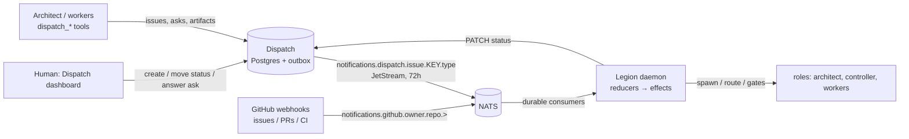

# Legion issue lifecycle on native Dispatch — design (T20)

**Status:** approved (decisions below); implementation plan in `docs/plans/2026-09-10-legion-dispatch-lifecycle.md`. Supersedes the GitHub Projects v2 board as
Legion's issue lifecycle. Tracked on Dispatch issue `LEGION-4` (mirror of sjawhar/legion#808).

## Decisions (settled by Sami on LEGION-4, 2026-09-10 01:14–01:29 UTC)

- **D1 — The Dispatch issue is the work item.** GitHub issues are not involved in the Legion
  lifecycle at all: the daemon never creates, mirrors, links, labels, comments on, or closes a GitHub
  issue, and never reads one. Dispatch's own ability to link a GitHub issue to a Dispatch issue
  (external links) stays as a human convenience; Legion ignores it. PRs carry the Dispatch key
  (branch `legion/<KEY>`, PR body line `Dispatch: <KEY>`). GitHub remains for code only: repos,
  branches, PRs, CI checks, and the human PR review that is the merge gate.
- **D2 — Dispatch-only intake; the architect writes through `dispatch_*`.** An issue created in the
  Legion project on Dispatch (dashboard or `dispatch_issue`) enters `triage`. GitHub issues opened in
  a repo are never auto-mirrored. The daemon's five GitHub-writing issue routes are deleted; the
  architect creates children with `dispatch_issue({project, parent, title, spec})`, opens gates with
  `dispatch_ask`, and the daemon learns from Dispatch events.
- **D3 — Smoke project.** `LEGSMOKE` ("Legion Smoke (disposable)") exists (created by the dispatch
  owner; humans cannot yet create projects in the dashboard — tracked on LEGION-2 as A19/G5).
- **D4 — Daemon identity on Dispatch.** Bearer `DISPATCH_TOKEN` with
  `actor: {kind: "session", id: "legion-daemon:<project>"}` and
  `origin.session_title: "Legion daemon · <project>"`; session-authored events carry `notify=false`,
  which is right for lifecycle status writes (confirmed by the dispatch owner).
- **Process (Sami, same thread):** a reviewer reads each implementer's transcript for silent struggle
  before any PR goes READY; the reviewer + thermonuclear pair gate stays.

## Settled (from conversation and code)

- Dispatch replaces the board; T20 lands before T18 (Sami, LEGION-4, 2026-09-10 01:14Z).
- Dispatch's `IssueStatuses` is Legion's lifecycle verbatim: `triage, icebox, backlog, todo,
  in_progress, testing, needs_review, retro, done` (`packages/envoy/internal/dispatch/model/model.go:204-220`).
- Legion has no merge gate of its own. Whether a human must approve a PR before merge is the
  repository's branch-protection/CODEOWNERS rule; the daemon neither reads nor writes it
  (decision 2026-09-11, superseding the `approval-check.ts` backstop this spec first kept).
- Human design gate becomes an ask: the architect opens `dispatch_ask` on the root issue with an
  `Approve` option; `ask.answered` with `Approve` selected is the wake. No labels.

## Architecture

### Intake and events

- New durable JetStream consumer per project: stream `ENVOY_NOTIFICATIONS`, filter
  `notifications.dispatch.issue.>`, durable `legion-<project>-dispatch`, same ack/nak/fatal contract
  as the GitHub lane (`nats-transport.ts:96-108`, `events.ts:56-90`). Client-side filter on the
  key prefix `<PROJECT>-` (the subject's key is one token; NATS cannot wildcard inside it).
- Reducer `reduceDispatchEvent(state, envelope)`:
  - `issue.created` → `IssueNode` (key = Dispatch KEY, title, status, parent);
    status `triage` with no parent → controller `triage` wake; with a parent → `child-adopted` to the
    parent's active role.
  - `issue.updated` → diff `status` against `state.issues[key].status` (payload is the full issue,
    no from/to): `todo` → `processManager.admit(key)`; `backlog`/`icebox` → park (replaces the
    backlog marker); `in_progress`/`testing`/`needs_review`/`retro` set by the daemon are echoes and
    no-op; a human moving a running tree to `icebox` → linger.
  - `issue.closed` (status `done`) → root: `linger`; child: `child-closed` / `children-complete`.
  - `child.status` on the parent → routed to the parent's active role (replaces `sub_issue_*`).
  - `ask.answered` → if the ask is the tree's design gate and `Approve` is selected →
    `human-approved` wake; persist `gates[key].designApproved = askId`.
  - Everything else (comments, artifacts, messages) is already delivered to role/session routes by
    Dispatch itself; the daemon ignores it.
- The GitHub lane keeps PRs, checks, and reviews only. `issues.*` webhook events are ignored by the
  reducers (D1/D2).

### Daemon writes to Dispatch

- Lifecycle statuses the daemon owns: `in_progress` when the architect is spawned, `testing` /
  `needs_review` / `retro` on the matching `phase-complete`, `done` when the tree closes. One helper
  `dispatchClient.setStatus(key, status)`; failures are logged and retried by resync, never fatal.
- Wave release: children are created by the architect in `backlog`; the architect releases a wave
  with `legion({op:"release_wave", issues})`, and the daemon `PATCH status=todo` on each child; the
  resulting `issue.updated` events drive admission. `/legion/v1/waves/release` stays, re-implemented
  as that PATCH loop.
- Auth: bearer `DISPATCH_TOKEN` with `actor: {kind: "session", id: "legion-daemon:<project>"}` and
  `origin.session_title` (D4); a service actor kind is requested as G1 but not required.

### Resync

Every `resync_interval_seconds`: `GET /api/v1/issues?project=
` (full list; no `updated_since`,
gap G3), compare `status` per key with state, replay synthetic `issue.updated` envelopes for drift
(same `resync:` sentinel pattern as today). Anomalies (`zero-owner-tree`, `untriaged-open`,
`launch-failed`) reported to the controller unchanged; `erroring-issue` and board-label
reconciliation are deleted with the board.

### Keys and schema

- `IssueKey` becomes the Dispatch key (`^[A-Z][A-Z0-9]*-[0-9]+$`); `owner/repo#n` disappears from
  `LegionState`. PR → issue linkage: branch `legion/<KEY>` (`issueForBranch`, `reducers.ts:588`),
  fallback: the PR body's `Dispatch: <KEY>` line. A PR with neither is not Legion's.
- `LegionState` v17 → v18: `issues[*].key` format, `issues[*].status` (Dispatch status replaces
  `labels`, `backlogMarker`, `released`), `gates[key].designApproved`. Migration
  refuses to run with active trees (there are none: Legion has not run) — it converts an empty or
  tree-less state and errors loudly otherwise.
- Config: `dispatch_url` (exists), `dispatch_project` (new, required), env `DISPATCH_TOKEN`
  (required when `dispatch_url` is set; never a YAML key), `board_project_ids` removed (rejected by
  name with a message, like `worker_budget`).

### Deletions

`board_project_ids`; `state/github-fetch.ts` Project v2 query; `reducers.ts` `boardEvent`/
`projects_v2_item` ingress and the `sub_issue_*` reducer; label state machine (`SURVIVING_LABELS`,
`GateLabelSchema`, `needs-approval`/`human-approved`/`legion-child`/`legion-backlog`); resync board
convergence; `legion admit`/`legion backlog`/`legion approve` CLI (status moves in the dashboard;
the controller uses `PATCH status`); under D4(a) the five GitHub-writing issue routes.

### Skills and roles

`legion-architect`: design gate = `dispatch_ask` with an `Approve` option on the root issue; children
via `dispatch_issue({project, parent, title, spec})`; waves via `release_wave`. `legion-controller`:
triage decides `todo`/`backlog`/`icebox` by `PATCH status` (through a daemon route that checks the
controller capability), never a label. `legion-worker`: unchanged except `LEGION_ISSUE` is now a
Dispatch key.

## Gaps in Dispatch (tracked by the dispatch owner on LEGION-2 as A15–A19; none blocking)

The DTO/event contract to import (never hand-mirror) is `packages/contracts/src/dispatch-api.ts`;
payload shapes are stable with additive changes only (`from`/`to` on `issue.updated`, ask reply
threads, `comment.created.ask_id`).

- **G1** A service actor for the daemon (`actor.kind: "daemon"` or accepted `session` id
  `legion-daemon:<project>`); today bearer callers must self-declare a session actor
  (`api/server.go:233-243`).
- **G2** A `project` header on the envelope (agreed with the dispatch owner; landing) so the
  consumer filters on the header instead of the key prefix (`outbox/publisher.go:193`).
- **G3** `updated_since` and pagination on `GET /api/v1/issues` (`api/issues.go:15-53`).
- **G4** `from`/`to` on `issue.updated` like `child.status` already has (`api/issues.go:437-459`).
- **G5** `POST /projects` is human-only and the dashboard has no project-creation UI
  (`api/projects.go:36-41`); the dispatch owner is fixing this first. `LEGSMOKE` was created by hand.

## Testing

- Reducer unit tests per event type (created/updated/closed/child.status/ask.answered) with the real
  envelope shapes captured from a running Dispatch.
- Resync drift test: state says `todo`, Dispatch says `backlog` → parked.
- Migration test v17→v18 on a tree-less state; loud failure with trees.
- Real-surface e2e (LEGION_E2E): scratch daemon + the local Dispatch server from `packages/dispatch/e2e/run-server.sh`
  + a NATS container: create an issue in the project → daemon triages → controller sets `todo` →
  root architect pane spawns → `dispatch_ask` gate → human answer via `POST /asks/{id}/answer`
  (human-only: the test logs in as the fixture user) → `human-approved` wake → close → `done`.
  This is also the shape of T18.

## Out of scope

Dispatch dashboard changes; the merge gate; Slack/mention lanes; what happens to GitHub issues in
repos that use them for other purposes (Legion neither reads nor writes them).
