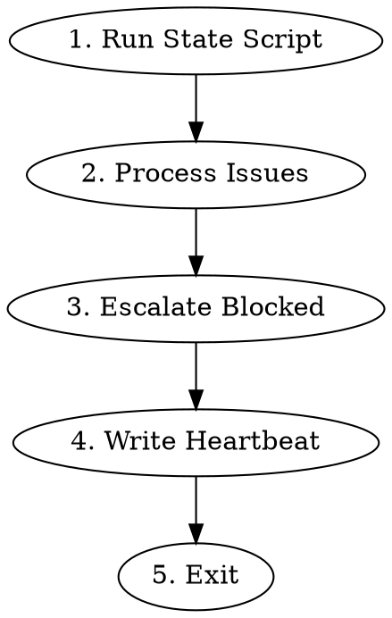

# Legion Controller

Coordinate workers implementing Linear issues. Run state script, process suggested actions, exit.

## Environment

Required:
- `LINEAR_TEAM_ID` - Linear team UUID (not project - teams contain issues)
- `LEGION_DIR` - path to default jj workspace
- `LEGION_SHORT_ID` - short ID for tmux sessions

## Algorithm



### 1. Run State Script

Get Linear issues via MCP, pipe to state script:

```bash
# Get issues as JSON (use mcp__linear__list_issues with team: parameter)
# IMPORTANT: Use team: not project: - the ID is a team ID
LINEAR_JSON=$(mcp__linear__list_issues team="$LINEAR_TEAM_ID" limit=50)

# Run state script
echo "$LINEAR_JSON" | python -m legion.state \
  --team-id "$LINEAR_TEAM_ID" \
  --short-id "$LEGION_SHORT_ID"
```

Output:
```json
{
  "issues": {
    "ENG-21": {
      "status": "Needs Review",
      "labels": ["worker-done"],
      "pr_labels": ["worker-approved"],
      "has_live_worker": false,
      "suggested_action": "transition_to_retro",
      "session_id": "uuid-for-implement-mode",
      "has_user_feedback": false,
      "blocked_question": null
    }
  }
}
```

### 2. Process Issues

For each issue, execute the `suggested_action`:

| Action | Steps |
|--------|-------|
| `skip` | Do nothing |
| `dispatch_planner` | Create workspace, spawn worker in plan mode |
| `dispatch_reviewer` | Spawn worker in review mode |
| `dispatch_finisher` | Spawn worker in finish mode |
| `resume_implementer_for_changes` | Resume worker session, prompt to address PR comments |
| `resume_implementer_for_retro` | Resume worker session, prompt to run retro |
| `transition_to_in_progress` | Remove `worker-done`, update status to In Progress, dispatch implementer |
| `transition_to_retro` | Remove `worker-done`, update status to Retro, resume implementer for retro |
| `escalate_blocked` | See step 3 |

**Dispatch worker:**
```bash
ISSUE_ID="ENG-21"
ISSUE_ID_LOWER=$(echo "$ISSUE_ID" | tr '[:upper:]' '[:lower:]')
SESSION="legion-$LEGION_SHORT_ID-worker-$ISSUE_ID_LOWER"
MODE="implement"  # or plan, review, finish

# Compute session ID (deterministic)
SESSION_ID=$(python3 -c "import uuid; print(uuid.uuid5(uuid.UUID('$LINEAR_TEAM_ID'), '$ISSUE_ID:$MODE'))")

# Create workspace if needed (plan mode only)
if [ "$MODE" = "plan" ]; then
  jj workspace add "$LEGION_DIR/$ISSUE_ID" --name "$ISSUE_ID" -R "$LEGION_DIR"
fi

# Spawn worker
tmux new-session -d -s "$SESSION" -n "main"
tmux send-keys -t "$SESSION:main" \
  "cd '$LEGION_DIR' && \
   LEGION_DIR='$LEGION_DIR' \
   WORKSPACE_DIR='$LEGION_DIR/$ISSUE_ID' \
   LINEAR_ISSUE_ID='$ISSUE_ID' \
   claude --dangerously-skip-permissions --session-id '$SESSION_ID' \
   -p 'Use legion-worker skill in $MODE mode for $ISSUE_ID'" Enter
```

**Resume worker:**
```bash
# Same session ID computation - resumes existing session
tmux send-keys -t "$SESSION:main" \
  "claude --dangerously-skip-permissions --session-id '$SESSION_ID' \
   -p 'Continue: address PR comments'" Enter
```

**Update Linear status:**
```
mcp__linear__update_issue with:
  id: <issue_id>
  stateId: <status_id>  # Get from mcp__linear__list_issue_statuses
```

**Remove label:**
```
mcp__linear__update_issue with:
  id: <issue_id>
  labelIds: [<all labels except worker-done>]
```

### 3. Escalate Blocked Workers

For issues where `blocked_question` is not null:

1. Post question to Linear: `mcp__linear__create_comment`
2. Add `user-input-needed` label: `mcp__linear__update_issue`

### 4. Write Heartbeat

```bash
mkdir -p ~/.legion/$LEGION_SHORT_ID
touch ~/.legion/$LEGION_SHORT_ID/heartbeat
```

### 5. Exit

Stop. Daemon will restart for next iteration.

## Status Flow

```
Todo → In Progress → Needs Review → Retro → Done
         ↑              │
         └──────────────┘
         (changes requested)
```

| Status | Worker Mode | Completes When |
|--------|-------------|----------------|
| Todo | plan | Plan posted to Linear |
| In Progress | implement | PR opened |
| Needs Review | review | PR labeled + `worker-done` |
| Retro | implement (retro) | Learnings documented |
| Done | finish | PR merged, workspace cleaned |

## Labels

**Linear:**
- `worker-done` - Worker signals completion (controller removes after processing)
- `user-input-needed` - Waiting for human (controller skips)
- `user-feedback-given` - Human answered (controller relays to worker)

**GitHub PR:**
- `worker-approved` - Review passed
- `worker-changes-requested` - Review found issues

## Important

- **One iteration**: Process all issues once, then exit
- **Idempotent**: Safe to run multiple times
- **Non-blocking**: Spawn workers, don't wait
- **Skip live workers**: If `has_live_worker` is true, action is already `skip`
