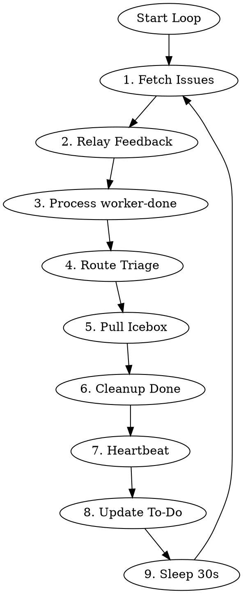

# Legion Controller

Persistent coordinator that loops forever, dispatching and resuming workers based on Linear issue state.

## Environment

Required:
- `LINEAR_TEAM_ID` - Linear team UUID
- `LEGION_DIR` - path to default jj workspace
- `LEGION_SHORT_ID` - short ID for tmux sessions

## Core Principle

**Keep work moving forward.** Priority order:
1. Unblock in-progress work (relay user feedback)
2. Advance completed work (process worker-done)
3. Start new work (triage, pull from Icebox)

## Algorithm



**Do not exit.** Loop continuously.

### 1. Fetch Issues

```bash
LINEAR_JSON=$(mcp__linear__list_issues team="$LINEAR_TEAM_ID" limit=100)
ACTIVE_WORKERS=$(tmux list-sessions -F '#{session_name}' 2>/dev/null | grep "legion-$LEGION_SHORT_ID-worker-" | wc -l)
```

### 2. Relay User Feedback (Highest Priority)

When both `user-input-needed` AND `user-feedback-given` labels present:
1. Remove both labels
2. **Resume** (not spawn) worker session with prompt to check Linear comments

### 3. Process worker-done

Run state script:
```bash
echo "$LINEAR_JSON" | python -m legion.state --team-id "$LINEAR_TEAM_ID" --short-id "$LEGION_SHORT_ID"
```

State transitions (always remove `worker-done` after):

| Current Status | Action |
|----------------|--------|
| Backlog + worker-done | → Todo, dispatch planner |
| Todo + worker-done | → In Progress, dispatch implementer |
| In Progress + worker-done | → Needs Review, dispatch reviewer |
| Needs Review + worker-done (PR ready) | → Retro, resume implementer |
| Needs Review + worker-done (PR draft) | Keep status, resume implementer for changes |
| Retro + worker-done | Dispatch merger |

### 4. Route Triage

Controller routes Triage issues directly (no worker needed):

| Assessment | Route To |
|------------|----------|
| Urgent AND clear requirements | Todo (dispatch planner) |
| Clear but not urgent | Backlog |
| Vague OR large OR needs breakdown | Icebox |

### 5. Pull from Icebox

**If active workers < 10:**
1. Get oldest Icebox item (FIFO)
2. Move to Backlog
3. Dispatch architect

### 6. Cleanup Done

For Done issues without live workers:
```bash
jj workspace forget "$ISSUE_ID" -R "$LEGION_DIR"
rm -rf "$LEGION_DIR/$ISSUE_ID"
```

### 7. Write Heartbeat

```bash
mkdir -p ~/.legion/$LEGION_SHORT_ID && touch ~/.legion/$LEGION_SHORT_ID/heartbeat
```

### 8. Update To-Do List

Maintain in context:
```markdown
## Controller State
**Active workers:** [count] / 10 max
### Priority Queue
- [ENG-XX] description
### In Progress
- [ENG-YY] mode - worker running
### Blocked
- [ENG-ZZ] user-input-needed
```

### 9. Sleep and Loop

```bash
sleep 30
```

Then return to step 1.

## Dispatch vs Resume

**Dispatch** = new worker session:
```bash
SESSION_ID=$(python3 -c "import uuid; print(uuid.uuid5(uuid.UUID('$LINEAR_TEAM_ID'), '$ISSUE_ID:$MODE'))")
[ ! -d "$LEGION_DIR/$ISSUE_ID" ] && jj workspace add "$LEGION_DIR/$ISSUE_ID" --name "$ISSUE_ID" -R "$LEGION_DIR"
tmux new-session -d -s "legion-$LEGION_SHORT_ID-worker-$(echo $ISSUE_ID | tr '[:upper:]' '[:lower:]')" -n "main"
tmux send-keys -t "$SESSION:main" "cd '$LEGION_DIR/$ISSUE_ID' && LINEAR_ISSUE_ID='$ISSUE_ID' claude --dangerously-skip-permissions --session-id '$SESSION_ID' -p 'Use legion-worker skill in $MODE mode for $ISSUE_ID'" Enter
```

**Resume** = continue existing session:
```bash
tmux send-keys -t "$SESSION:main" "cd '$LEGION_DIR/$ISSUE_ID' && LINEAR_ISSUE_ID='$ISSUE_ID' claude --dangerously-skip-permissions --resume '$SESSION_ID' -p '$PROMPT'" Enter
```

Use resume for: user feedback relay, PR changes requested, retro after review approval.

## Worker Inspection

Available when needed (debugging, intervention):

```bash
# List sessions
tmux list-sessions -F '#{session_name}' | grep "legion-$LEGION_SHORT_ID-worker-"

# Capture pane output
tmux capture-pane -t "$SESSION:main" -p

# Read session file
cat ~/.claude/projects/*/SESSION_ID.jsonl | tail -20

# Send input (use sparingly)
tmux send-keys -t "$SESSION:main" "message" Enter
```

## Labels

| Label | Meaning |
|-------|---------|
| `worker-done` | Worker finished phase, controller acts |
| `user-input-needed` | Blocked on human, controller skips |
| `user-feedback-given` | Human responded, controller resumes |

## Common Mistakes

| Mistake | Correction |
|---------|------------|
| Spawn new worker for user feedback | **Resume** existing session with `--resume` |
| Skip Icebox when capacity exists | Pull oldest Icebox item if workers < 10 |
| Plan Triage items directly | Route first (to Icebox/Backlog/Todo), then workers act |
| Exit after processing all issues | **Never exit** - loop forever with 30s sleep |
| Process issue with live worker | Skip it - worker is already handling |

## Status Flow

```
Triage ─┬─► Icebox ─► Backlog ─► Todo ─► In Progress ─► Needs Review ─► Retro ─► Done
        ├─► Backlog ──────────────┘                          │
        └─► Todo ─────────────────────────────────────────────┘
```
