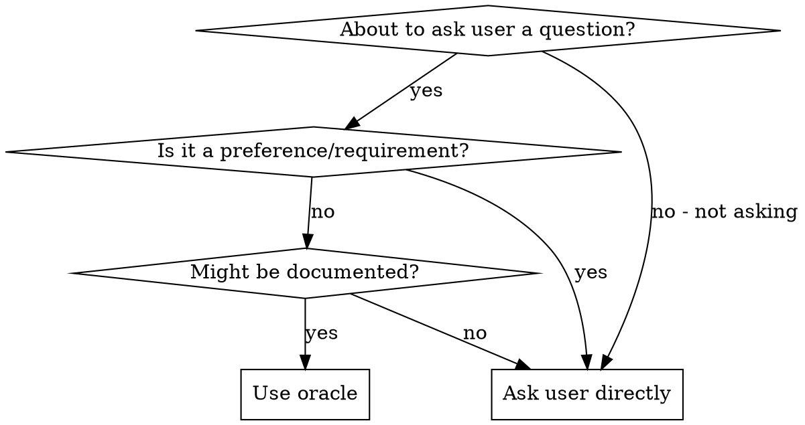

# Legion Oracle

Research institutional knowledge before escalating questions to users.

## Core Principle

**Check docs/solutions/ first.** This codebase captures learnings from past work.

## When to Use



**Use oracle for:** patterns, conventions, solved problems, technical approaches

**Ask directly for:** preferences, requirements, scope decisions, human judgment

## Research Strategy

If the deployment instructions name a librarian role, ask it first (publish to its
`notifications.role.<name>` topic with `expects_reply: required`). Then run steps 1-2 (parallel
OK), and 3-4 if needed, with tools a Legion pane actually has: `read`, `grep`, `web_search`, and
`task(agent="scout")` (fast read-only codebase search) or `task(agent="oracle")` (deeper
read-only analysis when the answer needs judgment across many files). Do not name any other agent.

| Step | Tool | Query |
|------|------|-------|
| 1. Institutional learnings | `grep` then `read` over `docs/solutions/` (front-matter `tags`, then the body) | [question]'s keywords |
| 2. Codebase patterns | `task(agent="scout")`; `task(agent="oracle")` when judgment across many files is needed | Find how [module] handles [topic] |
| 3. Framework docs | `read` the library's documentation URL | [library] [topic] |
| 4. External practices | `web_search`, then `read` the primary source | Current best practices for [topic] |

## Output

**Found:** Answer with source (file:line or URL)

**Not found:** "Checked docs/solutions/ and codebase - no relevant learnings found" → search externally OR escalate to user

## Example

```
Question: How should I paginate a GraphQL connection?

grep pagination docs/solutions/   → no matches
task(agent="scout")               → packages/daemon/src/state/fetch.ts loops on
                                    pageInfo.hasNextPage / endCursor (contextsPage)

Answer: cursor-based, per the `while (page.hasNextPage)` loop in packages/daemon/src/state/fetch.ts
```
