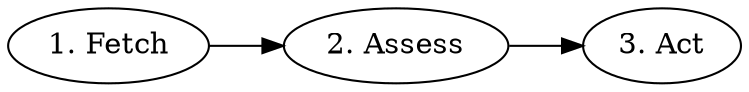

# Architect Workflow

Turn Backlog issues into spec-ready work.

## Workflow



### 1. Fetch Issue

```
mcp__linear__get_issue with id: $LINEAR_ISSUE_ID
mcp__linear__list_comments with issueId: $LINEAR_ISSUE_ID
```

Extract title, description, comments, current labels.

### 2. Assess

**Is it clear?** Does it have testable acceptance criteria and no unresolved questions?

If unclear and researchable, try `/oracle [your question]`.
If still unclear, escalate.

**Is it small enough?** Could it be split into independent, shippable pieces?

### 3. Act

**If unclear:** Add `user-input-needed` label, post comment with specific questions, exit.

**If too big:** Break down into sub-issues. Each sub-issue must be spec-ready:
- Clear problem statement (what needs to change and why)
- Testable acceptance criteria (how we verify it's done)
- Small enough for one PR
- No blocking questions

Create each spec-ready sub-issue with `worker-done` label.

**Partial breakdown allowed:** If some pieces are clear but others need clarification:
1. Create sub-issues for the clear pieces (with `worker-done`)
2. Add `user-input-needed` to parent with questions about unclear pieces
3. Post comment listing created children AND what still needs clarification

This unblocks work on clear pieces while getting answers on unclear ones.

**If spec-ready:** Ensure acceptance criteria are present and testable, add `worker-done` label. Exit.

## What Makes Good Acceptance Criteria

Acceptance criteria must be **testable** - a human or CI can verify pass/fail.

**Bad (vague):**
- "Should be fast"
- "Handle errors gracefully"
- "Nice UX"

**Good (testable):**
- "Page loads in under 500ms"
- "Shows error message with retry button on API timeout"
- "Form validates email format before submit"

Each criterion should answer: "How will we know this is done?"

## Sub-Issue Creation

```
parent = mcp__linear__get_issue with id: $LINEAR_ISSUE_ID

mcp__linear__create_issue with:
  title: [Scoped title]
  team: [Same team as parent]
  parentId: parent.id  # UUID required
  description: |
    ## Acceptance Criteria
    - [ ] [Testable condition]

    Part of $LINEAR_ISSUE_ID.
  state: "Backlog"
  labels: ["worker-done"]
```

Post comment to parent explaining the breakdown.

## Updating Labels

Labels array replaces all labels. Fetch current labels first:

```
issue = mcp__linear__get_issue with id: $LINEAR_ISSUE_ID
current_label_names = [label.name for label in issue.labels]

mcp__linear__update_issue with:
  id: $LINEAR_ISSUE_ID
  labels: current_label_names + ["worker-done"]
```

## Completion Signals

| Outcome | Action |
|---------|--------|
| Spec-ready | Add `worker-done` to issue |
| Fully broken down | Add `worker-done` to each child, leave parent unchanged |
| Partial breakdown | Add `worker-done` to clear children, add `user-input-needed` to parent |
| Unclear | Add `user-input-needed` to issue |

**After breakdown:** Parent keeps its existing labels. Do NOT add `worker-done` to parent - only children get it. Post comment to parent explaining what was created and what still needs clarification.

## Common Mistakes

| Mistake | Correction |
|---------|------------|
| Adding `worker-done` to parent after breakdown | Only children get it; parent stays unchanged |
| Thinking "none" means remove labels from parent | "None" means don't add anything; keep existing labels |
| Using identifier as `parentId` | Must use UUID from `get_issue` |
| Updating labels without fetching current | Fetch first, then append |
| Forgetting to comment on parent after breakdown | Always post comment explaining which children were created |
