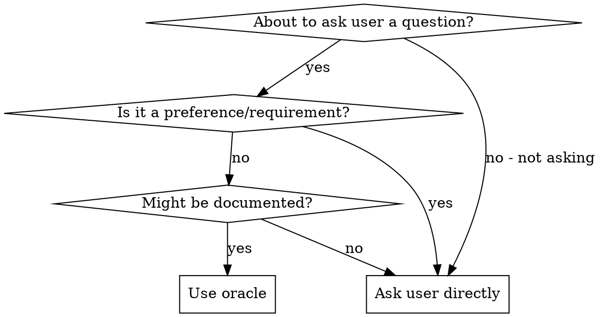

# Oracle Workflow

Research institutional knowledge before escalating questions to users.

## Core Principle

**Check docs/solutions/ first.** This codebase captures learnings from past work.

## When to Use



**Use oracle for:** patterns, conventions, solved problems, technical approaches

**Ask directly for:** preferences, requirements, scope decisions, human judgment

## Research Strategy

Run steps 1-2 first (parallel OK), then 3-4 if needed:

| Step | Tool | Query |
|------|------|-------|
| 1. Institutional learnings | `Task learnings-researcher` | Search docs/solutions/ for [question] |
| 2. Codebase patterns | `Task Explore` | Find how src/ handles [topic] |
| 3. Framework docs | Context7 MCP | resolve-library-id → query-docs |
| 4. External practices | `Task best-practices-researcher` or `WebSearch` | Current best practices for [topic] |

## Output

**Found:** Answer with source (file:line or URL)

**Not found:** "Checked docs/solutions/ and codebase - no relevant learnings found" → search externally OR escalate to user

## Example

```
/oracle How should I handle GraphQL pagination?

[learnings-researcher] → No matches
[Explore] → Found src/legion/state/fetch.py uses cursor-based pagination

Answer: Use cursor-based pagination per src/legion/state/fetch.py:42
```
