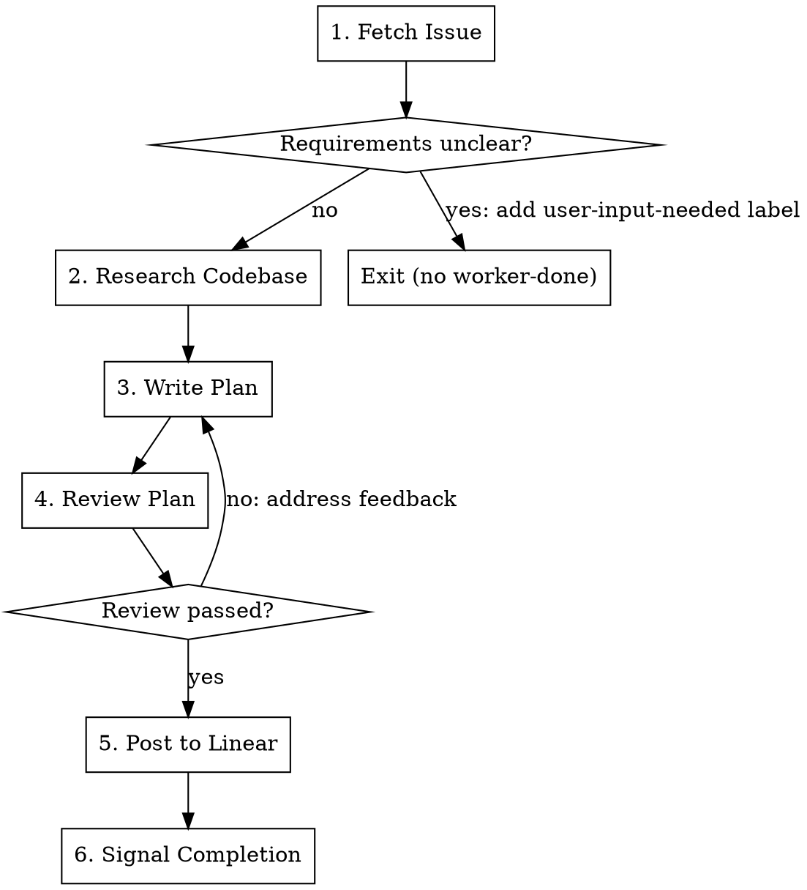

# Plan Workflow

Transform a Linear issue into a reviewed implementation plan.

## Workflow



### 1. Fetch the Issue

```
mcp__linear__get_issue with id: $LINEAR_ISSUE_ID
```

The `$LINEAR_ISSUE_ID` environment variable is set by the controller when spawning this worker.

Extract:
- Title and description
- Comments with additional context
- Acceptance criteria if present

**If requirements are unclear:**
1. Add `user-input-needed` label via `mcp__linear__update_issue`
2. Post a comment via `mcp__linear__create_comment` explaining what needs clarification
3. Exit immediately - do NOT add `worker-done`

### 2. Research the Codebase

Before writing the plan, understand the relevant code:
- Search for related files using Glob and Grep
- Read existing implementations of similar features
- Identify patterns, conventions, and dependencies
- Note any technical constraints

### 3. Write the Plan

Invoke `/superpowers:writing-plans` to create the implementation plan.

The plan must include:
- Problem statement (what and why)
- Proposed solution (high-level approach)
- Technical approach (specific implementation details)
- File changes (exact paths, what to create/modify)
- Test plan (specific test cases)
- Acceptance criteria (how to verify completion)

### 4. Review the Plan

Invoke `/compound-engineering:plan_review` to review the plan.

**Iterate until the review passes:**
1. Read the review feedback
2. Address each issue identified
3. Re-invoke `/compound-engineering:plan_review`
4. Repeat until no blocking issues remain

If review fails after 3 iterations, escalate: add `user-input-needed` label with a comment summarizing the unresolved issues, then exit without `worker-done`.

### 5. Post to Linear

Use `mcp__linear__create_comment` to post the complete plan to the Linear issue.

Format the comment clearly with markdown sections.

### 6. Signal Completion

Add `worker-done` label to the Linear issue via `mcp__linear__update_issue`, then exit.

**CRITICAL:** Only add `worker-done` after successfully posting the plan. Never add this label if:
- Requirements were unclear (use `user-input-needed` instead)
- Plan review failed and was not resolved
- Any step failed to complete

## Quick Reference

| Step | Action | Tool |
|------|--------|------|
| Fetch | Get issue details | `mcp__linear__get_issue` |
| Research | Explore codebase | Glob, Grep, Read |
| Write | Create plan | `/superpowers:writing-plans` |
| Review | Validate plan | `/compound-engineering:plan_review` |
| Post | Comment on issue | `mcp__linear__create_comment` |
| Complete | Add done label | `mcp__linear__update_issue` |

## Common Mistakes

| Mistake | Correction |
|---------|------------|
| Adding `worker-done` when requirements unclear | Use `user-input-needed` label, exit without `worker-done` |
| Skipping codebase research | Always research before writing to understand existing patterns |
| Posting plan before review passes | Complete review loop first |
| Vague technical approach | Include exact file paths and specific implementation details |
